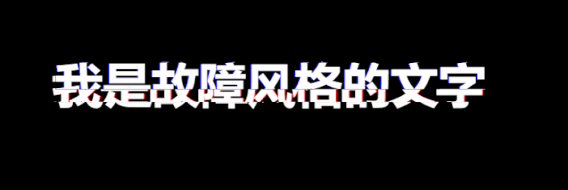
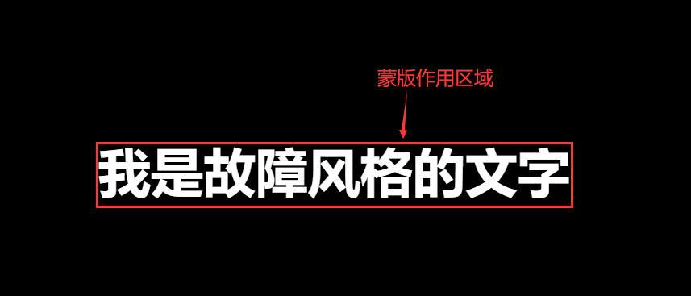
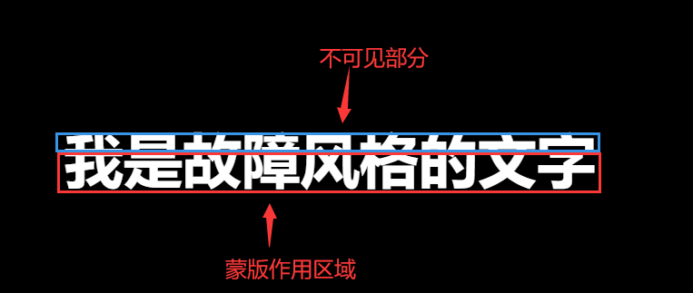
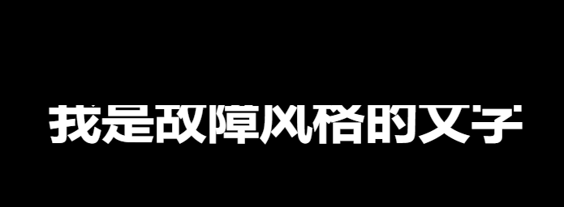

## Finished effect

---

Today, I will share a use of css3 to implement a recently popular fault-style text display animation. I dare say that as long as you use this animation in your project, the interviewer will definitely shine when he sees it. Let's take a look at the finished product picture:



The animation effect is more complicated, and more knowledge is used, such as **"css pseudo-element, element custom attribute, mask attribute, animation animation, etc."**

## Label element section

---

```html
<body>
   <div class="txt" data-text="I am a glitch-style text">I am a glitch-style text</div>
</body>
```

Here we use a custom attribute, that is, **「data-」** plus our custom attribute name, we use our text content as the value of the attribute, so that the pseudo-element can get the corresponding text later

## @keyframes section

---

```css
@keyframes animation-before {
   0% {
     clip-path: inset(0 0 0 0);
   }

   5% {
     clip-path: inset(0.8em 0 0.4em 0);
   }

   10% {
     clip-path: inset(0.4em 0 0.8em 0);
   }

   15% {
     clip-path: inset(0.1em 0 1em 0);
   }

   20% {
     clip-path: inset(0.3em 0 0.6em 0);
   }

   25% {
     clip-path: inset(0.6em 0 0.3em 0);
   }

   30% {
     clip-path: inset(0.8em 0 0.5em 0);
   }

   35% {
     clip-path: inset(1em 0 0.1em 0);
   }

   40% {
     clip-path: inset(0.7em 0 0.35em 0);
   }

   45% {
     clip-path: inset(0.5em 0 0.2em 0);
   }

   50% {
     clip-path: inset(0.2em 0 0.5em 0);
   }

   55% {
     clip-path: inset(0.35em 0 0.7em 0);
   }

   60% {
     clip-path: inset(0.1em 0 0.9em 0);
   }

   65% {
     clip-path: inset(0.8em 0 0.46em 0);
   }

   70% {
     clip-path: inset(0.66em 0 0.33em 0);
   }

   75% {
     clip-path: inset(0.48em 0 0.23em 0);
   }

   80% {
     clip-path: inset(0.23em 0 0.48em 0);
   }

   85% {
     clip-path: inset(0.39em 0 0.79em 0);
   }

   90% {
     clip-path: inset(0.33em 0 0.66em 0);
   }

   95% {
     clip-path: inset(1em 0 0.3em 0);
   }

   100% {
     clip-path: inset(0.62em 0 0.29em 0);
   }
}
@keyframes animation-after {
   0% {
     clip-path: inset(0 0 0 0);
   }

   5% {
     clip-path: inset(0.4em 0 0.8em 0);
   }

   10% {
     clip-path: inset(0.8em 0 0.4em 0);
   }

   15% {
     clip-path: inset(1em 0 0.1em 0);
   }

   20% {
     clip-path: inset(0.6em 0 0.3em 0);
   }

   25% {
     clip-path: inset(0.3em 0 0.6em 0);
   }

   30% {
     clip-path: inset(0.5em 0 0.8em 0);
   }

   35% {
     clip-path: inset(0.1em 0 1em 0);
   }

   40% {
     clip-path: inset(0.35em 0 0.7em 0);
   }

   45% {
     clip-path: inset(0.2em 0 0.5em 0);
   }

   50% {
     clip-path: inset(0.5em 0 0.2em 0);
   }

   55% {
     clip-path: inset(0.7em 0 0.35em 0);
   }

   60% {
     clip-path: inset(0.9em 0 0.1em 0);
   }

   65% {
     clip-path: inset(0.46em 0 0.8em 0);
   }

   70% {
     clip-path: inset(0.3em 0 0.66em 0);
   }

   75% {
     clip-path: inset(0.23em 0 0.48em 0);
   }

   80% {
     clip-path: inset(0.48em 0 0.23em 0);
   }

   85% {
     clip-path: inset(0.79em 0 0.39em 0);
   }

   90% {
     clip-path: inset(0.66em 0 0.33em 0);
   }

   95% {
     clip-path: inset(0.3em 0 1em 0);
   }

   100% {
     clip-path: inset(0.29em 0 0.62em 0);
   }
}
```

Here we set up two keyframes, respectively **「animation-before」**、**「animation-after」**

It must be obvious that the former is intended for the pseudo-element before; the latter is for the pseudo-element after

So what is the clip-path used in it for? This is a new property of css3 called "mask", and the value of inset() indicates that the shape of the mask is a rectangle

Let's see how to use it

First, inset() receives four length parameters, which respectively indicate the distance between the mask and the "upper side", "right side", "lower side" and "left side" of the element label, thus determining the size of the mask

When we set it to inset(0 0 0 0), it means that the mask area is as large as the element label, as shown in the figure below (the red border indicates the mask area)



At this time, our text can be fully displayed, because the effective area of the mask is the size of our label element

Then let's take a look again, if our setting is inset(30px 0 0 0) , the test shows that the mask's active area is 30px from the upper side of the label element and 0px from the other sides, as shown in the figure



The part of the blue border in the figure is not the active area of the mask, so we cannot see the content of this area. The real situation is shown in the figure below



After understanding the use of the mask, we set up frame-by-frame animation through @keyframes, so that the active area of the mask changes in the vertical direction to achieve the effect of shaking up and down. The code is as above

## **specific style**

---

```css
body {
   height: 100vh;
   display: flex;
   justify-content: center;
   align-items: center;
   background: black;
}
.txt {
   display: inline-block;
   font-size: 65px;
   font-weight: 600;
   padding: 0 4px;
   color: white;
   position: relative;
}
.txt::before {
   /* get text */
   content: attr(data-text);
   position: absolute;
   /* Move 2px to the left */
   left: -2px;
   width: 100%;
   /* Set the background color to the same color as the main background, to cover our label elements */
   background: black;
   /* Add a 2px red text shadow on the left to the text of the before pseudo-element */
   text-shadow: 2px 0 red;
   /* Apply mask vertical change animation, and keep looping */
   animation: animation-before 3s infinite linear alternate-reverse;
}
.txt::after {
   /* get text */
   content: attr(data-text);
   position: absolute;
   /* Move 2px to the left */
   left: 2px;
   width: 100%;
   /* Set the background color to the same color as the main background, to cover our label elements */
   background: black;
   /* Add a 2px blue text shadow on the right to the text of the before pseudo-element */
   text-shadow: -2px 0 blue;
   /* Apply mask vertical change animation, and keep looping */
   animation: animation-after 3s infinite linear alternate-reverse;
}
```

Here, we set two pseudo-elements before and after, respectively positioned at the same position as the parent element, and then moved a little distance to the left and right respectively to create a dislocation effect, and then set the background color to be the same as The same color as the background color of the parent element, used to block the parent element.

Then, after setting the vertical change animation of the mask, although the part covered by the mask cannot be seen, it will reveal the parent element content of the lower layer, so that a perfect glitch-style text display animation can be realized.
