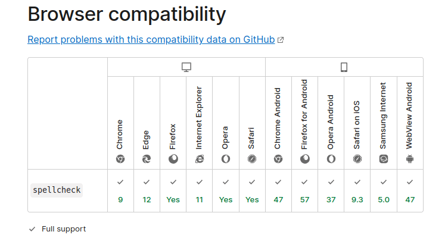

These HTML skills to be introduced today will definitely surprise you!

## 1. Use the capture property to open the device camera

---

Just as the `input` tag has `email`, `text` and `password` attributes, we also have some attributes that open the camera of the mobile device to capture an image.

That is the `capture` attribute, and there are two attribute values:

- `user` for front camera
- `environment` for rear camera

```html
<input type="file" capture="user" accept="image/*" />
```

## 2. Website auto refresh

---

You can set the website to refresh regularly in the `head` tag!

```html
<head>
   <meta http-equiv="refresh" content="10" />
</head>
```

This code snippet achieves a website refresh every 10 seconds.

## 3. Activate spell check

---

You can use the HTML `spellcheck` attribute and set it to `true` to activate spell checking. Use the `lang` attribute to specify the language to check.

```html
<input type="text" spellcheck="true" lang="en" />
```

This is a standard attribute, supported by most browsers.



## 4. Specify the file type to upload

---

You can use the `accept` attribute to specify the file types that users are allowed to upload in the `input` tag.

```html
<input type="file" accept=".jpeg,.png" />
```

## 5. Block browser translation

---

Setting the `translate` attribute to `no` prevents the browser from translating the content. This attribute can be applied if you don't want to translate a certain phrase or word, such as a logo, company or brand name.

```html
<p translate="no">Brand name</p>
```

## 6. Enter multiple items in the input tag

This can be done with the `multiple` attribute.

```html
<input type="file" multiple />
```

Works with files and emails. In case of emails, they can be separated by commas.

## 7. Create a poster (thumbnail) for the video

---

Using the `poster` attribute, we can display a specified thumbnail when the video loads, or before the user clicks the play button.

If no image is specified, the first frame of the video will be used as the thumbnail by default.

```html
<video poster="picture.png"></video>
```

## 8. Click the link to download automatically

---

If you want a specific resource to be downloaded when the link to the target resource is clicked, add the `download` attribute.

```html
<a href="image.png" download></a>
```
