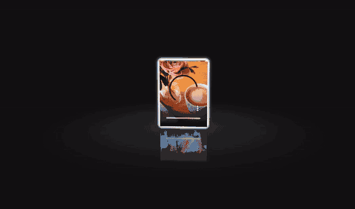

Today I will teach you how to implement a very cool but practical HTML5 3D photo album carousel animation. The album animation has the following characteristics:

- The pictures in the album form a three-dimensional circle, and rotate continuously in a clockwise direction.
- Each picture has a reflection effect, which better presents a 3D visual effect for the album.
- You can also drag the mouse to achieve a 360-degree panoramic view of the album.
- Not only pictures are supported, but mp4 videos are also supported.
- Support background music playback.

Let's take a look at the final effect first!

## Effect preview

---



## Code

**HTML code**

There is no need for complex elements in HTML. In general, a container is built on the page, which is used to define the picture and video elements in the album, clean and tidy. The code is as follows:

```html
<div id="drag-container">
   <div id="spin-container">
     <!-- Add pictures or mp4 videos here -->
     
     
     
     
     
     

     <!-- Image with link -->
     <a target="_blank" href="7.png">
       
     </a>

     <!-- sample video -->
     <video controls autoplay="autoplay" loop>
       <source src="demo.mp4" type="video/mp4" />
     </video>

     <!-- background text description -->
     <p>3D photo album</p>
   </div>
   <div id="ground"></div>
</div>
```

**CSS Code**

For the CSS code, we don’t give too much explanation. The most important thing here is to render the style of the picture or video element, especially to realize the 3D effect of the shadow and the glow effect when the mouse is over:

```css
#drag-container img,
#drag-container video {
  -webkit-transform-style: preserve-3d;
  transform-style: preserve-3d;
  position: absolute;
  left: 0;
  top: 0;
  width: 100%;
  height: 100%;
  line-height: 200px;
  font-size: 50px;
  text-align: center;
  -webkit-box-shadow: 0 0 8px #fff;
  box-shadow: 0 0 8px #fff;
  -webkit-box-reflect: below 10px linear-gradient(transparent, transparent, #0005);
}

#drag-container img:hover,
#drag-container video:hover {
  -webkit-box-shadow: 0 0 15px #fffd;
  box-shadow: 0 0 15px #fffd;
  -webkit-box-reflect: below 10px linear-gradient(transparent, transparent, #0007);
}
```

**JavaScript Code**

One of the better things about this album plugin is that you can define some global parameters in JS, so as to better do some personalized configurations, such as album circle radius, rotation speed, etc.:

```js
// global parameter definition
var radius = 240; // radius of album
var autoRotate = true; // Whether to automatically rotate
var rotateSpeed = -60; // rotation speed
var imgWidth = 120; // image width (unit: px)
var imgHeight = 170; // photo height (unit: px)

// background music address
var bgMusicURL =
   "https://api.soundcloud.com/tracks/143041228/stream?client_id=587aa2d384f7333a886010d5f52f302a";
var bgMusicControls = true; // Whether to display the background music player
```

Animation effects when the album is initialized:

```js
function init(delayTime) {
  for (var i = 0; i < aEle.length; i++) {
    aEle[i].style.transform =
      "rotateY(" +
      i * (360 / aEle.length) +
      "deg) translateZ(" +
      radius +
      "px)";
    aEle[i].style.transition = "transform 1s";
    aEle[i].style.transitionDelay = delayTime || (aEle.length - i) / 4 + "s";
  }
}
```

When the mouse drags the album, a 360-degree panoramic view is required. Here, the mouse events are processed, mainly mousedown, mousemove and mouseup:

```js
document.onpointerdown = function (e) {
  clearInterval(odrag.timer);
  e = e || window.event;
  var sX = e.clientX,
    sY = e.clientY;

  this.onpointermove = function (e) {
    e = e || window.event;
    var nX = e.clientX,
      nY = e.clientY;
    desX = nX - sX;
    desY = nY - sY;
    tX += desX * 0.1;
    tY += desY * 0.1;
    applyTranform(odrag);
    sX = nX;
    sY = nY;
  };

  this.onpointerup = function (e) {
    odrag.timer = setInterval(function () {
      desX *= 0.95;
      desY *= 0.95;
      tX += desX * 0.1;
      tY += desY * 0.1;
      applyTranform(odrag);
      playSpin(false);
      if (Math.abs(desX) < 0.5 && Math.abs(desY) < 0.5) {
        clearInterval(odrag.timer);
        playSpin(true);
      }
    }, 17);
    this.onpointermove = this.onpointerup = null;
  };

  return false;
};
```

Finally, we have to support mouse wheel zooming. When we roll the mouse wheel, the radius of the album will change accordingly:

```js
document.onmousewheel = function (e) {
  e = e || window.event;
  var d = e.wheelDelta / 20 || -e.detail;
  radius += d;
  init(1);
};
```

So far, the production process of our HTML5 3D photo album has been completed.
