The result first, the final effect is as follows:


Restoration should be fine, right?

## Douyin Logo Structure

---

If you want to use CSS to draw Douyin’s Logo, you must first understand its structure. It must be a splicing combination of some geometric figures, because many industry leaders have already picked up the structure of Douyin’s Logo before, so I will borrow it one time:

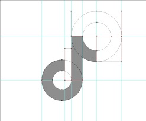

Ok, it's a bit complicated, to simplify it, it's actually `4` parts

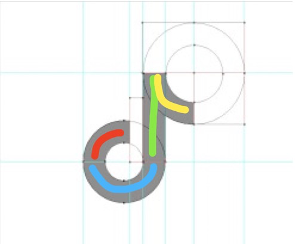

The area drawn by each color represents a part, so the final result is: `1/4 circle` + `semicircle` + `long rectangle` + `1/4 circle` with a slightly larger radius

## Production ideas

---

Going back to the title of this article, some people will say that I am a headline party. This `logo` is divided into four parts. How do you use one label to get it done? Even if you use `::before` and `::after`, plus the label body, there are only three parts in total

and! Douyin's `logo` has two layers:


Douyin logo

It can be seen that a cyan note and a red note are superimposed

so! With so many elements, how do you do it with one tag? And it also said that there will be animation, is it to amuse us?

Well, don't worry, let's go through the train of thought first:

- Start thinking about the general direction of the elements:

- - need to implement a black background (requires a label)
   - two notes superimposed ("black background" is already a label, those two notes can only be two pseudo-elements)

- Start to make breakthroughs from the small details of the elements:

- - Need to draw the entire note pattern in one stroke in a pseudo-element (let me think about it...)

How to draw the whole musical note pattern in one pseudo-element?

💡 I figured out a way, it's super simple, let me show you

```html
<style>
   /* In order to keep the article tidy, some codes are omitted... */
   .douyin::before {
     background: url("cyan note.png");
   }

   .douyin::affter {
     background: url("red note.png");
   }
</style>

<div class="douyin" />
```


Stop scolding, stop scolding, I just made a little joke with everyone, let's get to the text!

We must use the `background` attribute, otherwise where is the color block, go to the MDN document:

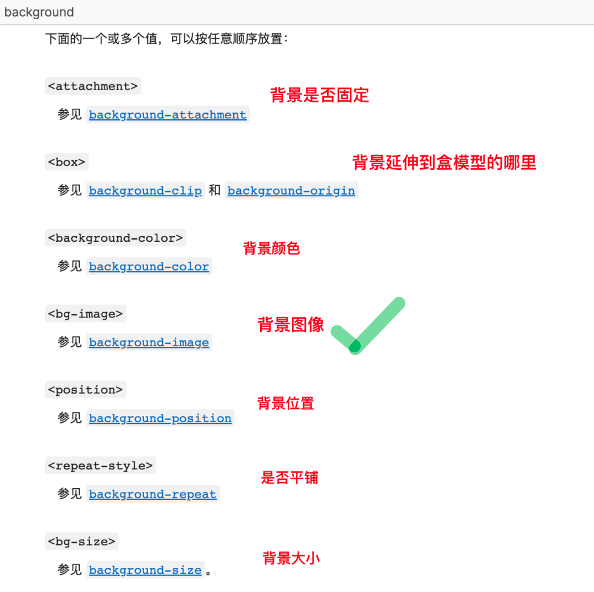

Don’t even think about it, only one `background-image` is useful, let’s take a look at it:

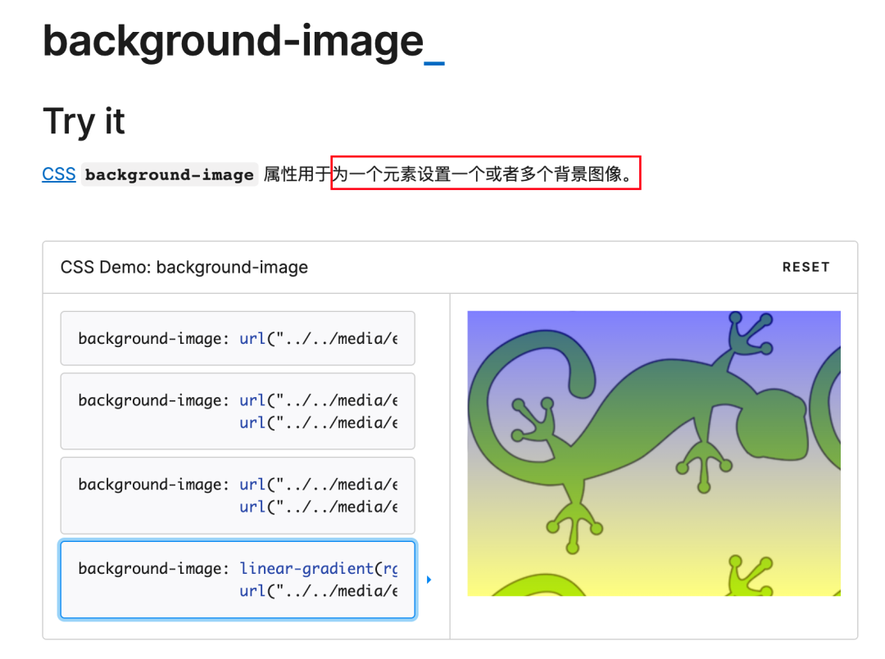

Focus now! Students, `background-image` supports setting one or more images for an element, let's take a look at what image types it supports:

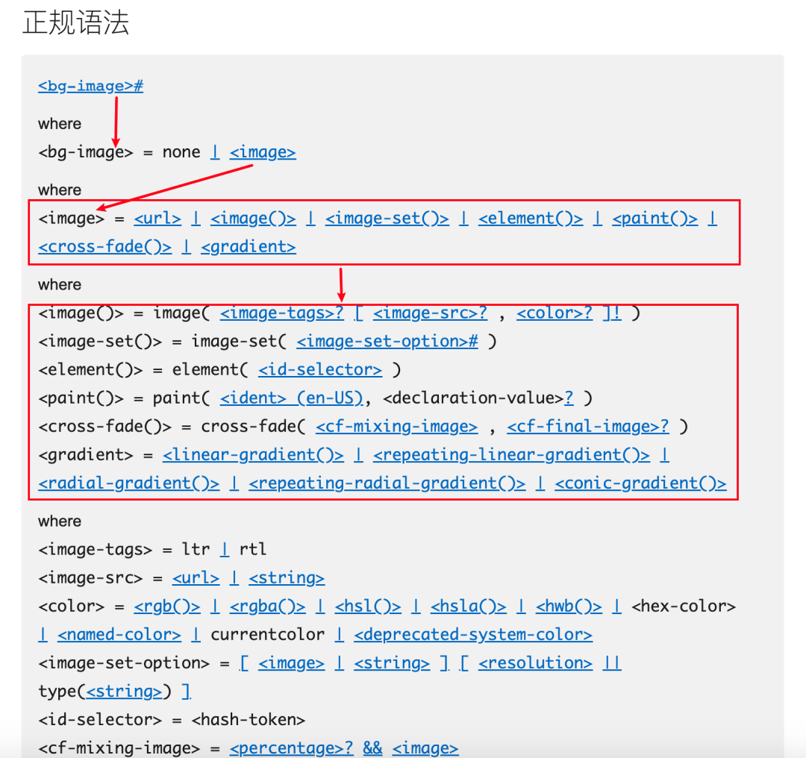

After reading the syntax, I found that basically the `<image>` type supports directly setting the image, but there is only one that supports the gradient function, for example: `linear-gradient`, `repeating-linear-gradient`, `radial- gradient`, `conic-gradient` ...

What is a gradient function? According to their word names, we can know that they support linear, radial (actually circle), and tapered color gradients. We can use the first two to satisfy the construction of Douyin `logo`

Because according to the explanation on MDN, we can use multiple gradient functions to control the background image of an element, and multiple values are separated by `,`, such as the official example:

```css
background-image: linear-gradient(rgba(0, 0, 255, 0.5), rgba(255, 255, 0, 0.5)),
  url("../../media/examples/lizard.png");
```

To use a more vivid metaphor, `background-image` is just like our writing, writing needs to be written stroke by stroke, and each value separated by `,` in `background-image` is like each stroke, these values together make up an "image"

Then we can use these functions to draw the Douyin logo

## Let's do it

---

Let’s first measure the aspect ratio of the note in the Douyin logo, in order to leave a certain space for the note

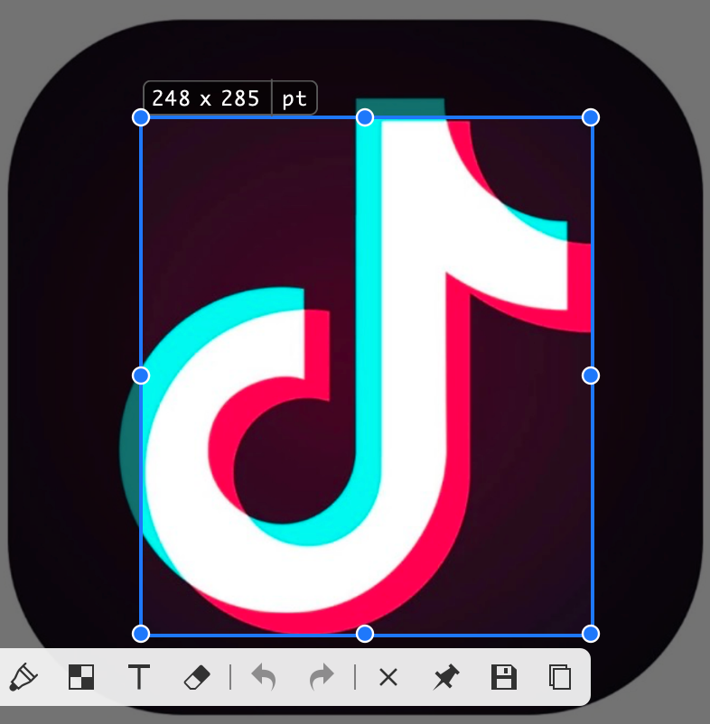

note aspect ratio

Specially use the screenshot tool to circle the part of the red note, the obtained width and height is `248 * 285`, calculate the aspect ratio is approximately equal to `248/285 = 0.87`, then we need to leave a width and height in the middle A rectangular position with a ratio of `0.87` to the note

### laying the foundation

---

Then lay the groundwork first!

```html
<style>
   .douyin {
     width: 100px;
     aspect-ratio: 0.87; /* aspect ratio 0.87 */
     border-radius: 25%;
     padding: 20px calc(20px + 100px / 0.87 * 0.13 / 2); /* leave space around, make room for notes in the middle */
     background-color: #000;
   }
</style>

<div class="douyin" />
```

Here I need to explain the value setting of `padding`, `20px` is a margin size I set randomly, since the top and bottom are `20px`, and the aspect ratio of the overall element itself is not `1:1 `(the whole is not a square), then in order to visually center and `1:1` of the overall width and height, we need to increase the left and right margins to equal the overall width and height

So `100px / 0.87` gets the overall height, and then multiplies by `0.13` to get the difference between width and height, because it needs to be evenly distributed to both sides, so it must be divided by `2`

Now it is properly a square, the current effect:

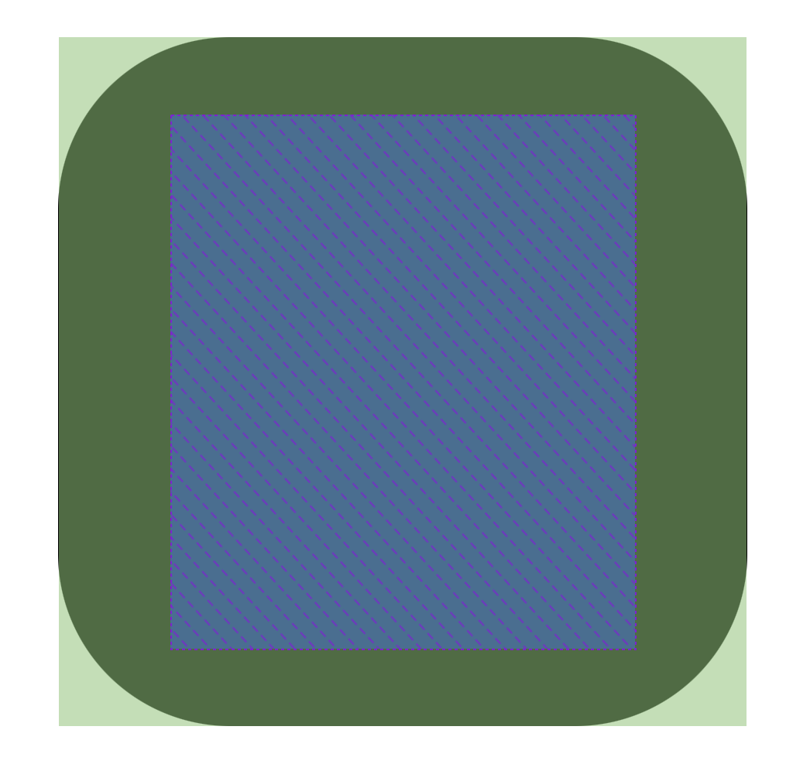

The foundation is laid

Here, in order to make the notes to be drawn only in the area in the picture, we set `display: grid` for the external container, and we need to use the ability of `grid` layout later

```css
.douyin::before,
.douyin::after {
   content: "";
   grid-area: 1/1; /* center display */
}
```

### draw 1/4 circle

---

How to draw a circle? Let's demonstrate with a simple example:

```html
<style>
   .demo {
     /* demo is a square */
     background: radial-gradient(
       100% 100% at 100% 100%,
       transparent 0 50%,
       red 50% 100%,
       transparent
     );
   }
</style>

<div class="demo" />
```

We get a graph like this:

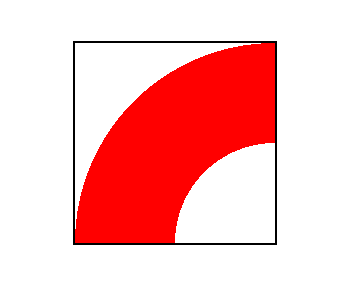

How to get such a `1/4 circle`? Let's break down the style:

##### `100% 100% at 100% 100%`:

The left side of at indicates the horizontal and vertical radius length of the circle (or ellipse); the right side of at indicates the position of the circle on the coordinate axis

That corresponds to this picture:

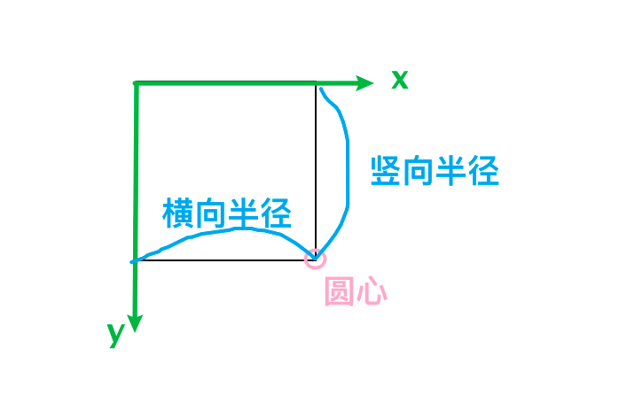

##### `transparent 0 50%`

The `radial-gradient()` function except the first parameter, the rest of the parameters represent the color and gradient

Therefore, `transparent 0 50%` means that from the center of the circle to the position where the radius is half the length, the color is transparent

I am afraid that everyone will not be able to see it here, so I changed `transparent` to `blue`, and I will show you the rendering:

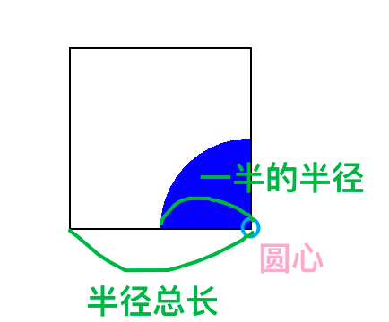

##### `red 50% 100%`

The principle is the same as the previous one, from the position where the radius is `50%` to the part where the radius is `100%`, red is displayed

The effect picture is:

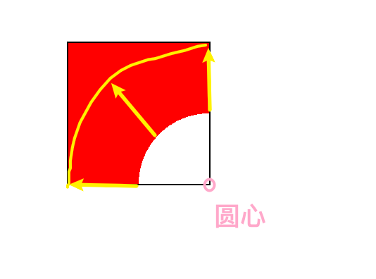

In fact, only the area pointed out by the yellow arrow is caused by our code, so why is it red all the way to the upper left corner of the square? Because the `radial-gradient()` function needs to set a `color-stop` at the end, please see below

##### `transparent`

This is also the last parameter of the function, indicating that the gradient ends with a transparent color, that is, from the end position of the previous position (`red 50% 100%`) to the edge of the container, it is displayed as transparent

Now look at the effect again:

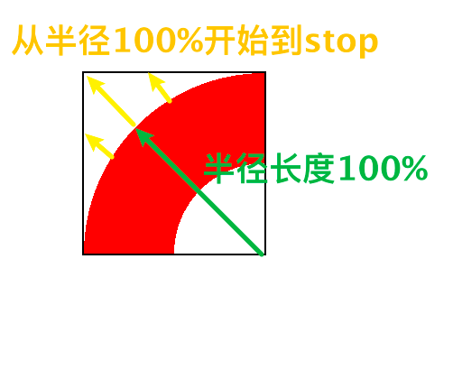

Such a `1/4 circle` is drawn

So back to our text

```css
.douyin::before,
.douyin::after {
   content: '';
   grid-area: 1/1; /* center display */
+ background:
+ radial-gradient(
+ 100% 100% at 100% 100%,
+ transparent 0 50%,
+ #08fff9 50% 100%,
+ transparent
+ );
}
```

Now the container we store the notes in is a rectangle with an aspect ratio of `0.87`. If we follow the code we just drew the rectangle, the final output should look like this:

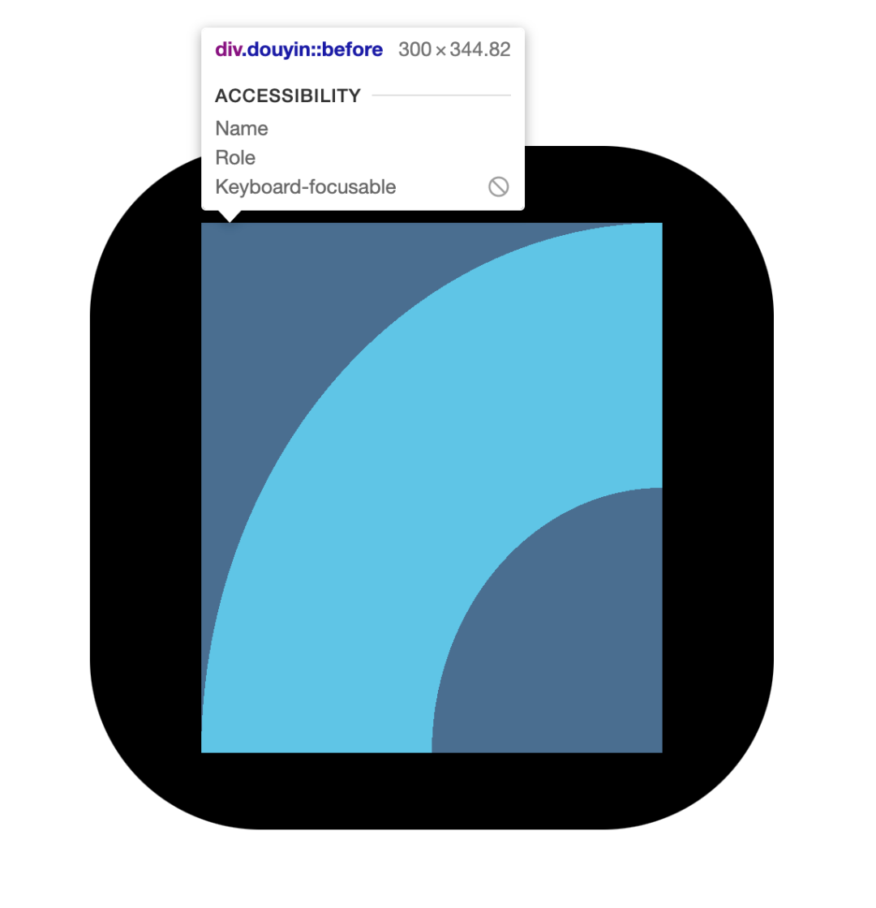

Obviously, the widths of the two ends of the ring are inconsistent. At this time, we can use `background-size` to compress it to get a ring with the same width. I’m too lazy to calculate it. Let’s fine-tune it directly on the console

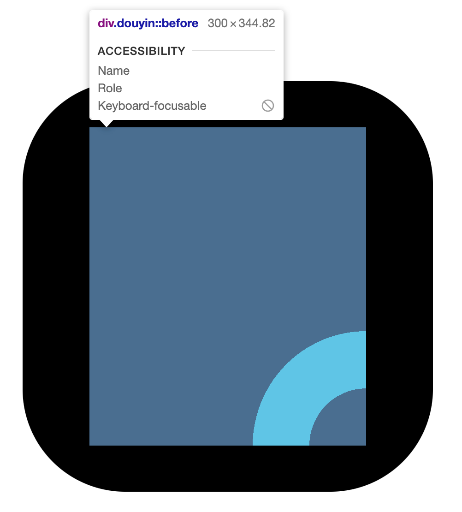

Now it is almost the same width, and it is probably a standard `1/4 ring`, and then we need to put it in the lower position in the middle of the left side, the code is as follows:

```css
.douyin::before,
.douyin::after {
   content: "";
   grid-area: 1/1; /* center display */
   background: radial-gradient(
       100% 100% at 100% 100%,
       transparent 0 50%,
       #08fff9 50% 100%,
       transparent
     ) + left 52%/41% 36% no-repeat;
}
```

It's got an inside smell, doesn't it?


### Draw a semicircle

---

The principles are similar, so let’s put a diagram of the generation and displacement process of a semicircle:


The code is as follows, and I will not explain too much the meaning of various values, because I am all fine-tuning:

```css
.douyin::before,
.douyin::after {
   content: "";
   grid-area: 1/1; /* center display */
   background: radial-gradient(
         100% 100% at 100% 100%,
         transparent 0 50%,
         #08fff9 50% 100%,
         transparent
       ) left 52%/41% 36% no-repeat, + radial-gradient(
         +50% 100% at top,
         + transparent 44%,
         + #08fff9 45% 98%,
         + transparent +
       ) 0 100%/73% 31% no-repeat;
}
```

### Draw long bars

---

The strip may not be the same as the ring and semicircle. It uses the `linear-gradient()` linear function. We don't do fancy operations, just fill the entire area with color, and then scale it horizontally and vertically get a rectangle bar

```css
.douyin::before,
.douyin::after {
   content: "";
   grid-area: 1/1; /* center display */
   background: radial-gradient(
         100% 100% at 100% 100%,
         transparent 0 50%,
         #08fff9 50% 100%,
         transparent
       ) left 52%/41% 36% no-repeat, radial-gradient(
         50% 100% at top,
         transparent 44%,
         #08fff9 45% 98%,
         transparent
       ) 0 100%/73% 31% no-repeat,
     + linear-gradient(#08fff9, #08fff9) 66% 0/20% 70% no-repeat;
}
```

The effect process animation is as follows:


### Draw a 1/4 circle with a slightly larger radius

---

Skip the explanation again and look directly at the code:

```css
.douyin::before,
.douyin::after {
   content: "";
   grid-area: 1/1; /* center display */
   background: radial-gradient(
         100% 100% at 100% 100%,
         transparent 0 50%,
         #08fff9 50% 100%,
         transparent
       ) left 52%/41% 36% no-repeat, radial-gradient(
         50% 100% at top,
         transparent 44%,
         #08fff9 45% 98%,
         transparent
       ) 0 100%/73% 31% no-repeat,
     linear-gradient(#08fff9, #08fff9) 66% 0/20% 70% no-repeat, + radial-gradient(
         +100% 100% at 100% 0,
         + transparent 0 58%,
         + #08fff9 58.5% 99%,
         + transparent +
       ) 100% 0/47% 41.8% no-repeat;
}
```

The renderings are as follows:


So far, a note has been drawn, and there is only one step away from success

## split

---

We wrote `::before` and `::after` together in our code just now, but now the two identical notes overlap completely, and the colors of the two notes are also the same now, let’s modify it

### The color is obtained through variables

---

In order not to make the code redundant, we use variables to get all `#08fff9` in the code just now, namely `#08fff9 => var(--color)`

```css
.douyin::before,
.douyin::after {
   content: "";
   grid-area: 1/1; /* center display */
   background: radial-gradient(
         100% 100% at 100% 100%,
         transparent 0 50%,
         var(--color) 50% 100%,
         transparent
       ) left 52%/41% 36% no-repeat, radial-gradient(
         50% 100% at top,
         transparent 44%,
         var(--color) 45% 98%,
         transparent
       ) 0 100%/73% 31% no-repeat,
     linear-gradient(var(--color), var(--color)) 66% 0/20% 70% no-repeat, radial-gradient(
         100% 100% at 100% 0,
         transparent 0 58%,
         var(--color) 58.5% 99%,
         transparent
       ) 100% 0/47% 41.8% no-repeat;
}
```

And set the color variable separately for `::before` and `::after`

```css

+ .douyin::before {
+  --color: #08fff9;
+ }

+ .douyin::after {
+  --color: #f00044;
+ }
```

Besides that, we're going to move one of the notes so that the two notes no longer overlap

```css
.douyin::before {
  --color: #08fff9;
}

.douyin::after {
  --color: #f00044;
+ transform: translate(3%, 3%);
}
```

look at the effect


Ok, but the two notes are misplaced, but the color mixing effect seems to be absent. At this time, the `mix-blend-mode` attribute is used. The definition of MDN is to make the content and background of the current element and its parent element in a certain There are a lot of supported attributes, so I won’t jump out and talk about other things in this article. I tried them one by one in the console and found that `lighten`, `plus-lighter`, and `screen` can all be used. It achieves our effect, but I don't know the specific function very well, I can learn it in the future

Please see the trial process 👇


Finally, let's set `mix-blend-mode: lighten`

wow! Our Logo is ready!


## Add an animation

---

Why can't Douyin not shake?

What we are setting now is that the red note is shifted to the right and up by `3%`, then we want these two notes to vibrate now, in fact, we are modifying their respective offsets. Let's change the code again!

```css
.douyin::before {
   --color: #08fff9;
   transform: translate(calc(var(--x, 0%) - 3%), calc(var(--x, 0%) - 3%));
}

.douyin::after {
   --color: #f00044;
   transform: translate(calc(3% - var(--x, 0%)), calc(3% - var(--x, 0%)));
}

/* When hover, set the offset variable --x */
.douyin:hover::before,
.douyin:hover::after {
   --x: 0.1%;
   transition: transform cubic-bezier(0.5, 300, 0.5, -150) 0.3s;
}
```

Please see the effect:


dithering effect

I originally wanted to add the effect of [text glitch wind] I wrote to this `Logo`, it must be cool, but I can’t do anything, because to set the glitch wind effect for notes, I need to use pseudo-elements, Now the note itself is already a pseudo-element. I can't get rid of the title of my article "Use only one html tag to realize the Douyin Logo with animation". If you are interested, you can go down and add it yourself. Remember Aite I, I also want to see the effect

I can't think of any fancy animations, and finally I will show you the "mutation" of the Douyin Logo.

Are you ready?

3~

2~

1~

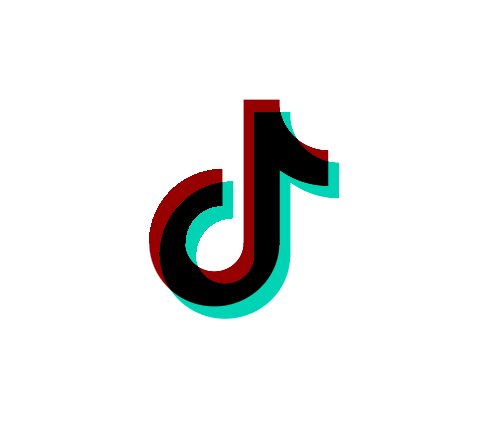

Mutant Douyin Logo

Wow! I have to say, it's so beautiful! Hahahaha, in fact, the implementation principle is not difficult, I just added a `filter: invert(1);` attribute to the element

## at last

---

How about it, am I not a headline party? It is true that only one HTML tag is used to realize a Douyin Logo with animation, right?
