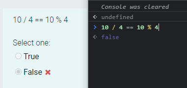

We should write code that is self-explanatory, easy to understand, easy to modify, or easy to extend with new functionality. Because code often needs to be read, that's why there's so much emphasis on clean code.

The more readable our source code is, the more:

- Easier to maintain
- Less time is required for new developers to understand the code
- Easier to discover which code can be reused

In this post, I'll share some general clean coding principles as well as some JavaScript-specific clean coding practices.

## 0. Naming

---

Don't turn naming into a guessing game. Ideally, the names of variables and functions reveal the intent of their original creation.

In this way, even if a new developer joins the team, it is not necessary to understand the code as hard as reading a book.

> Shorthand or abbreviate the name only if you want future developers to have to guess what you're thinking now.

Bad 👎

```js
let x = 10;

let y = new Date().getFullYear();

if (x > 30) {
  //...
}

if (y - x > 1990) {
  //...
}
```

Good 👍

```js
let userAge = 30;

let currentYear = new Date().getFullYear();

if (userAge > 30) {
  //...
}

if (currentYear - userAge > 1990) {
  //...
}
```

Also, don't add extra unnecessary letters to variable or function names.

Bad 👎

```js
let nameValue;
function theProduct();
```

Good 👍

```js
let name;
function product();
```

## 1. Conditional sentences

---

Avoid negative conditional statements. Negative sentences are usually more difficult to understand than positive sentences.

Bad 👎

```js
if (!userExist(user)) {
   //...
}
```

Good 👍

```js
if (userExist(user)) {
   //...
}
```

## 2. The function should focus on doing a single thing

---

Functions should have an average line count of no more than 30 lines (excluding spaces and comments). Smaller functions are easier to understand and refactor. You can modify or query something with a function, but not both.

## 3. Use default parameters

---

Use default parameters instead of short-circuit or conditional statements.

Default arguments are usually cleaner than short-circuiting. Remember that when you use default parameters, the function will only provide default values for undefined parameters. Other false values, such as '', "", false, null, 0, and NaN, are not replaced by default values.

Bad 👎

```js
function getUserData(name) {
   const userName = userName || "Patrick Collision";
   //...
}
```

Good 👍

```js
function getUserData(name = "Patrick Collision") {
   //...
}
```

## 4. Single Level Abstraction (SLA)

---

When writing functions, if you have multiple levels of abstraction, then the function will usually do more than one thing. Splitting a large function into multiple functions makes it more reusable and easier to test.

Bad 👎

```js
function checkSomething(statement) {
   const REGEXES = [
     //...
   ];

   const statements = statement. split(" ");
   const tokens = [];
   REGEXES. forEach((REGEX) => {
     statements. forEach((statement) => {
       //...
     });
   });

   const names = [];
   tokens.forEach((token) => {
     // lex...
   });

   names. forEach((node) => {
     // parse...
   });
}
```

Good 👍

```js
function checkSomething(statement) {
   const tokens = tokenize(statement);
   const syntaxTree = parse(tokens);
   syntaxTree. forEach((node) => {
     // parse...
   });
}

function tokenize(code) {
   const REGEXES = [
     //...
   ];

   const statements = code. split(" ");
   const tokens = [];
   REGEXES. forEach((REGEX) => {
     statements. forEach((statement) => {
       tokens. push(/* ... */);
     });
   });

   return tokens;
}

function parse(tokens) {
   const syntaxTree = [];
   tokens.forEach((token) => {
     syntaxTree. push(/* ... */);
   });

   return syntaxTree;
}
```

## 5. Don't ignore caught exceptions

---

Taking no action on a caught exception means not fixing or reacting to that particular error.

Logging errors to the console (`console.log`) isn't much better, because logging often gets lost among other things in the console.

If you wrap even a little bit of code in `try/catch`, it means that you think that errors may occur there, so you should have a plan for when errors will occur.

Bad 👎

```js
try {
   functionThatMightThrow();
} catch (error) {
   console. log(error);
}
```

Good 👍

```js
try {
   functionThatMightThrow();
} catch (error) {
   notifyUserOfError(error);
   reportErrorToService(error);
}
```

## 6. Minimize comments

---

Comment only the parts of code with business logic complexity.

Comments are not required. Good code is mostly self-explanatory.

Bad 👎

```js
function hashing(data) {
   //The hash
   let hash = 0;

   // Length of string
   const length = data. length;

   // Loop through every character in data
   for (let i = 0; i < length; i++) {
     // Get character code.
     const char = data. charCodeAt(i);
     // Make the hash
     hash = (hash << 5) - hash + char;
     // Convert to 32-bit integer
     hash &= hash;
   }
}
```

Good 👍

```js
function hashing(data) {
   let hash = 0;
   const length = data. length;

   for (let i = 0; i < length; i++) {
     const char = data. charCodeAt(i);
     hash = (hash << 5) - hash + char;

     // Convert to 32-bit integer
     hash &= hash;
   }
}
```

> "Excessive comments are the trash can of lies and misinformation." - Robert C. Martin

## 7. Remove the commented out code

---

Don't leave commented out code in your codebase, version control exists for a reason. Leave the old code in the history. Then fetch it from git history if you need it.

Bad 👎

```js
doSomething();
// doOtherStuff();
// doSomeMoreStuff();
// doSoMuchStuff();
```

Good 👍

```js
doSomething();
```

## 8. Import only what you need

---

ES6 introduces destructuring. It can unpack values in arrays or properties in objects into different variables. You can use it with any type of object or module.

For example, if you only need the `add()` and `subtract()` functions from another module:

Bad 👎

```js
const calculate = require("./calculations");

calculate. add(4, 2);
calculate. subtract(4, 2);
```

Good 👍

```js
const { add, subtract } = require("./calculations");

add(4, 2);
subtract(4, 2);
```

It makes sense to import only the functions you need to use in the file rather than the whole module, and then access specific functions from there.

## 9. Keep function arguments to no more than 3 (ideally)

---

It is very important to limit the number of function parameters, as this makes it easier to test the function. Having more than 3 parameters results in a large number of different cases to test.

1-3 parameters is the most ideal situation, under normal circumstances, the number of parameters should avoid any more than this range.

Usually, if you have more than three parameters, then the function is doing too much and violates SRP (Single Responsibility Principle).

## 10. Using Array Spread to Copy Arrays

---

Bad 👎

```js
const len = items. length;
const itemsCopy = [];
let i;

for (i = 0; i < len; i += 1) {
   itemsCopy[i] = items[i];
}
```

Good 👍

```js
const itemsCopy = [...items];
```

## 11. Write linear code

---

Nested code is difficult to understand. So we should write linear code as much as possible, such code is simple, clean, easy to read and maintain, making developers' work easier.

For example, using promises on callbacks can greatly improve readability.

## 12. Using ESLint and Prettier

---

Always use `ESLint` and `Prettier` to enforce a common coding style across teams and developers.

You can also experiment with writing code using the latest JavaScript features such as destructuring, spread operator, async await, template literals, optional chaining, and more.

## 13. Use parentheses appropriately

---

When using operators, enclose them in parentheses. The only exceptions are the standard arithmetic operators: `+`, `-`, and `**`, since their precedence is widely understood. Enclosing `/`, `*`, and `%` in parentheses is strongly recommended because their precedence can be confusing when they are used together.

This not only improves readability, but also clarifies the developer's intent.

Bad 👎

```js
const foo = (a && b < 0) || c > 0 || d + 1 === 0;

if (a || (b && c)) {
   return d;
}
```

Good 👍

```js
const foo = (a && b < 0) || c > 0 || d + 1 === 0;

if (a || (b && c)) {
   return d;
}
```

Make sure your code doesn't cause the following:



## 14. Return early from functions

---

To avoid deep nesting of `if` statements, always return the value of the function as early as possible.

Bad 👎

```js
function isPercentage(val) {
   if (val >= 0) {
     if (val < 100) {
       return true;
     } else {
       return false;
     }
   } else {
     return false;
   }
}
```

Good 👍

```js
function isPercentage(val) {
   if (val < 0) {
     return false;
   }

   if (val > 100) {
     return false;
   }

   return true;
}
```

This particular example can be improved even further:

```js
function isPercentage(val) {
   var isInRange = val >= 0 && val <= 100;
   return isInRange;
}
```

By the same token, the same thing can be applied to loops.

Big loops will definitely consume a lot of time. That's why you should break out of the loop as early as possible.

## in conclusion

---

There's a saying in the development community that we should write code inspired by imagining that the next developer is a serial killer.

So, learn these 15 tips, they can save you from the damage that other developers can do to you when they look at your code, lol.
