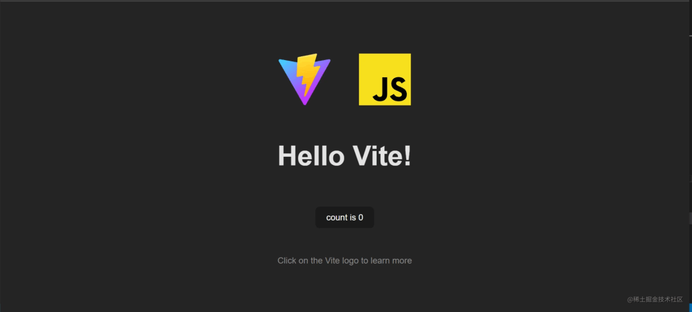

In this article, I will introduce some lesser-known but very useful APIs, such as:

- `Page Visibility API`
- `Web Share API`
- `Broadcast Channel API`
- `Internationalization API`

Together we'll take a look at what they are, where we should use them, and how to use them.

## Page Visibility API

---

It's a little-known web API that ranks fourth last in awareness in the State of JS Survey[1]. It lets you know when users leave the page. Specifically, the API fires an event whenever the visibility state of a page changes, whether the user minimizes, maximizes a window, or switches tabs.

In the past, you had to use some gimmicks to know if the user switched tabs or minimized the window. The most popular way is to use `blur` and `focus` browser events. Using these events will result in something like the following happening:

```js
window.addEventListener("focus", function () {
  // User is back on the page
  // Do Something
});

window.addEventListener("blur", function () {
  // User left the page
  // Do Something
});
```

The preceding code works, but not as expected. Because the `blur` event is fired when the page loses focus, it is fired when the user clicks on the search bar, `alert` dialog, console or window border. So, `blur` and `focus` only tell us whether the page is activated, but not whether the content of the page is hidden or shown.

### When to use

In general, we want to use the `Page Visibility API`, hoping to stop unnecessary programs. For example, when the user does not see the page, or when performing background operations. Specific scenarios can be:

- pause the video, image rotation or animation when the user navigates away from the page;
- If the page displays real-time data from the API, the behavior of temporarily stopping the real-time display when the user leaves;
- Send user analysis report.

### how to use

The `Page Visibility API` brings two properties and an event for accessing the page visibility state:

- `document.hidden`: This property is globally visible and read-only. Try to avoid using this attribute as it is now deprecated. When accessed, this property returns `true` if the page is hidden, and `false` if the page is visible.

- `document.visibilityState`: This property is the updated version of `document.hidden`. When this property is accessed, four possible values are returned depending on the page's visibility state:

- - `visible`: The page is visible, or to be precise, it is not minimized nor in another tab.
   - `hidden`: The page is not visible, it is minimized, or in another tab.
   - `prerender`: This is the initial state of a visible page when it is prerendered. A page's visibility state can start from `prerender` and then change to another state, but it cannot change from another state to `prerender`.
   - `unloaded`: The page is being unloaded from memory.

- `visibilitychange`: This is an event provided by the `document` object, which is fired when the `visibilityState` of the page changes.

```js
document.addEventListener("visibilitychange", () => {
  if (document.visibilityState === "visible") {
    // page is visible
  } else {
    // page is hidden
  }
});
```

To see how to use the `Page Visibility API`, let's use this feature to pause the video and stop fetching resources from the API when the user navigates away from the page. First, I'll use `vite.js`, an amazing tool for jumpstarting new projects:

```
npm create vite@latest unknown-web-apis
```

When asked to choose a framework, choose `vanilla` to create a `vanilla` javascript project. Once that's done, head to the new folder, install the necessary `npm` packages and start the development server:

```
cd unknown-web-apis
npm install
npm run dev
```

Open **localhost:3000/**[2] and you will see your Vite project up and running!

vite-new-project.png

First, we jump directly to the `/main.js` file and remove all boilerplate code. Secondly, open `/index.html`, add a `video` element inside the `div` tag whose `id` is `#app`, you can add any video file you want to add on it. Here I used a dancing Yoshi.

```html
<div id="app">
  <video controls id="video">
    <source src="./yoshi.mp4" />
  </video>
</div>
```

dancing-Yoshi.png

Back in `/main.js`, we will add an event listener to the `document` object to listen for the `visibilitychange` event. We can then access the value of the `document.visibilityState` property when the page is shown or hidden.

```js
document.addEventListener("visibilitychange", () => {
  console.log(document.visibilityState);
});
```

You can go to the page's console to see the page's visibility status when minimizing the window or switching to another tab. Now, inside the event listener, we can check the `document.visibilityState` property, pause the video when the value is `hidden`, and play the video when the value is `visible`. Of course, we first select the `video` element using `document.querySelector()`.

```js
const video = document.querySelector("#video");

document.addEventListener("visibilitychange", () => {
  if (document.visibilityState === "visible") {
    video.play();
  } else {
    video.pause();
  }
});
```

Now, whenever the user leaves the page, the video stops. Another scenario for using the `Page Visibility API` is to stop fetching unnecessary resources when the user is not viewing the page. To see it in action, we'll write a function that continuously fetches random quotes from the **quotable.io**[3] API, and pauses that behavior when the page is hidden. First, we will create a new `div` tag in `/index.html` to store the reference.

```html
<div id="app">
  <video controls id="video">
    <source src="./yoshi.mp4" />
  </video>
  <div id="quote"></div>
</div>
```

Back in `/main.js`, we use the **Fetch API**[4] to make a call to the `quotable.io` endpoint **https://api.quotable.io/random**[5], and then Insert the result into the `quote` div.

```js
const quote = document.querySelector("#quote");

const getQuote = async () => {
  try {
    const response = await fetch("<https://api.quotable.io/random>");
    const { content, author, dateAdded } = await response.json();
    const parsedQuote = ` <q>${content}</q> <br> <p>- ${author}</p><br> <p>Added on ${dateAdded}</p>`;
    quote.innerHTML = parsedQuote;
  } catch (error) {
    console.error(error);
  }
};
```

Let's briefly explain what's going on here. First we selected the `quote` element from the DOM. Then declare the `getQuote` function, which is an asynchronous function that allows us to wait using the `await` keyword until data is fetched from the API. The fetched data is in JSON format, so we again use the `await` keyword to wait until the data is parsed into a JavaScript object.

The `quotable.io` API provides us with properties such as `content`, `author` and `dateAdded`, which we inject and display in the `quote` div. This is fine, but the reference will only be fetched once, so we can use `setInterval()` to call the function every 10 seconds.

```js
const quote = document.querySelector("#quote");

const getQuote = async () => {
  try {
    const response = await fetch("<https://api.quotable.io/random>");
    const { content, author, dateAdded } = await response.json();
    const parsedQuote = ` <q>${content}</q> <br> <p>- ${author}</p><br> <p>Added on ${dateAdded}</p>`;
    quote.innerHTML = parsedQuote;
  } catch (error) {
    console.error(error);
  }
};

getQuote();

setInterval(getQuote, 10000);
```

If the user minimizes the window or switches tabs, the page will still get referrers, creating unnecessary network loads. To fix this, we can check if the current page is visible before getting the referrer.

```js
const getQuote = async () => {
  if (document.visibilityState === "visible") {
    try {
      const response = await fetch("<https://api.quotable.io/random>");
      const { content, author, dateAdded } = await response.json();
      const parsedQuote = `
          <q>${content}</q> <br> 
          <p>- ${author}</p><br> 
          <p>Added on ${dateAdded}</p>`;
      quote.innerHTML = parsedQuote;
    } catch (error) {
      console.error(error);
    }
  }
};

getQuote();

setInterval(getQuote, 10000);
```

Right now, we'll only fetch refs if the page is visible to the user.

### Compatibility

**WIDE SUPPORT**[6]

## Web Share API

---

### What's this

The `Web Share API` is also one of the least known, but very useful. It gives you access to the operating system's native sharing mechanism, which is especially useful for mobile users. With this API, you can share text, links, and files without creating your own sharing mechanism or using a third-party sharing mechanism.

### When to use

The usage is self-explanatory. You can use it to share your page content on social media, or to copy it to a user's clipboard.

### how to use

The `Web Share API` gives us two interfaces to access the user's sharing system:

1. `navigator.canShare()`: Accepts the data you want to share as a parameter, and returns a Boolean parameter according to whether it can be shared.

2. `navigator.share()`: returns a `promise`, if the share is successful, the `promise` will `resolve`. This interface will call the native sharing mechanism and receive the data you want to share as a parameter. Note that it can only be called when the user presses a link or button. That is, it requires **transient activation**[7] (transient activation). Shared data is an object that can have the following properties:

3. - `url`: the link to share
    - `text`: the text to share
    - `title`: the title to share
    - `files`: represents an array of `File` objects to share

To see how to use the API, we'll recycle the previous use case and make an option to share our references using the `Web Sharing API`. First, we must add a share button to `/index.html`:

```html
<div id="app">
  <video controls id="video">
    <source src="./yoshi.mp4" />
  </video>
  <div id="quote"></div>
  <button type="button" id="share-button">Share Quote</button>
</div>
```

Go to `/main.js` and select the share button from the DOM. Then, create `async` functions to share the data you want to share.

```js
const shareButton = document.querySelector("#share-button");

const shareQuote = async (shareData) => {
  try {
    await navigator.share(shareData);
  } catch (error) {
    console.error(error);
  }
};
```

Now, we can add a `click` event listener to the `shareButton` element to call the `shareQuote` function. The value of `shareData.text` will be the `quote.textContent` property, and the value of `shareData.url` will be the URL of the page, which is the `location.href` property.

```js
const shareButton = document.querySelector("#share-button");

const shareQuote = async (shareData) => {
  try {
    await navigator.share(shareData);
  } catch (error) {
    console.error(error);
  }
};

shareButton.addEventListener("click", () => {
  let shareData = {
    title: "A Beautiful Quote",
    text: quote.textContent,
    url: location.href,
  };

  shareQuote(shareData);
});
```

Now you can share your citations with anyone through your native OS. However, it is important to note that the `Web Share API` will only work if the context is safe, that is, pages are served via `https://` or `wss://` URLs.

### Compatibility

**Basically not supported**[8]

## Broadcast Channel API

---

### What's this

Another API I want to talk about is `Broadcast Channel API`. It allows browser contexts to send and receive basic data from each other. A browser context is an element such as a tab, window, `iframe`, or anywhere a page can be displayed. For security reasons, communication between browser contexts is not allowed unless they are of the same origin and use the `Broadcast Channel API`. For two browser contexts to have the same origin, their URLs must have the same protocol (eg `http/https`), domain (eg `example.com`) and port (eg `:8080`).

### When to use

The `Broadcast Channel API` is often used to keep page state in sync across different tabs and windows, either to improve user experience or for security reasons. It can also be used to know when a service is done in another tab or window. The usage scenarios are:

- Log in or log out users on all tabs.
- Detect when an asset is uploaded and display it on all pages.
- Instruct the `service worker` to do some work behind the scenes.

### how to use

The `Broadcast Channel API` involves a `BroadcastChannel` object that can be used to send information to other contexts. The constructor has only one parameter: a string that is the identifier to connect to the channel from some other context.

```js
const broadcast = new BroadcastChannel("new_channel");
```

Once we have created a `BroadcastChannel` object with the same identifier in both contexts, this new `BroadcastChannel` object will have two methods available to start communicating:

- `BroadcastChannel.postMessage()`: Post a message in the context of all connections. It accepts an object of any type as its only parameter, so you can send all kinds of data.

```js
broadcast.postMessage("Example message");
```

- `BroadcastChannel.close()`: Closes the channel, indicating to the browser that it will not receive any more messages, so that it can collect them for garbage collection.

```js
broadcast.onmessage = ({ data, origin }) => {
  console.log(`${origin} says ${data}`);
};
```

Let's see how to use `Broadcast Channel API` by using the previous examples. Our goal is to make another browser context with the same origin, and show the same references in both contexts. In order to do this, we will create a new folder called `new-origin` with a new `/index.html` and `/main.js` files inside.

`/new-origin/index.html` will be a new HTML template with a `#quote` div inside:

```html
<!DOCTYPE html>
<html lang="en">
  <head>
    <meta charset="UTF-8" />
    <link rel="icon" type="image/svg+xml" href="../favicon.svg" />
    <meta name="viewport" content="width=device-width, initial-scale=1.0" />
    <title>Vite App</title>
  </head>
  <body>
    <div id="quote"></div>
    <script type="module" src="./main.js"></script>
  </body>
</html>
```

In the `/new-origin/main.js` file, we will create a new `broadcast channel` and select the `#quote` element from the DOM:

```js
const broadcast = new BroadcastChannel("quote_channel");
const quote = document.querySelector("#quote");
```

In the previous `/main.js` file, we will create new `BroadcastChannel` object and connect to `"quote_channel"`. We will also modify the `getQuote` function to send quotes as messages to other contexts.

```js
const broadcast = new BroadcastChannel("quote_channel");

//...

const getQuote = async () => {
  try {
    const response = await fetch("<https://api.quotable.io/random>");
    const { content, author, dateAdded } = await response.json();
    const parsedQuote = ` <q>${content}</q> <br> <p>- ${author}</p><br> <p>Added on ${dateAdded}</p>`;
    quote.innerHTML = parsedQuote;
    broadcast.postMessage(parsedQuote);
  } catch (error) {
    console.error(error);
  }
};
```

Back in the `/new-origin/main.js` file, we will listen to the `message` event and change the `quote.innerHTML` every time a new quote is sent.

```js
const broadcast = new BroadcastChannel("quote_channel");
const quote = document.querySelector("#quote");

broadcast.onmessage = ({ data }) => {
  quote.innerHTML = data;
};
```

Now you can see how the origin from `http://localhost:3000/new-origin/` changes to the origin from `http://localhost:3000`. You can also notice that when the `http://localhost:3000` tag is hidden, the referrer does not change, because it only fetches referrers when its page visibility status is visible.

### Compatibility

**WIDE SUPPORT**[9]

## Internationalization API

---

### What's this

When developing a web page or application, it is very common to need to translate its content into other languages to reach a wider audience. However, simply translating the text of your web page into whatever language you need is not enough to make your content available to speakers of that language, as things like dates, numbers, units, etc. are different in different countries and may change Confuse your users.

Let's say you want to display the date "November 8, 2022" on your web page, like "11/8/22". Depending on the country of the reader, the data can be read in three different ways:

- "11/8/2022" or MM/DD/YY for US users.
- "8/11/2022" or DD/MM/YY for European and Latin American users.
- "2011/8/22" or YY/MM/DD for users in Japan, China and Canada.

This is where the `Internationalization API` (or `I18n API`) comes in to address formatting issues for different languages and regions. The `I18n API` is an amazing tool with many uses, but we won't delve into it so as not to overcomplicate this article.

### how to use

The `I18n API` uses `locale` identifiers to function. The `locale` identifier is a string representing the user's language, city, region, dialect, and other preferences. To be precise, a `locale` identifier is a string consisting of subtags separated by hyphens. Subtags represent user preferences, such as language, country, region or text, and are formatted in the following way:

1. `"zh"`: Chinese (language);
2. `"zh-Hant"`: Chinese (language) written in traditional characters (text);
3. `"zh-Hant-TW"`: Chinese (language) written in traditional characters (text) used in Taiwan (region).

There are many more subtags to address more user preferences (you can check **RFC**[10] for the definition of language tags if you want to know more), but in short, `I18n API` Use these `locale` identifiers to know how to format all language-sensitive data.

More precisely, the `I18n API` provides an `Intl` object which brings a bunch of specialized constructors for working with language-sensitive data. In my opinion, some of the most useful `Intl` constructors for internationalization are:

- `Intl.DateTimeFormat()`: Used to format date and time.
- `Intl.DisplayNames()`: Used to format language, region and text display names.
- `Intl.Locale()`: Used to construct and manipulate `locale` identifier tags.
- `Intl.NumberFormat()`: Used to format numbers.
- `Intl.RelativeTimeFormat()`: Used to format relative time descriptions.

In our example, we'll focus on the `Intl.DateTimeFormat()` constructor to format the referenced `dateAdded` property according to the user's locale. The `Intl.DateTimeFormat()` constructor receives two arguments: a `locale` string defining the date format convention and an `options` object for customizing the date format.

The `Intl.DateTimeFormat()` object created has a `format()` method that takes two arguments: the `Date` object we want to format and an `options` object for customizing how the formatted date is displayed.

```js
const logDate = (locale) => {
  const newDate = new Date("2022-10-24"); // YY/MM/DD
  const dateTime = new Intl.DateTimeFormat(locale, { timeZone: "UTC" });
  const formatedDate = dateTime.format(newDate);
  console.log(formatedDate);
};

logDate("en-US"); // 10/24/2022
logDate("de-DE"); // 24.10.2022
logDate("zh-TW"); // 2022/10/24
```

Note: In the `options` parameter of the `Intl.DateTimeFormat` constructor, we set the `timeZone` property to `"UTC"` so that the date will not be formatted to the user's local time. In my case, without the `timeZone` option, the date was parsed as "10/23/2022".

As you can see, `dateTime.format()` changes the date according to the `locale`'s date format conventions. We can achieve this behavior on referenced dates using the `navigator.language` global property with the user's preferred `locale` setting. To do this, we'll create a new function that takes a date string (in YYYY-MM-DD format) and returns the date formatted according to the user's locale.

```js
const formatDate = (dateString) => {
  const date = new Date(dateString);
  const locale = navigator.language;
  const dateTimeFormat = new Intl.DateTimeFormat(locale, { timeZone: "UTC" });

  return dateTimeFormat.format(date);
};
```

We can add this function inside the `getQuote()` function to parse the `dateAdded` date.

```js
const getQuote = async () => {
  if (document.visibilityState === "visible") {
    try {
      const response = await fetch("<https://api.quotable.io/random>");
      const { content, author, dateAdded } = await response.json();
      const parsedQuote = `
            <q>${content}</q> <br> 
            <p>- ${author}</p><br> 
            <p>Added on ${formatDate(dateAdded)}</p>`;
      quote.innerHTML = parsedQuote;
      broadcast.postMessage(parsedQuote);
    } catch (error) {
      console.error(error);
    }
  }
};
```

With this, our references are localized to the user's preferred language! In my case, my `navigator.language` value is `"en"`, so my dates are formatted as MM/DD/YY.

### Compatibility

**WIDE SUPPORT**[11]

## Summarize

---

After reading this article, you now have the flexibility to understand where these APIs exist and how to use them. Although they rank last in awareness in the State of JS survey, they are very useful and knowing how to use them will definitely improve your development experience. These powerful APIs are not well known, which means there are useful APIs that neither you nor I know about, so now is the best time to explore and find the one that will simplify your code and save you a lot of development time. good time.

### References

[1] JS status survey: https://2021.stateofjs.com/en-US/features/

[2]localhost:3000/:http://localhost:3000/

[3]quotable.io: https://github.com/lukePeavey/quotable

[4] Fetch API: https://developer.mozilla.org/en-US/docs/Web/API/Fetch_API [5] https://api.quotable.io/random: https://api.quotable. io/random

[6] Wide support: https://caniuse.com/pagevisibility

[7] transient activation: https://developer.mozilla.org/en-US/docs/Glossary/Transient_activation

[8]Basically not supported: https://caniuse.com/web-share

[9] Wide support: https://caniuse.com/mdn-api_broadcastchannel_name

[10] RFC: https://datatracker.ietf.org/doc/html/rfc5646

[11] Wide support: https://caniuse.com/internationalization
