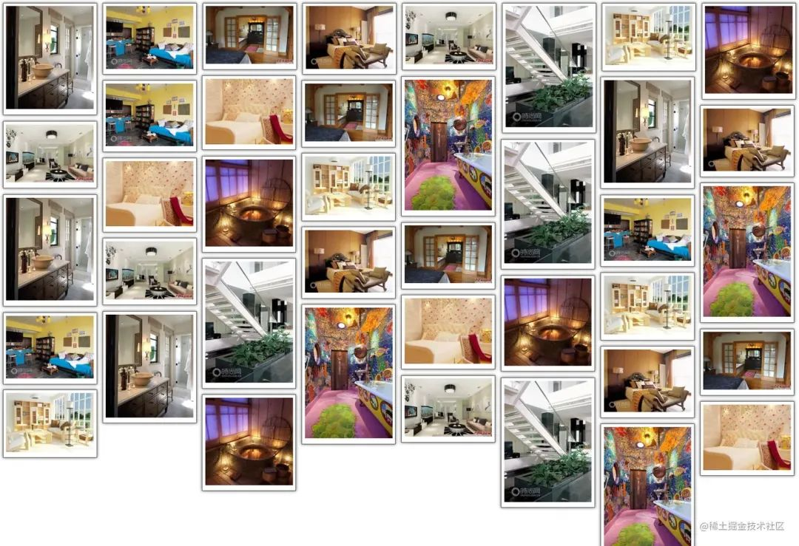

> Author: zt_ever
>
> https://juejin.cn/post/7216200378341589052

## foreword

---

> Waterfall layout is a more popular page layout method now, that is, elements of `multiple lines of equal width` are arranged, `equal width and different height`, and the following elements are `in turn` added to `the shortest` element of the `previous row Below`.

It can effectively reduce the complexity of the page and save a lot of space; moreover, the uneven arrangement of the waterfall can display multiple pieces of data to the user through the interface, and let the user have the urge to browse down, providing Great user experience! For example, Taobao’s page adopts this layout method. Let’s show you the renderings of **Taobao’s waterfall flow layout** (mobile terminal) and **the renderings we want to achieve** (PC terminal)~




## Idea preparation

---

By understanding the way of waterfall flow layout, let's sort out the steps to realize it, so as to facilitate our code writing.

1. First of all, we need to prepare **a lot of pictures** (I prepared 40 pictures), and **vscode** development tools.

2. Write the **front-end** code, add styles to the picture** so that the picture **equal width and parallel\*\* display.

3. To write **js** code, you need to know the number of pictures in the first line**, the serial number of the next picture** and the serial number of the shortest element in the previous line**, and** Placement\*\*.

## text

---

### 1. Front-end code writing

> 1. First, we define a **container** container to hold **all pictures**. In this container, use the **box** container to load the **box-img** container and then load **every picture **, which is convenient for later style writing.

> 2. Make the picture **peer** displayed--use **float:left; attribute** for the box container.

> 3. Let the image **equal width** display -- set width: 150px for the box-img container; **, set **width: 100% for the img tag; inherit 100% of the height of the parent container box-img.

> 4. In order to make the effect look better, we set the effect of **inner margin, border and shadow** for the container containing the picture.

The complete front-end code is attached:

```html
<!DOCTYPE html>
<html lang="en">
  <head>
    <meta charset="UTF-8" />
    <meta http-equiv="X-UA-Compatible" content="IE=edge" />
    <meta name="viewport" content="width=device-width, initial-scale=1.0" />
    <title>waterfall</title>
    <script src="./index.js"></script>
  </head>
  <style>
    * {
      margin: 0;
      padding: 0;
    }
    .container {
      overflow: hidden;
      position: relative;
    }
    .box {
      float: left;
      padding: 5px;
    }
    .box-img {
      width: 150px;
      padding: 5px;
      border: 1px solid #484848;
      box-shadow: 0 0 5px #484848;
    }
    .box-img img {
      width: 100%;
    }
  </style>
  <body>
    <div id="container">
      <div class="box">
        <div class="box-img">
          
        </div>
      </div>
      /*....... followed by 39 boxes, omitted here*/
    </div>
  </body>
</html>
```

### 2. js code writing

#### 1. First use window.onload=function(){} to implement the function executed immediately after the page is loaded

In this function, we call the **imgLocation('container', 'box') function** to present the final effect. The actual parameters passed in are the **parent container**'container' and the **sub-container that holds the picture **'box'.

```js
window.onload = function () {
  imgLocation("container", "box");
};
```

#### 2. Implement imgLocation() function

##### 1) First we have to `get all the images to be placed` and store them in an `array`

Use document.getElementById(parent) to get the parent container;

Call the **getChildElement(cparent, content) method**. In this method, first get all the tags of the parent container, **traverse** all the tags and use the if conditional statement** to get the container with the class name box **(container for holding pictures), store it in** an **array\*\* built by us, and the return value is this array, which is convenient to manipulate the position of the picture by traversing later.

```js
function imgLocation(parent, content) {
  var cparent = document.getElementById(parent);
  //All first-level sub-containers box under cparent
  var ccontent = getChildElement(cparent, content); //array, 40 divs
}

//Get a layer of child containers in the parent container
function getChildElement(parent, content) {
  var contentArr = [];
  var allContent = parent.getElementsByTagName("*"); //Select by tag to get an array
  //Traverse allContent and store all containers with the class name content in the contentArr array
  for (var i = 0; i < allContent.length; i++) {
    if (allContent[i].className == content) {
      //Whether the class name of the current container is content
      contentArr.push(allContent[i]);
    }
  }
  return contentArr;
}
```

##### 2) After getting this `array`, find out where `starting from` needs to be `placed`

We take the following approach:

First get the **width of the window** and **the width of each picture**, divide the two** and **round down** to get **the first row** where you can place the picture Naturally, we know the **serial number** of the picture we need to **operate\*\*.

```js
//Starting from who needs to be placed
var winWidth = document.documentElement.clientWidth; //window width
var imgWidth = ccontent[0].offsetWidth; //image width

var num = Math.floor(winWidth / imgWidth); // How many pictures can be placed in the first line
```

##### 3) After getting the serial number of the picture that needs to be `placed`, determine its `placement`

We define an array of **storage height** by ourselves, and **traverse** the **height** of the previous line of elements and **store it in the array, when traversing to the position where it needs to be **placed** For a picture, use the **Math.min() method** to get the height of the **shortest** element in the previous line, and use the **indexOf() method** to get its **subscript\*\*.

Then adjust the **style** of the image container we **operate**:
position: absolute; **absolute positioning**, **top value** is set to the height of the shortest picture in the previous line **minHeight**, **left value** is set to the width of a single picture **multiply** The subscript minIndex of this image.

Finally, don’t forget, after placing the picture, you need to **update** the **height** of the placed column~

```js
//Operate num+1 pictures
var BoxHeightArr = [];
for (var i = 0; i < ccontent.length; i++) {
  //The first num sheets only need to calculate the height
  if (i < num) {
    BoxHeightArr[i] = ccontent[i].offsetHeight;
  } else {
    //The box we want to operate: ccontent[i]
    var minHeight = Math.min.apply(null, BoxHeightArr); //apply: lend it the method of minimum value
    var minIndex = BoxHeightArr.indexOf(minHeight); //return array subscript
    ccontent[i].style.position = "absolute"; //style setting style
    ccontent[i].style.top = minHeight + "px";
    ccontent[i].style.left = imgWidth * minIndex + "px";

    //Update the height of the shortest column
    BoxHeightArr[minIndex] += ccontent[i].offsetHeight;
  }
}
```

Finally, after a little integration, the layout effect of the waterfall flow can be realized!

## at last

---

The above is the implementation process of the waterfall flow layout. If you find it useful after reading this article, remember to support it. You may use it someday after collecting it. There may be some mistakes in the article. Comments are welcome to point out, and welcome to discuss together.
