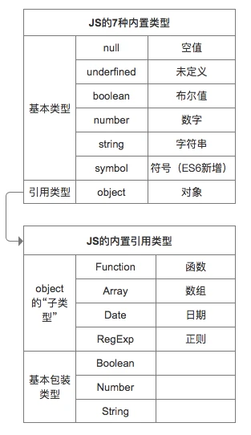

## 1. Basic data types

---

The seven built-in types in JS (null, undefined, boolean, number, string, symbol, object) are divided into two types

### Two types:

- Basic types: null, undefined, boolean, number, string, symbol
- Reference type Object: Array, Function, Date, RegExp, etc.



## 2. Judgment of data type

- typeof: can judge all value types and functions. It is not possible to accurately judge null, objects, and arrays, because they all return `object`.

```js
console.log(typeof undefined); // undefined
console.log(typeof 2); // number
console.log(typeof true); // boolean
console.log(typeof "str"); // string
console.log(typeof Symbol("foo")); // symbol
console.log(typeof 2172141653n); // bigint
console.log(typeof function () {}); // function
// cannot distinguish
console.log(typeof []); // object
console.log(typeof {}); // object
console.log(typeof null); // object
```

- instanceof: It can judge the object type, but not the basic data type. Its internal operation mechanism is to judge whether the prototype of this type can be found in its prototype chain. For example consider the following code:

```js
class People {}
class Student extends People {}

const vortesnail = new Student();

console.log(vortesnail instanceof People); // true
console.log(vortesnail instanceof Student); // true
```

Its realization is to search along the prototype chain. If the corresponding Xxxxx.prototype can be found, it is true . For example, vortesnail here is used as an example, and Student.prototype and People.prototype can be found along the prototype chain, so they are both true .

- Object.prototype.toString.call(): All primitive data types can be judged, as well as Error objects, Date objects, etc.

```js
Object.prototype.toString.call(2); // "[object Number]"
Object.prototype.toString.call(""); // "[object String]"
Object.prototype.toString.call(true); // "[object Boolean]"
Object.prototype.toString.call(undefined); // "[object Undefined]"
Object.prototype.toString.call(null); // "[object Null]"
Object.prototype.toString.call(Math); // "[object Math]"
Object.prototype.toString.call({}); // "[object Object]"
Object.prototype.toString.call([]); // "[object Array]"
Object.prototype.toString.call(function () {}); // "[object Function]"
```

A question that is often asked in interviews is: how to judge whether a variable is an array?

```js
Array.isArray(arr); // true
arr.__proto__ === Array.prototype; // true
arr instanceof Array; // true
Object.prototype.toString.call(arr); // "[object Array]"

function toRawType(value) {
  return Object.prototype.toString.call(value).slice(8, -1).toLowerCase();
}
```
