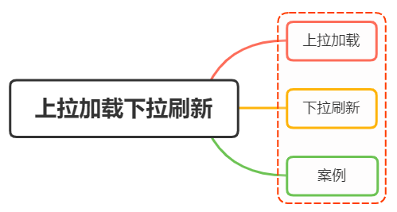

## I. Introduction

---

Pull-to-refresh and pull-up to load are two interactive methods that usually appear on the mobile terminal

Essentially the same as pagination in PC webpages, but the interactive form is different

There are also many excellent solutions in the open source community, such as `iscroll`, `better-scroll`, `pulltorefresh.js` libraries, etc.

These third-party libraries are very convenient to use

We implement a pull-up loading and pull-down refresh in a native way, which helps to better understand and use third-party libraries

## 2. Implementation principle

---

Both pull-up loading and pull-down refresh depend on user interaction

The most important thing is to understand what scene and when to trigger the interactive action

### Pull up and load

First look at a picture


The essence of pull-up loading is the action when the page bottoms out or is about to bottom out

To judge the bottom of the page, we need to understand the following attributes first

- `scrollTop`: The height of the scroll window is the distance from the top of `window`, it will increase as you scroll up, the initial value is 0, it is a changing value
- `clientHeight`: It is a fixed value, indicating the height of the visible area of the screen;
- `scrollHeight`: It does not exist when the page cannot be scrolled. It will only appear when the length of `body` exceeds `window`, and it represents the length of all elements of `body`

In summary, we come up with a bottoming formula:

```js
scrollTop + clientHeight >= scrollHeight;
```

Simple implementation

```js
let clientHeight = document.documentElement.clientHeight; //browser height
let scrollHeight = document. body. scrollHeight;
let scrollTop = document.documentElement.scrollTop;

let distance = 50; // start triggering when the distance from the window is still 50;

if (scrollTop + clientHeight >= scrollHeight - distance) {
   console.log("Start loading data");
}
```

### Pull down to refresh

The essence of pull-down refresh is the action that needs to be triggered when the user pulls down when the page itself is placed at the top

Regarding the native implementation of pull-down refresh, it is mainly divided into three steps:

- Listen to the native touchstart event and record the value of its initial position, e.touches[0].pageY;
- Listen to the native touchmove event, record and calculate the difference between the current sliding position value and the initial position value, greater than 0 means pulling down, and use the translateY attribute of CSS3 to make the element follow the gesture to slide down the corresponding difference, and should also Set a maximum value allowed to slide;
- Listen to the original touchend event. If the element slides to the maximum value at this time, the callback will be triggered, and translateY will be reset to 0, and the element will return to the initial position

for example:

The `Html` structure is as follows:

```html
<main>
   <p class="refreshText"></p>
   <ul id="refreshContainer">
     <li>111</li>
     <li>222</li>
     <li>333</li>
     <li>444</li>
     <li>555</li>
     ...
   </ul>
</main>
```

Listen to the `touchstart` event and record the initial value

```js
var _element = document. getElementById("refreshContainer"),
   _refreshText = document.querySelector(".refreshText"),
   _startPos = 0, // initial value
   _transitionHeight = 0; // distance moved

_element.addEventListener(
   "touchstart",
   function (e) {
     _startPos = e.touches[0].pageY; // record the initial position
     _element.style.position = "relative";
     _element.style.transition = "transform 0s";
   },
   false
);
```

Listen to the `touchmove` movement event and record the sliding difference

```js
_element.addEventListener(
   "touchmove",
   function (e) {
     // e.touches[0].pageY current position
     _transitionHeight = e.touches[0].pageY - _startPos; // record difference

     if (_transitionHeight > 0 && _transitionHeight < 60) {
       _refreshText.innerText = "Pull down to refresh";
       _element.style.transform = "translateY(" + _transitionHeight + "px)";

       if (_transitionHeight > 55) {
         _refreshText.innerText = "Refresh Refresh";
       }
     }
   },
   false
);
```

Finally, it is to listen to the event of `touchend` leaving

```js
_element.addEventListener(
   "touchend",
   function (e) {
     _element.style.transition = "transform 0.5s ease 1s";
     _element.style.transform = "translateY(0px)";
     _refreshText.innerText = "Updating...";
     // todo...
   },
   false
);
```

As can be seen from the above, in the process of pulling down to letting go, there are three stages:

- When the difference between the current gesture sliding position and the initial position is greater than zero, it prompts that the pull-down refresh operation is in progress
- When the pull down reaches a certain value, the operation prompt after letting go will be displayed
- When the pull-down reaches the set maximum value and let go, a callback will be executed, prompting that the update operation is in progress

## 3. Case

---

In actual development, we use more third-party libraries. Let's take `better-scroll` as an example:

HTML structure

```html
<div id="position-wrapper">
   <div>
     <p class="refresh">Pull down to refresh</p>
     <div class="position-list">
       <!--List content-->
     </div>
     <p class="more">See more</p>
   </div>
</div>
```

Instantiate the pull-up and drop-down plug-in, and register the plug-in through use

```js
import BScroll from "@better-scroll/core";
import PullDown from "@better-scroll/pull-down";
import PullUp from "@better-scroll/pull-up";
BScroll. use(PullDown);
BScroll. use(PullUp);
```

Instantiate `BetterScroll` and pass in relevant parameters

```js
let pageNo = 1, pageSize = 10, dataList = [], isMore = true;
var scroll = new BScroll("#position-wrapper",{
     scrollY:true,//Scroll vertically
     click:true,//The browser's native click event will be blocked by default. If you need to click, set it to true here
     pullUpLoad: true, // pull up to load more
     pullDownRefresh: {
         threshold:50,//The location where the pullingDown event is triggered
         stop:0//The stop position after the pull-down rebound
     }
});
//Listen to the pull-down refresh
scroll.on("pullingDown", pullingDownHandler);
//Monitor real-time scrolling
scroll.on("scroll", scrollHandler);
//Pull up to load more
scroll.on("pullingUp", pullingUpHandler);

async function pullingDownHandler(){
     dataList=[];
     pageNo=1;
     isMore=true;
     $(".more").text("See more");
     await getlist();//request data
     scroll.finishPullDown();//After each pull-down, this operation needs to be performed
     scroll.refresh();//When the dom structure of the scrolling area changes, this operation needs to be performed
}
async function pullingUpHandler(){
     if(!isMore){
         $(".more").text("No more data");
         scroll.finishPullUp();//After each pull-up is completed, this operation needs to be performed
         return;
     }
     pageNo++;
     await this.getlist();//request data
     scroll.finishPullUp();//After each pull-up is completed, this operation needs to be performed
     scroll.refresh();//When the dom structure of the scrolling area changes, this operation needs to be performed
}
function scrollHandler(){
     if(this.y>50) $('.refresh').text("let go and start loading");
     else $('.refresh').text("Pull down to refresh");
}
function getlist(){
     //returned data
     let result=...;
     dataList = dataList.concat(result);
     / / Determine whether it has been loaded
     if(result. length<pageSize) isMore=false;
     //Render dataList into html content
}
```

be careful:

Pay attention to the following points when using `better-scroll` to implement pull-down refresh and pull-up loading:

- There must be only one child element in wrapper
- The height of the child element is higher than the wrapper
- When using, to determine whether the DOM element has been generated, you must wait until the DOM rendering is complete, and then new BScroll()
- After the structure of the DOM elements in the scrolling area changes, refresh() needs to be executed
- Pull up or pull down, after the end, you need to execute finishPullUp() or finishPullDown(), otherwise the next operation will not be performed
- better-scroll, which will prevent the browser's native click event by default. If you want to add a click event to the scrolling content area, you need to set click:true in the instantiation property

## Summary

------

The principles of pull-down refresh and pull-up loading are very simple. What is really complicated is the compatibility, usability, performance and many other details to be considered in the packaging process.
