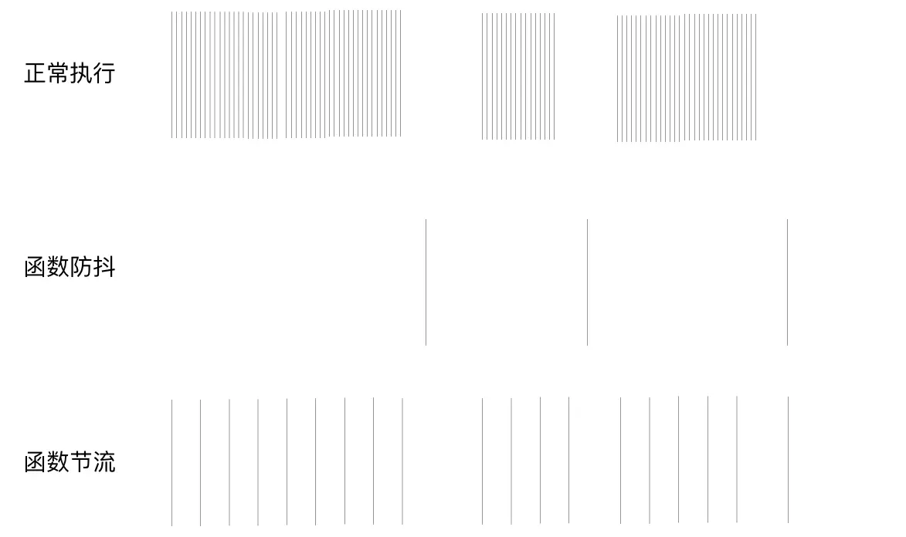

# Function debounce and throttling

> Function anti-shake and throttling are often used in our work, and often appear in interviews, so today we will talk about anti-shake and throttling

First, let's look at the following picture drawn with vertical lines:



Each of these vertical lines represents a function call (such as mousemove event, input input event, etc.) when it is executed normally, and the frequency of the call is very fast. But sometimes, we do not need such a high frequency to call this function .If this is an operation of calling the background interface, it will easily cause network congestion and greatly increase the pressure on the server. On top of that) when the function is throttling, it is triggered every certain time interval (no matter how fast your frequency is, I will keep my own rhythm) Now we roughly understand what the anti-shake and throttling of the function are all about Now, let's learn about them in detail

## Anti-shake (debounce)

### concept

In the case of frequent triggering of tasks, an event is triggered after a period of time and then executes the callback. If it is triggered again during this period, the timing will be restarted.

### Application scenarios

Anti-shake can be seen everywhere in our daily life. For example, when we usually take the elevator, we always have to wait until no one comes in for a while before the elevator door closes. In the project, the anti-shake There are quite a lot of application scenarios for shaking. When we enter content in a search box for remote search, it is often after we stop typing for a moment. The front desk initiates a request to the server to obtain matching results. We You can even think of the anti-shake process as a hero reading a skill bar. Only after the skill bar is finished, the skill can be thrown out. If someone interrupts it halfway, then you have to read the bar again next time.

### Simple version

```html
<input id="ipt1" type="text" value="" />
```

Let's first look at the effect without anti-shake:

```js
let ipt1 = document. querySelector("#ipt1");
ipt1.onkeydown = function (e) {
   console.log(e.target.value);
};
```

Let's take a look at the code with the anti-shake effect:

```js
let ipt1 = document. querySelector("#ipt1");
let timer = null;
ipt1.onkeydown = function (e) {
   clearTimeout(timer);
   timer = setTimeout(() => {
     console.log(e.target.value);
   }, 500);
};
```

You can copy the code to the editor and run it to see the effect, whether the user experience with anti-shake effect will be better.

### function version

```html
<div id="div1"></div>
```

```css
#div1 {
   height: 300px;
   background-color: orange;
   overflow: auto;
}
```

```js
let div1 = document. querySelector("#div1");
function move(e) {
   this.innerText = `${e.offsetX},${e.offsetY}`;
}
function debounce(fn, wait) {
   let timer = null;
   return function () {
     //let that = this;
     let args = arguments;
     clearTimeout(timer);
     timer = setTimeout(() => {
       fn.apply(this, args);
     }, wait);
   };
}
let debounceMove = debounce(move, 500);
div1.onmousemove = debounceMove;
```

Among them, `debounce` is our core anti-shake function

## Throttle

### concept

High-frequency event triggers, but only executes once in n seconds, which will dilute the execution frequency of the function.

### Application scenarios

An example of throttling in life, for example, when watching a movie, there are 24 frames per second. It probably means that every second of the movie actually plays 24 consecutive pictures for everyone. The higher the number of frames, the better the movie The smoother it is. But when the number of frames reaches a certain height, our naked eyes can’t see the difference. And there are many applications in the project, such as monitoring the position of the scroll bar when scrolling and loading more When the user scrolls, it is not necessary to monitor the position of the scroll bar every time, but for example, no matter how many times the scroll bar is scrolled within 1 second, the position of the scroll bar is only monitored once. If throttling is applied to the game, it is equivalent to a skill The CD, if the CD has not arrived, even if you press the keyboard, the skills will not be released.

### Simple version

```html
<div id="div1">
   <p>1</p>
   <p>1</p>
   ...
</div>
```

```css
#div1 {
   height: 200px;
   background-color: orange;
   overflow: auto;
}
```

Let's take a look at the normal effect first, and you can see that the console is outputting crazily:

```js
let div1 = document. querySelector("#div1");
div1. onscroll = function (e) {
   console.log("I'm outputting like crazy");
};
```

Let’s take a look at the throttling effect, the console will print the content every once in a while:

```js
let div1 = document. querySelector("#div1");
let flag = true;
div1. onscroll = function (e) {
   if (!flag) {
     return false;
   }
   flag = false;
   setTimeout(() => {
     console.log("I am slowly outputting");
     flag = true;
   }, 500);
};
```

### Timer version

Use timers to achieve throttling effects:

```js
let div1 = document. querySelector("#div1");
function move(e) {
   this.innerText = `(${e.offsetX}, ${e.offsetY})`;
}
function throttle(fn, delay) {
   let timer = null;
   return function (...args) {
     //let that = this;
     if (!timer) {
       timer = setTimeout(() => {
         timer = null;
         fn.apply(this, args);
       }, delay);
     }
   };
}
let throttleMove = throttle(move, 500);
div1.onmousemove = throttleMove;
```

### Timestamp version

Use timestamps to achieve throttling:

```js
function throttle(fn, delay) {
   let timer = 0;
   return function (...args) {
     let that = this;
     let now = Date.now();
     if (now - time > delay) {
       fn.apply(that, args);
       timer = now;
     }
   };
}
```

This version of the timestamp throttling stops running when our mouse moves out of the listening area

### Timer + timestamp version

Next, let's come to an enhanced version. This version combines timers and timestamps. After our mouse moves out of the monitoring area, the function will be executed again.

```js
function throttle(fn, delay) {
   let time = 0,
     timer = null;
   return function (...args) {
     //let that = this;
     let now = Date.now();
     if (now - time > delay) {
       fn.apply(this, args);
       time = now;
     } else {
       timer && clearTimeout(timer);
       timer = setTimeout(() => {
         fn.apply(this, args);
         time = now;
       }, delay);
     }
   };
}
```

## react-hook anti-shake and throttling

Anti-shake:

```jsx
function useDebounceHook(value, delay) {
  const [debounceValue, setDebounceValue] = useState(value);
  useEffect(() => {
    let timer = setTimeout(() => setDebounceValue(value), delay);
    return () => clearTimeout(timer);
  }, [value, delay]);
  return debounceValue;
}

const [value, setValue] = useState("");
const debounceText = useDebounceHook(value, 2000);
useEffect(() => {
  if (debounceText.length === 0) return;
  console.log("change", debounceText);
}, [debounceText]);
```

Throttling:

```jsx
function useThrottleValue(value, duration) {
  const [throttleValue, setThrottleValue] = useState(value);
  let Local = useRef({ flag: true }).current;
  useEffect(() => {
    let timer;
    if (Local.flag) {
      Local.flag = false;
      setThrottleValue(value);
      setTimeout(() => (Local.flag = true), duration);
    } else {
      timer = setTimeout(() => setThrottleValue(value), duration);
    }
    return () => clearTimeout(timer);
  }, [value, duration, Local]);
  return throttleValue;
}

const [value, setValue] = useState("");
const debounceText = useThrottleValue(value, 2000);
useEffect(() => {
  if (debounceText.length === 0) return;
  console.log("change", debounceText);
}, [debounceText]);
```

> Summary: Both anti-shake and throttling are used to limit the execution frequency of functions, so as to optimize the response speed caused by too high function trigger frequency, delay, suspended animation or freeze phenomenon
>
> - Function anti-shake: The principle is to maintain a timer and execute the callback after the specified time. If it is triggered again during this period, the timing will be restarted
> - Function throttling: the principle is to judge whether the specified time is reached
