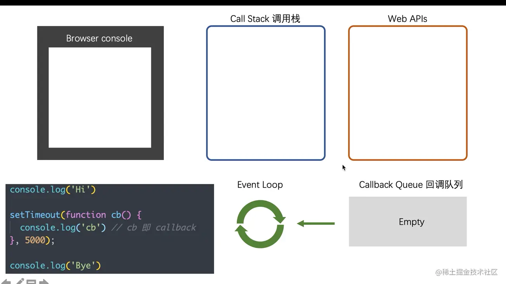

## 1. Event loop, macro task and micro task

------

First recommend a website where you can watch the code flow online: [loupe](http://latentflip.com/loupe/?code=JC5vbignYnV0dG9uJywgJ2NsaWNrJywgZnVuY3Rpb24gb25DbGljaygpIHsKICAgIHNldFRpbWVvdXQoZnVuY3Rpb24gdGltZ9XIZAg9ICAgS 5sb2coJ1lvdSBjbGlja2VkIHRoZSBidXR0b24hJyk7ICAgIAogICAgfSwgMjAwMCk7Cn0pOwoKY29uc29sZS5sb2coIkhpISIpOwoKc2V0VGltZW91dChmdW5jdGlvbiB0aW1lb3V0YNkCnucWb2ICAg NrIHRoZSBidXR0b24hIik7Cn0sIDUwMDApOwoKY29uc29sZS5sb2coIldlbGNvbWUgdG8gbG91cGUuIik7!!!PGJ1dHRvbj5DbGljayBtZSE8L2J1dHRvbj4%3D). Then watch this video to learn: [What is Event Loop? ](https://www.bilibili.com/video/BV1oV411k7XY/?spm_id_from=333.788.recommend_more_video.-1)

Simple example:

```js
console.log("Hi");

setTimeout(() => {
   console.log("cb");
}, 5000);

console.log("Bye");
```

Its execution process is as follows:



Web APIs will create corresponding threads, such as setTimeout will create timer threads, and ajax requests will create http threads. . . This is determined by the running environment of js, such as a browser.

After watching the above video, at least it is not a problem for everyone to draw the diagram of Event Loop, but when it comes to macro tasks and micro tasks, we have to read this article: [This time, thoroughly understand the JavaScript execution mechanism]( https://juejin.cn/post/6844903512845860872). If you are still not satisfied, why not read this very detailed article with a lot of animations: [Make some animations and learn about EventLoop](https://juejin.cn/post/6969028296893792286#comment). If you want to understand the relationship between event loop and page rendering, you can read this article again: [In-depth analysis of EventLoop and browser rendering, frame animation, idle callback (motion picture demonstration) you don’t know](https://juejin. cn/post/6844904165462769678).

<storge> Note: 1. Call Stack is idle -> 2. Try DOM rendering -> trigger Event loop. </storage>

- Every time the Call Stack is cleared (that is, the end of each polling), that is, the execution of the synchronization task is completed.

- Both are opportunities for DOM re-rendering, and re-rendering if the DOM structure changes.

- Then trigger the next Event loop.

Macro tasks: setTimeout, setInterval, Ajax, DOM events. Microtasks: Promise async/await.

The difference between the two:

- Macro task: triggered after DOM rendering, such as setTimeout, setInterval, DOM event, script.

- Microtask: triggered before DOM rendering, such as Promise.then, MutationObserver, process.nextTick in Node environment.

Explained from the event loop, why are microtasks executed earlier?

- Microtasks are specified by ES6 syntax (pushed into micro task queue).

- Macro tasks are specified by the browser (pushed into the Callback queue via Web APIs).

- The execution time of macro tasks is generally longer.

- Before the start of each macro task, it must be accompanied by the end of an event loop, while the micro task is executed before the end of an event loop.

## 2. Promise

------

There is nothing to say about this part. It is best to implement the Promise A+ specification once, which is somewhat impressive. Of course, the interviewer will not ask you to write a complete one silently, but you must at least know the implementation principle.

> For all the ways to use Promise, you can refer to this article: `Introduction to ECMAScript 6 - Promise Object`.
> For an analysis article of handwritten Promise source code, you can read this article: `Starting from a Promise interview question that made me insomnia, analyze the details of Promise implementation in depth`.
> For the interview questions about Promise, you can refer to this article: `If you want to come to 45 Promise interview questions once to cool to the end`.

Handwritten Promise

```js
class MyPromise {
  static pending = "pending";
  static fulfilled = "fulfilled";
  static rejected = "rejected";
  constructor(executor) {
    if (!this._isFunction(executor)) {
      throw new Error(`${executor} is not a function`);
    }
    this._status = MyPromise.pending;
    this._state = undefined;
    this._handleFulfilled = [];
    this._handleRejected = [];
    executor(this.resolve.bind(this), this.reject.bind(this));
  }
  _isFunction(val) {
    return Object.prototype.toString.call(val) === "[object Function]";
  }
  resolve(val) {
    if (this._status === MyPromise.pending) {
      this._status = MyPromise.fulfilled;
      this._state = val;
      let cb;
      // Asynchronously call in order and clear the callback
      setTimeout(() => {
        while ((cb = this._handleFulfilled.shift())) {
          cb(val);
        }
      }, 0);
    }
  }
  reject(val) {
    if (this._status === MyPromise.pending) {
      this._status = MyPromise.rejected;
      this._state = val;
      let cb;
      // Asynchronously call in order and clear the callback
      setTimeout(() => {
        while ((cb = this._handleRejected.shift())) {
          cb(val);
        }
      }, 0);
    }
  }
  then(onFulfilled, onRejected) {
    let self = this;
    const { _state, _status } = this;
    // If onFulfilled and onRejected are not functions, they are forced to be changed to functions, and the function returns the received parameters directly, and passes the subsequent then callback function
    onFulfilled = self._isFunction(onFulfilled) ? onFulfilled : (v) => v;
    onRejected = self._isFunction(onRejected) ? onRejected : (v) => v;
    return new MyPromise((resolve, reject) => {
      const fulfilled = (val) => {
        let res = onFulfilled(val);
        if (res instanceof MyPromise) {
          res.then(resolve, reject);
        } else {
          resolve(res);
        }
      };
      const rejected = (value) => {
        const res = onRejected(value);
        if (res instanceof MyPromise) {
          // here is the point
          res.then(resolve, reject);
        } else {
          // Note here is resolve(res), not reject(res)
          resolve(res);
        }
      };
      switch (_status) {
        case MyPromise.pending:
          self._handleFulfilled.push(fulfilled);
          self._handleRejected.push(rejected);
          break;
        case MyPromise.fulfilled:
          resolve(_state);
          break;
        case MyPromise.rejected:
          rejected(_value);
          break;
        default:
          throw new Error("Promise resolver Unverified status");
      }
    });
  }
}

new MyPromise((resolve) => {
  console.log(1);
  setTimeout(() => {
    resolve(2);
  }, 3000);
}).then((res) => {
  console.log(res);
});
```

Implement a Promise.all:

```js
Promise. all = function (promises) {
   return new Promise((resolve, reject) => {
     // The parameter can not be an array, but must have the Iterator interface
     if (typeof promises[Symbol. iterator] !== "function") {
       reject("Type error");
     }
     if (promises. length === 0) {
       resolve([]);
     } else {
       const res = [];
       let count = 0;
       const len = promises. length;
       for (let i = 0; i < len; i++) {
         //Consider that promises[i] may be thenable objects or ordinary values
         Promise. resolve(promises[i])
           .then((data) => {
             res[i] = data;
             if (++count === len) {
               resolve(res);
             }
           })
           .catch((err) => {
             reject(err);
           });
       }
     }
   });
};
```

## 3. The relationship between async/await and Promise

------

- async/await is the ultimate weapon to eliminate asynchronous callbacks.

- But Promise and Promise are not mutually exclusive, on the contrary, the two complement each other.

- Executing an async function must return a Promise object.

- await is equivalent to Promise's then.

- try...catch can catch exceptions instead of Promise's catch.
