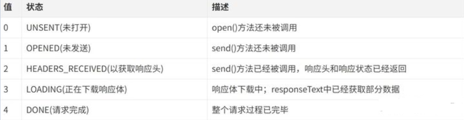

## 1. What is Ajax?

---

The full name of `AJAX` (Async Javascript and XML)

That is, asynchronous `JavaScript` and `XML`, is a web development technology for creating interactive web applications, which can exchange data with the server and update parts of the web page without reloading the entire web page

The principle of `Ajax` is simply to send an asynchronous request to the server through the `XmlHttpRequest` object, obtain data from the server, and then use JavaScript to manipulate the DOM to update the page

The flow chart is as follows:


Here is an example:

The leader wanted to report to Xiao Li, so he entrusted the secretary to call Xiao Li, and continued to do other things until the secretary told him that Xiao Li had arrived, and finally Xiao Li reported to the leader.

The browser can send the `HTTP` request, then do other things, and wait for the data returned by XHR to operate

## 2.the implementation process

---

Realizing Ajax asynchronous interaction requires the cooperation of server logic, and the following steps need to be completed:

- Create the core object of Ajax XMLHttpRequest object
- Establish a connection with the server through the open() method of the XMLHttpRequest object
- Construct the data content required by the request and send it to the server through the send() method of the XMLHttpRequest object
- Monitor your communication status on the server side through the onreadystatechange event provided by the XMLHttpRequest object
- Accept and process the data results from the server to the client
- Update processing result to HTML page

### Create XMLHttpRequest object

The `XMLHttpRequest()` constructor is used to initialize an `XMLHttpRequest` instance object

```js
const xhr = new XMLHttpRequest();
```

### Establish a connection with the server

Establish a connection with the server through the `open()` method of the `XMLHttpRequest` object

```js
xhr.open(method, url, [async][, user][, password])
```

Parameter Description:

- `method`: Indicates the current request method, common ones are `GET`, `POST`
- `url`: server address
- `async`: Boolean value, indicating whether to perform the operation asynchronously, the default is `true`
- `user`: optional username for authentication purposes; defaults to `null`
- `password`: optional password for authentication purposes, defaults to `null`

### Send data to the server

Send the data of the client page to the server through the `send()` method of the `XMLHttpRequest` object

```js
xhr. send([body]);
```

`body`: the data body to send in the XHR request, or `null` if no data is passed

If you use the `GET` request to send data, you need to pay attention to the following:

- Add the request data to the `url` address in the `open()` method
- The parameter in the `send()` method in sending request data is set to `null`

### Binding `onreadystatechange` event

The `onreadystatechange` event is used to monitor the communication status of the server. The main monitored property is `XMLHttpRequest.readyState`. There are five states for the `XMLHttpRequest.readyState` property, as shown in the following figure



Whenever the value of the `readyState` property changes, a `readystatechange` event will be fired

The `XMLHttpRequest.responseText` property is used to receive the response result from the server

for example:

```js
const request = new XMLHttpRequest();
request.onreadystatechange = function (e) {
   if (request. readyState === 4) {
     // The entire request process is completed
     if (request.status >= 200 && request.status <= 300) {
       console.log(request.responseText); // The result returned by the server
     } else if (request. status >= 400) {
       console.log("Error message: " + request.status);
     }
   }
};
request.open("POST", "http://xxxx");
request. send();
```

## 3. encapsulation

Through the above understanding of `XMLHttpRequest` object, let's encapsulate a simple `Ajax` request

```js
//Encapsulate an ajax request
function ajax(options) {
   //Create XMLHttpRequest object
   const xhr = new XMLHttpRequest();

   //Initialize the content of the parameters
   options = options || {};
   options.type = (options.type || "GET").toUpperCase();
   options.dataType = options.dataType || "json";
   const params = options. data;

   //send request
   if (options.type === "GET") {
     xhr.open("GET", options.url + "?" + params, true);
     xhr. send(null);
   } else if (options.type === "POST") {
     xhr.open("POST", options.url, true);
     xhr. send(params);
   }
   //receive request
   xhr.onreadystatechange = function () {
     if (xhr. readyState === 4) {
       let status = xhr. status;
       if (status >= 200 && status < 300) {
         options.success && options.success(xhr.responseText, xhr.responseXML);
       } else {
         options.error && options.error(status);
       }
     }
   };
}
```

Use as follows

```js
ajax({
   type: "post",
   dataType: "json",
   data: {},
   url: "https://xxxx",
   success: function (text, xml) {
     //Callback function after successful request
     console. log(text);
   },
   error: function (status) {
     ////Callback function after the request fails
     console.log(status);
   },
});
```
