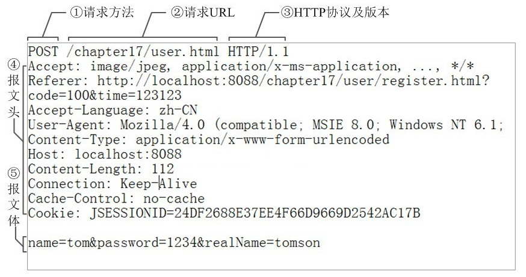

## 1. Simple analysis

---

Simple analysis, the behavior from inputting `URL` to pressing Enter is as follows:

- URL parsing
- DNS lookup
- TCP connection
- HTTP requests
- respond to requests
- Render the page

## 2.detailed analysis

---

### URL parsing

First judge whether you input a legal `URL` or a keyword to be searched, and perform corresponding operations according to the content you input

The first step in the parsing process of `URL`, the structure of a `URL` is parsed as follows:

### DNS lookup

In the previous article, I talked about DNS query, so I won’t talk about it here

The entire query process is shown in the figure below:

Finally, the target server `IP` address corresponding to the domain name is obtained

### TCP connection

In the previous article, I learned that `tcp` is a connection-oriented transport layer protocol

After determining the `IP` address of the target server, a `TCP` connection is established through three handshakes, the process is as follows:

### Send http request

When the tcp connection is established, communication can be carried out on this basis, and the browser sends an http request to the target server

The content of the request includes:

- request line
- request header
- request body

### Responding to requests

When the server receives the browser's request, it will perform logical operations, and return an `HTTP` response message after processing, including:

- status line
- response header
- response body

After the server responds, since `http` starts the long connection `keep-alive` by default, when the page is closed, the `tcp` link will be disconnected after four waves

### Page rendering

When the browser receives the resources responded by the server, it first parses the resources:

- View the information of the response header, and do corresponding processing according to different instructions, such as redirection, storing cookies, decompressing gzip, caching resources, etc.
- View the value of Content-Type in the response header, and use different parsing methods according to different resource types

The rendering process of the page is as follows:

- Parse HTML, build DOM tree
- Parse CSS and generate CSS rule tree
- Merge DOM tree and CSS rules to generate render tree
- Layout render tree ( Layout / reflow ), responsible for the calculation of the size and position of each element
- Draw render tree ( paint ), draw page pixel information
- The browser will send the information of each layer to the GPU, and the GPU will composite each layer and display it on the screen

