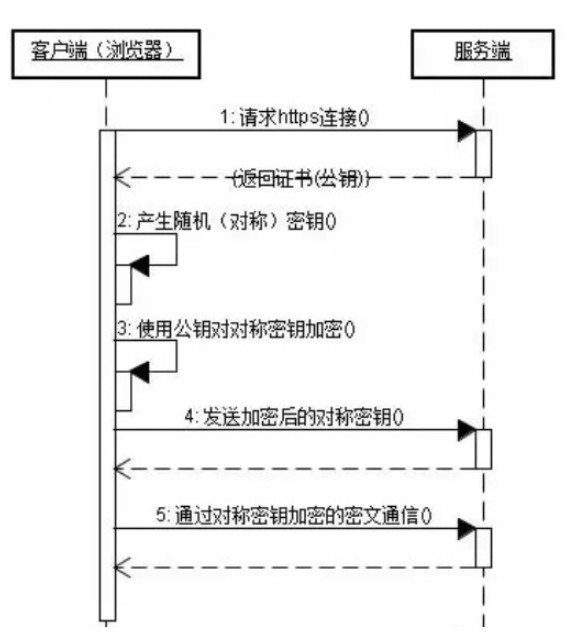

## 1.HTTP

---

`HTTP`(HyperText Transfer Protocol), that is, the Hypertext Transfer Protocol, is a specification for network communication.

In the computer and network world there are different protocols such as broadcast protocol, addressing protocol, routing protocol, etc...

And `HTTP` is a transmission protocol, that is, data is transferred from A to B or B to A, and many third parties can be stored between A and B, such as 
A<=>X<=>Y<=>Z<=>B

The transmitted data is not a binary package in the computer stratum, but complete and meaningful data, such as HTML files, image files, query results and other hypertext, can be identified by upper-level references

In practical applications, `HTTP` is often used to transfer information between `Web` browsers and web servers, sending content in plain text without providing any form of data encryption

The features are as follows:

- Support client/server mode
- Simple and fast: When a client requests a service from the server, it only needs to transmit the request method and path. Due to the simplicity of the HTTP protocol, the scale of the HTTP server is small, so the communication speed is very fast.

* Flexible: HTTP allows any type of data object to be transmitted, and the type being transmitted is marked by Content-Type
* No connection: The meaning of no connection is to limit each connection to only process one request. After the server finishes processing the client's request and receives the client's response, it disconnects. In this way, transfer time can be saved
* Stateless: The HTTP protocol cannot process this request based on the previous state

## 2. HTTPS

---

In the above introduction to `HTTP`, we learned that `HTTP` transfer information is to send content in clear text, which is not safe. And `HTTPS` appeared officially to solve the insecure features of `HTTP`

In order to ensure that these private data can be encrypted and transmitted, the `SSL/TLS` protocol that allows `HTTP` to run safely, that is, HTTPS=HTTP+SSL/TLS, uses the `SSL` certificate to verify the identity of the server, and provide the browser and server Encrypt communication between

The `SSL` protocol is located between the `TCP/IP` protocol and various application layer protocols. When using `SSL` to establish a connection between the browser and the server, it is necessary to select a set of appropriate encryption algorithms to achieve secure communication. Provide security support

The flowchart is as follows:

- First, the client establishes an SSL connection by accessing the server through the URL
- After the server receives the client request, it will send a copy of the certificate information supported by the website (the certificate contains the public key) to the client
- The client's server begins to negotiate the security level of the SSL connection, that is, the level of information encryption
- The client's browser establishes a session key based on the level agreed by both parties, and then encrypts the session key with the public key of the website, and transmits the session key to the website
- The server uses its own private key to decrypt the session key
- The server encrypts the communication with the client using the session key

## 3.the difference

---

- HTTPS is a secure version of the HTTP protocol. The data transmission of the HTTP protocol is in plain text, which is insecure. HTTPS uses the SSL/TLS protocol for encryption, which is relatively safer
- HTTP and HTTPS use different connection methods, and the default port is also different, HTTP is 80, HTTPS is 443
- HTTPS is not as good as HTTP in terms of performance due to the need to design encryption and multiple handshakes
- HTTPS requires SSL, SSL certificates cost money, more powerful certificates cost more
