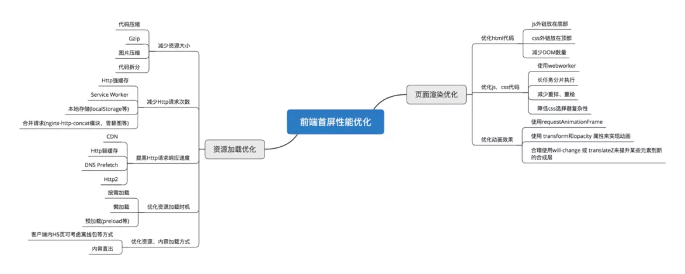

## 1. What is the first screen loading

---

First Contentful Paint (First Contentful Paint) refers to the time from when the browser responds to the URL address input by the user to when the content of the first screen is rendered. At this time, the entire webpage is not the same as it needs to be fully rendered, but it needs to display the content required by the current window.

The first screen loading can be said to be an important link in the user experience.

## 2. Reasons for slow loading

---

During the page rendering process, the factors that cause the slow loading speed may be as follows:

- Network delay problem
- Whether the resource file size is too large
- Whether the resource resends the sending request to load
- When loading scripts, the rendering content is blocked

## 3. the solution

---

Several Common SPA First Screen Optimization Methods

- Reduce the size of the entry file
- Local caching of static resources
- UI framework loaded on demand
- Image resource compression
- Enable Gzip compression
- Using SSRs

### Reduce the size of the entry file

1. The common method is lazy loading of routes. The components corresponding to different routes are divided into different code blocks. When the route is requested, the route will be packaged separately, so that the entry file becomes smaller and the loading speed is greatly increased.
2. There is also the use of CDN to accelerate and reduce the file size, but if other people’s CDN servers are unstable, you can also download the CDN and put them on your own server, but if your server does not have CDN distribution, the speed will be when downloading CDN files Affects loading speed.

### Static resource local cache

---

Resource issues returned by the backend:

- Use `HTTP` cache, set `Cache-Control`, `Last-Modified`, `Etag` and other response headers
- Use `Service Worker` offline cache
   Reasonable use of LocalStorage on the front end

### UI framework loaded on demand

### Image resource compression

Although the image resource is not in the encoding process, it is the factor that has the greatest impact on page performance
For all image resources, we can perform appropriate compression
For the icons used on the page, you can use online font icons or sprite images to combine many small icons into one image to reduce the number of `HTTP` requests

### Enable Gzip compression

After unpacking, we are using `Gzip` to do some compression and install `compression-webpack-plugin`

```shell
yarn add compression-webpack-plugin -D
```

Introduce and modify `webpack` configuration in `vue.config.js`

```js
const CompressionWebpackPlugin = require("compression-webpack-plugin");
module.exports={
   ..., //omitted
   configureWebpack:{
     plugins:[
       new CompressionWebpackPlugin({
         test:/\.(js|css)$/,//Match file name
         threshold: 10240, // Compress data over 10k
         minRatio: 0.8, // compression ratio
         deleteOriginalAssets: false //Whether to delete the original file
          exclude: "/node_modules/",
       })
     ]
   },
   ...
}
```

We also need to do corresponding configuration on the server, such as `Nginx`

```Nginx
gzip on;
gzip_disable "msie6";
gzip_vary on;
gzip_proxied any;
gzip_comp_level 6;
gzip_buffers 16 8k;
gzip_http_version 1.1;
gzip_min_length 256;
gzip_types application/atom+xml application/geo+json application/javascript application/x-javascript application/json application/ld+json application/manifest+json application/rdf+xml application/rss+xml application/xhtml+xml application/xml font/eot font/otf font/ttf image/svg+xml text/css text/javascript text/plain text/xml;
```

### Using SSR

SSR (Server side), that is, server rendering, components or pages generate html strings through the server, and then send them to the browser
Building a server rendering from scratch is very complicated, `Vue` applications recommend using `Nuxt.js` for server rendering

### Summary

There are many ways to reduce the rendering time of the first screen. Generally speaking, it can be divided into two parts, resource loading optimization and page rendering optimization.

The figure below is a more comprehensive first-screen optimization solution



You can choose various methods to optimize the first screen rendering according to your own project situation
