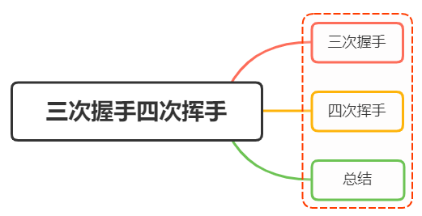
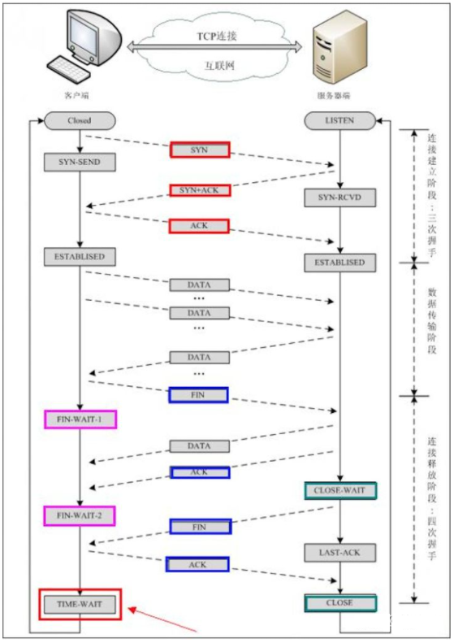

## One or three handshakes

---

Three-way handshake (Three-way Handshake) actually means that when establishing a TCP connection, the client and server need to send a total of 3 packets

The main function is to confirm whether the receiving and sending capabilities of both parties are normal, and specify your own initialization sequence number to prepare for the subsequent reliable transmission

The process is as follows:

- The first handshake: the client sends a SYN message to the server and specifies the client's initialization serial number ISN(c), and the client is in the SYN_SENT state
- The second handshake: After receiving the SYN message from the client, the server will respond with its own SYN message. In order to confirm the SYN of the client, the client’s ISN+1 is used as the value of ACK. At this time, the server is in the state of SYN_RCVD
- The third handshake: After receiving the SYN message, the client will send an ACK message with the value of the server's ISN+1. At this point the client is in the ESTABLISHED state. After the server receives the ACK message, it is also in the ESTABLISHED state. At this time, the two parties have established a connection

The role of each of the above handshakes is as follows:

- The first handshake: the client sends a network packet, and the server receives it 
   In this way, the server can conclude that the sending capability of the client and the receiving capability of the server are normal.

- The second handshake: the server sends a packet, and the client receives it 
   In this way, the client can conclude that the receiving and sending capabilities of the server and the receiving and sending capabilities of the client are normal. However, at this time, the server cannot confirm whether the receiving ability of the client is normal.

- The third handshake: the client sends a packet, and the server receives it.  
   In this way, the server can draw a conclusion: the client’s receiving and sending capabilities are normal, and the server’s own sending and receiving capabilities are also normal.

Through the three-way handshake, it can be determined that the receiving and sending capabilities of both parties are normal. Then you can communicate normally

### Why not two handshakes?

If it is a two-way handshake, the sending end can be sure that the information sent by itself can be received by the other party, and can also be sure that the packet sent by the other party can be received by itself, but the receiving end can only be sure that the packet sent by the other party can be received by itself, but not by itself. The package can be received by the other party

And if there are two handshakes, the client may send multiple request messages due to network congestion and other reasons, and the delayed arrival request will establish a connection with the server, wasting many server resources

## Two or four waves

---

`tcp` terminates a connection and needs to wave four times

The process is as follows:

- First wave: The client sends a FIN message, which specifies a sequence number. At this point, the client is in the FIN_WAIT1 state, stops sending data, and waits for the confirmation from the server
- The second wave: After receiving the FIN, the server will send an ACK message, and use the serial number value of the client + 1 as the serial number value of the ACK message, indicating that the message from the client has been received. At this time, the service terminal is in CLOSE_WAIT state
- The third wave: If the server also wants to disconnect, it will send a FIN message and specify a sequence number just like the first wave of the client. At this time, the server is in the state of LAST_ACK
- The fourth wave: After receiving the FIN, the client also sends an ACK message as a response, and uses the serial number value of the server + 1 as the serial number value of its own ACK message. At this time, the client is in the TIME_WAIT state. It takes a while to ensure that the server will enter the CLOSED state after receiving its own ACK message. After the server receives the ACK message, it will close the connection and be in the CLOSED state

reason for four waves

After the server receives the client disconnection Fin message, it will not close the connection immediately, but first sends an ACK packet to tell the client that it has received the request to close the connection, and only after all the messages from the server have been sent , only to send a FIN message to disconnect, so four waved hands are required

## Summarize

---

A complete three-way handshake and four waved hands are shown in the following figure:

