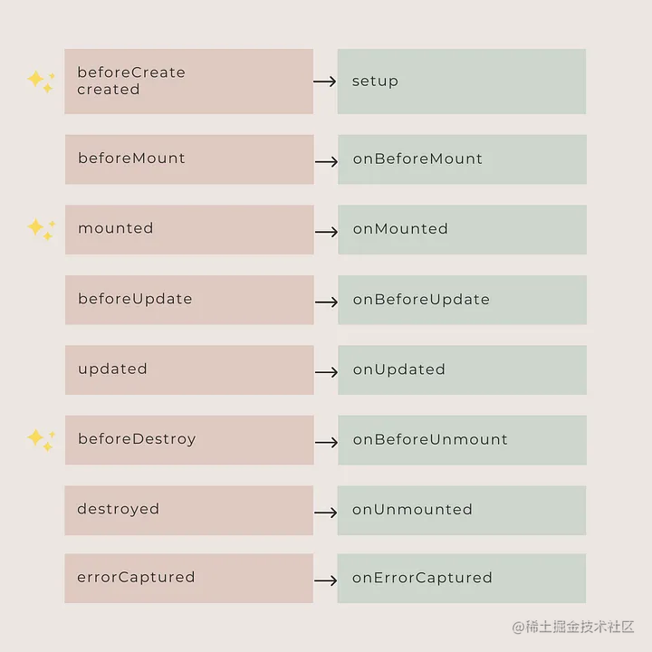

Vue 3 has been stable for quite some time now. Many codebases use it in production, and everyone else will eventually have to migrate to Vue 3. I've now had a chance to use it and documented my mistakes, which you might want to avoid.

## Declare primitive values using Reactive

---

Data declarations used to be pretty straightforward, but now there are a lot of helper functions at our disposal. The current rules are:

- Declare `Object, Array, Map, Set` using `reactive`
- Use `ref` to declare `String, Number, Boolean`

Using `reactive` for a primitive value will return a warning, and the value will not be made reactive.

```vue
/* DOES NOT WORK AS EXPECTED */
<script setup>
import { reactive } from "vue";

const count = reactive(0);
</script>
```

> [Vue warn]: value cannot be made reactive

Paradoxically, another way is possible. For example, using `ref` to declare an `Array` will internally call `reactive`.

## Deconstruct responsive data

---

Suppose you have a reactive object with a `count` property, and a button to increment the `count`.

```vue
<template>
  Counter: {{ state.count }}
  <button @click="add">Increase</button>
</template>

<script>
import { reactive } from "vue";
export default {
  setup() {
    const state = reactive({ count: 0 });

    function add() {
      state.count++;
    }

    return {
      state,
      add,
    };
  },
};
</script>
```

The above logic is fairly straight forward and works as expected, but you might take advantage of javascript's destructuring to do the following:

```vue
/* DOES NOT WORK AS EXPECTED */
<template>
  <div>Counter: {{ count }}</div>
  <button @click="add">Increase</button>
</template>

<script>
import { reactive } from "vue";
export default {
  setup() {
    const state = reactive({ count: 0 });

    function add() {
      state.count++;
    }

    return {
      ...state,
      add,
    };
  },
};
</script>
```

The code looks the same, and based on our previous experience it should work, but in fact, Vue's reactive tracking works through property access. This means that we cannot assign or destructure a reactive object because the reactive connection to the first reference is broken. This is one of the limitations of using reactive helper functions.

## Confused about .value

---

Also, a weird pattern of using ref can be hard to get used to.

`Ref` takes a value and returns a reactive object. The value is available inside the object under the `.value` property.

```vue
const count = ref(0) console.log(count) // { value: 0 } console.log(count.value)
// 0 count. value++ console.log(count.value) // 1
```

But `ref` is unwrapped when used in a template file, and `.value` is not needed.

```vue
<script setup>
import { ref } from "vue";

const count = ref(0);

function increment() {
  count.value++;
}
</script>

<template>
  <button @click="increment">{{ count }} // no .value needed</button>
</template>
```

But be careful! Unwrapping only works on top-level properties. The code snippet below generates `[object Object]`.

```vue
// DON'T DO THIS
<script setup>
import { ref } from "vue";

const object = { foo: ref(1) };
</script>

<template>{{ object.foo + 1 }} // [object Object]</template>
```

Getting `.value` right takes time. I use it more and more often, although I sometimes forget how to use it.

## trigger event

---

Since the initial release of Vue, child components have been able to communicate with parent components using `emit`. You just need to add a custom event listener to listen for an event.

```vue
// Subassembly this. $emit('my-event') // parent component
<my-component @my-event="doSomething" />
```

Now, `emit` needs to be declared using `defineEmits`.

```vue
<script setup>
const emit = defineEmits(["my-event"]);
emit("my-event");
</script>
```

Another thing to keep in mind is that neither `defineEmits` nor `defineProps` need to be imported. They are automatically available when using `script setup`.

```vue
<script setup>
const props = defineProps({
  foo: String,
});

const emit = defineEmits(["change", "delete"]);
// setup code
</script>
```

Finally, since events must now be declared, there is no need to use the `.native` modifier, in fact it has been removed.

## Declare additional options

---

The Options API method has several attributes that are not supported in `script setup`.

- `name`
- `inheritAttrs`
- Custom options required by the plugin or library

The solution is to set up two different scripts in the same component according to the **definition**[1] of the `script setup` RFC.

```vue
<script>
export default {
  name: "CustomName",
  inheritAttrs: false,
  customOptions: {},
};
</script>

<script setup>
// script setup logic
</script>
```

## Use reactive transformations

---

Reactivity Transform is an **experimental but controversial feature**[2] of Vue 3, which aims to simplify the way components are declared. The idea is to use compile-time transformations to automatically unwrap a `ref` and make `.value` obsolete. But now it is deprecated and will be removed in Vue 3.3. It's still available as a package, but since it's not part of Vue core, it's best not to invest time in it.

## Define asynchronous components

---

Previously an asynchronous component was declared by enclosing it in a function.

```vue
const asyncModal = () => import('./Modal.vue')
```

Starting with Vue 3, async components need to be explicitly defined using the `defineAsyncComponent` helper function.

```vue
import { defineAsyncComponent } from 'vue' const asyncModal =
defineAsyncComponent(() => import('./Modal.vue'))
```

## Use redundant wrapping elements in templates

---

In Vue 2, component templates required a single root element, which sometimes introduced unnecessary wrapper elements.

```vue
<!-- Layout.vue -->
<template>
  <div>
    <header>...</header>
    <main>...</main>
    <footer>...</footer>
  </div>
</template>
```

This is no longer necessary as multiple root elements are now supported. 🥳

```vue
<!-- Layout.vue -->
<template>
  <header>...</header>
  <main v-bind="$attrs">...</main>
  <footer>...</footer>
</template>
```

## Using the wrong lifecycle

---

All component lifecycle events have been renamed, either adding an `on` prefix, or changing the name entirely. You can check out all the changes in the chart below.



## Do not read the documentation

---

Finally, the official documentation has been revamped to reflect the new API and includes many valuable notes, guides, and best practices. Even if you are an experienced Vue 2 engineer, you will definitely learn something new by reading the documentation.

## Summarize

---

Every framework has a learning curve, and Vue 3's learning curve is undoubtedly steeper than Vue 2's. I still don't believe the migration effort between the two versions is justified, but the composition API is much neater and feels natural once you get the hang of it.

Finally, remember:

> It is much better to be wrong than to do nothing.
>
> Making mistakes is a lot better than not doing anything.

- Original link: **https://fadamakis.com/10-mistakes-to-avoid-when-starting-with-vue-3-1d1ced8552ae**[3]
- By Fotis Adamakis

That's all for this article. If it is helpful to you, welcome to collect and forward~
