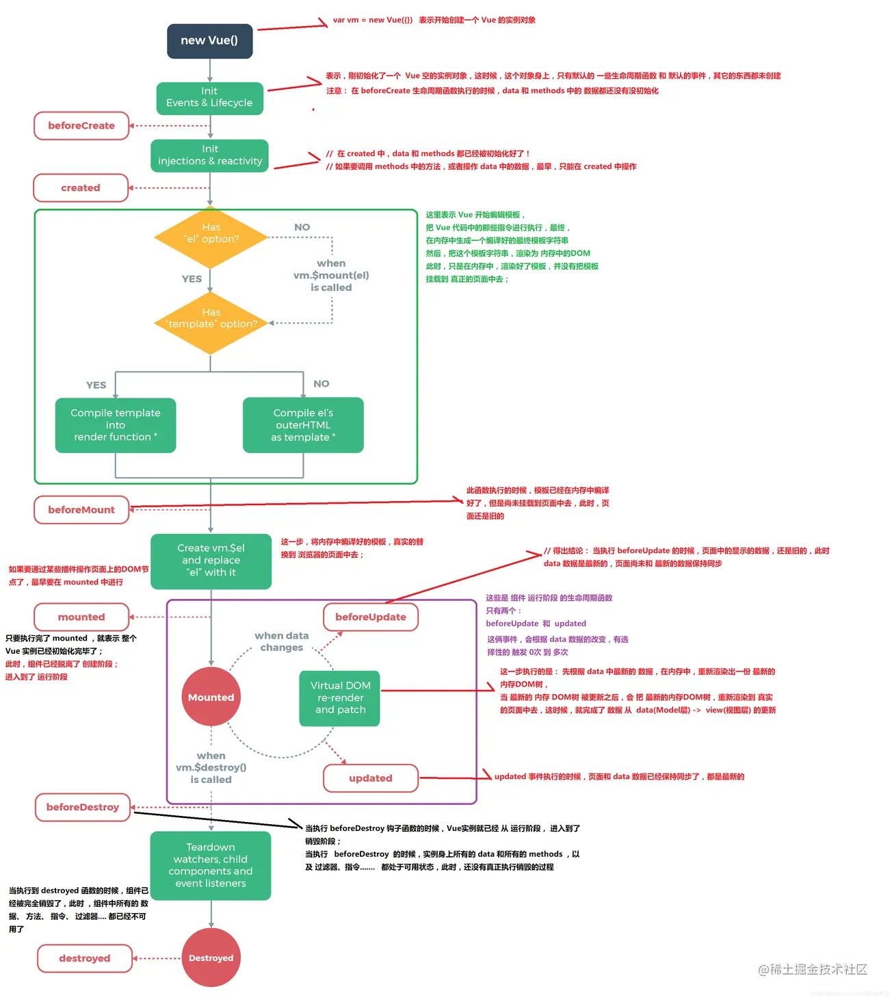
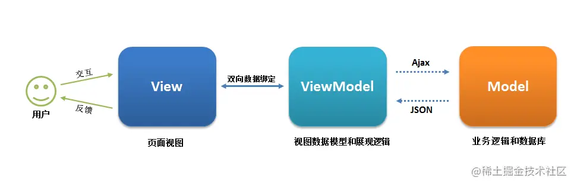
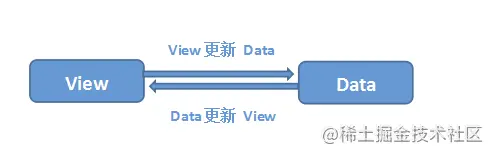
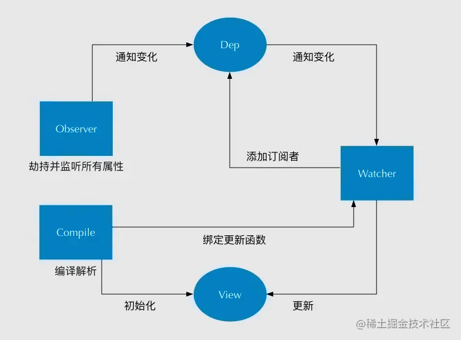

## 1.Tell me about your understanding of SPA single page, what are its advantages and disadvantages?

---

SPA (single-page application) only loads the corresponding HTML, CSS, and JavaScript when the Web page is initialized. Once the page is loaded, SPA will not reload or jump the page due to the user's operation; instead, it uses the routing mechanism to realize the transformation of HTML content, and the UI interacts with the user to avoid page reloading.

advantage:

- The user experience is good and fast, and the content change does not need to reload the entire page, avoiding unnecessary jumps and repeated rendering.
- Based on the above point, SPA is equivalent to less pressure on the server.
- Separation of front-end and back-end responsibilities, clear structure, front-end interaction logic, and back-end responsible for data processing.

shortcoming:

- Time-consuming initial loading: In order to load the functions and display effects of a single-page web application, JavaScript and CSS need to be loaded together when the page is loaded, and some pages are loaded on demand.
- Forward and backward routing management: Since the single-page application displays all the content in one page, the forward and backward function of the browser cannot be used, and all page switching needs to establish a stack management by itself.
- Difficulty in SEO: Since all page content is dynamically replaced and displayed on one page, it has a natural weakness in SEO.

## 2. What is the difference between v-show and v-if?

---

`v-if` is true conditional rendering, because it will ensure that event listeners and child components inside the conditional block are destroyed and rebuilt appropriately during the switch; also lazy: if the condition is false on the initial render, then what Neither - the conditional block won't start rendering until the first time the condition becomes true.

`v-show` is much simpler - the element is rendered regardless of the initial condition, and is simply toggled based on the CSS "display:none" property.

Therefore, `v-if` is suitable for scenarios that rarely change conditions at runtime and does not require frequent switching conditions; `v-show` is suitable for scenarios that require very frequent switching conditions.

## 3. How to dynamically bind Class and Style?

---

Class can be dynamically bound through object syntax and array syntax:

- Object syntax:

```html
<div v-bind:class="{ active: isActive, 'text-danger': hasError }"></div>

data: { isActive: true, hasError: false }
```

- Array syntax:

```html
<div v-bind:class="[isActive? activeClass : '', errorClass]"></div>

data: { activeClass: 'active', errorClass: 'text-danger' }
```

Style can also be dynamically bound through object syntax and array syntax:

- Object syntax:

```html
<div v-bind:style="{ color: activeColor, fontSize: fontSize + 'px' }"></div>

data: { activeColor: 'red', fontSize: 30 }
```

- Array syntax:

```html
<div v-bind:style="[styleColor, styleSize]"></div>

data: { styleColor: { color: 'red' }, styleSize:{ fontSize:'23px' } }
```

## 4. How to understand the one-way data flow of Vue?

---

All props form a single downward binding between their parent and child props: updates to the parent prop flow down to the child component, but not the other way around. This prevents child components from accidentally changing the state of the parent and child components, making your application's data flow difficult to understand.

In addition, every time the parent component is updated, all props in the child component will be refreshed with the latest values. This means you should not change props inside a child component. If you do this, Vue will issue a warning in the browser's console. When the child component wants to modify, it can only send a custom event through \$emit, and the parent component will modify it after receiving it.

There are two common situations when trying to mutate a prop:

- This prop is used to pass an initial value; the child component then expects to use it as a local prop data. In this case it is better to define a local data property and use this prop as its initial value:

```
props: ['initialCounter'],
data: function () {
   return {
     counter: this.initialCounter
   }
}
```

- The prop is passed in as a raw value and needs to be converted. In this case it is better to use the value of this prop to define a computed property

```
props: ['size'],
computed: {
   normalizedSize: function () {
     return this.size.trim().toLowerCase()
   }
}
```

## 5. What is the difference between computed and watch and the application scenarios?

---

<b>computed:</b> is a computed attribute, which depends on other attribute values, and the value of computed is cached. Only when the value of the computed attribute changes, the value of computed will be recalculated the next time the value of computed is obtained;

<b>watch:</b> is more of an "observation" function, similar to the monitoring callback of some data, whenever the monitored data changes, the callback will be executed for subsequent operations;

<b>Usage scenario:</b>

- When we need to perform numerical calculations and depend on other data, computed should be used, because the cache feature of computed can be used to avoid recalculation every time a value is obtained;
- When we need to perform asynchronous or expensive operations when data changes, we should use watch, using the watch option allows us to perform asynchronous operations (access an API), limit how often we perform the operation, and when we get the final result Before, set the intermediate state. These are things that computed properties cannot do.

## 6. Can Vue detect the change by directly assigning a value to an array?

---

Due to JavaScript limitations, Vue cannot detect changes to the following arrays:

- When you directly set an array item by index, eg: `vm.items[indexOfItem]=newValue`
- When you modify the array length, eg: `vm.items.length = newLength`

To solve the first problem, Vue provides the following operation methods:

```js
//Vue.set
Vue.set(vm.items, indexOfItem, newValue);
//vm. $set
vm.$set(vm.items, indexOfItem, newValue);
//Array.prototype.splice
vm.items.splice(indexOfItem, 1, newValue);
```

To solve the second problem, Vue provides the following operation methods:

```js
//Array.prototype.splice
vm.items.splice(newLength);
```

## 7. Tell me about your understanding of the Vue life cycle?

---

### (1) What is the life cycle?

A Vue instance has a complete life cycle, that is, a series of processes from the beginning of creation, initialization of data, compilation of templates, mounting of DOM->rendering, update->rendering, unloading, etc. We call this the life cycle of Vue.

### (2) The role of each life cycle?

|   Lifecycle   | Description                                                  |
| :-----------: | ------------------------------------------------------------ |
| beforeCreate  | When the component instance is created, before the properties of the component take effect |
|    created    | The component instance has been fully created and properties are bound, but the real DOM has not been generated yet, \$el is not yet available |
|  beforeMount  | Called before the mount starts: the associated render function is called for the first time |
|    mounted    | el is replaced by the newly created vm.\$el and this hook is called after it is mounted on the instance |
| beforeUpdate  | Called before the component data is updated, before the virtual DOM is patched |
|    update     | After component data is updated                              |
|   activated   | dedicated to keep-alive, called when the component is activated |
|  deactivated  | Exclusive to keep-alive, called when the component is destroyed |
| beforeDestory | Called before the component is destroyed                     |
|   destroyed   | Called after the component is destroyed                      |

### (3) Schematic diagram of life cycle



## 8. What is the execution order of Vue's parent component and child component lifecycle hook functions?

---

The execution sequence of Vue's parent component and child component lifecycle hook functions can be classified into the following four parts:

- Load the rendering process

parent beforeCreate -> parent created -> parent beforeMount -> child beforeCreate -> child created -> child beforeMount -> child mounted -> parent mounted

- Subcomponent update process

parent beforeUpdate -> child beforeUpdate -> child updated -> parent updated

- Parent component update process

parent beforeUpdate -> parent updated

- Destruction process

parent beforeDestroy -> child beforeDestroy -> child destroyed -> parent destroyed

## 9. In which life cycle is the asynchronous request called?

---

It can be called in the hook functions created, beforeMount, and mounted, because in these three hook functions, data has already been created, and the data returned by the server can be assigned. But I recommend calling asynchronous requests in the created hook function, because calling asynchronous requests in the created hook function has the following advantages:

- Can get server data faster and reduce page loading time;
- SSR does not support beforeMount and mounted hook functions, so placing them in created is helpful for consistency;

## 10. At what stage can the DOM be accessed and manipulated?

---

Before the hook function mounted is called, Vue has already mounted the compiled template to the page, so the DOM can be accessed and manipulated in mounted.

## 11. Can the parent component monitor the life cycle of the child component?

---

For example, if there is a parent component Parent and a child component Child, if the parent component monitors that the child component is mounted, it will do some logic processing, which can be achieved by the following writing method:

```js
// Parent.vue
<Child @mounted="doSomething"/>

// Child. vue
mounted() {
   this. $emit("mounted");
}
```

The above needs to manually trigger the event of the parent component through \$emit. The simpler way is to listen to it through @hook when the parent component references the child component, as shown below:

```js
// Parent.vue
<Child @hook:mounted="doSomething"></Child>

doSomething() {
    console.log('The parent component listens to the mounted hook function ...');
},

// Child. vue
mounted(){
    console.log('The subcomponent triggers the mounted hook function ...');
},

// The above output sequence is:
// child component triggers mounted hook function ...
// The parent component listens to the mounted hook function ...
```

Of course, the @hook method can not only monitor mounted, but also other life cycle events, such as created, updated, etc.

## 12. Tell me about your understanding of keep-alive?

---

keep-alive is a built-in component of Vue, which can preserve the state of the contained components and avoid re-rendering. It has the following characteristics:

- Generally used in conjunction with routing and dynamic components for caching components;
- Provide include and exclude attributes, both of which support strings or regular expressions, include means that only components with matching names will be cached, and exclude means that any components with matching names will not be cached, and exclude has a higher priority than include ;
- Corresponding to two hook functions activated and deactivated, when the component is activated, the hook function activated is triggered, and when the component is removed, the hook function deactivated is triggered.

## 13. Why is data in the component a function?

---

> Why must the data in the component be a function and return an object, but in the new Vue instance, data can be an object directly?

```js
// data
data() {
   return {
message: "Subcomponent",
childName: this.name
   }
}

// new Vue
new Vue({
   el: '#app',
   router,
   template: '<App/>',
   components: {App}
})
```

Because the component is used for reuse, and the object in JS is a reference relationship, if the data in the component is an object, then the scope is not isolated, and the data attribute values in the subcomponents will affect each other. If the data option in the component is a function, each instance can maintain an independent copy of the returned object, and the data attribute values between component instances will not affect each other; and the instance of new Vue will not be reused, so there is no reference object The problem.

## 14. The principle of v-model?

---

In the vue project, we mainly use the v-model instruction to create two-way data binding on form input, textarea, select and other elements. We know that v-model is essentially just syntactic sugar, and v-model is used internally for different input elements different properties and throw different events:

- text and textarea elements use value attribute and input event;
- checkbox and radio use checked property and change event;
- The select field has value as prop and change as event.

Take the input form element as an example:

```js
<input v-model='something'>

equivalent to

<input v-bind:value="something" v-on:input="something = $event.target.value">
```

If in a custom component, v-model will by default utilize a prop named value and an event named input, like so:

```js
parent component:
<ModelChild v-model="message"></ModelChild>

Subassembly:
<div>{{value}}</div>

props: {
     value: String
},
methods: {
   test1(){
      this.$emit('input', 'Xiaohong')
   },
},
```

## 15. What are the ways of communication between Vue components?

---

Communication between Vue components only refers to the following three types of communication: parent-child component communication, intergenerational component communication, and sibling component communication. Below we will introduce each communication method and explain which type of component communication this method is applicable to.

### (1) `props` / `$emit` applies to parent-child component communication

### (2) `ref` and `$parent` / `$children` apply to parent-child component communication

- `ref`: If used on a normal DOM element, the reference points to the DOM element; if used on a child component, the reference points to the component instance
- `$parent` / `$children`: access parent/child instances

### (3) `EventBus` (`$emit` / `$on`) is suitable for parent-child, intergenerational, sibling component communication

This method uses an empty Vue instance as the central event bus (event center), which is used to trigger events and listen to events, so as to realize communication between any components, including parent-child, intergenerational, and sibling components.

### (4) `$attrs`/`$listeners` are suitable for intergenerational component communication

- `$attrs`: Contains attribute bindings (except class and style ) that are not recognized (and acquired) by props in the parent scope. When a component does not declare any props, all parent scope bindings (except class and style ) will be included here, and internal components can be passed through v-bind="\$attrs". Usually used in conjunction with the inheritAttrs option.
- `$listeners`: Contains the v-on event listeners in the parent scope (without the .native decorator). It can be passed to internal components via v-on="\$listeners"

### (5) `provide` / `inject` are suitable for intergenerational component communication

Provide variables through provider in the ancestor component, and then inject the variable through inject in the descendant component. The provide / inject API mainly solves the communication problem between cross-level components, but its usage scenario is mainly that sub-components obtain the state of the upper-level components, and a relationship between active provision and dependency injection is established between cross-level components.

### (6) `Vuex` is suitable for parent-child, intergenerational, sibling component communication

Vuex is a state management pattern developed specifically for Vue.js applications. At the heart of every Vuex application is the store. A "store" is basically a container that holds most of your application's state ( state ).

- Vuex's state store is reactive. When the Vue component reads the state from the store, if the state in the store changes, the corresponding component will be efficiently updated accordingly.
- The only way to change the state in the store is to explicitly commit the mutation. This allows us to easily track every state change.

## 16. Have you ever used Vuex?

---

Vuex is a state management pattern developed specifically for Vue.js applications. At the heart of every Vuex application is the store. A "store" is basically a container that holds most of your application's state ( state ).

(1) Vuex's state storage is responsive. When the Vue component reads the state from the store, if the state in the store changes, the corresponding component will be efficiently updated accordingly.

(2) The only way to change the state in the store is to explicitly submit (commit) the mutation. This allows us to easily track every state change.

- State: defines the data structure of the application state, where the default initial state can be set.
- Getter: Allows components to get data from the Store, the mapGetters helper function just maps the getters in the store to local computed properties.
- Mutation: is the only way to change the state in the store, and must be a synchronous function.
- Action: used to submit mutations instead of directly changing the state, and can contain any asynchronous operations.
- Module: Allows a single Store to be split into multiple stores and stored in a single state tree at the same time.

## 17. Have you ever used Vue SSR? Talk about SSRs?

---

> Vue.js is a framework for building client-side applications. By default, Vue components can be output in the browser to generate DOM and manipulate DOM. However, it is also possible to render the same component as HTML strings on the server side, send them directly to the browser, and finally "activate" these static markup as a fully interactive application on the client side. <br/>That is: SSR roughly means that the work of vue rendering the entire html fragment of the tag on the client is completed on the server, and the html fragment formed by the server is directly returned to the client. This process is called server rendering.

The advantages and disadvantages of server-side rendering SSR are as follows:

(1) Advantages of server-side rendering:

- Better SEO: Because the content of the SPA page is obtained through Ajax, and the search engine crawler does not wait for the asynchronous completion of Ajax before crawling the content of the page, so the page cannot be crawled through Ajax in the SPA content; while SSR returns the rendered page directly from the server (the data is already included in the page), so search engine crawling tools can crawl the rendered page;
- Faster content arrival time (first screen loads faster): SPA will wait for all Vue-compiled js files to be downloaded before starting to render the page. File downloads take a certain amount of time, so the first screen rendering It takes a certain amount of time; SSR directly renders the page directly from the server and returns it for display, without waiting to download the js file and then render it, so SSR has a faster content arrival time;

(2) Disadvantages of server-side rendering:

- More restrictions on development conditions: For example, server-side rendering only supports two hook functions, beforCreate and created, which will cause some external extension libraries to require special handling to run in server-side rendering applications; and can be deployed in any static Unlike the fully static single-page application SPA on the file server, the server-side rendering application needs to be in the Node.js server operating environment;
- More server load: Rendering a full application in Node.js is obviously more CPU-intensive than a server that just serves static files (CPU-intensive - CPU-intensive), so if you expect to be in a high-traffic environment ( high traffic ), prepare for appropriate server load, and use caching strategies wisely.

## 18. How many routing modes does vue-router have?

---

Vue-router has 3 routing modes: hash, history, abstract, and the corresponding source code is as follows:

```js
switch (mode) {
   case "history":
     this.history = new HTML5History(this, options.base);
     break;
   case "hash":
     this.history = new HashHistory(this, options.base, this.fallback);
     break;
   case "abstract":
     this.history = new AbstractHistory(this, options.base);
     break;
   default:
     if (process.env.NODE_ENV !== "production") {
       assert(false, `invalid mode: ${mode}`);
     }
}
```

Among them, the descriptions of the three routing modes are as follows:

- hash: Use the URL hash value for routing. Support all browsers, including browsers that do not support HTML5 History Api;
- history : Rely on HTML5 History API and server configuration. For details, you can view the HTML5 History mode;
- abstract : Support all JavaScript runtime environments, such as Node.js server-side. Routers are automatically forced into this mode if no browser API is found.

## 19. Can you talk about the implementation principles of the commonly used hash and history routing modes in vue-router?

---

### (1) Implementation principle of hash mode

The early implementation of front-end routing was based on location.hash. The implementation principle is very simple, the value of location.hash is the content after # in the URL. For example, the following website has a location.hash value of '#search':

```
https://www.word.com#search
```

The implementation of hash routing mode is mainly based on the following characteristics:

- The hash value in the URL is only a state of the client, that is to say, when a request is made to the server, the hash part will not be sent;
- A change in the hash value will add a record to the browser's access history. Therefore, we can control hash switching through the back and forward buttons of the browser;
- You can pass the a tag and set the href attribute. When the user clicks on this tag, the hash value of the URL will change; or use JavaScript to assign a value to loaction.hash to change the hash value of the URL;
- We can use the hashchange event to monitor the change of the hash value, so as to jump (render) the page.

### (2) The realization principle of history mode

HTML5 provides History API to implement URL changes. Among them, there are two main APIs: history.pushState() and history.repalceState(). These two APIs can manipulate the browser's history without refreshing. The only difference is that the former is to add a new history record, and the latter is to directly replace the current history record, as shown below:

```
window.history.pushState(null, null, path);
window.history.replaceState(null, null, path);
```

The implementation of the history routing mode is mainly based on the following characteristics:

- two APIs, pushState and repalceState, are used to implement URL changes;
- We can use popstate event to monitor the change of url, so as to jump (render) the page;
- history.pushState() or history.replaceState() will not trigger the popstate event, then we need to manually trigger the page jump (render).

## 20. What is MVVM?

---

Model–View–ViewModel (MVVM) is a software architectural design pattern developed by Ken Cooper and Ted Peters, architects of Microsoft WPF and Silverlight, and is an event-driven programming method that simplifies user interfaces. Posted by John Gossman (also architect of WPF and Silverlight) on his blog in 2005

MVVM is derived from the classic Model-View-Controller (MVC) pattern. The emergence of MVVM promotes the separation of front-end development and back-end business logic, greatly improving the efficiency of front-end development. The core of MVVM is the ViewModel layer, which is like It is a transfer station (value converter), which is responsible for converting the data objects in the Model to make the data easier to manage and use. This layer performs two-way binding with the View layer upwards, and interacts with the Model layer through interface requests for data interaction downwards. Qi presents the role of up and down, as follows:



### (1) View layer

View is the view layer, which is the user interface. The front end is mostly built with HTML and CSS.

### (2) Model layer

Model refers to the data model, which generally refers to various business logic processing and data manipulation performed by the backend. For the frontend, it is the api interface provided by the backend.

### (3) ViewModel layer

ViewModel is a view data layer generated and maintained by an organization of front-end developers. At this layer, front-end developers convert and process the Model data obtained from the back-end, and do secondary packaging to generate a view data model that meets the expectations of the View layer. It should be noted that the data model encapsulated by ViewModel includes the state and behavior of the view, while the data model of the Model layer only includes state, such as what is displayed on this part of the page, and what happens when the page is loaded, click here What happens in one piece, what happens when this piece is scrolled, these all belong to the view behavior (interaction), and the view state and behavior are encapsulated in the ViewModel. Such encapsulation allows ViewModel to completely describe the View layer.

The MVVM framework implements two-way binding, so that the content of the ViewModel will be displayed in the View layer in real time. Front-end developers no longer need to update the view by manipulating the DOM inefficiently and troublesomely. The MVVM framework has already done the dirtiest and most tiring part. , our developers only need to process and maintain the ViewModel, and updating the data view will automatically update accordingly. In this way, the View layer does not display the data of the Model layer, but the data of the ViewModel. The ViewModel is responsible for interacting with the Model layer, which completely decouples the View layer and the Model layer. This decoupling is crucial. It is the front-end and back-end An important part of the implementation of the separation scheme.

Let's use a Vue example to illustrate the specific implementation of MVVM, which should be clear to students with Vue development experience:

(1) View layer

```html
<div id="app">
   <p>{{message}}</p>
   <button v-on:click="showMessage()">Click me</button>
</div>
```

(2) ViewModel layer

```js
var app = new Vue({
   el: "#app",
   data: {
     // used to describe the view state
     message: "Hello Vue!",
   },
   methods: {
     // Used to describe view behavior
     showMessage() {
       let vm = this;
       alert(vm. message);
     },
   },
   created() {
     let vm = this;
     // Ajax gets the data of the Model layer
     ajax({
       url: "/your/server/data/api",
       success(res) {
         vm.message = res;
       },
     });
   },
});
```

(3) Model layer

```json
{
   "url": "/your/server/data/api",
   "res": {
     "success": true,
     "name": "IoveC",
     "domain": "www.cnblogs.com"
   }
}
```

## 21. How does Vue implement two-way data binding?

---

Vue data two-way binding mainly refers to: update the view when the data changes, and update the data when the view changes, as shown in the following figure:



Right now:

- When the content of the input box changes, the data in Data changes synchronously. That is, the change of View => Data.
- When the data in Data changes, the content of the text node changes synchronously. That is, the change of Data => View.

Among them, updating Data when View changes can be realized through event monitoring, so the work of Vue's two-way data binding is mainly how to update View according to Data changes.

Vue mainly implements two-way data binding through the following four steps:

Implement a listener Observer: traverse the data object, including the properties of the sub-property object, and use Object.defineProperty() to add setters and getters to the properties. In this case, assigning a value to this object will trigger the setter, and then the data change can be monitored.

Implement a parser Compile: parse the Vue template instructions, replace the variables in the template with data, then initialize the rendering page view, bind the node corresponding to each instruction with an update function, add subscribers to monitor data, and once the data is available Change, receive a notification, call the update function to update the data.

Implement a Subscriber Watcher: Watcher Subscriber is the communication bridge between Observer and Compile. The main task is to subscribe to the message of property value change in Observer. When receiving the message of property value change, trigger the corresponding update function.

Implement a subscriber Dep: the subscriber adopts the publish-subscribe design pattern, which is used to collect subscriber Watchers and manage the listener Observer and subscriber Watcher in a unified manner.



## 22. How does the Vue framework realize the monitoring of objects and arrays?

---

If you are asked how Vue implements two-way data binding, everyone will definitely answer that the data is hijacked through Object.defineProperty(), but Object.defineProperty() can only hijack the data of the property, and cannot hijack the entire object. The same reason Arrays cannot be hijacked, but we all know that Vue can detect changes in objects and arrays (operations of some methods) when using the Vue framework, so how does it achieve it? We view the relevant code as follows:

```js
   /**
    * Observe a list of Array items.
    */
   observeArray (items: Array<any>) {
     for (let i = 0, l = items. length; i < l; i++) {
       observe(items[i]) // observe function is to monitor data changes
     }
   }

   /**
    * Recursively traverse the attributes
    */
   let childOb = !shallow && observe(val) // The function of observe is to monitor the changes of data
```

Through the above part of the Vue source code, we can know that the Vue framework traverses the array and recursively traverses the object, so that Object.defineProperty() can also be used to monitor objects and arrays (operations of some methods).

## 23. Pros and Cons of Proxy and Object.defineProperty

---

The advantages of Proxy are as follows:

- Proxy can directly listen to objects instead of properties;
- Proxy can directly monitor the changes of the array;
- Proxy has as many as 13 interception methods, not limited to apply, ownKeys, deleteProperty, has, etc. Object.defineProperty does not have;
- Proxy returns a new object, we can only operate the new object to achieve the goal, and Object.defineProperty can only traverse the object properties and directly modify;
- Proxy, as a new standard, will be continuously optimized by browser manufacturers, which is the performance bonus of the legendary new standard;

The advantages of Object.defineProperty are as follows:

- Good compatibility, supports IE9, and Proxy has browser compatibility problems, and cannot be smoothed out with polyfill, so the author of Vue declares that it needs to wait until the next major version (3.0) to rewrite with Proxy.

## 24. How does Vue use vm.\$set() to solve the problem that the object's new property cannot respond?

---

Due to the limitations of modern JavaScript, Vue cannot detect the addition or removal of object properties. Since Vue performs getter/setter conversion on properties when initializing an instance, the property must exist on the data object for Vue to convert it to reactive. But Vue provides Vue.set (object, propertyName, value) / vm.\$set (object, propertyName, value) to add responsive properties to objects, so how does the framework itself implement it?

Let's check the corresponding Vue source code: vue/src/core/instance/index.js

```js
export function set(target: Array<any> | Object, key: any, val: any): any {
   // target is an array
   if (Array.isArray(target) && isValidArrayIndex(key)) {
     // Modify the length of the array to avoid index > length of the array causing splcie() to execute incorrectly
     target.length = Math.max(target.length, key);
     // Use the splice mutation method of the array to trigger the response
     target.splice(key, 1, val);
     return val;
   }
   // The key already exists, directly modify the attribute value
   if (key in target && !(key in Object.prototype)) {
     target[key] = val;
     return val;
   }
   const ob = (target: any).__ob__;
   // target itself is not responsive data, directly assign
   if (!ob) {
     target[key] = val;
     return val;
   }
   // Responsive processing of properties
   defineReactive(ob. value, key, val);
   ob.dep.notify();
   return val;
}
```

We read the above source code and know that the realization principle of vm.\$set is:

- If the target is an array, directly use the splice method of the array to trigger the response;
- If the target is an object, it will first judge whether the attribute exists and whether the object is responsive. Finally, if you want to perform responsive processing on the attribute, you need to call the defineReactive method to perform responsive processing (the defineReactive method is Vue when initializing the object. Object properties use the Object.defineProperty method called by the function of dynamically adding getters and setters)

## 25. What are the advantages and disadvantages of virtual DOM?

---

advantage:

- Guarantee the lower limit of performance: The virtual DOM of the framework needs to adapt to any operations that may be generated by the upper-level API, and the implementation of some of its DOM operations must be universal, so its performance is not optimal; but compared to rough DOM operations The performance is much better, so the virtual DOM of the framework can at least guarantee that you can still provide good performance without manual optimization, that is, the lower limit of guaranteed performance;
- No need to manually manipulate DOM: We no longer need to manually manipulate the DOM, we only need to write the code logic of the View-Model, the framework will bind the virtual DOM and data bidirectionally, helping us update the view in a predictable way, greatly improving our development efficiency;
- Cross-platform: Virtual DOM is essentially a JavaScript object, and DOM is strongly related to the platform. In contrast, virtual DOM can be more convenient for cross-platform operations, such as server rendering, weex development, etc.

shortcoming:

- Unable to perform extreme optimization: Although virtual DOM + reasonable optimization is sufficient to meet the performance requirements of most applications, in some applications with extremely high performance requirements, virtual DOM cannot be targeted for extreme optimization.

## 26. What is the implementation principle of virtual DOM?

---

The realization principle of virtual DOM mainly includes the following three parts:

- Simulate the real DOM tree with JavaScript objects and abstract the real DOM;
- diff algorithm — compare the differences between two virtual DOM trees;
- pach algorithm — applies the difference of two virtual DOM objects to the real DOM tree.

## 27. What is the function of key in Vue?

---

key is the unique mark of vnode in Vue, through this key, our diff operation can be more accurate and faster. The diff process of Vue can be summarized as: oldCh and newCh each have two head and tail variables oldStartIndex, oldEndIndex and newStartIndex, newEndIndex, they will compare the new node and the old node in pairs, that is, there are 4 comparison methods in total: newStartIndex and oldStartIndex , newEndIndex and oldEndIndex, newStartIndex and oldEndIndex, newEndIndex and oldStartIndex, if none of the above 4 comparisons match, if the key is set, the key will be used for comparison again. During the comparison process, the traversal will lean towards the middle, once StartIdx > EndIdx indicates that at least one of oldCh and newCh has been traversed, and the comparison will end. For the diff process of whether there is a key or not, you can check another article written by the author to explain the virtual DOM in detail "In-depth Analysis: Virtual DOM at the Core of Vue"

So the function of key in Vue is: key is the unique mark of vnode in Vue, through this key, our diff operation can be more accurate and faster

<b>More accurate:</b>Because it is not in-place multiplexing with key, in-place multiplexing can be avoided in the sameNode function a.key === b.key comparison. So it will be more accurate.

<b>Faster:</b> Use the uniqueness of the key to generate a map object to obtain the corresponding node, which is faster than the traversal method. The source code is as follows:

```js
function createKeyToOldIdx(children, beginIdx, endIdx) {
   let i, key;
   const map = {};
   for (i = beginIdx; i <= endIdx; ++i) {
     key = children[i].key;
     if (isDef(key)) map[key] = i;
   }
   return map;
}
```

## 28. What optimizations have you made to the Vue project?

---

### (1) Optimization at the code level

- v-if and v-show distinguish usage scenarios
- computed and watch differentiate usage scenarios
- v-for traversal must add key to item, and avoid using v-if at the same time
- Long list performance optimization
- Destruction of events
- Lazy loading of image resources
- Routing lazy loading
- On-demand introduction of third-party plug-ins
- Optimize infinite list performance
- Server-side rendering SSR or pre-rendering

### (2) Optimization at the Webpack level

- Webpack compresses images
- Reduce redundant code from ES6 to ES5
- Extract public code
- Template precompilation
- Extract component's CSS
- Optimize SourceMap
- Build result output analysis
- Compilation optimization for Vue projects

### (3) Optimization of basic web technologies

- Enable gzip compression
- browser cache
- Use of CDNs
- Find performance bottlenecks with Chrome Performance

## 29. Do you know anything about the upcoming vue3.0 features?

---

##

---

Vue 3.0 is on the way to release. The goal of Vue 3.0 is to make the Vue core smaller, faster and more powerful. Therefore, Vue 3.0 adds the following new features:

### (1) Changes in the monitoring mechanism

3.0 will bring a Proxy-based observer implementation, providing full-language coverage of reactive tracking. This removes many of the limitations of the Object.defineProperty based implementation in Vue 2:

- Can only monitor properties, not objects
- Detect attribute addition and removal
- Detect changes in array index and length
- Support for Map, Set, WeakMap and WeakSet

The new observer also provides the following features:

- Public API for creating observables. This provides a simple and lightweight cross-component state management solution for small and medium-scale scenarios.
- Defaults to lazy observation. In 2.x, no matter how large the reactive data is, it will be observed on startup. If your dataset is large, this can introduce a noticeable overhead at app startup. In 3.x, only the data used to render the initially visible part of the application is observed.
- More precise change notifications. In 2.x, forcing a new property via Vue.set will cause watchers that depend on that object to be notified of the change. In 3.x, only watchers that depend on a particular property will be notified.
- Immutable observables: We can create "immutable" versions of values (even nested properties), unless the system temporarily "unblocks" them internally. This mechanism can be used to freeze prop passing or changes outside of the Vuex state tree.
- Better debugging: We can track exactly when and why a component re-renders with the new renderTracked and renderTriggered hooks.

### (2) template

There is no major change in the template, only the scope slot is changed. The 2.x mechanism causes the scope slot to change, and the parent component will be re-rendered, while 3.0 changes the scope slot to a function, so that only It will affect the re-rendering of sub-components and improve the performance of rendering.

At the same time, for the aspect of the render function, vue3.0 will also make a series of changes to facilitate the habit of using the api directly to generate vdom.

### (3) Object-style component declaration

Components in vue2.x pass in a series of options through declaration, and the combination with TypeScript needs to be done through some decorators. Although it can realize the function, it is more troublesome. In 3.0, the declaration method of components has been changed to a class-style writing method, which makes it easy to combine with TypeScript.

In addition, the source code of vue is also written in TypeScript. In fact, when the functions of the code are complex, there must be a static type system to do some auxiliary management. Now vue3.0 has also been completely rewritten with TypeScript, which makes it easier to combine TypeScript with externally exposed APIs. A static type system is really necessary for the maintenance of complex code.

### (4) Other changes

The changes of vue3.0 are comprehensive, the above only involves the main 3 aspects, and there are some other changes:

- Support for custom renderers, so that weex can be extended by customizing the renderer instead of directly forking the source code.
- Support Fragment (multiple root nodes) and Portal (render component content in other parts of dom) components, and handle some special scenarios.
- Based on treeshaking optimization, it provides more built-in functions.

## 30. Handwritten Promise.all and Promise.race

---

### Promise. all()

<b>Core idea:</b>

1. Promise.all must return a Promise object, so you can directly write a return new Promise((resolve,reject)=>{}) (this should be an inertial thinking)
2. Traverse the incoming parameters, use Promise.resolve() to "wrap" the parameters into a Promise object
3. The key point is when to "resolve", that is, when it is appropriate to resolve, a counter (count) is made here. After each internal Promise object is resolved, the counter is incremented by one, and it is judged whether the size after the addition is the same as the incoming If the number of objects is equal, resolve is called, and if any promise object fails, the reject() method is called.
4. The official website stipulates that the parameter accepted by Promise.all() is a traversable parameter, so it may not necessarily be an array, so use Array.from() to convert it
5. Use for...of to traverse, because all variables that can be traversed should be deployed with the iterator method, so it is safest to use for...of to traverse

```js
Promise. all = function (iterater) {
   let count = 0;
   let len = iterater. length;
   let res = [];
   return new Promise((resolve, reject) => {
     for (item of iterater) {
       Promise. resolve(iterater[item])
         .then((data) => {
           res[item] = data;
           if (++count === len) {
             resolve(res);
           }
         })
         .catch((err) => reject(err));
     }
   });
};
const promise1 = Promise. resolve(3);
const promise2 = new Promise((resolve, reject) => {
   setTimeout(resolve, 100, "foo");
});
const promise3 = 42;
Promise.all([promise1, promise2, promise3]).then((values) =>
   console. log(values)
);
```

### Promise. race()

<b>Core idea:</b>
Whoever decides first will return, so all the counters and logical judgments of all can be removed.

```js
romise.race = function (iterater) {
  return new Promise((resolve, reject) => {
    for (item of iterater) {
      Promise.resolve(iterater[item])
        .then((data) => {
          resolve(res);
        })
        .catch((err) => reject(err));
    }
  });
};
const promise1 = Promise.resolve(3);
const promise2 = new Promise((resolve, reject) => {
  setTimeout(resolve, 100, "foo");
});
const promise3 = 42;
Promise.race([promise1, promise2, promise3]).then((values) =>
  console.log(values)
);
```
