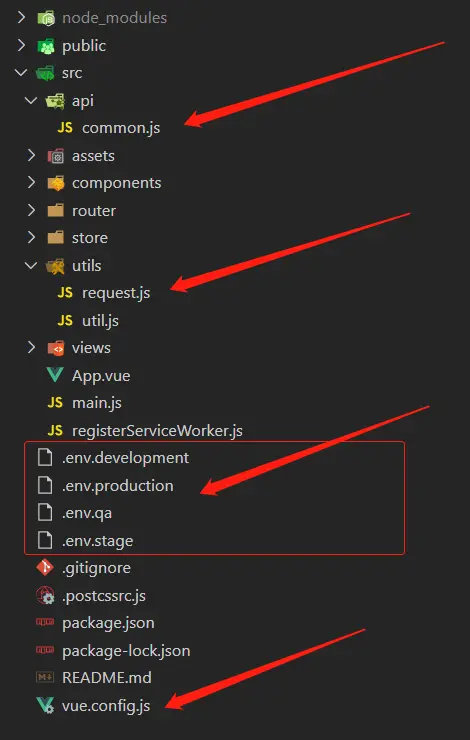

In project development, there are generally multiple environments such as development environment, test environment, and production environment. Therefore, when the project is packaged, we will call the interfaces of different environments. At this time, we need to configure variables to solve this problem.

## 1. Configure different environment variables

---

The following three environments, development, testing, and production, are taken as examples.

#### 1. Create 3 different files in the root directory of the project, representing different environment configurations

- Development environment: `.env.development`
- Test environment: `.env.test`
- Production environment: `.env.production`

#### 2. Configure variables in different files

- .env.development

   ```
   NODE_ENV = 'development'
   VUE_APP_BASE_URL = 'http://www.development.api'
   ```

- .env.test

   ```
   NODE_ENV = 'test'
   VUE_APP_BASE_URL = 'http://www.test.api'
   ```

- .env.production

   ```
   NODE_ENV = 'production'
   VUE_APP_BASE_URL = 'http://www.production.api'
   ```

[Note]: 1. The NODE_ENV = 'development' declared here means the development environment 2. Except baseUrl and NODE_ENV, other environment variables start with VUE_APP, such as VUE_APP_XXX 3. Then we can get the definition through process.env.VUE_APP_XXX Environment variable 4. When assigning baseUrl in the js file that encapsulates axios below, the value will be obtained through the environment variable

#### 3. Configure the packaging command package.json

```
   "scripts": {
     "dev": "vue-cli-service serve",
     "dev-development": "vue-cli-service serve --mode development",
     "dev-test": "vue-cli-service serve --mode test",
     "dev-production": "vue-cli-service serve --mode production",
     "build-development": "vue-cli-service build --mode development",
     "build-test": "vue-cli-service build --mode test",
     "build-production": "vue-cli-service build --mode production"
   },
```

[Description]: `npm run dev` means: `vue-cli-service serve` will execute the `.env.development` file by default; `--mode test` to specify the execution of the `.env.test` file;`-- mode production` to specify the execution of the `.env.production` file

## 2.axios secondary packaging

---

#### 1. Create `request.js` file

Create a `utils` folder under `src` to put some tool-type files, first create a file `request` in it to encapsulate `axios`, of course, the file name is customized

```js
//src/utils/request.js
import axios from "axios";

// create axios instance
const service = axios. create({
   baseURL: process.env.VUE_APP_BASE_URL, // url = base url + request url
   timeout: 10000, // request timeout
});

// request interceptor
service.interceptors.request.use(
   (config) => {
     config.headers["Content-Type"] = "application/json;charset=UTF-8";
     config. headers["Accept"] = "application/json";
     config. headers["Request-From"] = "mobile";
     let token = sessionStorage. getItem("loginToken") || null;
     if (token) {
       // If the token is not null, otherwise pass the token to the background
       config. headers["Token"] = token;
     }
     return config;
   },
   (error) => {
     return Promise. reject(error);
   }
);

// response interceptor
service.interceptors.response.use(
   (response) => {
     const res = response.data;
     //At that time, judge according to the success or code value returned by the backend
     if (res. success === true) {
       return res;
     } else {
       return res;
     }
   },
   (error) => {
     //response error
     return Promise. reject(error);
   }
);

export default service;
```

[Note]: `baseURL: process.env.VUE_APP_BASE_URL` in the file is to take different interface addresses according to different environments

#### 2. Create `common.js` file

Create an `api` folder under `src` to store some interface files. When there are too many interfaces, you can create interface files by category. At present, we first create a public file `common.js`, and then import it just now Encapsulated `request.js` file

```js
//src/api/common.js
import request from "@/utils/request";

/**
  * Difference between POST method and GET method
  *
  * post==> data: obj
  * get==>params: obj
  *
  */
// For example (post):
export function updateBook(obj) {
   return request({
     url: "/book/update", // url = base url + request url
     method: "post",
     data: obj, //----------------->>> difference
   });
}
// For example (get):
export function getBookList(obj) {
   return request({
     url: "/book/list", // url = base url + request url
     method: "post",
     params: obj, //------------------>>> difference
   });
}
```

#### 3. Used in the page

```vue
<template>
   <div class="booktest"></div>
</template>
<script>
import { getBookList, updateBook } from "@/api/common"; //path
export default {
   name: "",
   data() {
     return {};
   },
   methods: {
     //get method
     getBookList() {
       let params = {
         userName: "Zhang San",
       };
       getBookList(params). then((res) => {
         //return value
       });
     },
     //post method
     updateBook() {
       let params = {
         bookId: 1,
       };
       updateBook(params). then((res) => {
         //return value
       });
     },
   },
};
</script>
```

## 3.vue.config.js configuration

---

```js
module.exports = {
   // options...
   /* Base URL to deploy application package */
   publicPath: "./",

   /* The directory of the production environment build file generated when running vue-cli-service build defalut: dist */
   outputDir: "./dist",
   // Different addresses can be packaged according to different environments
   //outputDir: process.env.NODE_ENV == 'production' ?
   // '../../../../dist-mobile/production/course' : process.env.NODE_ENV == 'production' ?
   // '../../../../dist-mobile/test/course' : process.env.NODE_ENV == 'test' ?
   //'../../../../dist-mobile/development/course' : '../../../../dist-mobile/run/course',

   /* Place the generated static file directory (js css img) */
   assetsDir: "static",

   /* Specify the generated index.html output path relative to default: index.html */
   indexPath: "index.html",

   /* Specifies that the generated file name contains hash default: true */
   filenameHashing: true,

   // All webpack-dev-server options are supported.
   devServer: {
     host: "0.0.0.0",
     port: 8888, // port number
     https: false,
     open: false, //Configure to automatically start the browser

     // Configure multiple agents
     proxy: {
       "/api": {
         target: process.env.VUE_APP_BASE_URL, // proxy server path
         changeOrigin: true,
         pathRewrite: {
           "^/api": "", // Remove the api string in the interface address
         },
       },
     },
   },
};
```

This completes the startup command according to different projects to automatically configure different environments and match the specified interface address
For example:
Start `npm run dev-test`,
Execute `vue-cli-service serve --mode test`,
According to `--mode test`,
Find the `.env.test` file,
The obtained environment `NODE_ENV` is: `test environment`, and the interface address `VUE_APP_BASE_URL` is: `http://www.test.api`
So the baseUrl address in the encapsulated axios is `http://www.test.api`
The address after calling is: `http://www.test.api/book/list`
Probably this is the process,
Then you can develop happily.


