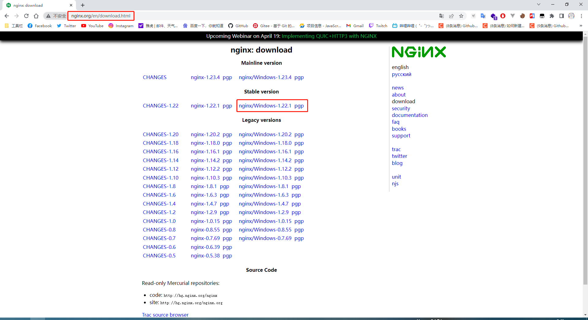
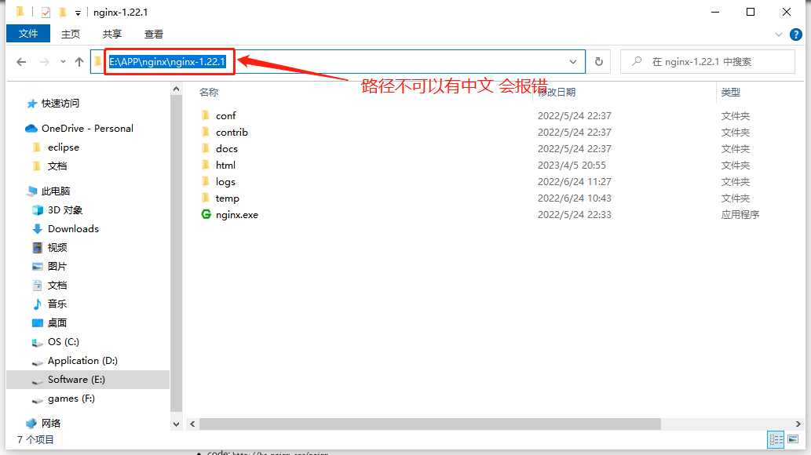
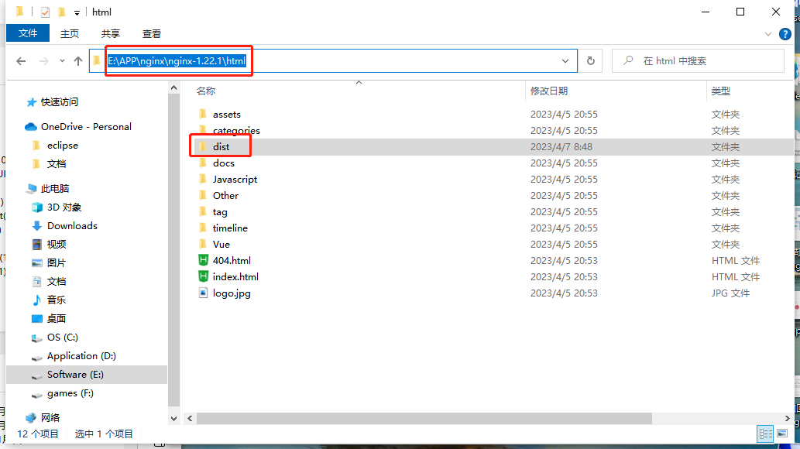
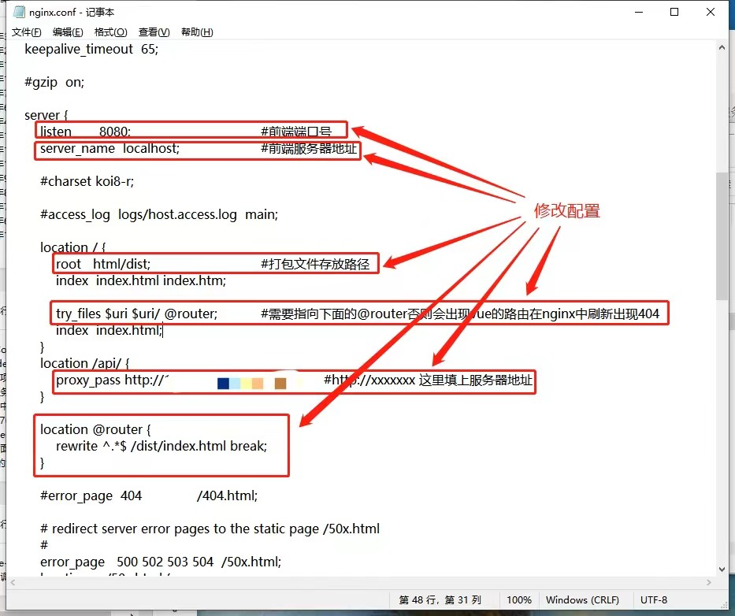
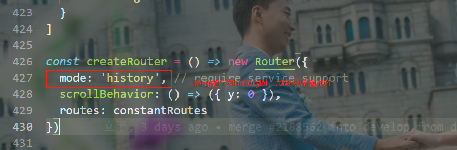

## 1. Download the stable version of nginx from the nginx official website: http://nginx.org/en/download.html Refer to the following picture:

---



## 2. The decompression path of the nginx installation package cannot contain Chinese, otherwise an error will be reported when nginx starts

---



## 3. Use the npm run build command or other self-configured packaging commands to package the vue project. After the packaging is complete, copy the dist directory generated under the vue project to the nginx/html directory

---



## 4. The most critical step is to modify the configuration file of nginx in conf\nginx.conf under nginx, and modify the configuration as follows

---

After sorting, it is as shown in the figure below:



[Note]: Note: When the routing is configured as history, 404 problems will occur when refreshing, and the 404 problems can be solved by configuring as shown in the above figure



Complete original code:

```
#user nobody;
worker_processes 1;

#error_log logs/error.log;
#error_log logs/error.log notice;
#error_log logs/error.log info;

#pid logs/nginx.pid;


events {
     worker_connections 1024;
}


http {
     include mime.types;
     default_type application/octet-stream;

     #log_format main '$remote_addr - $remote_user [$time_local] "$request"'
     # '$status $body_bytes_sent "$http_referer"'
     # '"$http_user_agent" "$http_x_forwarded_for"';

     #access_log logs/access.log main;

     sendfile on;
     #tcp_nopush on;

     #keepalive_timeout 0;
     keepalive_timeout 65;

     #gzip on;

     server {
         listen 8080; #Front end port number
         server_name localhost; #Front-end server address

         #charset koi8-r;

         #access_log logs/host.access.log main;

         location / {
             root html/dist; #Package file storage path
             index index.html index.htm;

             try_files $uri $uri/ @router; #Need to point to the following @router, otherwise there will be a vue route, and 404 will appear when refreshing in nginx
             index index.html;
         }
         location /api/ {
             proxy_pass http://xxxxxxxxxxxxx; #http://xxxxxxx fill in the server address here
         }

         location @router {
             rewrite ^.*$ /dist/index.html break;
         }

         #error_page 404 /404.html;

         # redirect server error pages to the static page /50x.html
         #
         error_page 500 502 503 504 /50x.html;
         location = /50x.html {
             root html;
         }

         # proxy the PHP scripts to Apache listening on 127.0.0.1:80
         #
         #location ~ \.php$ {
         # proxy_pass http://127.0.0.1;
         #}

         # pass the PHP scripts to FastCGI server listening on 127.0.0.1:9000
         #
         #location ~ \.php$ {
         # root html;
         # fastcgi_pass 127.0.0.1:9000;
         # fastcgi_index index.php;
         # fastcgi_param SCRIPT_FILENAME /scripts$fastcgi_script_name;
         #include fastcgi_params;
         #}

         # deny access to .htaccess files, if Apache's document root
         # concurs with nginx's one
         #
         #location ~ /\.ht {
         # deny all;
         #}
     }


     # another virtual host using mix of IP-, name-, and port-based configuration
     #
     #server {
     # listen 8000;
     # listen somename:8080;
     # server_name somename alias another.alias;

     # location / {
     # root html;
     # index index.html index.htm;
     # }
     #}


     # HTTPS server
     #
     #server {
     # listen 443 ssl;
     # server_name localhost;

     # ssl_certificate cert.pem;
     # ssl_certificate_key cert.key;

     # ssl_session_cache shared:SSL:1m;
     # ssl_session_timeout 5m;

     # ssl_ciphers HIGH:!aNULL:!MD5;
     # ssl_prefer_server_ciphers on;

     # location / {
     # root html;
     # index index.html index.htm;
     # }
     #}

}
```

## After modifying the 5.conf configuration file, you can start nginx.exe in the nginx installation directory, or use the command, start nginx to start the project.

---

Finally, you can access the vue project through the front-end server address and front-end port in the configuration file.

Common commands

```
start nginx start

nginx -s reload refresh

tasklist /fi "imagename eq nginx.exe" View all nginx processes

taskkill /fi "imagename eq nginx.exe" /f stops all nginx processes
```
