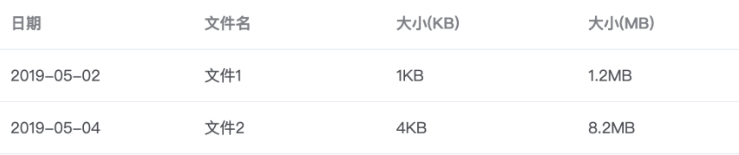
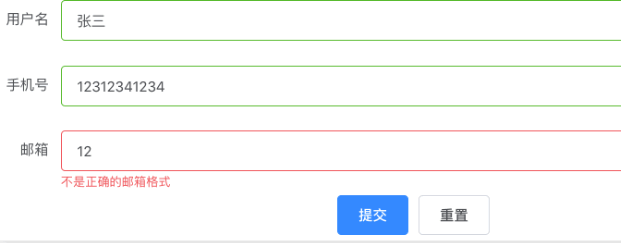
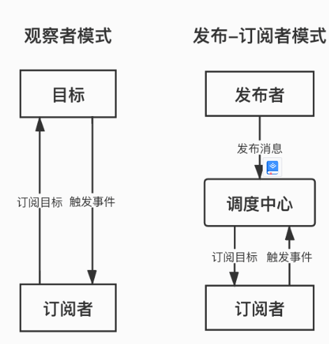
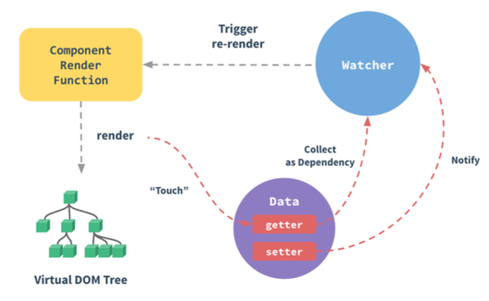

## 1. What is a design pattern?

---

A design pattern is a set of code design experiences that are repeatedly used, known to most people, and categorized. It is for reusable code, making the code easier for others to understand and ensuring the reliability of the code.

The design pattern is actually the practice of "bringing doctrine" in the software field. It is a set of ready-made tools that can be used immediately. Let's take a look at the design principles of the design pattern.

## 2.design a few principles

---

Single Responsibility Principle, Open and Closed Principle, Li-style Replacement Principle, Interface Segregation Principle, Dependency Inversion Principle, and Least Knowledge Principle.

Let's take a look at several common design patterns in the front-end field:

Singleton mode, factory mode, strategy mode, proxy mode, adapter mode, observer mode/publish-subscribe mode

## 3. Common design patterns and actual cases

---

### Singleton pattern

---

#### 1. What is a singleton pattern?

Singleton Pattern (Singleton Pattern), also known as singleton pattern, ensures that there is only one instance of a class and provides a global access point to access it. In other words, the second time you use the same class to create a new object, you should get exactly the same object as the first created object.

#### Singleton pattern in Vue

(1) Element UI

Element UI is a front-end UI framework developed with Vue. There are two forms of full-screen Loading mask calls in ElementUI:

● Instruction form: Vue.use(Loading.directive)

● Service form: Vue.prototype.$loading = service

How to use instruction form registration:

```vue
<div :v-loading. fullscreen="true">...</div>
;
```

How to use the service form registration:

```vue
this. $loading({ fullscreen: true });
```

Using full-screen loading in a service mode is a singleton, that is, calling full-screen loading again before the previous full-screen loading is closed will not create a new loading instance, but return the instance of the existing full-screen loading.

The following is the source code for ElementUI to implement full-screen Loading:

```vue
import Vue from 'vue' import loadingVue from './loading.vue' const
LoadingConstructor = Vue. extend(loadingVue) let fullscreenLoading const Loading
= (options = {}) => { if (options. fullscreen && fullscreenLoading) { return
fullscreenLoading } let instance = new LoadingConstructor({ el:
document.createElement('div'), data: options }) if (options.fullscreen) {
fullscreenLoading = instance } return instance } export default Loading
```

The singleton here is fullscreenLoading, which is stored in the closure. If the fullscreen of the options passed by the user is true and a singleton has been created, it will directly return to the previously created singleton. If it has not been created before, a singleton will be created. And assign it to fullscreenLoading in the closure and return the newly created singleton instance.

(2) Vuex

Vuex is a state management pattern developed specifically for Vue.js applications. Vuex, they all implement a global Store to store all the state of the application. The implementation of this Store is a typical application of the singleton pattern.

Vuex uses a single state tree, which contains all application-level state with a single object. At this point it exists as a "Single Source of Truth (SSOT)". This also means that each application will contain only one store instance. A single state tree allows us to directly locate any specific state fragment, and easily obtain a snapshot of the entire current application state during debugging. ——Vuex Official Documentation

```vue
// Install the vuex plugin Vue.use(Vuex) // Inject the store into the Vue instance new Vue({ el: '#app',
store })
```

The Vuex plugin is installed by calling the Vue.use() method. A Vuex plugin is an object that internally implements an install method that will be called when the plugin is installed to inject the Store into the Vue instance. That is to say, every install will try to inject a Store into the Vue instance.

```vue
let Vue // The function of this Vue is the same as that of the instance upstairs ... export function install
(_Vue) { //
Determine whether the Vue instance object passed in has been installed by the Vuex plug-in (whether it has a unique state) if (Vue
&& _Vue === Vue) { if (process.env.NODE_ENV !== 'production') { console.error(
'[vuex] already installed. Vue. use(Vuex) should be called only once.' ) } return
} // If not, install a unique Vuex for this Vue instance Vue = _Vue //
Write Vuex's initialization logic into Vue's hook function applyMixin(Vue) }
```

It can be guaranteed that a Vue instance (that is, a Vue application) will only be installed once with the Vuex plugin, so each Vue instance will only have one global Store.

### Factory Pattern

---

#### 1. What is the factory pattern?

The factory pattern is to return different instances according to unused input. It is generally used to create the same type of objects. Its main idea is to separate the creation of objects from the realization of objects.
When creating an object, the specific logic is not exposed, but the logic is encapsulated in a function, then this function can be regarded as a factory. The factory pattern can be divided into: simple factory, factory method and abstract factory according to the degree of abstraction.

#### Factory pattern in Vue

(1) VNodes

Similar to the native document.createElement, Vue, a framework with a virtual DOM tree (Virtual Dom Tree) mechanism, provides the createElement method to generate a VNode when generating a virtual DOM, which is used as a mapping of a real DOM node:

```
createElement('h3', { class: 'main-title' }, [
     createElement('img', { class: 'avatar', attrs: { src: '../avatar.jpg' } }),
     createElement('p', { class: 'user-desc' }, 'hello world')
])
```

The structure of the createElement function is roughly as follows:

```
class Vnode (tag, data, children) { ... }
function createElement(tag, data, children) {
       return new Vnode(tag, data, children)
}
```

(2) vue-route

In Vue's routing creation mode, the factory mode is also used many times:

```js
export default class VueRouter {
   constructor(options) {
     this.mode = mode; // routing mode

     switch (
       mode // simple factory
     ) {
       case "history": // history method
         this.history = new HTML5History(this, options.base);
         break;
       case "hash": // hash method
         this.history = new HashHistory(this, options.base, this.fallback);
         break;
       case "abstract": // abstract way
         this.history = new AbstractHistory(this, options.base);
         break;
       default:
       // ... initialization failed with an error
     }
   }
}
```

mode is the mode of routing creation. There are three types of History, Hash, and Abstract. Among them, History is the routing method of H5, Hash is the routing method with # in the routing, and Abstract represents the routing method in a non-browser environment, such as Node, weex, etc. ;this.history is used to save routing instances, and the idea of factory mode is used in vue-router to obtain instances of response routing control classes.

### Strategy Pattern

---

#### 1. What is the strategy pattern?

Strategy Pattern, also known as Policy Pattern, defines a series of algorithms, encapsulates them one by one, and makes them interchangeable. The encapsulated strategy algorithm is generally independent, and the strategy mode adjusts which algorithm to use according to the input. The key is the separation of policy implementation and use.

#### Practical application of strategy pattern

(1) form formatter

The Column of Element UI's table control accepts a formatter parameter, which is used to format the content. Its type is function, and it can also accept several specific parameters, like this: Function(row, column, cellValue, index).

Taking file size conversion as an example, the backend often directly transmits the file size in bit units, so the frontend needs to convert the file size into the unit it needs based on the backend data, such as KB/MB.

First implement the algorithm for file calculation:

```js
export const StrategyMap = {
   // Strategy 1: Convert file size (bit) to KB
   bitToKB: (val) => {
     const num = Number(val);
     return isNaN(num) ? val : (num / 1024).toFixed(0) + "KB";
   },
   // Strategy 2: Convert file size (bit) to MB
   bitToMB: (val) => {
     const num = Number(val);
     return isNaN(num) ? val : (num / 1024 / 1024).toFixed(1) + "MB";
   },
};
// Context: generate el form formatter
const strategyContext = function (type, rowKey) {
   return function (row, column, cellValue, index) {
     StrategyMap[type](row[rowKey]);
   };
};
export default strategyContext;
```

Use directly in the component:

```vue
<template>
   <el-table:data="tableData">
     <el-table-column prop="date" label="date"></el-table-column>
     <el-table-column prop="name" label="filename"></el-table-column>
     <!-- Call strategyContext directly -->
     <el-table-column
       prop="sizeKb"
       label="file size (KB)"
       :formatter="strategyContext('bitToKB', 'sizeKb')"
     >
     </el-table-column>
     <el-table-column
       prop="sizeMb"
       label="attachment size (MB)"
       :formatter="strategyContext('bitToMB', 'sizeMb')"
     >
     </el-table-column>
   </el-table>
</template>
<script type="text/javascript">
import strategyContext from "./strategyContext.js";

export default {
   name: "ElTableDemo",
   data() {
     return {
       strategyContext,
       tableData: [
         { date: "2019-05-02", name: "File 1", sizeKb: 1234, sizeMb: 1234426 },
         { date: "2019-05-04", name: "File 2", sizeKb: 4213, sizeMb: 8636152 },
       ],
     };
   },
};
</script>
<style scoped></style>
```

The result of the operation is as shown in the figure below



(2) Form validation

In addition to the formatter in the form, the strategy pattern is also often used in form validation scenarios. The Form form of Element UI has a form validation function, which is used to verify the form content entered by the user. In actual requirements, form validation items are generally more complicated, so it is necessary to add a validator custom validation method to each form item.

Implement a generic form validation method:

```js
// src/utils/validates.js
// Name verification consists of 2-10 Chinese characters
export function validateUsername(str) {
   const reg = /^[\u4e00-\u9fa5]{2,10}$/;
   return reg.test(str);
}
// Mobile phone number verification consists of 11 digits starting with 1
export function validateMobile(str) {
   const reg = /^1\d{10}$/;
   return reg.test(str);
}
// email verification
export function validateEmail(str) {
   const reg = /^[a-zA-Z0-9_-]+@[a-zA-Z0-9_-]+(\.[a-zA-Z0-9_-]+)+$/;
   return reg.test(str);
}
```

Add a currying method to generate form validation functions

```js
// src/utils/index.js
import * as Validates from "./validates.js";
// Generate form custom validation function
export const formValidateGene = (key, msg) => (rule, value, cb) => {
   if (Validates[key](value)) {
     cb();
   } else {
     cb(new Error(msg));
   }
};
```

Specific use:

```vue
<template>
   <el-form
     ref="ruleForm"
     label-width="100px"
     class="demo-ruleForm"
     :rules="rules"
     :model="ruleForm"
   >
     <el-form-item label="username" prop="username">
       <el-input v-model="ruleForm.username"></el-input>
     </el-form-item>

     <el-form-item label="mobile phone number" prop="mobile">
       <el-input v-model="ruleForm.mobile"></el-input>
     </el-form-item>

     <el-form-item label="email" prop="email">
       <el-input v-model="ruleForm.email"></el-input>
     </el-form-item>
   </el-form>
</template>
<script type="text/javascript">
import * as Utils from "../utils";

export default {
   name: "ElTableDemo",
   data() {
     return {
       ruleForm: { pass: "", checkPass: "", age: "" },
       rules: {
         username: [
           {
             validator: Utils. formValidateGene(
               "validateUsername",
               "The name is composed of 2-10 Chinese characters"
             ),
             trigger: "blur",
           },
         ],
         mobile: [
           {
             validator: Utils. formValidateGene(
               "validateMobile",
               "Mobile phone number consists of 11 digits starting with 1"
             ),
             trigger: "blur",
           },
         ],
         email: [
           {
             validator: Utils. formValidateGene(
               "validateEmail",
               "Not in the correct email format"
             ),
             trigger: "blur",
           },
         ],
       },
     };
   },
};
</script>
```

The effect is as shown in the figure:



### Proxy mode

---

#### 1. What is proxy mode?

Proxy Pattern (Proxy Pattern), also known as delegation pattern, creates a proxy object for the target object to control access to the target object.

The proxy mode inserts the proxy object between the visitor and the target object, thus introducing a certain degree of indirection for the visitor's access to the target object. It is this indirection that gives the proxy object a lot of room to operate, such as performing some pre-operations and post-operations before and after calling the target object, so as to realize new functions or extend the functions of the target.

#### The application of proxy mode in actual combat

(1) Interceptor

Axios instances are often used in projects to make HTTP requests, and the interceptor interceptor can be used to preprocess the request request and response return in advance, such as:
1. The setting of the request request header and the setting of the Cookie information;
2. Preprocessing of authority information, such as authority verification operation or Token verification;
3. The format of the data format, such as performing some serialization operations on the Date type data bound to the component before the request;
4. Format preprocessing of empty fields, and perform some filtering operations according to the backend;
5. Some general error handling of response, such as using the Message control to throw an error;

In addition to HTTP-related interceptors, there are also interceptors for routing jumps, which can perform some operations such as preprocessing of routing jumps.

(2) Data responsiveness of the front-end framework

In Vue 2.x, the setter/getter of each property is hijacked through Object.defineProperty. When the data changes, the message is published to the subscriber through the publish-subscribe mode, and the corresponding monitoring callback is triggered, so as to realize the responsiveness of the data, that is, Two-way binding of data to views.

Why does Vue 2.x to 3.x switch from Object.defineProperty to Proxy? It is because of some limitations of the former, which lead to the following defects:
1. It is impossible to monitor an item of an array directly set by index, for example: vm.items[indexOfItem] = newValue;
2. Unable to monitor the modification of the length of the array, for example: vm.items.length = newLength;
3. Unable to monitor the changes of ES6's Set, WeakSet, Map, and WeakMap;
4. Unable to listen to data of Class type;
5. Unable to monitor the addition or deletion of object properties;

### Adapter pattern

---

#### 1. What is the adapter pattern?

Adapter Pattern (Adapter Pattern), also known as wrapper pattern, converts the interface (method, attribute) of a class (object) into another interface that users need, and solves the problem of interface incompatibility between classes (objects).

The main function is to perform conversion matching, the purpose is to reuse existing functions, not to implement new interfaces. In other words, the functions required by the visitor should have already been implemented, and there is no need for the adapter mode to realize it. The adapter mode is mainly responsible for converting the incompatible interface into the format expected by the visitor.

#### The actual case of the adapter

(1) Vue computed properties

The computed property in Vue is also an instance of the adapter pattern, taking the example on the official website as an example:

```vue
<template>
   <div id="example">
     <p>Original message: "{{ message }}"</p>
     <!-- Hello -->
     <p>Computed reversed message: "{{ reversedMessage }}"</p>
     <!-- olleH -->
   </div>
</template>
<script type="text/javascript">
export default {
   name: "demo",
   data() {
     return {
       message: "Hello",
     };
   },
   computed: {
     reversedMessage: function () {
       return this. message. split(""). reverse(). join("");
     },
   },
};
</script>
```

There is no change to the original data, only the representation form of the original data is changed.

(2) Adapter mode in source code

The adapter used by Axios to send requests essentially encapsulates the API XMLHttpRequest provided by the browser.

```js
module.exports = function xhrAdapter(config) {
     return new Promise(function dispatchXhrRequest(resolve, reject) {
         var requestData = config.data
         var requestHeaders = config. headers

         var request = new XMLHttpRequest()

         // Initialize a request
         request.open(config.method.toUpperCase(),
           buildURL(config.url, config.params, config.paramsSerializer), true)

         // set the maximum timeout
         request.timeout = config.timeout

         // Callback when the readyState property changes
         request.onreadystatechange = function handleLoad() { ... }

         // Callback when the browser requests to exit
         request.onabort = function handleAbort() { ... }

         // Callback when the request reports an error
         request.onerror = function handleError() { ... }

         // Callback called when the request times out
         request.ontimeout = function handleTimeout() { ... }

         // Set the value of the HTTP request header
         if ('setRequestHeader' in request) {
             request.setRequestHeader(key, val)
         }

         // Whether cross-domain requests should use certificates
         if (config. withCredentials) {
             request.withCredentials = true
         }

         // response type
         if (config. responseType) {
             request.responseType = config.responseType
         }

         // send request
         request. send(requestData)
     })
}
```

This module mainly sets the request header, request configuration and some callbacks, and does not change the native API, so it can be used normally in other places. This adapter can be regarded as an adaptation to XMLHttpRequest, which is an adaptation layer between the user's Axios call layer and the native XMLHttpRequest API.

### Observer pattern/publish-subscribe pattern

---

**1. What is the Observer pattern? **

Observer Pattern (Observer Pattern) defines a one-to-many relationship, allowing multiple subscriber objects to listen to a publisher, or topic object, at the same time. When the status of the topic object changes, it will notify all subscribers Subscriber objects, enabling them to update themselves automatically.

2**. What is the publish-subscribe model? **

In fact, it is an alias for the publish-subscribe model, but the two are different. This alias very vividly interprets the two core role elements in the Observer pattern-publisher and subscriber.

**Publish-subscribe model has a dispatch center**



The observer mode is scheduled by specific targets, while the publish-subscribe mode is uniformly coordinated by the dispatch center

**Publish-subscribe pattern in Vue**

(1) EventBus

There is a set of event mechanisms in Vue, one of which is EventBus. EventBus can be used to solve the problem of data communication between components.

#### 1. Create communication between event center management components

```js
// event-bus.js
import Vue from "vue";
export const EventBus = new Vue();
```

#### 2. Sending events

```vue
<template>
   <div>
     <first-com></first-com>
     <second-com></second-com>
   </div>
</template>
<script>
import firstCom from "./firstCom.vue";
import secondCom from "./secondCom.vue";
export default {
   components: { firstCom, secondCom },
};
</script>
```

Send events in the firstCom component:

```vue
<template>
   <div>
     <button @click="add">addition</button>
   </div>
</template>
<script>
import { EventBus } from "./event-bus.js"; // import event center
export default {
   data() {
     return {
       num: 0,
     };
   },
   methods: {
     add() {
       EventBus. $emit("addition", {
         num: this. num++,
       });
     },
   },
};
</script>
```

#### 3. Receive events

Send the event in the secondCom component:

```vue
<template>
  <div>求和: {{ count }}</div>
</template>
<script>
import { EventBus } from "./event-bus.js";
export default {
  data() {
    return {
      count: 0,
    };
  },
  mounted() {
    EventBus.$on("addition", (param) => {
      this.count = this.count + param.num;
    });
  },
};
</script>
```

(2) Vue source code

The publish-subscribe model is widely used in source code, such as the scenario of two-way binding mechanism



Responsiveness is roughly the process of using Object.defineProperty to convert data into getters/setters and adding a list of subscribers to each data. This list is a property in the getter closure that will record all components that depend on this data. In other words, the responsive data is equivalent to the publisher.

Each component corresponds to a Watcher subscriber. When the rendering function of each component is executed, the Watcher of this component will be placed in the subscriber list of the responsive data it depends on, which is equivalent to completing the subscription. Generally, this process is called dependency collection (Dependency Collect).
The result of the execution of the component rendering function is to generate a virtual DOM tree (Virtual DOM Tree), which will be mapped to the real DOM tree on the browser, which is the page view seen by the user.
When the responsive data changes, that is, when the setter is triggered, the setter will be responsible for notifying (Notify) the Watcher in the subscriber list of the data, and the Watcher will trigger component re-rendering (Trigger re-render) to update (update) view.

Source code of Vue:

```js
// src/core/observer/index.js responsive process
Object.defineProperty(obj, key, {
   enumerable: true,
   configurable: true,
   get: function reactiveGetter() {
     //...
     const value = getter ? getter.call(obj): val; // Execute if the original object has a getter method
     dep.depend(); // Dependency collection, dep.addSub
     return value;
   },
   set: function reactiveSetter(newVal) {
     //...
     if (setter) {
       setter. call(obj, newVal);
     } // Execute if the original object has a setter method
     dep.notify(); // If there is a change, notify the update
   },
});
```
